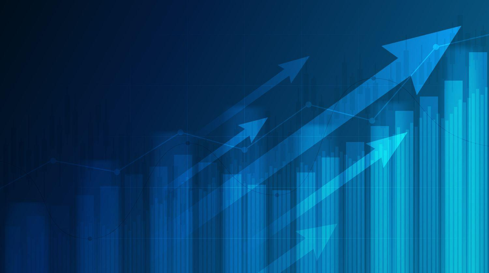

## Table of Contents

## What is the S&P 500 and why is it important?

The S&P 500 is a stock market index that measures the performance of 500 large companies in the United States. It includes companies from different industries like technology, healthcare, and finance. The index is managed by a company called Standard & Poor's, which is why it's called the S&P 500. When people talk about "the market" going up or down, they often mean the S&P 500.

The S&P 500 is important because it gives a good picture of how the U.S. economy is doing. If the S&P 500 goes up, it usually means that many big companies are doing well, which can be a sign of a healthy economy. Investors and financial experts watch the S&P 500 closely to make decisions about buying or selling stocks. It's also used as a benchmark to see how well other investments are doing compared to the overall market.

## How is the weight of stocks determined in the S&P 500?

The weight of stocks in the S&P 500 is determined by the market capitalization of each company. Market capitalization, or market cap, is calculated by multiplying the total number of a company's shares by the current price of one share. This means that bigger companies, which have a higher market cap, have a bigger impact on the S&P 500's performance. For example, if a large company's stock price goes up a lot, it can pull the whole index up more than if a smaller company's stock price goes up by the same amount.

This method of weighting is called a market-cap-weighted index. It's different from other ways of weighting, like giving each stock the same weight no matter the size of the company. The idea behind using market cap is that it reflects what investors think the company is worth. If a lot of people want to buy a company's stock, its price and market cap go up, which means it will have a bigger effect on the S&P 500. This way, the index shows the overall health of the market based on what investors are doing.

## What are the top 25 stocks by index weight in the S&P 500 for October 2024?

In October 2024, the top 25 stocks in the S&P 500 by index weight are led by big tech and other large companies. The list starts with companies like Apple, Microsoft, and Amazon, which have the highest market values and therefore the biggest impact on the index. Other tech giants like Nvidia, Alphabet (Google's parent company), and Meta Platforms (formerly known as Facebook) are also near the top. These companies are important because they are worth a lot of money and their stock prices can move the whole index up or down.

Besides tech, there are also big names from other industries in the top 25. Companies like Berkshire Hathaway, which is run by Warren Buffett, and healthcare giants like Johnson & Johnson and UnitedHealth Group are also high on the list. Financial firms like JPMorgan Chase and Bank of America, as well as energy companies like ExxonMobil and Chevron, round out the top 25. These companies come from different parts of the economy, but they all have one thing in common: they are big and their stock prices matter a lot to the S&P 500's performance.

## How have the weights of these top stocks changed over the past year?

Over the past year, the weights of the top stocks in the S&P 500 have shifted due to changes in their market values. Big tech companies like Apple and Microsoft have seen their weights increase as their stock prices have gone up. Apple's weight in the index has grown because more people want to buy its stock, making its market value bigger. Microsoft has also become more important to the index because its stock price has risen a lot, especially with the growth in cloud computing and AI technology. Amazon's weight has also increased, but not as much as Apple and Microsoft, as its stock price has had ups and downs.

Other top stocks have seen their weights change too. Nvidia's weight has jumped a lot because its stock price has soared, thanks to high demand for its chips used in AI and gaming. Alphabet and Meta Platforms have also seen their weights go up, but not as dramatically as Nvidia. On the other hand, some non-tech companies like Berkshire Hathaway and Johnson & Johnson have seen their weights stay about the same or even drop a little. This is because their stock prices haven't grown as fast as the tech giants. Overall, the top stocks' weights in the S&P 500 have been influenced by how well their businesses are doing and how investors feel about them.

## What sectors are most represented among the top 25 stocks by index weight?

The sectors most represented among the top 25 stocks by index weight in the S&P 500 are technology and healthcare. Technology is the biggest sector, with companies like Apple, Microsoft, Amazon, Nvidia, Alphabet, and Meta Platforms taking up a lot of the index's weight. These companies are very important to the S&P 500 because they are big and their stock prices can move the whole index a lot. Healthcare is the next biggest sector, with companies like Johnson & Johnson and UnitedHealth Group also having a big impact on the index.

Other sectors like finance and energy also have some representation among the top 25 stocks, but not as much as technology and healthcare. Financial companies like JPMorgan Chase and Bank of America are in the top 25, but their weights are smaller compared to the tech giants. Energy companies like ExxonMobil and Chevron are also in the list, but they don't have as big an effect on the S&P 500 as the tech and healthcare companies. Overall, the top 25 stocks show that technology and healthcare are the most important sectors in the S&P 500 right now.

## How do these top stocks contribute to the overall performance of the S&P 500?

The top stocks in the S&P 500, especially the big tech companies like Apple, Microsoft, and Amazon, have a big effect on how the whole index does. Because these companies are so big and their stock prices are so high, even small changes in their prices can move the S&P 500 up or down a lot. For example, if Apple's stock goes up by a few percent, it can pull the whole index up because Apple is such a big part of it. This means that if you're looking at how the S&P 500 is doing, you're really looking at how these big companies are doing.

Healthcare companies like Johnson & Johnson and UnitedHealth Group also play a big role in the S&P 500's performance, but not as much as the tech giants. These companies are important because they are big and their stock prices matter, but their impact is smaller compared to tech. Other sectors like finance and energy, with companies like JPMorgan Chase and ExxonMobil, also help move the index, but they don't have as much weight as tech and healthcare. So, when you see the S&P 500 going up or down, it's often because of what's happening with these top stocks.

## What are the key financial metrics (e.g., market cap, P/E ratio) of these top 25 stocks?

The top 25 stocks in the S&P 500 have big market caps, which means they are worth a lot of money. For example, Apple and Microsoft have market caps over $2 trillion, making them some of the biggest companies in the world. Amazon and Alphabet are also worth over $1 trillion. These big market caps mean that these companies have a lot of weight in the S&P 500. Other companies like Nvidia and Meta Platforms have market caps in the hundreds of billions, which is still a lot but not as big as the trillion-dollar companies. The market caps of healthcare companies like Johnson & Johnson and UnitedHealth Group are also in the hundreds of billions, showing they are big but not as big as the tech giants.

The P/E ratios of these top stocks can tell us how expensive their stocks are compared to their earnings. Apple and Microsoft have P/E ratios around 30, which means investors are willing to pay $30 for every dollar of earnings these companies make. Amazon's P/E ratio is higher, around 50, showing that investors expect a lot of growth from Amazon. Nvidia has a very high P/E ratio, over 70, because its stock price has gone up a lot and investors are betting on its future in AI and gaming. Healthcare companies like Johnson & Johnson have lower P/E ratios, around 20, which means their stocks are seen as less expensive compared to their earnings. These P/E ratios help investors decide if a stock is a good buy or not.

## What are the growth prospects for these top stocks in the next year?

The growth prospects for the top stocks in the S&P 500 over the next year look good, especially for the big tech companies like Apple, Microsoft, and Amazon. These companies are expected to keep growing because they are leaders in their fields. Apple might see growth from new products like the iPhone and their services like Apple Music. Microsoft is likely to grow thanks to their cloud computing business and AI technology. Amazon's growth could come from their online shopping business and their cloud services like AWS. These companies have strong positions in the market, so they are expected to do well in the next year.

Healthcare companies like Johnson & Johnson and UnitedHealth Group also have good growth prospects. Johnson & Johnson might grow because they have a lot of different products, from medicine to medical devices. UnitedHealth Group could see growth from more people needing health insurance and healthcare services. While these companies might not grow as fast as the tech giants, they are still expected to do well. Other sectors like finance and energy, with companies like JPMorgan Chase and ExxonMobil, might have slower growth but still have a chance to do well if the economy stays strong.

## How do these top stocks compare to their performance in previous years?

The top stocks in the S&P 500, like Apple, Microsoft, and Amazon, have been doing really well over the last few years. Apple's stock price has gone up a lot because people keep buying their iPhones and using their services. Microsoft has grown thanks to their cloud computing and AI businesses, which have become more important. Amazon's stock has had some ups and downs, but overall it has grown because more people shop online and use their cloud services. These companies have been doing better than many other stocks in the S&P 500, which is why they are so important to the index.

Healthcare companies like Johnson & Johnson and UnitedHealth Group have also been growing, but not as fast as the big tech companies. Johnson & Johnson's stock has been steady because they have a lot of different products that people need, like medicine and medical devices. UnitedHealth Group has grown because more people need health insurance and healthcare services. Other sectors like finance and energy, with companies like JPMorgan Chase and ExxonMobil, have had mixed results. Their stocks have gone up and down depending on what's happening in the economy, but they haven't grown as fast as tech and healthcare. Overall, the top stocks have been doing well, but the tech companies have been leading the way.

## What are the risks associated with investing in these top stocks?

Investing in the top stocks of the S&P 500, like Apple, Microsoft, and Amazon, can be risky because their stock prices can go up and down a lot. These companies are big and important, but if something goes wrong with them, their stock prices can drop fast. For example, if people stop buying Apple's iPhones or if there's a problem with Microsoft's cloud services, their stock prices could fall. Also, because these companies are so big, they can be affected by big changes in the economy or new laws that make it harder for them to do business.

Another risk is that these stocks might be too expensive. When a stock's price is high compared to how much money the company makes, it can be risky to buy it. For example, Nvidia's stock has a very high P/E ratio, which means investors are paying a lot for each dollar of earnings. If the company doesn't grow as fast as people expect, the stock price could go down. Healthcare companies like Johnson & Johnson and UnitedHealth Group might be less risky because their stocks are not as expensive, but they can still be affected by changes in healthcare laws or if people need fewer medical services.

## How do these top stocks align with current market trends and economic conditions?

The top stocks in the S&P 500, like Apple, Microsoft, and Amazon, are doing well because they fit with what's happening in the market and the economy right now. People are using more technology, so these companies are growing. Apple is selling a lot of iPhones and their services like Apple Music are popular. Microsoft's cloud computing and AI businesses are growing because more companies need these services. Amazon is doing well because more people are shopping online and using their cloud services. These companies are also investing in new technology, which makes investors excited about their future.

Healthcare companies like Johnson & Johnson and UnitedHealth Group are also doing okay, but they're not growing as fast as the tech companies. Johnson & Johnson has a lot of different products, so they can still make money even if one part of their business isn't doing well. UnitedHealth Group is growing because more people need health insurance and healthcare services. Other sectors like finance and energy, with companies like JPMorgan Chase and ExxonMobil, are affected by what's happening in the economy. If the economy is doing well, these companies can do well, but if the economy slows down, their stocks might not do as well. Overall, the top stocks are doing well because they match what's happening in the market and the economy right now.

## What advanced analytical methods can be used to predict future performance of these top stocks?

To predict how the top stocks in the S&P 500 like Apple, Microsoft, and Amazon might do in the future, people use something called machine learning. This is a kind of computer magic that looks at a lot of old data to find patterns. For example, it can look at how a company's stock price has moved in the past when certain things happened, like new products coming out or changes in the economy. By finding these patterns, the computer can guess what might happen to the stock price next time something similar happens. This can help investors decide if they should buy or sell the stock.

Another way to predict future performance is by using something called sentiment analysis. This method looks at what people are saying about a company on social media, in the news, or in reports. If a lot of people are saying good things about Apple's new iPhone, that might mean the stock price could go up. On the other hand, if there's bad news about Microsoft's cloud services, the stock price might go down. By understanding what people think and feel about these companies, investors can get a better idea of where the stock price might be headed. Both machine learning and sentiment analysis help investors make smarter choices about the top stocks.

## What is the understanding of S&P 500 and how does index weighting work?

The S&P 500 index, created by the financial services company Standard & Poor's, is a comprehensive representation of the U.S. economy and one of the most commonly followed equity indices. It comprises 500 leading publicly traded companies, predominantly in the United States, and serves as a benchmark for the overall performance of the American stock market. The S&P 500 is calculated using a market capitalization-weighted method, where the index level is derived from the sum of the market capitalizations of each component company, adjusted by a divisor that accounts for changes such as stock splits or spin-offs.

**Index Weighting Methodologies**

The primary approach used for the S&P 500 is market-cap weighting, where each company's influence on the index is proportional to its total market value. Market-cap weighting leads to significant representation by large-cap stocks, which dominate the index. This is expressed mathematically by:

$$
\text{Weight of Stock}_i = \frac{\text{Market Cap of Stock}_i}{\sum \text{Market Cap of all stocks}}
$$

Other weighting strategies exist beyond market-cap weighting, such as equal weighting and alternative weightings like fundamental or [factor](/wiki/factor-investing)-based methods. In an equal-weighted index, every stock is assigned the same weight regardless of its market capitalization, leading to greater influence from smaller-cap stocks compared to the traditional S&P 500 index. This can affect the index's sensitivity to market movements differently, potentially resulting in greater [volatility](/wiki/volatility-trading-strategies).

**Impact of Large-Cap Stocks**

Large-cap stocks, often representing major corporations with vast resources and a significant share of their respective markets, possess a disproportionately large influence in a market-cap weighted index like the S&P 500. For instance, a few top-weighted companies, such as those in the technology or healthcare sectors, can substantially influence the index's trajectory because of their extensive market valuations.

**Performance Implications of Weighting Methods**

Historical analyses reveal that different weighting methodologies yield varying performance characteristics. For instance, equal-weighted indices may exhibit higher returns in rising markets due to the enhanced role of smaller-cap stocks, which can experience rapid growth. However, they may also present heightened levels of risk, particularly during market downturns. Conversely, market-cap weighted indices are generally more stable and reflective of the broader economic environment, but they may underperform when large-cap stocks stagnate.

Data from various periods show that equal-weighted indices have historically outpaced their market-cap weighted counterparts in terms of annualized returns, though often with higher volatility. This is due to the benefit of sizing up smaller stocks that sometimes experience more robust growth phases compared to larger, more stable companies.

In conclusion, understanding the nuances of index weighting methodologies is critical for investors and traders, providing insight into potential returns and associated risks based on how assets are structured and weighted within an index like the S&P 500.

## What are the challenges and considerations?

Developing effective trading algorithms tailored for the S&P 500 index stocks encompasses a range of challenges and necessitates a careful approach to mitigate associated risks. This section outlines the primary challenges that traders and developers face, addressing risks such as overfitting, market volatility, and data inaccuracies, and exploring the regulatory and ethical considerations inherent in algorithmic trading.

### Challenges in Algorithm Development

1. **Overfitting**: A prevalent challenge in developing trading algorithms is overfitting, where algorithms are excessively tailored to historical data, capturing noise rather than relevant patterns. This diminishes their predictive power in live trading scenarios. To counteract overfitting, practitioners often employ techniques like cross-validation and out-of-sample testing. These methods help ensure the algorithm's robustness by assessing its performance on unseen data sets.

2. **Market Volatility**: The inherent volatility of financial markets poses significant challenges. Algorithms must be sophisticated enough to adapt quickly to rapid market movements without incurring substantial losses. Strategies such as volatility scaling, which adjusts trading size according to current market volatility, can be integrated to mitigate this risk. For example, the position size can be adjusted dynamically based on the recent volatility, calculated using the standard deviation of returns:
$$
   \text{Adjusted Size} = \frac{\text{Base Size}}{\sigma_{\text{recent returns}}}

$$

3. **Data Inaccuracies**: Algorithms heavily rely on historical and real-time data; thus, the accuracy and integrity of this data are crucial. Data inaccuracies, whether through erroneous market data feeds or historical backtesting errors, can mislead the algorithm's decision-making process. Traders often need systems in place to detect and rectify such inaccuracies, including robust data validation pipelines.

### Regulatory and Ethical Considerations

1. **Regulatory Compliance**: The use of algorithmic trading within the financial markets is tightly regulated. Firms are required to ensure that their algorithms comply with regulations imposed by authorities such as the U.S. Securities and Exchange Commission (SEC) and the European Securities and Markets Authority (ESMA). Compliance involves maintaining audit trails, implementing risk checks, and adhering to rules around market manipulation and fair trading practices. Traders should keep abreast of regulatory changes to ensure ongoing compliance.

2. **Ethical Considerations**: Ethical considerations in algorithmic trading include ensuring fair market access and avoiding strategies that could lead to market manipulation. Developers and traders must be vigilant in creating algorithms that do not exploit market inefficiencies in a way that could harm other market participants. This includes adhering to guidelines that prevent predatory trading practices like spoofing or front-running.

3. **Systemic Risk**: There is a broader ethical concern regarding the contribution of algorithmic trading to systemic risk, as high-speed trading can exacerbate market swings. Traders must design algorithms with safeguards such as kill switches to halt trading during erratic market conditions, thereby minimizing potential negative impacts on market stability.

Overall, while algorithmic trading presents numerous opportunities for enhancing trading efficiency and returns, it requires careful consideration of challenges and risks. A thoughtful approach involving rigorous testing, data validation, and strict adherence to regulatory and ethical standards is essential for reliable and responsible trading strategies.

## References & Further Reading

[1]: Bergstra, J., Bardenet, R., Bengio, Y., & Kégl, B. (2011). ["Algorithms for Hyper-Parameter Optimization."](https://dl.acm.org/doi/10.5555/2986459.2986743) Advances in Neural Information Processing Systems 24.

[2]: ["Advances in Financial Machine Learning"](https://www.amazon.com/Advances-Financial-Machine-Learning-Marcos/dp/1119482089) by Marcos Lopez de Prado

[3]: ["Evidence-Based Technical Analysis: Applying the Scientific Method and Statistical Inference to Trading Signals"](https://www.amazon.com/Evidence-Based-Technical-Analysis-Scientific-Statistical/dp/0470008741) by David Aronson

[4]: ["Machine Learning for Algorithmic Trading"](https://github.com/PacktPublishing/Machine-Learning-for-Algorithmic-Trading-Second-Edition) by Stefan Jansen

[5]: ["Quantitative Trading: How to Build Your Own Algorithmic Trading Business"](https://books.google.com/books/about/Quantitative_Trading.html?id=j70yEAAAQBAJ) by Ernest P. Chan