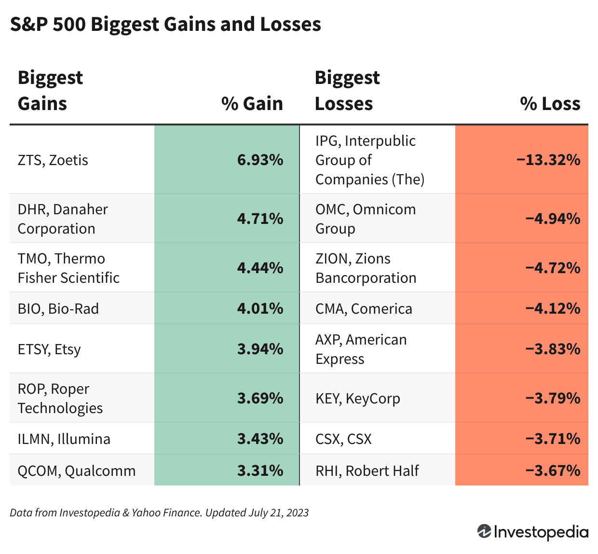

## Table of Contents

## What is the S&P 500 and why is it important?

The S&P 500 is a stock market index that measures the performance of 500 large companies listed on stock exchanges in the United States. It is maintained by a company called Standard & Poor's, which is why it's called the S&P 500. The index includes companies from many different industries, like technology, healthcare, and finance. When people talk about "the market" going up or down, they often mean the S&P 500.

The S&P 500 is important because it gives investors a good idea of how the overall U.S. economy is doing. If the S&P 500 goes up, it usually means that many big companies are doing well, which can be a sign of a strong economy. Many people use the S&P 500 to compare their own investments. If their investments are doing better than the S&P 500, they might be happy with their choices. Also, many investment funds try to match the performance of the S&P 500, so it's a common benchmark for investors.

## How are the top stocks in the S&P 500 determined?

The top stocks in the S&P 500 are determined by their market capitalization, which is the total value of all the company's shares. The bigger the market capitalization, the higher the company ranks in the S&P 500. This means that companies like Apple, Microsoft, and Amazon, which have very high market values, are usually at the top of the list.

The S&P 500 is not just about size, though. The index also looks at other things like how much of the company's stock is available to the public and how the company is doing financially. But market capitalization is the main thing that decides which companies are at the top. So, if a company's stock price goes up a lot, its market capitalization will go up too, and it might move higher in the S&P 500 rankings.

## What criteria are used to select the top 25 S&P 500 stocks?

The top 25 S&P 500 stocks are chosen mainly by looking at their market capitalization. This means the total value of all the shares a company has. The bigger this value, the higher the company ranks. So, companies like Apple, Microsoft, and Amazon, which have very high market values, are usually at the top of the list.

But it's not just about size. The S&P 500 also considers other things. They look at how much of the company's stock is available to the public and how well the company is doing financially. These factors help make sure the top 25 stocks are not only big but also strong and stable.

## Can you list the top 25 S&P 500 stocks and their sectors?

The top 25 S&P 500 stocks are led by companies like Apple, Microsoft, and Amazon. Apple is in the technology sector and makes products like iPhones and iPads. Microsoft, also in the technology sector, is known for its Windows operating system and Office software. Amazon, in the consumer discretionary sector, is famous for its online shopping platform. Other big tech companies in the top 25 include Alphabet (Google's parent company) and Nvidia, both in the technology sector. Alphabet provides search engines and online services, while Nvidia makes computer chips.

In the financial sector, you'll find companies like Berkshire Hathaway and JPMorgan Chase in the top 25. Berkshire Hathaway, led by Warren Buffett, invests in many different businesses. JPMorgan Chase is a big bank that helps people and businesses with their money. The healthcare sector is represented by companies like UnitedHealth Group and Johnson & Johnson. UnitedHealth Group provides health insurance, and Johnson & Johnson makes medicines and medical devices. Other sectors in the top 25 include energy with Exxon Mobil, which finds and sells oil and gas, and communication services with Meta Platforms, which runs social media sites like Facebook.

Some other notable companies in the top 25 are Tesla in the consumer discretionary sector, known for its electric cars, and Visa in the financial sector, which helps people pay for things with credit and debit cards. Procter & Gamble, in the consumer staples sector, makes everyday products like soap and shampoo. Lastly, companies like Chevron in the energy sector and Eli Lilly in the healthcare sector, which makes medicines, round out the list of the top 25 S&P 500 stocks.

## What are the key performance indicators for these top stocks?

Key performance indicators for the top S&P 500 stocks include things like earnings per share, which shows how much money the company makes for each share of stock. Another important indicator is the price-to-earnings ratio, which compares the stock's price to how much money the company makes. Investors also look at revenue growth to see if the company is making more money over time. The return on equity is another key indicator, showing how well the company uses the money that shareholders have invested. These indicators help investors decide if a stock is a good buy or not.

Other important indicators include the company's market capitalization, which is the total value of all its shares, and the stock's volatility, which shows how much the stock's price goes up and down. The dividend yield is also key for some investors, as it shows how much money the company pays out to shareholders as a percentage of the stock's price. Finally, the beta of a stock tells investors how much the stock moves compared to the overall market. All these indicators together give investors a good picture of how well a company is doing and whether its stock is a good investment.

## How have these top stocks performed over the last year?

Over the last year, the top S&P 500 stocks have had different results. Some did really well, like Apple and Microsoft. Apple's stock went up a lot because people kept buying their iPhones and other products. Microsoft also did great because more people used their software and cloud services. Amazon's stock also grew, but not as much as Apple and Microsoft. They had a lot of competition, but their online shopping and cloud services still did well.

Other top stocks had mixed results. Tesla's stock went up and down a lot. At first, it went down because people worried about electric cars, but then it went up again because Tesla kept selling more cars. In the financial sector, JPMorgan Chase did okay, but not as good as the tech companies. Their stock went up a little because they made more money from loans and other services. In the healthcare sector, UnitedHealth Group's stock went up because more people needed health insurance. Overall, the top stocks had different performances, but many of them did well over the last year.

## What are the growth prospects for these top 25 stocks?

The growth prospects for the top 25 S&P 500 stocks look promising, especially for the big tech companies like Apple, Microsoft, and Amazon. Apple continues to sell a lot of iPhones and other devices, and they're also getting into new areas like streaming services and augmented reality. Microsoft is doing well with their cloud services and software, and they're always coming up with new things to help businesses and people. Amazon is growing their online shopping and cloud services, and they're also trying new things like grocery stores and healthcare. These companies have strong businesses and keep finding new ways to grow.

Other sectors also have good growth prospects. In the financial sector, companies like JPMorgan Chase and Visa are expected to grow because more people and businesses need their services. In healthcare, UnitedHealth Group and Johnson & Johnson should keep growing because more people need health insurance and medicines. Energy companies like Exxon Mobil and Chevron might have some ups and downs, but they'll still be important because the world needs oil and gas. Overall, most of these top 25 stocks have good chances to grow in the future because they're in strong industries and keep finding new ways to make money.

## How do these stocks contribute to the overall performance of the S&P 500?

The top 25 stocks in the S&P 500 have a big impact on how the whole index does. These stocks are usually the biggest companies in the S&P 500, and they make up a big part of the index's total value. When these big stocks go up, they can pull the whole S&P 500 up with them. For example, if Apple or Microsoft have a good day, their stock prices can go up a lot, and that can make the S&P 500 go up too. On the other hand, if these big stocks go down, they can drag the whole index down with them.

Because these top stocks are so important, what happens to them can show how the whole market is doing. If companies like Amazon and Tesla are doing well, it might mean the economy is strong. But if they're not doing well, it could be a sign that the economy is having problems. Investors watch these top stocks closely because they can give a good idea of where the market is headed. So, the performance of these top 25 stocks is a big part of what makes the S&P 500 go up or down.

## What are the risk factors associated with investing in these top stocks?

Investing in the top stocks of the S&P 500 can be risky because these companies are big and well-known, so a lot of people watch them closely. If something bad happens to one of these companies, like a big problem with their products or a lawsuit, their stock price can go down a lot. Also, these companies can be affected by things happening all over the world, like changes in laws or big economic problems. So, if you invest in these stocks, you need to be ready for some ups and downs.

Another risk is that these big companies might not grow as fast as smaller companies. Sometimes, big companies like Apple or Microsoft can grow slowly because they're already so big. If you want to make a lot of money quickly, these stocks might not be the best choice. Also, because these stocks make up a big part of the S&P 500, if they do badly, it can affect your whole investment portfolio. So, it's important to think about how much of your money you want to put into these stocks and make sure you're not putting all your eggs in one basket.

## How do these stocks compare to other major indices like the Dow Jones or Nasdaq?

The top S&P 500 stocks are different from the stocks in the Dow Jones and Nasdaq because each index looks at different things. The S&P 500 has 500 big companies from many different industries, so it gives a good picture of the whole U.S. economy. The Dow Jones, on the other hand, only has 30 big companies, and it's been around for a long time. It's more focused on traditional industries like finance and manufacturing. The Nasdaq has a lot of technology and internet companies, so it's good if you want to see how tech stocks are doing.

When you look at how these stocks perform, the S&P 500 often moves in a similar way to the Dow Jones because they both have big, well-known companies. But the Nasdaq can be different because it has a lot of tech stocks that can go up and down a lot. For example, if Apple or Microsoft do well, they can help the S&P 500 and Nasdaq go up, but they might not affect the Dow Jones as much because it has fewer tech companies. So, if you're thinking about investing, it's good to know how these different indices work and what kinds of companies they have.

## What are some advanced financial metrics used to evaluate these top stocks?

When people want to understand how well the top S&P 500 stocks are doing, they look at advanced financial metrics like the price-to-earnings growth ratio, or PEG ratio. This number helps investors see if a stock's price is a good deal compared to how fast the company is growing. A lower PEG ratio can mean the stock is a good buy because the company is growing quickly but the stock price isn't too high. Another important metric is the free cash flow, which shows how much money a company has left after it pays for everything it needs to run its business. If a company has a lot of free cash flow, it can use that money to grow, pay dividends, or buy back its own stock.

Investors also pay attention to the debt-to-equity ratio, which tells them how much a company is borrowing compared to what it owns. A high debt-to-equity ratio can be risky because it means the company has a lot of debt, but a low ratio can mean the company is financially strong. Another useful metric is the return on invested capital, or ROIC, which shows how well a company is using the money it gets from investors to make more money. A high ROIC means the company is good at turning investments into profits. These advanced metrics help investors get a deeper understanding of a company's financial health and future potential.

## How can an investor build a diversified portfolio using these top S&P 500 stocks?

An investor can build a diversified portfolio using the top S&P 500 stocks by choosing a mix of companies from different sectors. For example, they might pick stocks from technology companies like Apple and Microsoft, financial companies like JPMorgan Chase, healthcare companies like UnitedHealth Group, and energy companies like Exxon Mobil. By spreading their money across different sectors, the investor can reduce the risk that comes with having all their money in just one type of business. If one sector has a bad year, the others might do better, which can help balance out the portfolio.

Another way to diversify is to look at the size of the companies. While the top S&P 500 stocks are all big, some are bigger than others. An investor might choose to put some money into the very biggest companies, like Apple and Microsoft, and some into slightly smaller ones, like Chevron or Procter & Gamble. This can help spread the risk even more because the biggest companies might not always grow as fast as the smaller ones. By mixing different sizes and sectors, an investor can create a portfolio that's more likely to do well over time, even if some parts of the market have ups and downs.

## References & Further Reading

[1]: Bergstra, J., Bardenet, R., Bengio, Y., & Kégl, B. (2011). ["Algorithms for Hyper-Parameter Optimization."](https://papers.nips.cc/paper/4443-algorithms-for-hyper-parameter-optimization) Advances in Neural Information Processing Systems 24.

[2]: ["Advances in Financial Machine Learning"](https://www.amazon.com/Advances-Financial-Machine-Learning-Marcos/dp/1119482089) by Marcos Lopez de Prado

[3]: ["Evidence-Based Technical Analysis: Applying the Scientific Method and Statistical Inference to Trading Signals"](https://www.amazon.com/Evidence-Based-Technical-Analysis-Scientific-Statistical/dp/0470008741) by David Aronson

[4]: ["Machine Learning for Algorithmic Trading"](https://github.com/stefan-jansen/machine-learning-for-trading) by Stefan Jansen

[5]: ["Quantitative Trading: How to Build Your Own Algorithmic Trading Business"](https://www.amazon.com/Quantitative-Trading-Build-Algorithmic-Business/dp/1119800064) by Ernest P. Chan