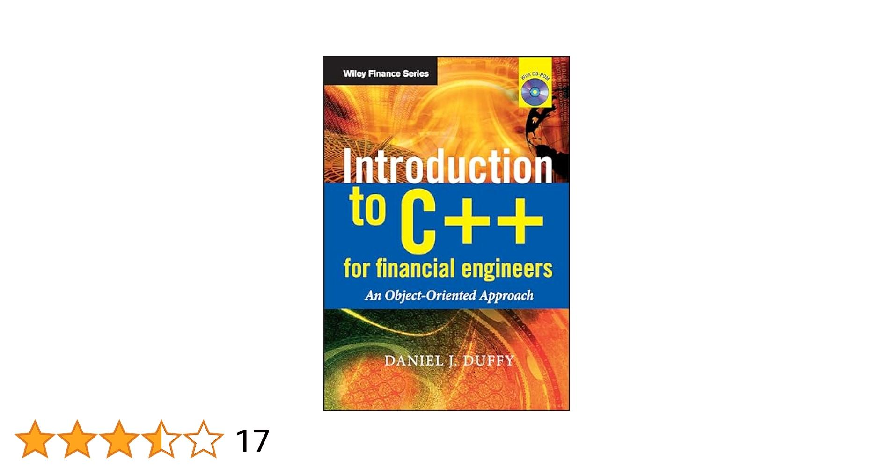

## Table of Contents

## What are the basic programming concepts that a beginner financial engineer should learn from a C++ book?

As a beginner financial engineer learning C++, it's important to start with the basics of the language. You should first understand variables and data types, which are the building blocks of any program. Variables store data, and data types define what kind of data they can hold, like numbers or text. Next, you need to learn about control structures, such as if-else statements and loops. These help you make decisions and repeat actions in your code. Functions are also crucial; they allow you to break your program into smaller, reusable pieces of code, making it easier to manage and understand.

Another key concept is object-oriented programming (OOP), which is very useful in financial engineering. OOP involves creating classes and objects, which help you model real-world entities and their behaviors. For example, you might create a class to represent a financial instrument like a stock or bond. Understanding how to use classes and objects will help you build more complex and organized programs. Additionally, you should learn about memory management in C++, as it's important for performance and efficiency, especially when dealing with large datasets common in finance.

Lastly, getting familiar with some advanced topics like templates and the Standard Template Library (STL) can be beneficial. Templates allow you to write generic code that can work with different data types, which is useful for creating flexible financial models. The STL provides a collection of pre-written code for common tasks, like sorting data or managing containers, which can save you time and help you focus on the financial aspects of your work. By mastering these concepts, you'll be well-equipped to tackle the programming challenges in financial engineering.

## How do the recommended C++ books introduce object-oriented programming to beginners in financial engineering?

Recommended C++ [books](/wiki/algo-trading-books) for beginners in financial engineering often introduce object-oriented programming (OOP) by first explaining the concept of classes and objects. They start with simple examples, like creating a class to represent a bank account or a stock. These books show how to define a class with attributes (like account balance or stock price) and methods (like deposit money or calculate stock returns). By using relatable financial examples, the books help beginners understand how OOP can model real-world financial entities and their behaviors. They also explain how to create objects from these classes, which allows you to work with multiple instances of the same type, like different bank accounts or stocks.

As beginners progress, the books delve into more advanced OOP concepts like inheritance and polymorphism. They might show how to create a base class for a financial instrument and then derive specific classes for stocks, bonds, or options. This helps beginners see how inheritance can be used to share common attributes and methods among different types of financial instruments, making the code more organized and easier to maintain. Polymorphism is introduced by showing how different financial instruments can respond differently to the same method call, like calculating returns. By using these OOP concepts, the books guide beginners in building more complex and flexible financial models, which are essential in financial engineering.

## What specific C++ features are most useful for financial engineers, and which books cover them effectively?

For financial engineers, some of the most useful C++ features include templates, the Standard Template Library (STL), and object-oriented programming (OOP). Templates allow you to write code that can work with different data types, which is helpful when you need to create flexible financial models. The STL provides ready-to-use code for common tasks like sorting data or managing containers, which can save time and help focus on the financial aspects of your work. OOP lets you model real-world financial entities like stocks or bonds, making your code more organized and easier to understand.

Books like "C++ Primer" by Stanley B. Lippman, Josée Lajoie, and Barbara E. Moo cover these features effectively. This book starts with the basics and gradually introduces more advanced topics, including templates and the STL. It also explains OOP in a way that's easy to understand, using examples that can be related to financial engineering. Another good book is "Effective C++" by Scott Meyers, which provides practical advice on how to use C++ features efficiently. It covers best practices for using templates and OOP, which are crucial for building robust financial models. Both books are great resources for financial engineers looking to master C++.

## Can you recommend C++ books that include practical examples related to financial engineering?

"C++ for Financial Engineers" by Daniel J. Duffy is a great book that focuses on using C++ in finance. It has many practical examples that show how to use C++ for things like pricing options and managing risk. The book explains how to use C++ features like templates and object-oriented programming to build financial models. It's written in a way that's easy to understand, even if you're new to financial engineering.

Another good book is "Financial Instrument Pricing Using C++" by Petter Kolm. This book uses C++ to show how to price different financial instruments like stocks and bonds. It includes lots of code examples that you can use and learn from. The book also talks about how to use the Standard Template Library (STL) to make your financial models more efficient. It's a helpful resource for anyone wanting to apply C++ in real financial situations.

## How do these books help beginners understand the application of C++ in financial modeling?

"C++ for Financial Engineers" by Daniel J. Duffy is really helpful for beginners because it uses clear examples to show how C++ can be used in finance. The book talks about things like pricing options and managing risk, which are important in financial modeling. It explains how to use C++ features like templates and object-oriented programming to build these models. By showing step-by-step examples, the book makes it easier for beginners to see how C++ can be applied in real financial situations.

"Financial Instrument Pricing Using C++" by Petter Kolm also helps beginners understand financial modeling with C++. This book focuses on pricing different financial instruments, like stocks and bonds, using C++. It includes lots of code examples that you can look at and learn from. The book also explains how to use the Standard Template Library (STL) to make your financial models work better. By going through these examples, beginners can see how C++ can be used to solve real problems in finance.

## What level of mathematical knowledge is required to fully utilize the C++ books suggested for financial engineers?

To fully use the C++ books suggested for financial engineers, you need to know some basic math. You should be comfortable with algebra, because it helps you understand the formulas used in financial models. You also need to know a bit about [statistics](/wiki/bayesian-statistics), like how to calculate averages and standard deviations. These books often explain how to use C++ to solve financial problems that involve these math concepts, so knowing them will help you follow along and use the code examples better.

For more advanced parts of the books, you might need to know about calculus and probability. Calculus is important for things like pricing options, which is a common topic in financial engineering. Probability helps you understand risk and how to model it in your financial models. The books usually explain these concepts in a way that's easy to understand, but having a basic understanding of them before you start can make it easier to learn how to use C++ for these advanced financial models.

## Are there any books in the list that focus on advanced C++ techniques specifically tailored for financial engineering applications?

"C++ for Financial Engineers" by Daniel J. Duffy is a book that focuses on advanced C++ techniques for financial engineering. It goes beyond the basics and shows you how to use C++ for complex tasks like pricing options and managing risk. The book explains how to use advanced features like templates and object-oriented programming to build sophisticated financial models. It's written in a way that's easy to understand, even if you're new to these advanced topics.

"Financial Instrument Pricing Using C++" by Petter Kolm also dives into advanced C++ techniques for financial engineering. This book focuses on pricing different financial instruments like stocks and bonds. It uses advanced C++ features and the Standard Template Library (STL) to make these financial models work better. The book includes lots of code examples that show you how to apply these advanced techniques in real financial situations.

## How do the recommended books address the integration of C++ with other financial tools and software?

"C++ for Financial Engineers" by Daniel J. Duffy talks about how C++ can work with other financial tools and software. It explains how you can use C++ to connect with databases and other systems that financial engineers often use. The book shows you how to write code that can talk to these other tools, making it easier to use C++ in real financial work. It also gives examples of how to use C++ with libraries that help with things like graphing data or running simulations, which are important in finance.

"Financial Instrument Pricing Using C++" by Petter Kolm also covers how C++ can be used with other financial software. The book shows how you can use C++ to work with tools that help price financial instruments like stocks and bonds. It gives examples of how to connect C++ code with these tools, so you can use C++ to do the heavy lifting while still using other software for things like data analysis or reporting. Both books help you understand how C++ fits into the bigger picture of financial engineering, making it easier to use in real-world situations.

## What are the differences in teaching approach among the top 5 C++ books for financial engineers?

"C++ for Financial Engineers" by Daniel J. Duffy takes a very practical approach. It uses lots of real-life examples from finance to show how C++ can be used. The book starts with basic C++ concepts and slowly moves to more advanced topics like templates and object-oriented programming. It also explains how C++ can work with other financial tools and software. Duffy's book is good for beginners because it's easy to understand and focuses on applying C++ to solve financial problems.

"Financial Instrument Pricing Using C++" by Petter Kolm focuses more on using C++ to price financial instruments like stocks and bonds. It includes many code examples that show you how to do this. The book also talks about how to use the Standard Template Library (STL) to make your financial models work better. Kolm's book is good for people who want to learn how to use C++ for specific financial tasks. It shows how C++ can be connected with other software used in finance.

"Effective C++" by Scott Meyers takes a different approach. It's not specifically about finance, but it gives you tips on how to use C++ better. The book is full of best practices and advice on how to write good C++ code. It's useful for financial engineers who want to improve their C++ skills and make their financial models more efficient. Meyers' book is more about the general use of C++ and can help you write better code for any application, including finance.

## How do these books prepare financial engineers for real-world challenges in programming and financial analysis?

"C++ for Financial Engineers" by Daniel J. Duffy prepares financial engineers for real-world challenges by focusing on practical examples from finance. The book starts with basic C++ concepts and gradually introduces more advanced topics like templates and object-oriented programming. It shows how to use C++ to solve real financial problems, like pricing options and managing risk. By including examples of how C++ can work with other financial tools and software, the book helps engineers understand how to integrate C++ into their daily work. This practical approach makes it easier for beginners to see how C++ can be applied in real financial situations, preparing them for the challenges they will face.

"Financial Instrument Pricing Using C++" by Petter Kolm also equips financial engineers for real-world challenges by focusing on pricing different financial instruments like stocks and bonds. The book includes many code examples that show how to use C++ for these specific tasks. It also explains how to use the Standard Template Library (STL) to make financial models more efficient. By showing how C++ can be connected with other software used in finance, Kolm's book helps engineers understand how to use C++ in a broader financial context. This focus on practical applications and integration with other tools prepares engineers to tackle real-world financial analysis and programming challenges.

"Effective C++" by Scott Meyers, while not specifically about finance, helps financial engineers by providing tips on how to use C++ better. The book is full of best practices and advice on writing good C++ code. This can help engineers make their financial models more efficient and reliable. By learning these general C++ skills, financial engineers can improve their programming abilities, which is crucial for handling the complex tasks they face in financial analysis. Meyers' book complements the other two by focusing on the quality and efficiency of C++ code, preparing engineers for the technical challenges of real-world financial programming.

## Are there any companion resources, such as online courses or forums, that complement the books listed?

For those using "C++ for Financial Engineers" by Daniel J. Duffy, there are several online resources that can help. You can find video tutorials on platforms like YouTube that explain C++ concepts in a way that's easy to understand. Websites like Coursera and Udemy also offer courses on C++ and financial engineering that can complement the book. Joining forums like Stack Overflow or Reddit's r/learnprogramming can be helpful too. These places let you ask questions and get answers from other people who are learning or working in the field.

If you're using "Financial Instrument Pricing Using C++" by Petter Kolm, you might want to check out online courses that focus on financial modeling and C++. Websites like edX and Coursera have courses that cover these topics. You can also join online communities like Quantopian or Wilmott, where you can discuss financial engineering and programming with others. These forums are great for getting advice and sharing your own experiences.

"Effective C++" by Scott Meyers can be paired with online resources that focus on C++ best practices. Websites like Pluralsight offer courses that dive deep into C++ programming. Joining forums like C++ subreddit or the C++ Users Group can also be beneficial. These communities are full of experienced programmers who can give you tips on how to write better C++ code.

## What feedback have financial engineers given about these books in terms of their effectiveness in learning C++?

Financial engineers often say that "C++ for Financial Engineers" by Daniel J. Duffy is very helpful for learning C++. They like how the book uses real examples from finance to explain C++ concepts. Many say it's easy to understand, even if you're new to programming. The book's practical approach helps them see how to use C++ in their everyday work. They also appreciate how it shows how C++ can work with other financial tools and software.

"Financial Instrument Pricing Using C++" by Petter Kolm gets good feedback too. Financial engineers find the book useful because it focuses on pricing financial instruments like stocks and bonds. They like the many code examples that show how to do this. The book also helps them understand how to use the Standard Template Library (STL) to make their financial models work better. Many say it's great for learning how to use C++ for specific financial tasks.

"Effective C++" by Scott Meyers is praised for its tips on writing good C++ code. Financial engineers say it helps them make their financial models more efficient and reliable. Even though it's not just about finance, they find the general C++ advice very useful. Many say it's a great book to read after learning the basics, as it helps them improve their programming skills and tackle real-world challenges in financial engineering.

## References & Further Reading

[1]: Armstrong, J. (2011). ["C++ for Financial Mathematics."](https://www.taylorfrancis.com/books/mono/10.1201/9781315368382/financial-mathematics-john-armstrong) World Scientific Publishing Company.

[2]: Duffy, D. J. (2004). ["Financial Instrument Pricing Using C++."](https://onlinelibrary.wiley.com/doi/book/10.1002/9781119170518) Wiley.

[3]: Johnson, B. (2010). ["Algorithmic Trading & DMA: An Introduction to Direct Access Trading Strategies."](https://www.amazon.com/Algorithmic-Trading-DMA-introduction-strategies/dp/0956399207) 4Myeloma Press.

[4]: Lopez de Prado, M. (2018). ["Advances in Financial Machine Learning."](https://www.amazon.com/Advances-Financial-Machine-Learning-Marcos/dp/1119482089) Wiley.

[5]: Chan, E. P. (2008). ["Quantitative Trading: How to Build Your Own Algorithmic Trading Business."](https://github.com/ftvision/quant_trading_echan_book) Wiley.

[6]: Jansen, S. (2020). ["Machine Learning for Algorithmic Trading: Predictive Models to Extract Signals from Market and Alternative Data for Systematic Trading Strategies with Python."](https://www.amazon.com/Machine-Learning-Algorithmic-Trading-alternative/dp/1839217715) Packt Publishing.