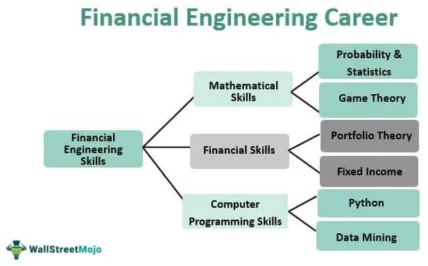

Algorithmic trading represents a transformative force in the finance sector, offering substantial enhancements over traditional trading methods. It involves the use of computer algorithms to execute a vast array of financial transactions at speeds and frequencies that are unimaginable for a human trader. By utilizing mathematical models and automated processes, algorithmic trading helps in achieving objectives such as market making, arbitrage, and trend following with precision and minimal market impact.

The significance of algorithmic trading lies in its ability to handle complex calculations across extensive datasets, making it invaluable in today's fast-paced financial markets. It promises increased efficiency, reduced transaction costs, and improved market liquidity. Moreover, algorithmic trading can process multiple indicators and parameters simultaneously, offering traders the ability to craft advanced strategies that adapt to ever-changing market conditions.



C++ emerges as a pivotal language in this computational-intensive landscape. Renowned for its execution speed and memory efficiency, C++ is highly relevant in high-frequency trading (HFT) environments where every microsecond counts. Its ability to operate at both high and low levels of abstraction makes C++ an ideal choice for developing trading algorithms that require optimal performance and precise control over system resources. Additionally, its comprehensive standard libraries and frameworks are instrumental in constructing reliable and scalable trading platforms.

The purpose of this article is to explore how C++ serves as a powerful tool in developing financial algorithms for trading, leveraging its strengths to enhance key aspects of modern trading systems. We will cover the advantages of integrating C++ in trading, focusing on areas such as computational efficiency, memory management, and real-time data processing. Furthermore, the article will discuss the role of C++'s advanced features, such as multithreading capabilities and resourceful libraries, in supporting complex financial solutions.

Key points that will be addressed in this article include the transformative role of algorithmic trading, why C++ is preferred for constructing high-performance algorithms, critical features of C++ that benefit financial applications, the process of developing trading strategies using C++, and an examination of the challenges associated with using C++ in trading environments. Through this comprehensive discussion, readers will obtain insights into why C++ remains a dominant force in the development of sophisticated trading systems.

## Table of Contents

## The Role of Algorithmic Trading in Finance

Algorithmic trading involves using computer algorithms to execute trading strategies in financial markets. These strategies are designed to identify profitable trading opportunities by analyzing large data sets, identifying patterns, and executing trades at speeds beyond human capability. This approach has significantly transformed the finance industry by enhancing the efficiency, speed, and accuracy of trading operations.

One of the primary benefits of [algorithmic trading](/wiki/algorithmic-trading) is the speed at which it can execute trades. Automated systems can process information and make trading decisions in a fraction of a second, providing a substantial advantage in markets where timeliness is crucial. The accuracy of algorithmic trading lies in its ability to systematically eliminate the influence of human error and emotion, allowing for consistent and objective decision-making based on pre-defined criteria.

Algorithmic trading also excels in its ability to handle large data sets. It can simultaneously analyze data from various sources, process multiple data streams, and execute complex algorithms in real-time. This capability is particularly crucial in high-frequency trading, where successful strategies require the analysis of extensive historical data and contemporary market trends to predict future price movements accurately.

The versatility of algorithmic trading extends to various financial instruments, including stocks, derivatives, and [forex](/wiki/forex-system). In the stock market, algorithms are utilized to execute trades that account for short-term price fluctuations, while in derivatives markets, they are used to manage complex options strategies and hedge positions. Forex trading, with its 24-hour global market, benefits from algorithms that can capitalize on minute differences in currency exchange rates across different markets and time zones.

Overall, algorithmic trading has become an integral part of the financial industry due to its ability to enhance trading strategies' speed, precision, and scope. Its application across diverse financial instruments makes it an indispensable tool for modern financial markets.

## Why C++ is Preferred for Algo Trading

C++ is often favored in algorithmic trading due to its prominent performance advantages, primarily speed and efficiency. Trading algorithms require rapid execution and minimal latency, as decisions are made within microseconds. C++ excels in this environment because it compiles directly to machine code, allowing programs to run at significantly higher speeds compared to interpreted languages like Python. This speed is crucial for high-frequency trading platforms, where even nanosecond-level differences can impact profitability.

C++ allows for low-level memory manipulation, which provides programmers with precise control over system resources. This control enables optimization of memory usage and processing efficiency, reducing overall execution time. For example, developers can manage memory allocation and deallocation using pointers, providing an ability to directly influence memory layouts and cache management. Such control ensures trading systems operate with minimal overhead, an essential [factor](/wiki/factor-investing) in financial environments where every microsecond counts.

Furthermore, C++ supports both low-level memory manipulation and high-level computational tasks, a dual capability that benefits complex algorithmic operations. The language's capability to perform intricate numerical computations is bolstered by its support for inline assembly within C++ code, allowing developers to optimize specific sections for hardware-level operations. This amalgamation of low and high-level functionality positions C++ as a versatile tool for implementing sophisticated trading models that require optimized computation and data handling.

In comparison with other programming languages, C++'s performance in trading systems often surpasses that of languages such as Python and Java. Python, while popular for its ease of use and extensive libraries, is an interpreted language and thus inherently slower. Python is frequently used for prototyping trading algorithms due to its simplicity and readability. However, once the algorithms need to be deployed for production in a high-frequency setting, they are often rewritten in C++ to benefit from its superior execution speed.

Java, though faster than Python, is generally slower than C++ due to its reliance on the Java Virtual Machine (JVM) for execution. While Java offers portability across different platforms and has a garbage collection mechanism that simplifies memory management, it incurs additional runtime overhead compared to C++, which can impact the latency-sensitive domain of algorithmic trading.

Overall, the preference for C++ in algorithmic trading arises from its ability to deliver unmatched speed and efficiency, coupled with an ability to perform both low-level and high-level operations essential for executing complex trading strategies promptly and reliably.

## Key Features of C++ That Benefit Algorithmic Trading

C++ has long been a language of choice for developing algorithmic trading systems, owing to several key features that contribute to its efficiency and flexibility. One of the most significant advantages is the wealth of libraries available, such as the Standard Template Library (STL) and Boost, which provide robust tools for building sophisticated financial algorithms. The STL offers a variety of data structures and algorithms that are essential for managing and processing large volumes of financial data efficiently. Boost, on the other hand, extends the functionality of C++ with libraries that support tasks like threading, mathematical computations, and data handling, crucial for high-frequency trading environments. 

Multithreading is another pivotal feature of C++ that enhances its utility in algorithmic trading. The ability to execute multiple threads simultaneously allows trading applications to perform various calculations concurrently, minimizing latency and improving execution speed. This is particularly important in high-frequency trading, where the ability to process market data and execute orders within microseconds can significantly impact profitability. C++ provides robust support for multithreading through both its standard library and extensions like Boost.Thread, offering tools to optimize concurrent operations and thread management.

The flexibility and scalability of C++ code are vital for developing complex trading systems that must adapt to changing market conditions and integrate with various data sources and trading platforms. C++'s capacity for low-level memory manipulation allows developers to optimize performance-critical sections of the code, ensuring efficient use of system resources. Additionally, C++ is well-suited for building scalable systems, as developers can modularize code, facilitating maintenance and enhancing the system's ability to evolve with new functionalities.

In summary, C++ is favored in financial algorithmic trading for its comprehensive libraries, multithreading capabilities, and the flexibility it provides in creating scalable trading systems. These features enable developers to build robust, high-performance trading applications that meet the demanding requirements of modern financial markets.

## Developing Algorithmic Trading Strategies with C++

Developing algorithmic trading strategies using C++ involves a structured process that encompasses designing, coding, testing, and deploying trading algorithms. This section outlines key steps and considerations for effectively implementing trading strategies using C++.

### Process of Developing a Trading Algorithm

1. **Define the Trading Strategy**

   Before coding begins, it is crucial to define the trading strategy. This entails specifying the rules for buy and sell signals, the financial instruments involved, and the risk management procedures. The strategy formulation is typically based on quantitative analysis and historical data insights.

2. **Coding the Algorithm in C++**

   C++ is used to translate the defined strategy into a programmable algorithm. This involves implementing the decision-making logic of the strategy, as well as necessary data handling processes. Given C++'s speed and efficiency, it is ideal for executing complex calculations and processing large datasets, essential for high-frequency trading environments.

3. **Integration with Data Feeds and APIs**

   Real-time trading requires integration with market data feeds and trading platforms' APIs. C++ provides the tools to connect and interact with various data providers. Libraries such as Boost and Poco are often used to handle network communications efficiently, allowing the algorithm to receive and process live market data instantly. This real-time data integration is crucial for executing trades according to timely insights and market conditions.

4. **Backtesting the Trading Strategy**

   Backtesting is a critical step that involves testing the algorithm against historical data to evaluate its effectiveness and profitability. This process helps identify potential flaws and areas for improvement in the strategy. Using historical data, the algorithm simulates trades as if it were live, allowing for the assessment of performance metrics such as return on investment, drawdowns, and Sharpe ratio. The C++ language optimizes this [backtesting](/wiki/backtesting) phase by handling large volumes of data quickly, thereby accelerating the validation process.

   The following Python pseudocode represents a simplified outline for backtesting a moving average crossover strategy:

   ```python
   def backtest_moving_average(data, short_window, long_window):
       signals = pd.DataFrame(index=data.index)
       signals['price'] = data['Close']
       signals['short_mavg'] = data['Close'].rolling(window=short_window, min_periods=1).mean()
       signals['long_mavg'] = data['Close'].rolling(window=long_window, min_periods=1).mean()
       signals['signal'] = 0.0
       signals['signal'][short_window:] = np.where(signals['short_mavg'][short_window:] > signals['long_mavg'][short_window:], 1.0, 0.0)
       signals['positions'] = signals['signal'].diff()
       return signals
   ```

   The pseudocode is used here for illustrative purposes, offering a glimpse into the backtesting logic that could be employed in a similar C++ implementation.

5. **Optimization and Deployment**

   After testing, optimizations are often required to refine the algorithm's performance. This includes adjusting parameters and restructuring code to reduce latency and increase throughput. Once optimized, the trading algorithm is deployed onto the trading platform.

### Importance of Historical Data Analysis

Historical data analysis is fundamental to algorithmic trading as it provides the foundation for both strategy formulation and validation during backtesting. By analyzing past market behavior, traders can identify trends and patterns that inform strategy development and refine their algorithms to better forecast future price movements.

In conclusion, developing algorithmic trading strategies using C++ requires meticulous planning and execution, with an emphasis on precise data handling and real-time capabilities. The integration of reliable data feeds and a rigorous backtesting process underpin the strategy's success and commercialization.

## Challenges and Considerations

Programming in C++ for algorithmic trading presents several complexities and considerations, particularly due to the language's powerful yet intricate features. One notable challenge is the steep learning curve associated with mastering C++. Compared to more intuitive languages like Python, C++ demands a comprehensive understanding of concepts such as memory management, pointers, and object-oriented programming. Mastery of these aspects is critical for developing robust and efficient trading algorithms.

System integration and maintenance within a C++ trading framework also pose significant challenges. Trading systems often require integration with various data providers, APIs, and execution platforms, necessitating the use of a variety of libraries and protocols. C++'s flexibility allows for precise control over system resources, but this also demands meticulous system integration to ensure compatibility and reliability across different components. Maintenance of such systems can be demanding, as updates or modifications need to be carefully managed to prevent disruptions in trading activities. This requires a disciplined approach to software development and version control.

Another critical consideration in high-frequency trading ([HFT](/wiki/high-frequency-trading-strategies)) systems is the management and minimization of latency. Latency refers to the time delay between the initiation of a trading action and its execution. In HFT, where trades are executed in microseconds, minimizing latency is critical for success. C++ is favored for HFT due to its ability to produce highly optimized and efficient executable code, which is crucial for reducing latency. However, achieving low latency involves addressing various factors beyond just the choice of programming language.

First, the use of efficient data structures and algorithms is fundamental. For instance, optimizing algorithmic complexity from O(n^2) to O(n log n) can significantly impact execution time. Second, network latency must be minimized. This involves optimizing network stack performance, selecting efficient communication protocols, and potentially employing co-location strategies, which involve placing trading servers physically close to exchange servers. Third, hardware considerations such as CPU processing power, memory bandwidth, and cache sizes play an important role in reducing computational delays.

In summary, while C++ offers unparalleled performance advantages for algorithmic trading, leveraging its full potential requires overcoming several challenges. Understanding the language's complexities, ensuring seamless system integration, and rigorously addressing latency are all pivotal for developing a successful and competitive trading system.

## Conclusion

C++ has firmly established itself as a critical tool in the domain of financial algorithmic trading. The language's primary appeal lies in its unparalleled speed and efficiency, which are essential for executing high-frequency trades where milliseconds can determine the profitability of a transaction. Its ability to handle low-level memory manipulation simultaneously with high-level computational processes ensures that trading algorithms can perform optimally without compromising on processing power.

Moreover, the scalability of C++ allows for the seamless expansion and customization of trading systems as market demands evolve. This adaptability is crucial in contemporary finance, where trading platforms must rapidly process vast amounts of data and respond instantaneously to market changes. The flexibility offered by C++ aids in constructing robust and reliable trading architectures capable of handling these high-stakes, complex environments.

For those intrigued by the potential of C++ in the financial sector, pursuing further knowledge and expertise in this programming language can open doors to innovative algorithmic trading strategies. There is immense value in learning how to leverage C++ to maximize system performance and augment trading capabilities. Engaging with resources and communities focused on C++ in finance will undoubtedly enrich one’s understanding and application of this formidable programming tool in algorithmic trading. Through continuous learning and application, traders and developers can harness the full spectrum of opportunities that C++ offers, ultimately leading to more sophisticated and effective trading solutions.

## Additional Resources

For those looking to enhance their knowledge of C++ in the context of finance and algorithmic trading, several excellent resources are available. These resources range from [books](/wiki/algo-trading-books) and online courses to interactive tutorials and community forums, each offering unique insights into mastering C++ for trading applications.

### Books
1. **"C++ for Financial Mathematics" by John Armstrong** – This book provides a comprehensive introduction to using C++ in financial mathematics, emphasizing practical applications and numerical methods.
2. **"Financial Instrument Pricing Using C++" by Daniel J. Duffy** – Known for its practical examples, this book covers the pricing of financial derivatives using C++ with detailed code explanations.
3. **"Algorithmic Trading & DMA: An Introduction to Direct Access Trading Strategies" by Barry Johnson** – While not exclusively focused on C++, this book provides a strong foundation in trading strategies and includes C++ code snippets relevant to algorithmic trading.

### Online Courses
1. **Coursera - "C++ For C Programmers, Part A"** – This course provides an intermediate-level introduction to C++, beneficial for those with prior programming experience, focusing on the aspects most applicable to trading algorithms.
2. **edX - "Introduction to C++"** – Provided by Microsoft, this course is ideal for beginners wanting to solidify their C++ understanding, which is crucial for developing efficient trading systems.

### Tutorials
1. **CPlusPlus.com – C++ Language Tutorial**: This website offers a structured and comprehensive guide to C++ starting from basics to advanced topics which are crucial in algorithmic trading.
2. **GeeksforGeeks - C++ Programming Language**: Known for its easy explanations and strong emphasis on coding, this platform can be an ideal place for grasping the nuances of C++ programming.

### Communities and Forums
1. **Quantitative Finance Stack Exchange**: An invaluable platform where professionals and learners discuss algorithmic trading strategies and troubleshoot C++ coding issues related to trading.
2. **GitHub**: Many open-source algorithmic trading projects use C++. Engaging with repositories can provide practical insights and aid learning via collaboration.
3. **Reddit - r/algotrading**: A community-driven forum where topics related to algorithmic and high-frequency trading are discussed, with occasional focus on programming languages like C++.

### Online Platforms
1. **Algorithmic Trading Course (AlgoTrading101)** – This course covers various algorithmic strategies, often incorporating C++ as a foundational language.
2. **Udacity**: Known for its Nanodegree programs, Udacity offers courses that include C++ programming for financial applications, providing practical projects to implement learned skills.

Engagement with these resources can significantly enhance one's proficiency in C++, specifically tailored to the requirements and challenges of algorithmic trading.

## References & Further Reading

[1]: Armstrong, J. (2011). ["C++ for Financial Mathematics."](https://www.taylorfrancis.com/books/mono/10.1201/9781315368382/financial-mathematics-john-armstrong) World Scientific Publishing Company.

[2]: Duffy, D. J. (2004). ["Financial Instrument Pricing Using C++."](https://onlinelibrary.wiley.com/doi/book/10.1002/9781119170518) Wiley.

[3]: Johnson, B. (2010). ["Algorithmic Trading & DMA: An Introduction to Direct Access Trading Strategies."](https://www.amazon.com/Algorithmic-Trading-DMA-introduction-strategies/dp/0956399207) 4Myeloma Press.

[4]: Lopez de Prado, M. (2018). ["Advances in Financial Machine Learning."](https://www.amazon.com/Advances-Financial-Machine-Learning-Marcos/dp/1119482089) Wiley.

[5]: Chan, E. P. (2008). ["Quantitative Trading: How to Build Your Own Algorithmic Trading Business."](https://github.com/ftvision/quant_trading_echan_book) Wiley.

[6]: Jansen, S. (2020). ["Machine Learning for Algorithmic Trading: Predictive Models to Extract Signals from Market and Alternative Data for Systematic Trading Strategies with Python."](https://www.amazon.com/Machine-Learning-Algorithmic-Trading-alternative/dp/1839217715) Packt Publishing.