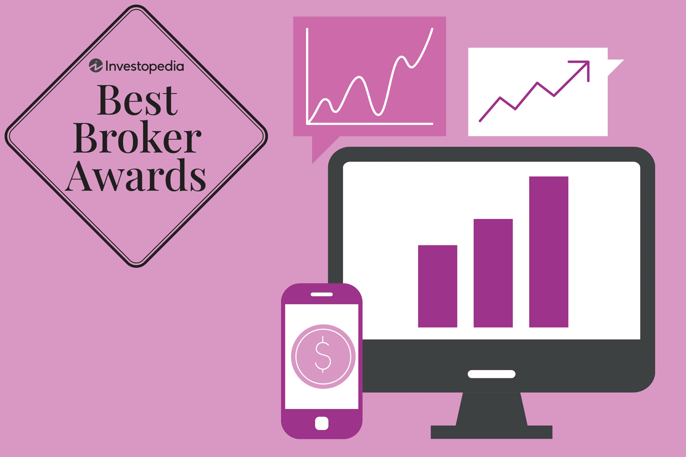

## Table of Contents

## What is an ETF and why should beginners consider investing in them?

An ETF, or Exchange-Traded Fund, is a type of investment that holds a collection of assets like stocks, bonds, or commodities. It's like a basket where you can own a little bit of many different things at once. ETFs are traded on stock exchanges, just like individual stocks, which means you can buy and sell them throughout the day at market prices.

Beginners should consider investing in ETFs because they offer a simple way to diversify their investments. Instead of picking individual stocks, which can be risky and time-consuming, you can invest in an ETF and instantly own a piece of many companies or assets. This diversification can help reduce risk because if one company in the ETF does poorly, it's balanced out by the others. Plus, ETFs often have lower fees than other types of funds, making them a cost-effective choice for new investors.

## How do I choose the right broker for ETF investing as a beginner?

Choosing the right broker for ETF investing as a beginner can feel a bit overwhelming, but it's easier if you focus on a few key things. First, look for a broker that offers a user-friendly platform. This means the website or app should be easy to use and understand. You don't want to struggle with complicated menus or confusing instructions when you're just starting out. Also, make sure the broker has good customer support. If you have questions or run into problems, it's helpful to have someone you can call or chat with who can explain things in a simple way.

Another important thing to consider is the cost. Some brokers charge fees for buying and selling ETFs, while others offer commission-free trades. As a beginner, you'll want to keep your costs low, so look for a broker that doesn't charge you every time you make a trade. Also, check if the broker offers a wide selection of ETFs. You want to be able to choose from different types of ETFs so you can build a diversified portfolio that matches your investment goals.

Lastly, it can be helpful to read reviews and maybe even try out a few brokers before you decide. Many brokers offer a practice account where you can pretend to invest without using real money. This can give you a feel for how their platform works and whether it's a good fit for you. Remember, the right broker for you is one that makes investing easy, affordable, and enjoyable.

## What are the key features to look for in a broker for ETF investments?

When choosing a broker for ETF investments, the first thing to look for is a user-friendly platform. This means the website or app should be easy to use and understand. As a beginner, you don't want to struggle with complicated menus or confusing instructions. It's also important that the broker has good customer support. If you have questions or run into problems, you'll want someone you can call or chat with who can explain things in a simple way.

Another key feature is the cost. Some brokers charge fees for buying and selling ETFs, while others offer commission-free trades. As a beginner, keeping your costs low is important, so look for a broker that doesn't charge you every time you make a trade. Also, make sure the broker offers a wide selection of ETFs. You want to be able to choose from different types of ETFs so you can build a diversified portfolio that matches your investment goals.

Lastly, it can be helpful to read reviews and maybe even try out a few brokers before you decide. Many brokers offer a practice account where you can pretend to invest without using real money. This can give you a feel for how their platform works and whether it's a good fit for you. Remember, the right broker for you is one that makes investing easy, affordable, and enjoyable.

## Which brokers offer the lowest fees for ETF trading in 2024?

In 2024, some of the brokers that offer the lowest fees for ETF trading are Robinhood, Fidelity, and Vanguard. Robinhood is known for its zero-commission trades, which means you don't pay anything to buy or sell ETFs. Fidelity also offers commission-free trades for most ETFs, and they have a wide selection of ETFs to choose from. Vanguard, on the other hand, is famous for its low-cost index funds and ETFs, and they also don't charge you to trade their own ETFs.

These brokers are popular among beginners because they make it easy and affordable to start investing in ETFs. Robinhood has a very simple app that's easy to use, even if you're new to investing. Fidelity has a user-friendly platform and great customer support, so you can get help if you need it. Vanguard is a good choice if you want to keep your costs as low as possible and you're interested in their specific ETFs. Remember, the best broker for you depends on what you need, so it's a good idea to try out a few to see which one you like best.

## Can you recommend brokers that are best suited for passive ETF investors?

For passive ETF investors, Vanguard is a great choice. They are known for their low-cost index funds and ETFs, which are perfect for people who want to invest without spending a lot of time managing their money. Vanguard doesn't charge you to trade their own ETFs, which helps keep your costs down. Their platform is easy to use, and they have a lot of resources to help you learn about investing. If you're looking to set it and forget it, Vanguard is a good place to start.

Another good option for passive ETF investors is Fidelity. They offer commission-free trades for most ETFs, which means you don't pay anything to buy or sell them. Fidelity has a wide selection of ETFs, so you can find ones that fit your investment goals. Their platform is user-friendly, and they have great customer support if you need help. If you want to invest in ETFs without a lot of fuss, Fidelity can be a good fit for you.

Robinhood is also worth considering for passive ETF investors. They offer zero-commission trades, which is great for keeping your costs low. Robinhood's app is very simple and easy to use, making it a good choice if you're new to investing. While they might not have as many ETFs as some other brokers, they still offer a good selection. If you want a straightforward way to invest in ETFs without spending a lot of time or money, Robinhood could be the right choice for you.

## What are the advantages of using robo-advisors for ETF investments?

Using robo-advisors for ETF investments can make things a lot easier for you. They automatically pick and manage your ETFs based on your goals and how much risk you're okay with. This means you don't have to spend a lot of time figuring out which ETFs to buy or when to buy them. Robo-advisors use fancy computer programs to keep your investments balanced and make sure they're doing well. They also usually charge less than if you hired a human advisor, so you can save money while still getting good advice.

Another big advantage is that robo-advisors help you stay on track with your investing plan. They can automatically put money into your account and invest it for you, which is great if you're the kind of person who might forget to do it yourself. Plus, they can adjust your investments if things change in the market or if your goals change. This way, you can just set up your account and let the robo-advisor do the work for you, making investing a lot less stressful and time-consuming.

## How do different brokers support advanced trading strategies for ETFs?

Different brokers offer various tools and features to support advanced trading strategies for ETFs. For example, brokers like Interactive Brokers and Charles Schwab provide advanced trading platforms that allow you to use complex order types, like limit orders and stop-loss orders. These can help you buy or sell ETFs at specific prices or automatically sell them if the price drops too much. They also offer real-time data and charting tools, which can help you make better decisions about when to trade. If you're into more advanced strategies like options trading, these brokers let you trade options on ETFs, which can be a way to make money or protect your investments.

Another broker, TD Ameritrade, is known for its thinkorswim platform, which is popular among advanced traders. This platform has a lot of tools for analyzing the market and testing out different trading strategies before you use real money. You can use it to look at past data and see how your strategy would have worked, which can help you make smarter trades. TD Ameritrade also offers educational resources and webinars to help you learn more about advanced trading, which can be really helpful if you're trying to get better at it.

## Which brokers provide the best tools and research for ETF analysis in 2024?

In 2024, Fidelity stands out for its excellent tools and research for ETF analysis. They have a user-friendly platform that makes it easy to find and compare ETFs. You can look at detailed data like performance, expense ratios, and holdings. Fidelity also offers research reports and analyst ratings, which can help you understand if an ETF is a good choice for your goals. If you like to do a lot of research before you invest, Fidelity's tools can really help you make smart decisions.

Another broker that's great for ETF analysis is Charles Schwab. They have a tool called Schwab ETF Select List, which helps you find ETFs that have been carefully chosen by their experts. This can save you time because you don't have to look through hundreds of ETFs yourself. Charles Schwab also has a lot of educational resources and webinars, so you can learn more about ETFs and how to analyze them. If you want to get better at picking ETFs, Charles Schwab's tools and research can be really useful.

## What are the tax implications of ETF investing with various brokers?

When you invest in ETFs, the tax implications can be different depending on which broker you use. Most brokers handle ETFs the same way when it comes to taxes, but some might offer special accounts like tax-advantaged retirement accounts that can help you save on taxes. For example, if you invest in ETFs through a regular taxable account, you'll have to pay taxes on any dividends you receive and on any profits you make when you sell your ETFs. The tax rate can depend on how long you held the ETFs and whether the profits are considered short-term or long-term capital gains.

Some brokers, like Fidelity and Vanguard, offer tax-advantaged accounts such as IRAs or 401(k)s. These accounts can help you save on taxes because the money you invest grows without being taxed until you take it out, usually when you retire. This can be a big advantage if you're planning to hold your ETFs for a long time. It's a good idea to talk to a tax advisor or use the tax tools that some brokers provide to understand how your ETF investments might affect your taxes.

## How do international brokers compare for ETF investing, especially for non-U.S. investors?

For non-U.S. investors, choosing an international broker for ETF investing can offer different benefits and challenges compared to using U.S.-based brokers. International brokers like Interactive Brokers and Degiro are popular because they let you trade ETFs from many different countries. This is great if you want to invest in ETFs that focus on markets outside the U.S. These brokers often have lower fees for trading international ETFs, which can save you money. They also usually have platforms in multiple languages, making it easier for non-U.S. investors to use them.

However, there are some things to think about when using international brokers. For example, tax rules can be different depending on where you live and where the broker is based. You might need to pay taxes in your home country and in the country where the ETF is listed, which can be complicated. Also, some international brokers might not offer the same level of customer support or educational resources as U.S. brokers. It's important to look at all these factors to find a broker that fits your needs as a non-U.S. investor.

## What are the customer service and educational resources offered by top ETF brokers?

Top ETF brokers like Fidelity and Charles Schwab offer great customer service and educational resources. Fidelity has a team of people you can call or chat with if you have questions about ETFs. They're really helpful and can explain things in a way that's easy to understand. Fidelity also has a lot of free resources like articles, videos, and webinars that teach you about ETFs and how to invest in them. If you're new to investing, these resources can help you learn a lot.

Charles Schwab is another broker with good customer service. They have a support team that's available 24/7, so you can get help whenever you need it. They also have a platform called thinkorswim, which has a lot of tools for learning about ETFs. Charles Schwab offers free webinars and workshops where you can learn from experts. They also have a lot of articles and guides that can help you understand ETFs better. If you want to get better at investing, Charles Schwab's resources can be really useful.

Vanguard is known for its low-cost ETFs and also offers good customer service and educational resources. You can call or email their support team if you need help with your ETF investments. Vanguard has a lot of free resources like articles, videos, and courses that teach you about investing in ETFs. They also have a tool called Vanguard Personal Advisor Services, where you can get advice from a real person. If you want to learn more about ETFs and get help when you need it, Vanguard's resources can be a big help.

## How have the top brokers for ETF investing evolved their services from 2023 to 2024?

From 2023 to 2024, top brokers like Fidelity have made their platforms even easier to use. They've added new tools that help you find and compare ETFs more easily. Fidelity now has more detailed data and research reports that can help you make better choices about which ETFs to invest in. They've also improved their customer service, making it easier to get help when you need it. If you're new to investing, these changes can make it simpler to start and manage your ETF investments.

Charles Schwab has also made big changes to their services for ETF investors. They've updated their thinkorswim platform to include more advanced tools for analyzing ETFs. This can be really helpful if you want to do a lot of research before you invest. Charles Schwab has also added more educational resources like webinars and workshops, so you can learn more about ETFs and how to invest in them. These improvements make it easier for both new and experienced investors to use their platform and make smart investment decisions.

## References & Further Reading

[1]: ["Exchange-Traded Funds and the Active Versus Passive Debate"](https://www.fool.com/investing/how-to-invest/active-vs-passive-investing/) by Larry Swedroe and Andrew Berkin, CFA Institute.

[2]: Marcos Lopez de Prado, ["Advances in Financial Machine Learning"](https://www.amazon.com/Advances-Financial-Machine-Learning-Marcos/dp/1119482089), Wiley Finance, 2018.

[3]: Stefan Jansen, ["Machine Learning for Algorithmic Trading"](https://github.com/stefan-jansen/machine-learning-for-trading), Packt Publishing, 2020.

[4]: Ernest P. Chan, ["Quantitative Trading: How to Build Your Own Algorithmic Trading Business"](https://books.google.com/books/about/Quantitative_Trading.html?id=j70yEAAAQBAJ), Wiley Trading, 2017.

[5]: David Aronson, ["Evidence-Based Technical Analysis: Applying the Scientific Method and Statistical Inference to Trading Signals"](https://www.amazon.com/Evidence-Based-Technical-Analysis-Scientific-Statistical/dp/0470008741), Wiley Finance, 2006.

[6]: ["Understanding Smart Beta"](https://www.investopedia.com/terms/s/smart-beta.asp) by FTSE Russell.