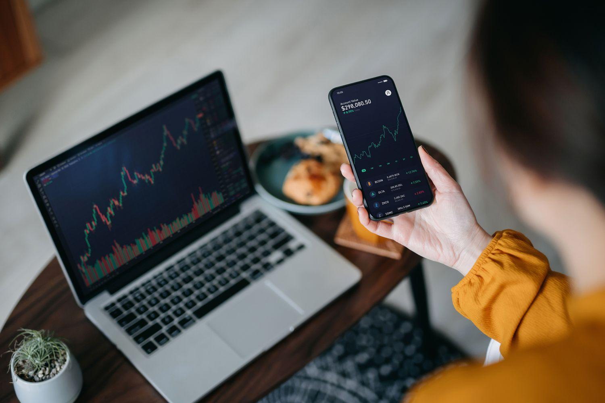

International trading in 2024 is an intricate network of financial transactions, dictated by the forces of globalization, technological advancements, and ever-evolving market dynamics. As the world becomes increasingly interconnected, the landscape of international trading has expanded and grown more complex, with investment platforms and brokers playing an essential role in facilitating these interactions. These entities serve as the vital link connecting traders, investors, and markets, ensuring smooth transactions and providing access to a vast array of international investment opportunities. 

The significance of these platforms in global markets cannot be overstated. They provide the tools and infrastructure necessary for executing trades across diverse markets and asset classes, ranging from equities and bonds to commodities and cryptocurrencies. In doing so, they enable businesses and individuals to diversify portfolios, hedge against various risks, and capitalize on global economic trends.



Algorithmic trading, a systematic method of executing orders using pre-programmed instructions, is revolutionizing the trading landscape. Using complex mathematical models and innovative software, algorithms can analyze multiple market variables swiftly, optimizing trading transactions far beyond the capability of human traders. This technology reduces transaction costs and enhances market liquidity, while also posing some challenges, such as the potential for systemic risk and increased market volatility. In 2024, the impact of algorithmic trading is more pronounced, as it continues to disrupt traditional trading paradigms and forge new pathways in the financial sector.

This article aims to explore several critical components that are shaping the future of international trading: the latest trends and key markets, as well as advances in technology and regulation. It will examine the pivotal role of investment platforms and brokers, shedding light on how digital transformation is reshaping these services. Moreover, it will delve into the emergence of algorithmic trading, highlighting its advantages, challenges, and the rapid integration of AI and machine learning technologies.

Readers will gain insight into the current state of international trading, understand the dynamics of investment platforms, and appreciate the transformative power of algorithmic trading on trading strategies. The article will also provide knowledge on choosing appropriate trading platforms and address the regulatory and ethical considerations around these technologies. By examining these components, we aim to equip readers with the understanding necessary to navigate and leverage the changing landscape of international trading as it evolves in 2024.

## Table of Contents

## Understanding International Trading in 2024

International trading in 2024 is marked by several transformative trends that continue to reshape the global economic landscape. These include the growing importance of key markets, advancements in technology, regulatory adaptations, and critical economic indicators.

### Current Trends in International Trading

In 2024, global trade is characterized by several significant trends:

1. **Fragmented Globalization**: Nations are adopting new economic strategies that lean towards regional trade agreements over global ones, fostering intra-regional commerce. This shift reflects geopolitical tensions and supply chain reshuffling as countries strive for economic autonomy and resilience.

2. **Digital Trade Expansion**: The penetration of e-commerce and digital services in international markets is significant. As digital infrastructure improves, barriers to cross-border digital trade are diminishing, allowing smaller enterprises to access global markets with greater ease.

3. **Sustainability-Driven Trade**: Environmental considerations are becoming central to trade policies, with a focus on reducing carbon footprints and enhancing sustainable practices. This trend is fostering innovation in green technologies and influencing international agreements to include stringent environmental standards.

### Key Markets and Their Influence on Global Trading

**Emerging Markets**: Countries such as India and Indonesia are seeing rapid economic growth, driven by demographic advantages, technological adoption, and a burgeoning middle class. Their increasing demand for commodities and services makes them crucial elements in global trading networks.

**China and the United States**: Despite ongoing geopolitical tensions, both nations remain pivotal to international trade. China's Belt and Road Initiative continues to extend its economic influence, while the U.S. is leveraging technological prowess to maintain competitiveness.

**European Union**: As a collective bloc, the EU's emphasis on sustainable and digital trades serves as a model, influencing international regulatory standards and trade practices.

### Role of Technology in Shaping Modern Trading Practices

Technology continues to be a major driver of change in international trade through:

- **Automation and AI**: Automated supply chains and AI-driven market analysis are enhancing efficiency, reducing costs, and improving decision-making processes for traders globally.

- **Blockchain**: By providing transparent and immutable transaction records, blockchain is gaining traction for verifying cross-border trades, reducing fraud, and ensuring compliance.

- **5G and IoT**: The adoption of 5G networks and IoT devices facilitates real-time data exchange, enabling smarter logistics and more responsive trade operations.

### Regulatory Changes and Their Effects on International Trade

Regulatory landscapes in 2024 are evolving to address modern trading complexities:

- **Data Privacy Laws**: With data being a crucial asset, stringent privacy regulations like the GDPR inspire global counterparts, impacting how data is traded internationally.

- **Tariff Adjustments**: Countries are recalibrating tariff structures in response to political and economic pressures, affecting the cost and flow of goods.

- **Trade Agreements**: New bilateral and regional agreements are being negotiated to reflect changes in geopolitical landscapes, with a focus on digital trade inclusivity and sustainability.

### Economic Indicators to Watch in 2024

Several economic indicators are key to understanding and predicting international trade patterns in 2024:

- **Global GDP Growth**: Fluctuations in GDP growth rates among major economies provide insights into trade demand and supply dynamics.

- **Commodity Prices**: As global supply chains adapt, monitoring commodity prices remains essential for assessing cost pressures and sourcing strategies.

- **Exchange Rates**: Currency fluctuations influence export and import competitiveness, impacting trade balances worldwide.

- **Inflation Rates**: Rising inflation can affect consumer spending and production costs, thereby influencing trade volumes.

These elements combined underscore an era where international trading is increasingly shaped by technological innovation, geopolitical shifts, and regulatory adaptations. Businesses must navigate these waters with strategic approaches to capitalize on emerging opportunities.

## Role of Investment Platforms and Brokers

Investment platforms and brokers serve as vital intermediaries in international trading, facilitating transactions across global financial markets. These entities enable investors to access a vast array of financial instruments, ranging from stocks and bonds to futures and cryptocurrencies.

### What are Investment Platforms and Brokers?

Investment platforms are online services that allow individuals and institutions to buy and sell financial assets. These platforms provide users with access to a variety of markets and instruments, often supported by real-time data and tools for portfolio management. Brokers, on the other hand, are individuals or firms that act as intermediaries between buyers and sellers, executing trades on behalf of clients for a commission or fee.

### How They Facilitate International Trading

Investment platforms and brokers simplify the process of international trading by offering tools and services that reduce the complexity of cross-border transactions. These platforms provide access to foreign markets and assets, while brokers supply the necessary expertise and regulatory compliance to facilitate transactions. By streamlining these processes, they enable investors to exploit global market opportunities and diversify their portfolios beyond domestic boundaries.

### Criteria for Choosing Reliable Platforms and Brokers

Several factors are crucial when selecting an investment platform or broker:

1. **Regulatory Compliance**: Ensures the safety of investments and adherence to international trading laws.
2. **Fees and Commissions**: Competitive pricing structures that do not erode investment returns.
3. **Market Access**: A broad range of markets and financial instruments.
4. **Technological Capabilities**: Advanced tools for analysis, risk management, and execution speed.
5. **Customer Support**: Responsive and knowledgeable service to assist with trading inquiries and issues.

### The Impact of Digital Transformation on These Services

Digital transformation has revolutionized the investment industry, ushering in greater efficiency, transparency, and security. Automation and algorithmic processes enable faster trade execution and reduced costs, while big data and [machine learning](/wiki/machine-learning) provide insights for better decision-making. Moreover, the use of blockchain technology enhances transaction security and reduces the risk of fraud.

### Profiles of Leading Investment Platforms and Brokers for 2024

Prominent platforms and brokers in 2024 exemplify the integration of cutting-edge technology and robust service offerings. Examples include:

- **Interactive Brokers**: Known for its comprehensive market access and sophisticated trading tools, catering to professional traders and institutions.
- **eToro**: Notable for its social trading features that allow users to mimic the trades of successful investors, appealing to novice investors.
- **TD Ameritrade**: Offers a wide array of educational resources and advanced trading platforms suitable for traders of all levels.
- **Robinhood**: Provides commission-free trades and a user-friendly mobile interface, attracting younger demographics and casual investors.

Investment platforms and brokers are pivotal to the landscape of international trading, leveraging technology to offer seamless and accessible trading experiences across global markets.

## The Emergence of Algorithmic Trading

Algorithmic trading, commonly known as algo trading, refers to the use of computer algorithms to execute trading orders. These algorithms are designed to make fast, coherent decisions to optimize trading strategies. They rely on pre-defined criteria such as timing, price, and [volume](/wiki/volume-trading-strategy) to implement trading across various markets with minimal human intervention.

Historically, [algorithmic trading](/wiki/algorithmic-trading) gained traction during the 1970s with the introduction of electronic trading platforms. The first significant milestone was the creation of the New York Stock Exchange's Designated Order Turnaround (DOT) system, which automated order routing and execution. As computing technology advanced, the 1990s saw a significant uptick in algo trading, especially with the proliferation of high-frequency trading firms. The 2000s marked a period of exponential growth, driven by technological advancements and the increased availability of data.

Algorithms impact trading strategies by allowing traders to execute large orders quickly and anonymously, minimize market impact, and exploit market inefficiencies. They enable strategies such as statistical [arbitrage](/wiki/arbitrage), [market making](/wiki/market-making), and [trend following](/wiki/trend-following). For instance, through [statistical arbitrage](/wiki/statistical-arbitrage), algorithms can identify price discrepancies across different markets and execute trades to take advantage of these differences. This reduces the human effort required to analyze vast datasets and execute trades at the optimal time.

The advantages of algorithmic trading include increased speed and efficiency, reduced transaction costs, and the elimination of human emotion from trading decisions. Algo trading facilitates back-testing strategies using historical data, which aids in refining trading models before live implementation. However, challenges persist, including the risk of model errors and overfitting, where algorithms might be optimized for past markets but fail under different future conditions. Moreover, algorithms can potentially exacerbate market [volatility](/wiki/volatility-trading-strategies), as evidenced during the 2010 Flash Crash, when rapid algorithmic trading temporarily led to a severe stock market dip.

Several case studies highlight the successful application of algorithmic trading. Renaissance Technologies, a notable [hedge fund](/wiki/hedge-fund-trading-strategies), employs complex algorithms and statistical models to consistently outperform traditional funds. Another example is the use of [momentum](/wiki/momentum)-based algo trading by investment firms like AQR Capital, which deploys models to capitalize on stock price trends over time.

Overall, the emergence of algorithmic trading represents a paradigm shift in how financial markets operate, offering both opportunities and challenges for traders and institutions alike.

## Algo Trading in International Markets

Algorithmic trading, commonly referred to as algo trading, has seen widespread adoption across various international markets. The adoption of algo trading has been driven by the quest for efficiency, speed, and reduced trading costs. Several factors contribute to the increasing prevalence of algo trading globally, including regulatory considerations, the influence of [artificial intelligence](/wiki/ai-artificial-intelligence) (AI) and machine learning, and documented case studies that demonstrate its impact on trading outcomes.

### Adaptation of Algorithmic Trading Across Different Markets

Algo trading's adaptation across markets has been influenced by market structure, [liquidity](/wiki/liquidity-risk-premium), and regulatory environments. In mature markets like the United States and Europe, high-frequency trading, a subset of algo trading, dominates due to well-established infrastructure and liquidity. Emerging markets in Asia and Latin America have seen slower adoption due to less developed securities exchanges and varying levels of regulatory control.

### Regulatory Considerations for Algo Trading Internationally

The regulatory landscape for algo trading varies significantly across countries and regions. Regulatory bodies, such as the U.S. Securities and Exchange Commission (SEC) and the European Securities and Markets Authority (ESMA), have established guidelines to maintain market stability and prevent disruptive trading activities. These regulations typically focus on ensuring transparency, risk management, and the prevention of market manipulation.

- **Example:** In Europe, the Markets in Financial Instruments Directive II (MiFID II) mandates robust risk controls for firms engaging in algo trading to ensure markets remain fair and efficient.

### Influence of AI and Machine Learning in Developing Sophisticated Algorithms

AI and machine learning have played a crucial role in advancing algo trading strategies. These technologies enable the development of sophisticated algorithms capable of processing vast amounts of data and adapting to changing market conditions in real-time. Machine learning models, particularly those that use [deep learning](/wiki/deep-learning) techniques, can identify complex patterns and predict price movements with higher accuracy.

```python
# Example of a simple machine learning model using Python
from sklearn.ensemble import RandomForestRegressor
from sklearn.model_selection import train_test_split

# Assume data is a pandas DataFrame containing market data
X = data[['feature1', 'feature2', 'feature3']]
y = data['target_price']

# Split data into training and testing sets
X_train, X_test, y_train, y_test = train_test_split(X, y, test_size=0.2, random_state=42)

# Initialize and train the model
model = RandomForestRegressor(n_estimators=100)
model.fit(X_train, y_train)

# Predict prices for the test set
predictions = model.predict(X_test)
```

### Global Case Studies Where Algo Trading has Transformed Trading Outcomes

Numerous case studies illustrate the transformative impact of algo trading on trading outcomes:

- **United States:** High-frequency trading firms have been shown to provide liquidity and reduce spreads, benefiting overall market efficiency.
- **Japan:** The Tokyo Stock Exchange reports an increase in algo trades, with these trades accounting for a significant portion of the daily traded volume, contributing to increased liquidity and market efficiency.
- **India:** The National Stock Exchange has seen growth in algo trading, resulting in tighter spreads and improved price discovery.

### Future Prospects: Where is Algo Trading Heading?

The future of algo trading will likely see further integration of AI and machine learning technologies, enabling more nuanced and adaptive trading strategies. Quantum computing may offer new possibilities for processing large datasets and executing complex algorithms at unprecedented speed. Furthermore, increasing global collaboration may pave the way for more standardized international regulations, fostering greater market integrity and harmonized trading practices worldwide.

In conclusion, as markets continue to evolve and technology advances, algo trading will remain an integral component of global financial markets, shaping the future of trading strategies and market dynamics.

## Choosing the Right Algo Trading Platform

Choosing the right algo trading platform is crucial for leveraging the advantages of algorithmic trading effectively. A robust platform can significantly enhance trading efficiency, reduce error rates, and provide strategic insights.

### Key Features of Robust Algo Trading Platforms
The fundamental features that define a robust algorithmic trading platform include:

1. **Execution Speed**: High-frequency trading requires platforms with low latency to ensure transactions execute at optimum speeds. Platforms such as MetaTrader 5 and Interactive Brokers offer the necessary infrastructure for swift trade execution.

2. **Backtesting Capabilities**: These enable traders to test their strategies on historical data to assess potential efficacy. This feature is essential for developing and refining trading algorithms.

3. **API Access**: A comprehensive Application Programming Interface (API) supports various programming languages like Python. This allows developers to create custom scripts and strategies tailored to their methods.

4. **Data Integration**: Access to real-time data feeds and historical data is vital for informed decision-making and strategy testing.

5. **Security Features**: Robust security protocols, including encryption and two-factor authentication, protect users' data and transactions.

6. **User Interface**: An intuitive user interface enhances user experience, making it easier for traders to navigate and execute trades.

### Evaluation Criteria for Comparing Platforms
When comparing algo trading platforms, consider the following criteria:

- **Latency and Performance**: Test the platform's speed and reliability under various conditions.
- **Cost**: Evaluate commission fees, subscription costs, and the value of features offered.
- **Customization and Learning Curve**: Determine if the platform allows for strategy customization and consider how easy it is to learn and use.

### Importance of Support and Learning Resources
Effective customer support and educational resources are vital for both novice and experienced traders. Platforms that offer extensive documentation, user forums, webinars, and training courses assist traders in mastering algorithmic functionalities and troubleshooting issues.

### Tips for Beginners Entering Algo Trading
For beginners, starting with algorithmic trading can be daunting. Here are some helpful tips:

- **Grasp the Basics**: Familiarize yourself with the principles of trading and algorithmic concepts.
- **Start Small**: Begin with small, simple strategies and progress as you gain more experience.
- **Leverage Simulations**: Use demo accounts to simulate trading without financial risk.
- **Stay Updated**: Continuously update your knowledge about market trends and technological advancements.

### User Experience and Security Considerations
User experience is pivotal for trading efficiency. A platform should provide a seamless experience with minimal technical difficulties. Furthermore, security measures play a crucial role in protecting sensitive information and assets. Regular updates and adherence to industry standards ensure platform integrity.

In conclusion, selecting the right algo trading platform involves assessing multiple features and criteria that align with users' trading strategies and technological needs. A comprehensive platform empowers users to navigate complex markets with confidence and precision.

## Regulatory and Ethical Issues in Algo Trading

The rapid growth of algorithmic trading has significantly changed how financial markets operate worldwide. This evolution necessitates a rigorous regulatory framework to ensure fair, transparent, and stable trading environments. The regulatory framework for algorithmic trading often addresses market manipulation, risk controls, and fair access, among other considerations. Key regulatory bodies, such as the U.S. Securities and Exchange Commission (SEC) and the European Securities and Markets Authority (ESMA), have established guidelines to govern algorithmic trading practices, focusing on pre-trade risk management controls, system resilience, and post-trade scrutiny.

Ethical implications of algorithmic decision-making arise from the automation of trading decisions. Algorithms may inadvertently execute trades that impact market fairness or amplify volatility. Ethical concerns also include the autonomy of algorithms, where minimal human intervention is involved in decision-making, leading to unforeseen consequences in complex markets. Addressing these issues requires a balance between innovation and moral responsibility, emphasizing the development of algorithms that are not only efficient but also ethically sound.

Risk management practices are crucial to prevent market disruptions, such as the 'flash crashes' experienced in recent years. Effective risk management involves implementing robust algorithms with mechanisms to halt trading during anomalies, ensuring liquidity, and maintaining orderly markets. Tools such as kill switches and automated circuit breakers are employed to mitigate potential risks. Moreover, thorough [backtesting](/wiki/backtesting) and stress testing of algorithms under various market conditions are essential to ensure reliability.

Transparency and accountability in algorithmic trading are achieved through clear documentation of algorithms and trading strategies, enabling regulatory oversight. Standardized record-keeping and audit trails help verify compliance with regulatory requirements and facilitate investigations into market incidents. Transparency also fosters trust among market participants, reducing the risk of disputes and enhancing market integrity.

International efforts towards standardized regulations are underway to harmonize algo trading practices across jurisdictions. Collaborations among major regulatory bodies are pivotal to establishing consistent guidelines, thus minimizing regulatory arbitrage—a risk where traders exploit differences between regional regulations. Initiatives like the International Organization of Securities Commissions (IOSCO) work towards creating coherent frameworks conducive to global markets, ensuring that algorithmic trading contributes positively to market efficiency and stability.

Overall, stringent regulatory and ethical considerations are key to leveraging algorithmic trading's advantages while safeguarding market integrity. The ongoing adaptation of regulations will be crucial as algorithmic trading evolves along with emerging technologies.

## Conclusion

In 2024, the landscape of international trading continues to transform, deeply interwoven with advancements in investment platforms, brokers, and the burgeoning field of algorithmic trading. These components form a triad that defines the efficiency and dynamism of today's global markets. Investment platforms and brokers serve as critical conduits that facilitate access to international markets, offering traders the tools needed to execute trades efficiently. The rise of algorithmic trading, leveraging advancements in artificial intelligence and machine learning, has further augmented this process, enabling rapid, data-driven trading strategies that can parse vast datasets to predict market movements with notable accuracy.

The future of international trading, intertwined with algorithmic trading, promises continued evolution. As technology advances, trading strategies will become even more sophisticated, increasingly relying on cutting-edge algorithms. We can anticipate a broader implementation of AI-driven insights and further integration of machine learning, allowing traders to effectively manage risk and enhance decision-making processes. With these developments, markets are likely to become more interconnected and responsive to global economic shifts, offering new opportunities for traders worldwide.

Staying informed and adept in the utilization of these platforms and technologies is critical for both new and experienced traders. Familiarity with the tools at one's disposal not only increases the potential for successful trading outcomes but also helps mitigate associated risks. As technology evolves, so too must the skills and strategies employed by those navigating the trading arena.

In conclusion, the trading landscape in 2024 is characterized by a confluence of technology and financial acumen. The interconnected nature of trading platforms, brokers, and algorithms underscores the importance of adaptability and continual learning. Embracing these tools and staying abreast of emergent trends will be pivotal for those aiming to thrive in this rapidly advancing field. The promise of further innovation suggests a dynamic future, where well-informed traders are best positioned to capitalize on the expanding possibilities within international markets.

## References & Further Reading

[1]: Bergstra, J., Bardenet, R., Bengio, Y., & Kégl, B. (2011). ["Algorithms for Hyper-Parameter Optimization."](https://dl.acm.org/doi/10.5555/2986459.2986743) Advances in Neural Information Processing Systems 24.

[2]: ["Advances in Financial Machine Learning"](https://www.amazon.com/Advances-Financial-Machine-Learning-Marcos/dp/1119482089) by Marcos Lopez de Prado

[3]: ["Evidence-Based Technical Analysis: Applying the Scientific Method and Statistical Inference to Trading Signals"](https://www.amazon.com/Evidence-Based-Technical-Analysis-Scientific-Statistical/dp/0470008741) by David Aronson

[4]: ["Machine Learning for Algorithmic Trading"](https://github.com/stefan-jansen/machine-learning-for-trading) by Stefan Jansen

[5]: ["Quantitative Trading: How to Build Your Own Algorithmic Trading Business"](https://books.google.com/books/about/Quantitative_Trading.html?id=j70yEAAAQBAJ) by Ernest P. Chan