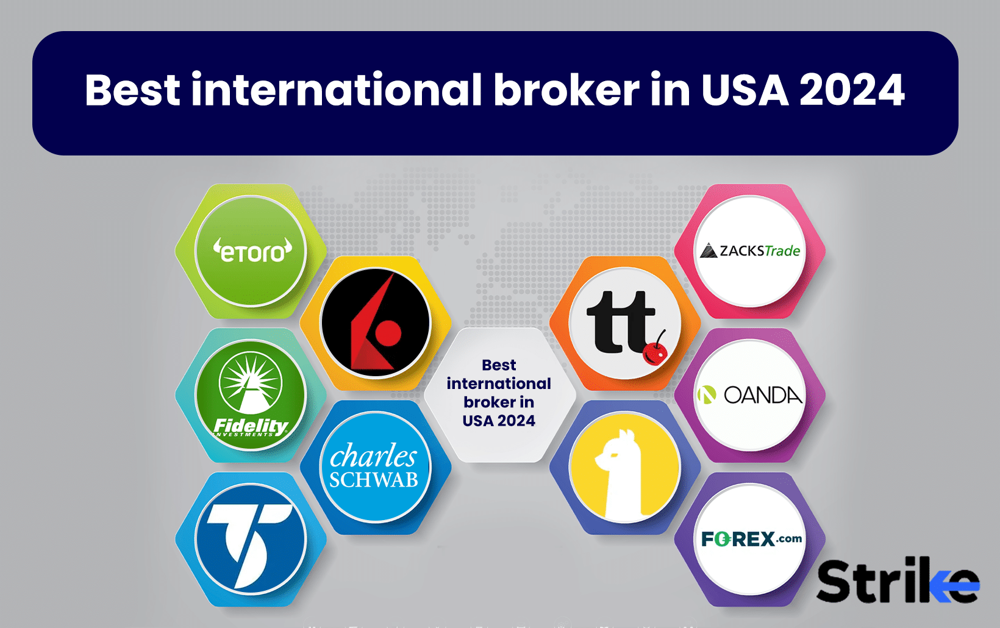

## Table of Contents

## What is international trading and why is it important?

International trading is when countries buy and sell goods and services with each other. It's like a big market where different countries can exchange things they make or grow. For example, one country might sell oil to another country that needs it, and in return, they might buy cars or electronics from that country.

This kind of trading is important because it helps countries get things they can't make themselves. It also helps countries make money by selling what they're good at making. When countries trade, it can lead to more jobs and better lives for people. It also helps countries work together and understand each other better, which can make the world a more peaceful place.

## What are the key features to look for in a broker for international trading?

When you're looking for a broker for international trading, one of the first things to consider is the fees they charge. Some brokers might have high fees for trading, which can eat into your profits. You'll want to find a broker with low fees so you can keep more of your money. Another important feature is the platform they use. A good trading platform should be easy to use and work well on your computer or phone. It should also have all the tools you need to make smart trading decisions, like charts and real-time data.

Another key feature to look for is the range of markets the broker offers. A good broker should let you trade in many different countries and with different types of investments, like stocks, bonds, and commodities. This gives you more options and can help you spread out your risks. Customer support is also very important. You want a broker that has good customer service and can help you quickly if you have any problems or questions. Lastly, make sure the broker is regulated by a trusted authority. This helps ensure that they follow the rules and keep your money safe.

## How do fees and commissions impact international trading?

Fees and commissions can have a big impact on international trading. When you trade through a broker, they usually charge you a fee for each trade you make. These fees can add up quickly, especially if you are trading a lot. If the fees are high, they can eat into your profits, making it harder for you to make money from your trades. For example, if you make a small profit on a trade but the fee is almost as much as your profit, you won't be left with much money.

It's important to understand all the fees and commissions before you start trading. Some brokers might have different fees for different types of trades or for trading in different countries. They might also charge extra fees for things like withdrawing money or keeping your account open. By choosing a broker with low fees, you can keep more of your profits. This can make a big difference in how successful your international trading is over time.

## What are the regulatory considerations when choosing an international trading broker?

When you're [picking](/wiki/asset-class-picking) a broker for international trading, it's really important to check if they are regulated by a trusted authority. Regulation means that the broker has to follow certain rules to make sure they are treating their customers fairly and keeping their money safe. Different countries have different regulatory bodies, like the SEC in the United States or the FCA in the United Kingdom. You should look for a broker that is regulated by a well-known and respected authority because this can help protect you from fraud and make sure your money is safe.

Another thing to think about is how the broker's regulation might affect your trading. Some countries have strict rules about what kinds of investments you can make or how much risk you can take. If you choose a broker that is regulated in a country with tight rules, it might limit what you can do. On the other hand, a broker from a country with looser rules might give you more freedom, but it could also be riskier. So, it's a good idea to understand the regulatory environment of the broker you're thinking about using, and make sure it fits with your trading goals and how much risk you're willing to take.

## How does the choice of trading platform affect international trading?

The choice of trading platform can really change how you do international trading. A good platform should be easy to use and work well on your computer or phone. It should have all the tools you need, like charts and real-time data, to help you make smart trading decisions. If the platform is hard to use or doesn't have the right tools, it can make trading more difficult and stressful. You might miss out on good trading opportunities or make mistakes because you can't see all the information you need.

Another important thing about the trading platform is how fast it works. When you're trading internationally, you need a platform that can handle trades quickly. If the platform is slow, you might miss out on trades or end up buying or selling at a worse price than you wanted. A fast and reliable platform can help you trade more effectively and make better decisions. So, choosing the right trading platform is key to having a good experience with international trading.

## What are the best brokers for beginners in international trading in 2024?

For beginners in international trading in 2024, one of the best brokers is eToro. eToro is great for new traders because it's easy to use and has a lot of helpful tools. They have something called "CopyTrading," which lets you copy the trades of experienced traders. This can help you learn how to trade without making big mistakes. eToro also has low fees and lets you trade in many different countries and with different types of investments. Plus, they have good customer support to help you if you have any questions.

Another good broker for beginners is [Interactive Brokers](/wiki/interactive-brokers-api). They are known for having low fees and a wide range of markets you can trade in. Their platform, called Trader Workstation, might be a bit more complicated than eToro's, but it has a lot of tools that can help you learn and grow as a trader. Interactive Brokers also has a lot of educational resources, like videos and guides, which can be really helpful for someone just starting out. They are regulated by many different authorities, so you can feel safe using them for your international trading.

## How can intermediate traders benefit from specific broker features in 2024?

Intermediate traders in 2024 can benefit a lot from using brokers like Saxo Bank. Saxo Bank has a platform called SaxoTraderGO that is easy to use but also has a lot of advanced tools. These tools can help intermediate traders make better decisions. For example, Saxo Bank offers something called "Trader Insights," which gives you detailed analysis and ideas about what to trade. This can be really helpful if you're trying to figure out the best times to buy or sell. Plus, Saxo Bank lets you trade in many different markets around the world, so you can spread out your investments and manage your risks better.

Another broker that can help intermediate traders is IG. IG has a platform that is good for people who are getting more experienced. They have a feature called "IG Academy," which has a lot of free courses and webinars. These can help you learn more about trading and improve your skills. IG also has low fees and lets you trade in lots of different markets, which is great for intermediate traders who want to try new things and grow their portfolios. With IG, you can also use something called "smart portfolios," which can help you manage your investments more easily and make smarter choices.

## What advanced tools and analytics do top brokers offer for expert traders in 2024?

For expert traders in 2024, top brokers like Charles Schwab offer advanced tools and analytics that can really help. Charles Schwab has a platform called thinkorswim, which is packed with features that expert traders love. You can use things like customizable charts, real-time data, and advanced order types to make smart trading decisions. They also have something called "thinkScript," which lets you create your own trading algorithms. This can help you automate your trading and find new opportunities that other traders might miss. Plus, Charles Schwab has a lot of research and analysis tools that can give you deep insights into the markets.

Another top broker for expert traders is Fidelity. Fidelity's platform, called Active Trader Pro, is designed for people who know a lot about trading. It has advanced charting tools, real-time data, and options analytics that can help you understand the markets better. Fidelity also offers something called "Wealth-Lab Pro," which lets you backtest your trading strategies using historical data. This can help you see how your strategies would have worked in the past, so you can make better decisions in the future. With these advanced tools and analytics, expert traders can get a big advantage in international trading.

## How do customer support and educational resources vary among top brokers for international trading?

Customer support and educational resources can be very different among top brokers for international trading. Some brokers, like eToro, have really good customer support. They offer help through phone, email, and live chat, so you can get answers to your questions quickly. eToro also has a lot of educational resources, like videos and guides, that can help you learn about trading. They even have a feature called "CopyTrading," which lets you copy the trades of experienced traders, making it easier for you to learn and grow.

Other brokers, like Charles Schwab, focus more on advanced tools and might not have as much customer support or educational resources for beginners. Charles Schwab's customer support is good, but it might take a bit longer to get help compared to eToro. They do have some educational resources, like webinars and research reports, but these are more geared towards experienced traders. If you're an expert trader, you might like Charles Schwab's focus on advanced tools and analytics, but if you're new to trading, you might find eToro's support and resources more helpful.

## What are the emerging trends in international trading that brokers are adapting to in 2024?

In 2024, one big trend in international trading that brokers are adapting to is the use of [artificial intelligence](/wiki/ai-artificial-intelligence) (AI) and [machine learning](/wiki/machine-learning). Brokers are using these technologies to help traders make better decisions. For example, AI can analyze a lot of data quickly and find patterns that might be hard for a person to see. This can help traders know when to buy or sell. Some brokers are also using AI to give personalized advice to traders, which can make trading easier and more successful.

Another trend is the focus on sustainable and ethical trading. More and more people want to invest in companies that are good for the environment and treat their workers well. Brokers are responding to this by offering more options for trading in sustainable investments. They are also making it easier for traders to see how their investments affect the world. This helps traders make choices that match their values and can lead to a better future for everyone.

## How do geopolitical factors influence the choice of brokers for international trading?

Geopolitical factors can really change which broker you pick for international trading. If there's a lot of tension between countries, it might be hard to trade with some places. For example, if two countries are not getting along, a broker from one of those countries might not be able to help you trade with the other country. So, you might want to choose a broker from a country that gets along well with a lot of other countries. This way, you can trade in more places and not miss out on good opportunities.

Also, different countries have different rules about trading. Some countries might have strict rules that make it hard to trade certain things. If you choose a broker from a country with tight rules, it might limit what you can do. On the other hand, a broker from a country with looser rules might give you more freedom, but it could also be riskier. So, it's important to think about the geopolitical situation and the rules in different countries when you're picking a broker for international trading.

## What are the future predictions for the international trading landscape and broker services in 2024 and beyond?

In 2024 and beyond, international trading is expected to see big changes thanks to new technology. More brokers will use artificial intelligence and machine learning to help traders make better choices. These tools can look at a lot of information quickly and find patterns that might be hard for people to see. This can help traders know when to buy or sell. Brokers might also use AI to give personalized advice to traders, making trading easier and more successful. Another big change will be the focus on sustainable and ethical trading. More people want to invest in companies that are good for the environment and treat their workers well. Brokers will offer more options for trading in these kinds of investments and make it easier for traders to see how their investments affect the world.

Geopolitical factors will also play a big role in the future of international trading. Tensions between countries can make it hard to trade with some places. Traders might choose brokers from countries that get along well with a lot of other countries, so they can trade in more places and not miss out on good opportunities. Different countries have different rules about trading, and these rules can change over time. A broker from a country with strict rules might limit what you can do, while a broker from a country with looser rules might give you more freedom but could also be riskier. So, understanding the geopolitical situation and the rules in different countries will be important when picking a broker for international trading.

## References & Further Reading

[1]: Bergstra, J., Bardenet, R., Bengio, Y., & Kégl, B. (2011). ["Algorithms for Hyper-Parameter Optimization."](https://dl.acm.org/doi/10.5555/2986459.2986743) Advances in Neural Information Processing Systems 24.

[2]: ["Advances in Financial Machine Learning"](https://www.amazon.com/Advances-Financial-Machine-Learning-Marcos/dp/1119482089) by Marcos Lopez de Prado

[3]: ["Evidence-Based Technical Analysis: Applying the Scientific Method and Statistical Inference to Trading Signals"](https://www.amazon.com/Evidence-Based-Technical-Analysis-Scientific-Statistical/dp/0470008741) by David Aronson

[4]: ["Machine Learning for Algorithmic Trading"](https://github.com/stefan-jansen/machine-learning-for-trading) by Stefan Jansen

[5]: ["Quantitative Trading: How to Build Your Own Algorithmic Trading Business"](https://books.google.com/books/about/Quantitative_Trading.html?id=j70yEAAAQBAJ) by Ernest P. Chan