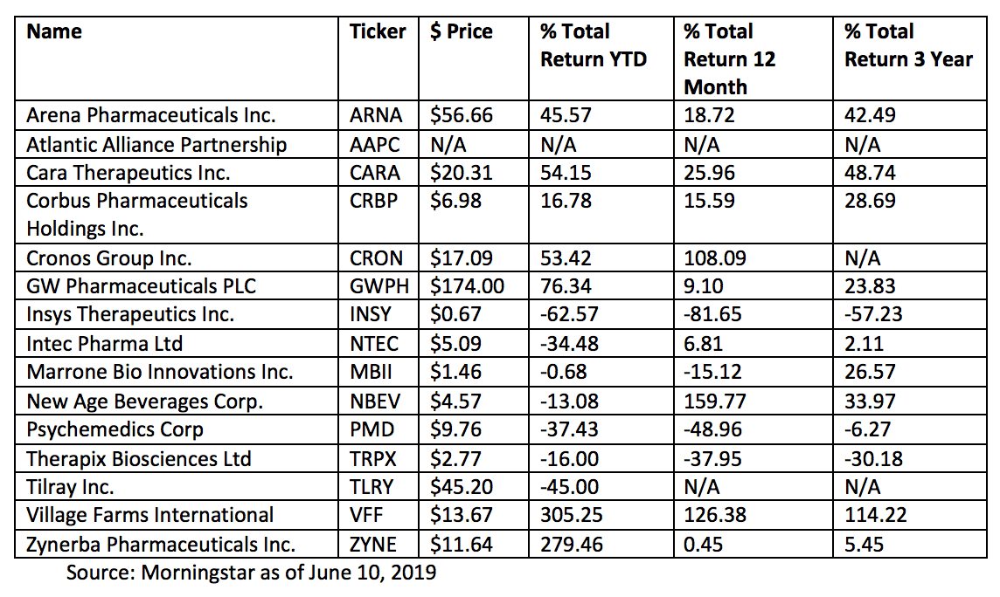

The cannabis industry has experienced significant growth over the past few years, driven fundamentally by various legalization efforts across different regions and increasing consumer demand. In North America, countries like Canada have fully legalized recreational use, while numerous states in the U.S. have followed suit despite varying federal positions. These changes have catalyzed the industry's expansion, encouraging both recreational and medical markets.

Financial performance stands as a crucial aspect for companies within this burgeoning industry. Investors and stakeholders closely watch earnings reports, which serve as barometers of a company's financial health and project its future prospects. Earnings reports encompass various financial metrics such as revenue, net income, profit margins, and key performance indicators like EBITDA (Earnings Before Interest, Taxes, Depreciation, and Amortization). Performance in these areas provides vital insights into the operational efficiency and market position of cannabis companies.



Alongside traditional financial analysis, algorithmic trading is becoming an indispensable tool for investors aiming to capture shifts in cannabis stocks. Given the high volatility and speculative nature of these stocks, algorithmic trading strategies, which utilize advanced mathematical models and computational techniques, are increasingly employed to execute trades quickly and with precision. For example, Python-based libraries like pandas, numpy, and trading algorithms can be utilized to analyze stock data, identify trends, and optimize trading decisions. 

Thus, this article will explore the financial performance of cannabis companies, highlighting the significance of earnings reports and the evolving role of algorithmic trading in navigating the sector's complexities. Through this analysis, we aim to provide a comprehensive understanding of how these elements contribute to the overall landscape of the cannabis industry.

## Table of Contents

## Overview of the Cannabis Industry

The cannabis industry's scope extends across both recreational and medical markets, with each segment governed by a distinct set of regulations that vary significantly across different global jurisdictions. In recent years, the industry has witnessed a profound transformation, largely propelled by legalization initiatives and changing societal attitudes towards cannabis consumption.

In North America, Canada has emerged as a frontrunner, having fully legalized recreational cannabis nationwide in October 2018. This monumental policy shift has not only catalyzed market expansion but has also positioned Canada as a model for cannabis legalization globally. Simultaneously, in the United States, a patchwork of state-level legalizations reflects a more fragmented landscape. States such as California, Colorado, and Washington have legalized the recreational use of cannabis, contributing to a burgeoning market that forecasters predict will continue to grow as more states consider legislative changes.

The industry is characterized by diverse company strategies aimed at capitalizing on this rapidly evolving terrain. Leading cannabis companies are actively pursuing expansion into newly legalized markets, recognizing the potential for significant revenue generation. This growth strategy often involves mergers and acquisitions, as companies seek to broaden their geographical reach and consolidate their market positions.

Product diversification is another critical strategy employed by cannabis companies to capture a wider consumer base. With advancements in extraction and cultivation technologies, companies are developing a plethora of cannabis-based products beyond traditional flower, including edibles, beverages, concentrates, and topicals. This diversification not only caters to a broader demographic but also aligns with the nuanced preferences of medical and recreational consumers.

Globally, the regulatory environment remains varied, with countries like Uruguay and, more recently, Luxembourg legalizing recreational cannabis, while others maintain restrictive stances. In medical markets, countries such as Germany and Israel are making strides, with robust medical cannabis programs that serve as templates for other nations contemplating similar moves.

The concurrent rise in consumer acceptance and the strategic maneuvers by companies underscore the cannabis industry's dynamic nature, promising substantial growth opportunities despite the complexities of navigating different regulatory frameworks. As legalization continues to advance, both domestically and internationally, the industry's landscape is set to evolve, presenting challenges and opportunities alike.

## Key Players and Financial Performance

Major cannabis companies such as Aurora Cannabis, Canopy Growth, and Tilray are leading figures in the cannabis industry, which has experienced both promising expansions and financial challenges. These companies provide a significant part of the industry's production and distribution networks. However, they navigate a complex landscape marked by high operational costs, regulatory compliance expenses, and fluctuating market conditions that affect their financial performance.

**Aurora Cannabis Inc.** has been recognized for its expansive growth strategy, which includes acquisitions and increasing its production capabilities. Despite significant revenues, Aurora has faced challenges in achieving profitability primarily due to high operational costs and restructuring expenditures. The fluctuating nature of market demands and regulatory shifts heavily impacts its financial outcomes, leading to varying stock performance.

**Canopy Growth Corporation** is another major player within the cannabis sector. Known for its substantial market capitalization and partnerships, Canopy Growth focuses on both recreational and medical cannabis markets. This company has invested significantly in brand development and international expansion. Despite these efforts, Canopy has encountered hurdles such as substantial operating losses owing to market investments and stock-based compensation expenses. Its earnings reports reveal consistent attempts at cost management and efficiency improvements, yet profitability remains an ongoing goal.

**Tilray Brands, Inc.** aims to leverage its diversified product lines and wide-ranging market presence. By integrating operations with other entities, sector leaders like Tilray seek streamlined costs and enhanced revenue growth. The company's financial performance is influenced by acquisition-related charges and foreign exchange effects, which contribute to the dynamics of its earnings and stock valuation.

Understanding the financial health of these industry leaders requires analyzing key metrics such as their market capitalization, revenue growth, and profitability. Market capitalization refers to the total market value of a company's outstanding shares, which provides insights into its potential for expansion and investor perceptions. Revenue growth, a critical indicator of a company's ability to increase its sales over time, contributes to evaluating strategic success and market presence. Calculating profitability involves assessing the net income relative to revenue, providing a clear picture of operational efficiency and financial viability.

Overall, while Aurora Cannabis, Canopy Growth, and Tilray show strong revenue streams and market positioning, high operational costs and economic [volatility](/wiki/volatility-trading-strategies) pose significant challenges to steady profitability. Investors and analysts must continuously assess these financial indicators to gain insights into their long-term potential and adaptation strategies in an evolving market landscape.

## Earnings Reports: A Closer Look

Cannabis earnings reports are vital for understanding the financial health and performance of companies within the industry. These reports provide a snapshot of a company's revenue, net income, and profit margins, which are essential for investors making informed decisions.

Revenue is a primary indicator of a company's performance, reflecting the total income generated from its operations. In the cannabis sector, revenue can fluctuate significantly due to regulatory changes and market dynamics. For instance, changes in legalization status in various regions can either boost or constrain revenue streams. To assess the efficiency of a company's operations, investors pay close attention to net income, which represents profit after all expenses, taxes, and costs are subtracted from total revenue.

Profit margins, specifically the gross profit margin and net profit margin, gauge how effectively a company converts revenue into actual profit. A higher margin indicates better cost management and operational efficiency. Gross profit margin is calculated as:

$$
\text{Gross Profit Margin} = \left( \frac{\text{Revenue} - \text{Cost of Goods Sold}}{\text{Revenue}} \right) \times 100
$$

Net profit margin, on the other hand, is defined as:

$$
\text{Net Profit Margin} = \left( \frac{\text{Net Income}}{\text{Revenue}} \right) \times 100
$$

Key performance indicators (KPIs) such as EBITDA (Earnings Before Interest, Taxes, Depreciation, and Amortization) and operating cash flow are especially important in the cannabis industry. EBITDA provides a clear picture of a company's operational profitability by excluding non-operating expenses. It is expressed as:

$$
\text{EBITDA} = \text{Net Income} + \text{Interest} + \text{Taxes} + \text{Depreciation} + \text{Amortization}
$$

Operating cash flow, calculated from the cash generated by a company's core business activities, offers insights into its [liquidity](/wiki/liquidity-risk-premium) and financial flexibility. A positive operating cash flow indicates a company's capability to maintain or grow operations without needing external financing.

Cannabis companies face a volatile market environment influenced by regulatory changes, shifting consumer trends, and competitive pressures, all affecting these financial figures. For instance, regulatory amendments can introduce new markets or impose restrictions, impacting sales and revenue projections. Additionally, consumer preferences for product types (e.g., edibles, oils) shape revenue composition, requiring companies to adapt and innovate continually.

In conclusion, understanding earnings reports through metrics like EBITDA, operating cash flow, and profit margins is crucial for evaluating investment opportunities in the cannabis industry. These metrics not only highlight financial performance but also reflect a company's ability to adapt to external challenges and capitalize on emerging market trends.

## Algorithmic Trading in Cannabis Stocks

Algorithmic trading has grown in prominence across various sectors of the stock market, and the cannabis industry is no exception. Utilizing advanced mathematical models, [algorithmic trading](/wiki/algorithmic-trading) allows for quicker and more precise execution of trades, essential in a market characterized by high volatility and speculative investments. The cannabis sector, still in its relative infancy, experiences frequent price fluctuations due to regulatory changes, market saturation concerns, and shifts in consumer sentiment. In this environment, algorithmic trading provides a significant advantage to investors seeking to maneuver through these rapid changes effectively.

Key to algorithmic trading in cannabis stocks are the algorithms themselves, designed to process large datasets rapidly and make trading decisions based on specific criteria. These algorithms utilize models based on quantitative analysis to predict price movements, identify trading opportunities, and execute trades within milliseconds. For instance, mean-reversion strategies in algorithmic trading could detect when a stock price deviates from its historical average, signaling a potential trading opportunity when it returns to its mean. 

```python
import numpy as np

# Sample basic mean reversion strategy
def mean_reversion_strategy(prices, window=20):
    signals = np.zeros(len(prices))
    rolling_mean = prices.rolling(window=window).mean()

    for i in range(window, len(prices)):
        if prices[i] < rolling_mean[i] * 0.95:  # Buy signal
            signals[i] = 1
        elif prices[i] > rolling_mean[i] * 1.05:  # Sell signal
            signals[i] = -1

    return signals
```

This simple mean reversion strategy computes a rolling average to identify when a price is significantly below or above its typical levels, offering buying or selling signals respectively. Although basic, such an approach can serve as a foundational component of more sophisticated algorithms.

Moreover, algorithmic trading in cannabis stocks can uncover subtle patterns and trends that might be missed by manual trading methods. The sector's high volatility—driven by rapidly evolving regulations and consumer trends—can cause price swings that present lucrative opportunities if captured quickly. Algorithms can be programmed to react immediately to specific triggers, such as breaking news on cannabis legalization, allowing investors to capitalize on these short-term fluctuations.

In addition to speed and efficiency, algorithmic trading mitigates the risk of human error and emotional decision-making, common pitfalls in highly volatile markets. By adhering strictly to coded parameters, these algorithms can consistently apply strategic rules without bias, ensuring disciplined and informed trading practices.

Algorithmic trading is poised to play an increasingly significant role in the cannabis sector. As the industry continues to grow and volatility remains a defining characteristic, investors adopting these advanced trading systems stand to benefit from the ability to rapidly adapt to market changes and optimize their investment strategies.

## Case Studies

Green Thumb Industries (GTI) and Glass House Brands are key players in the cannabis sector, known for their innovative approaches to cost management, operational optimization, and market expansion. Understanding their financial performance offers valuable insights into the broader dynamics of the cannabis industry. 

### Green Thumb Industries

**Cost Management and Operational Efficiency**

Green Thumb Industries has implemented strategic measures to manage costs effectively. The company focuses on vertical integration, minimizing dependency on third-party suppliers. This approach reduces production costs and enhances control over the supply chain. The company's continuous investment in advanced cultivation techniques and automation contributes to operational efficiency, lowering overall expenses [1].

**Market Expansion and Revenue Growth**

GTI's strategic acquisition of retail locations and cultivation facilities has been a significant driver of its market presence. With operations spanning multiple U.S. states, GTI capitalizes on statewide legalizations, thus increasing its revenue streams. The diversification of its product portfolio, which includes premium brands and value products, appeals to a broader consumer base, enhancing sales and revenue growth.

**Impact of Tax Strategies**

Navigating the complex tax environment is challenging for cannabis companies. GTI employs tax optimization strategies to mitigate federal tax burdens, including optimizing its 280E tax code strategy. The 280E code disallows standard business deductions for companies involved in federally illegal activities, like cannabis. GTI's approach involves meticulous financial planning to manage these liabilities effectively, ensuring compliance while minimizing financial strain.

### Glass House Brands

**Cost Management**

Glass House Brands emphasizes reducing cultivation costs through large-scale greenhouse operations, leveraging California's favorable climate. This approach minimizes the need for energy-intensive indoor growing, reducing operational costs significantly. The company invests in sustainable practices, such as water recycling and energy efficiency, further decreasing expenses [2].

**Operational Optimization**

By focusing on sustainable and scalable operations, Glass House Brands maximizes yield and quality. The adoption of advanced agricultural technologies and efficient logistics systems ensures optimal resource utilization. This operational model not only contributes to cost savings but also improves product consistency, crucial for maintaining consumer trust and brand reputation.

**Market Trends and Financial Impact**

Market trends such as increased demand for eco-friendly and organic products align with Glass House's operational focus, providing competitive advantages. The company's strategic decisions to align with consumer preferences and market trends bolster its market position, facilitating revenue growth.

In summary, both Green Thumb Industries and Glass House Brands demonstrate successful strategies in cost management and market expansion. These approaches are central to their financial performance, allowing them to navigate the challenges of a competitive and rapidly evolving cannabis market. Their adaptive tax strategies and alignment with market trends further accentuate their status as industry leaders.

**References**
1. [Green Thumb Industries Investor Relations](https://investors.gtigrows.com/)
2. [Glass House Brands Sustainability Report](https://www.glasshousebrands.com/sustainability)

## Future Outlook and Challenges

The cannabis industry is poised at a critical juncture where numerous challenges could influence its future trajectory. Regulatory changes stand as a principal hurdle. Globally, marijuana's legal status remains a patchwork of policies that could shift with political and public opinion trends. In regions where cannabis is legal, sudden regulatory adjustments can disrupt market stability, requiring companies to adapt quickly.

Market saturation is another pressing concern. As more players enter the cannabis market, competition intensifies, potentially compressing profit margins. Companies that once thrived under limited competition may now have to innovate continuously to maintain their market share. Product differentiation, brand strength, and customer loyalty will be pivotal for sustaining profitability.

Economic variables, including inflation rates, access to capital, and consumer spending power, further complicate the landscape. Financial institutions have been traditionally hesitant to engage with cannabis enterprises due to its status under federal law in regions like the United States, constraining cash flow and capital investments.

To counter these challenges, continued innovation in product development and strategic financial management is essential. Companies that can leverage data analytics to drive efficiencies, reduce operational costs, and predict consumer trends will likely thrive. Moreover, mastering regulatory compliance can offer a strategic advantage in navigating international markets.

Algorithmic trading is anticipated to expand in prominence within this sector. The heightened volatility characteristic of cannabis stocks presents ample opportunities for algorithmic strategies to optimize trades. By employing advanced mathematical models and [machine learning](/wiki/machine-learning) techniques, investors can swiftly respond to market conditions. Consider the following Python example, which outlines a simple moving average strategy to identify potential buy and sell signals in cannabis stocks:

```python
import pandas as pd

def simple_moving_average(stock_data, short_window=10, long_window=50):
    signals = pd.DataFrame(index=stock_data.index)
    signals['price'] = stock_data['Close']
    signals['short_mavg'] = stock_data['Close'].rolling(window=short_window, min_periods=1, center=False).mean()
    signals['long_mavg'] = stock_data['Close'].rolling(window=long_window, min_periods=1, center=False).mean()

    signals['signal'] = 0.0
    signals['signal'][short_window:] = np.where(signals['short_mavg'][short_window:] > signals['long_mavg'][short_window:], 1.0, 0.0)
    signals['positions'] = signals['signal'].diff()

    return signals

# Example usage with a DataFrame 'cannabis_stock_data' containing the stock's closing prices:
# signals = simple_moving_average(cannabis_stock_data)
```

This code provides a foundational algorithm for exploring trading opportunities by identifying crossover points of moving averages, which are often used to signal potential trade actions.

Overall, the cannabis industry's future is intertwined with how well it navigates regulatory landscapes, manages market competition, and leverages technological advancements such as algorithmic trading. Sustained success will likely depend on a blend of adaptability, innovation, and strategic financial planning.

## Conclusion

The cannabis industry, characterized by rapid growth and evolving regulatory landscapes, presents substantial investment opportunities. However, these opportunities come with the necessity for meticulous financial analysis. Earnings reports remain a cornerstone for understanding a company's financial health, offering insights into revenue, net income, and profitability metrics such as EBITDA (Earnings Before Interest, Taxes, Depreciation, and Amortization). These reports provide vital information that can guide investors in making informed decisions by revealing both the strengths and operational challenges specific to the cannabis sector.

In tandem with earnings reports, algorithmic trading has emerged as a powerful tool for investors navigating the cannabis market's volatility and speculative nature. By utilizing sophisticated models and data analytics, algorithmic trading can yield faster and more precise trading decisions, uncovering trends and opportunities that are less apparent through manual trading methods. This technology-driven approach enables investors to better respond to market shifts influenced by regulatory changes, consumer trends, and economic factors.

As the cannabis industry continues to mature, the importance of financial performance as a determinant of success cannot be overstated. Companies must not only strive for revenue growth but also aim for sustainable profitability amid competitive pressures and regulatory challenges. For investors, a thorough understanding of financial metrics coupled with advanced trading strategies will be crucial in capitalizing on the sector's potential while mitigating risks. 

In conclusion, while the cannabis industry offers significant promise, success within this space hinges on rigorous financial scrutiny and the strategic application of technological advancements in trading practices.

## References & Further Reading

[1]: Bergstra, J., Bardenet, R., Bengio, Y., & Kégl, B. (2011). ["Algorithms for Hyper-Parameter Optimization."](https://dl.acm.org/doi/10.5555/2986459.2986743) Advances in Neural Information Processing Systems 24.

[2]: ["Advances in Financial Machine Learning"](https://www.amazon.com/Advances-Financial-Machine-Learning-Marcos/dp/1119482089) by Marcos Lopez de Prado

[3]: ["Evidence-Based Technical Analysis: Applying the Scientific Method and Statistical Inference to Trading Signals"](https://www.amazon.com/Evidence-Based-Technical-Analysis-Scientific-Statistical/dp/0470008741) by David Aronson

[4]: ["Machine Learning for Algorithmic Trading"](https://github.com/stefan-jansen/machine-learning-for-trading) by Stefan Jansen

[5]: ["Quantitative Trading: How to Build Your Own Algorithmic Trading Business"](https://www.amazon.com/Quantitative-Trading-Build-Algorithmic-Business/dp/1119800064) by Ernest P. Chan