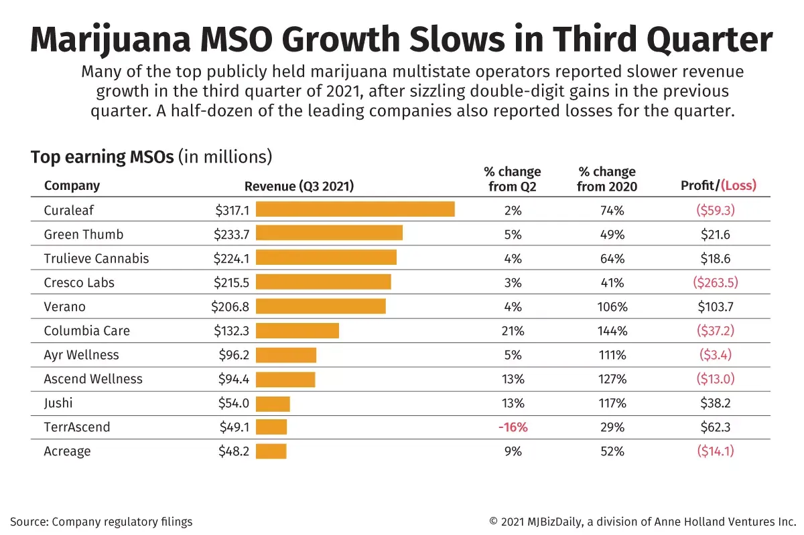

## Table of Contents

## What are the top cannabis companies by revenue?

The top cannabis companies by revenue include Curaleaf Holdings, Inc., Trulieve Cannabis Corp., and Green Thumb Industries Inc. Curaleaf is one of the biggest in the U.S. and also operates in Europe. They make a lot of money from selling cannabis products in many states where it's legal. Trulieve is another big company, mainly in Florida, but they are growing in other states too. Green Thumb Industries, or GTI, operates in several states and focuses on both medical and recreational cannabis.

These companies have seen big growth because more places are allowing cannabis for medical and fun use. Curaleaf made about $1.2 billion in 2022, Trulieve around $1.2 billion too, and Green Thumb Industries earned about $1 billion. They keep growing by opening new stores and making new products. As more states and countries legalize cannabis, these companies could get even bigger.

## How do cannabis companies report their earnings?

Cannabis companies report their earnings in a way similar to other businesses. They share how much money they made, how much they spent, and if they made a profit or a loss. This information is usually shared in a report called a quarterly earnings report, which comes out every three months. They also have an annual report that covers the whole year. These reports are important because they show investors and the public how the company is doing.

In these reports, cannabis companies list their revenue, which is all the money they made from selling cannabis products. They also list their expenses, like the cost of growing cannabis, paying employees, and other costs of running the business. The difference between revenue and expenses is their profit or loss. If they made more money than they spent, they have a profit. If they spent more than they made, they have a loss. These reports help everyone understand if the company is growing, staying the same, or getting smaller.

## What factors influence the earnings of cannabis companies?

The earnings of cannabis companies are influenced by many things. One big thing is whether cannabis is legal in the places where the company works. If more states or countries say yes to cannabis for medical or fun use, the company can sell more products and make more money. Another [factor](/wiki/factor-investing) is how much people want to buy cannabis. If more people want it, the company can sell more and earn more. The price of cannabis also matters. If the price goes up, the company makes more money from each sale, but if the price goes down, they make less.

Competition is another thing that can change a cannabis company's earnings. If there are a lot of other companies selling cannabis, they all have to fight for customers. This can make prices go down and profits go down too. The cost of growing and making cannabis products also affects earnings. If it costs a lot to grow cannabis or make products, the company might not make as much money. Things like taxes and rules from the government can also make a big difference in how much money a cannabis company makes.

Marketing and how well the company can get its products to customers also play a role. Good marketing can help a company sell more, but it can also cost a lot of money. If a company can get its products to more stores or places where people can buy them easily, it might sell more and earn more. All these things together decide how much money a cannabis company makes.

## Can you explain the financial metrics used to assess cannabis company performance?

When people want to know how well a cannabis company is doing, they look at different numbers called financial metrics. One important number is revenue, which is all the money the company makes from selling cannabis products. Another number is profit, which is what's left after the company pays for things like growing cannabis, paying workers, and other costs. If a company's revenue is going up and it's making a profit, that's a good sign. But if revenue is going down or the company is losing money, that might be a problem. People also look at a number called EBITDA, which stands for Earnings Before Interest, Taxes, Depreciation, and Amortization. This number helps show how much money the company is making before some big costs are taken out.

Another important metric is gross margin, which shows how much money the company makes from each sale after paying for the cost of the product itself. A higher gross margin means the company is keeping more money from each sale, which is good. Investors also look at the price-to-earnings ratio, or P/E ratio, which compares the company's stock price to its earnings per share. This helps people decide if the stock is a good buy. Lastly, cash flow is important because it shows how much money is coming in and going out. Good cash flow means the company can pay its bills and invest in growing the business. All these numbers together help people understand if a cannabis company is doing well or not.

## How have the earnings of leading cannabis companies changed over the past year?

Over the past year, the earnings of leading cannabis companies have shown mixed results. Curaleaf Holdings, Inc., one of the biggest cannabis companies in the U.S., saw its revenue grow to about $1.3 billion in 2023, up from $1.2 billion in 2022. This growth came from expanding into new states and increasing sales in existing markets. However, their profits were affected by high costs and competition, leading to a smaller profit margin than expected. Trulieve Cannabis Corp. also saw revenue growth, reaching around $1.3 billion in 2023, but they faced challenges with regulatory changes and market saturation in Florida, which impacted their overall earnings.

Green Thumb Industries Inc. had a solid year with revenue increasing to about $1.1 billion in 2023 from $1 billion the previous year. They managed to keep their costs under control and saw strong demand in states where they operate. Despite these gains, the cannabis industry as a whole faced challenges like price compression and regulatory hurdles, which affected the earnings of many companies. Overall, while some leading cannabis companies saw revenue growth, the industry's profitability remained under pressure due to various external factors.

## What are the projections for future earnings in the cannabis industry?

The future earnings in the cannabis industry look promising but also challenging. More states and countries are starting to say yes to cannabis for medical and fun use. This could mean more people buying cannabis products, which would help companies make more money. Experts think the cannabis market could grow a lot in the next few years. They guess it might be worth over $50 billion by 2026. This growth could come from new places where cannabis becomes legal and from more people wanting to buy cannabis products.

But there are also some problems that could make it hard for cannabis companies to earn more money. One big problem is that there are a lot of companies fighting for customers, which can make prices go down. Another problem is that the rules about cannabis can change a lot, and this can make it hard for companies to plan and grow. Also, the cost of growing and making cannabis products can go up, which can eat into the money companies make. So, while the future looks bright, cannabis companies will need to be smart and careful to keep growing their earnings.

## How do regulatory changes impact the earnings of cannabis companies?

Regulatory changes can really shake things up for cannabis companies. When new rules come out, they can either help or hurt how much money these companies make. If a state or country says yes to cannabis for medical or fun use, it can open up new markets for companies to sell their products. This means more customers and more sales, which can boost earnings. But if the rules get stricter, like limiting how much cannabis can be grown or sold, it can cut into the company's profits. Companies have to follow these new rules, which can be expensive and might mean they can't sell as much as before.

Sometimes, changes in regulation can also affect the costs of doing business. For example, if new taxes are put on cannabis, the price of products goes up, and this can make people buy less. Or if the rules about how cannabis is grown or tested get tougher, it can cost more money to follow them. All these extra costs can eat into the company's earnings. So, while some regulatory changes can open up new opportunities, others can make it harder for cannabis companies to make money. Keeping up with these changes is a big part of running a successful cannabis business.

## What role does market expansion play in the earnings growth of cannabis companies?

Market expansion is really important for cannabis companies to grow their earnings. When a company starts selling in new places, like new states or countries, it can reach more customers. This means they can sell more cannabis products and make more money. For example, if a company that only sold in California starts selling in New York too, they can double their potential customers. More customers usually mean more sales and more earnings. So, expanding into new markets is a big way for cannabis companies to grow their business and make more money.

But expanding into new markets isn't always easy. It can cost a lot of money to set up new stores or grow operations in new places. Companies have to spend money on things like licenses, buildings, and hiring new workers. If the costs of expanding are too high, it might take a while before the company starts making more money from the new market. Also, the rules about cannabis can be different in each place, and companies have to learn and follow these new rules. So, while market expansion can help cannabis companies grow their earnings, it comes with challenges and costs that they have to manage carefully.

## How do cannabis companies manage costs to improve their earnings?

Cannabis companies try to manage costs in different ways to make more money. One way they do this is by figuring out how to grow cannabis cheaper. They might use new technology or better ways of farming to save money. They also look at how much they spend on things like workers, buildings, and supplies. By finding ways to spend less on these things, they can keep more of the money they make from selling cannabis. Sometimes, they might even move their business to places where it costs less to grow and sell cannabis.

Another way cannabis companies manage costs is by being smart about how they make and sell their products. They might make different kinds of cannabis products, like edibles or oils, that can be sold for more money. They also try to sell more in places where they already have stores, instead of always opening new ones. This can help them save money on new buildings and workers. By keeping their costs low and finding ways to make more money from what they sell, cannabis companies can improve their earnings and grow their business.

## What are the differences in earnings between medical and recreational cannabis companies?

Medical and recreational cannabis companies have different earnings because they sell to different kinds of customers and have to follow different rules. Medical cannabis companies sell to people who need it for health reasons. They have to follow strict rules about who can buy it and how it's made. This can make it harder for them to sell a lot, but they can sometimes charge more because people really need it. On the other hand, recreational cannabis companies sell to anyone who wants to buy it for fun. They can sell to more people, but they might have to charge less because there's more competition.

The earnings of medical cannabis companies can be more stable because they have regular customers who need the product for their health. But they might not grow as fast because they can only sell to people with medical needs. Recreational cannabis companies can grow faster because they can sell to anyone, but their earnings can go up and down more. If a lot of people want to buy cannabis for fun, they can make a lot of money. But if people stop buying as much, their earnings can drop. So, while both types of companies can make money, their earnings can be different because of who they sell to and the rules they have to follow.

## How do mergers and acquisitions affect the earnings of cannabis companies?

Mergers and acquisitions can help cannabis companies grow their earnings by making them bigger and stronger. When one company buys another or two companies join together, they can sell more products and reach more customers. This can lead to more sales and more money. They might also save money by not having to pay for two sets of offices, workers, or other costs. So, by getting bigger through mergers and acquisitions, cannabis companies can make more money and become more successful.

But mergers and acquisitions can also be risky. It can cost a lot of money to buy another company, and sometimes it takes a while before the new, bigger company starts making more money. There can be problems when two companies try to work together, like different ways of doing things or disagreements about how to run the business. If these problems aren't solved, the company might not make as much money as they hoped. So, while mergers and acquisitions can help cannabis companies grow their earnings, they have to be careful and plan well to make sure it works out.

## What advanced financial analysis techniques can be used to predict future earnings trends in the cannabis industry?

To predict future earnings trends in the cannabis industry, financial analysts often use a technique called regression analysis. This method helps them see how different things, like the number of new states legalizing cannabis or changes in prices, might affect how much money cannabis companies make in the future. By looking at past data, analysts can create models that show what might happen if certain things change. For example, if more states start allowing cannabis for fun use, regression analysis can help guess how much more money companies might make.

Another useful technique is scenario analysis. This involves making different stories about what could happen in the future and seeing how each one might change a company's earnings. Analysts might create a story where cannabis becomes legal in more countries, another where prices drop because of more competition, and another where costs go up because of new rules. By looking at these different stories, they can get a better idea of what might happen to earnings. This helps cannabis companies plan for the future and make smart choices about where to spend their money and how to grow their business.

## What do Earnings Reports reveal upon a closer look?

Cannabis earnings reports are vital for understanding the financial health and performance of companies within the industry. These reports provide a snapshot of a company's revenue, net income, and profit margins, which are essential for investors making informed decisions.

Revenue is a primary indicator of a company's performance, reflecting the total income generated from its operations. In the cannabis sector, revenue can fluctuate significantly due to regulatory changes and market dynamics. For instance, changes in legalization status in various regions can either boost or constrain revenue streams. To assess the efficiency of a company's operations, investors pay close attention to net income, which represents profit after all expenses, taxes, and costs are subtracted from total revenue.

Profit margins, specifically the gross profit margin and net profit margin, gauge how effectively a company converts revenue into actual profit. A higher margin indicates better cost management and operational efficiency. Gross profit margin is calculated as:

$$
\text{Gross Profit Margin} = \left( \frac{\text{Revenue} - \text{Cost of Goods Sold}}{\text{Revenue}} \right) \times 100
$$

Net profit margin, on the other hand, is defined as:

$$
\text{Net Profit Margin} = \left( \frac{\text{Net Income}}{\text{Revenue}} \right) \times 100
$$

Key performance indicators (KPIs) such as EBITDA (Earnings Before Interest, Taxes, Depreciation, and Amortization) and operating cash flow are especially important in the cannabis industry. EBITDA provides a clear picture of a company's operational profitability by excluding non-operating expenses. It is expressed as:

$$
\text{EBITDA} = \text{Net Income} + \text{Interest} + \text{Taxes} + \text{Depreciation} + \text{Amortization}
$$

Operating cash flow, calculated from the cash generated by a company's core business activities, offers insights into its [liquidity](/wiki/liquidity-risk-premium) and financial flexibility. A positive operating cash flow indicates a company's capability to maintain or grow operations without needing external financing.

Cannabis companies face a volatile market environment influenced by regulatory changes, shifting consumer trends, and competitive pressures, all affecting these financial figures. For instance, regulatory amendments can introduce new markets or impose restrictions, impacting sales and revenue projections. Additionally, consumer preferences for product types (e.g., edibles, oils) shape revenue composition, requiring companies to adapt and innovate continually.

In conclusion, understanding earnings reports through metrics like EBITDA, operating cash flow, and profit margins is crucial for evaluating investment opportunities in the cannabis industry. These metrics not only highlight financial performance but also reflect a company's ability to adapt to external challenges and capitalize on emerging market trends.

## References & Further Reading

[1]: Bergstra, J., Bardenet, R., Bengio, Y., & Kégl, B. (2011). ["Algorithms for Hyper-Parameter Optimization."](https://dl.acm.org/doi/10.5555/2986459.2986743) Advances in Neural Information Processing Systems 24.

[2]: ["Advances in Financial Machine Learning"](https://www.amazon.com/Advances-Financial-Machine-Learning-Marcos/dp/1119482089) by Marcos Lopez de Prado

[3]: ["Evidence-Based Technical Analysis: Applying the Scientific Method and Statistical Inference to Trading Signals"](https://www.amazon.com/Evidence-Based-Technical-Analysis-Scientific-Statistical/dp/0470008741) by David Aronson

[4]: ["Machine Learning for Algorithmic Trading"](https://github.com/stefan-jansen/machine-learning-for-trading) by Stefan Jansen

[5]: ["Quantitative Trading: How to Build Your Own Algorithmic Trading Business"](https://www.amazon.com/Quantitative-Trading-Build-Algorithmic-Business/dp/1119800064) by Ernest P. Chan