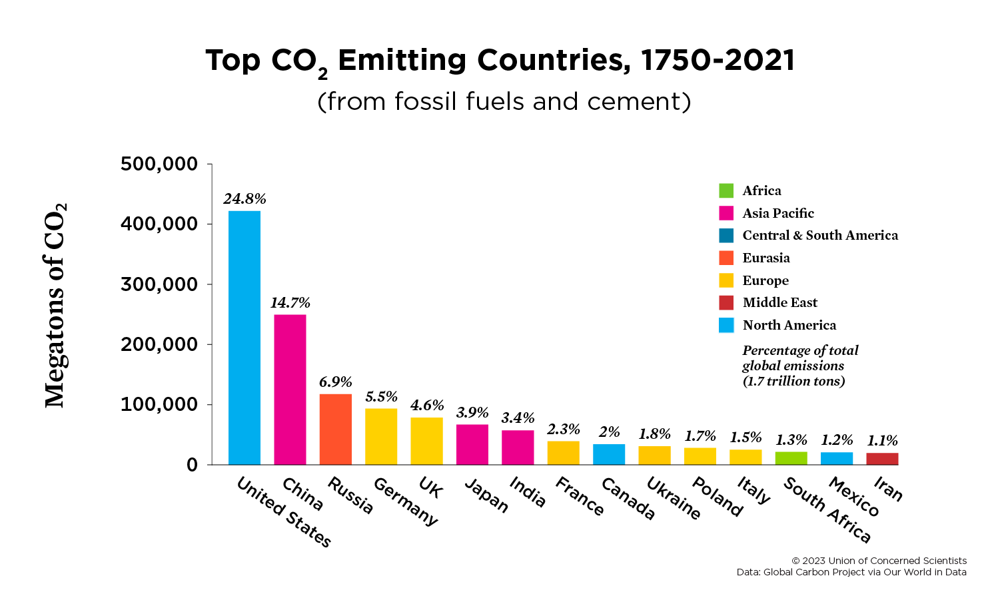

## Table of Contents

## What is carbon dioxide and why is it important to track emissions?

Carbon dioxide, or CO2, is a gas made up of one carbon atom and two oxygen atoms. It is naturally present in the air we breathe and is also produced by human activities like burning fossil fuels, driving cars, and even breathing. Plants use CO2 to make food through a process called photosynthesis, which is important for life on Earth. However, too much CO2 in the atmosphere can cause problems.

It's important to track CO2 emissions because they contribute to climate change. When there is too much CO2 in the air, it traps heat from the sun, making the Earth warmer. This can lead to more extreme weather, like hotter temperatures, more storms, and rising sea levels. By keeping an eye on how much CO2 we are putting into the air, we can try to reduce it and help protect our planet for the future.

## How is carbon dioxide emission measured?

Carbon dioxide emissions are measured using different tools and methods. One common way is by using machines called gas analyzers. These machines can be placed in places like factories or power plants to check how much CO2 is coming out of their chimneys. They work by taking a sample of the air and figuring out how much CO2 is in it. Another way to measure emissions is by looking at how much fuel is being used. For example, if a car uses a certain amount of gasoline, we can estimate how much CO2 it will produce.

Scientists also use satellites to measure CO2 emissions from space. These satellites can see large areas and help us understand where CO2 is coming from all over the world. By combining all these different measurements, we get a good idea of how much CO2 is being released into the air. This helps us keep track of our emissions and work on ways to reduce them.

## Which countries are the top emitters of carbon dioxide?

The countries that produce the most carbon dioxide are China, the United States, and India. China is the biggest emitter because it has a lot of factories and power plants that burn coal. The United States comes in second because it uses a lot of cars and has many industries. India is third because it is growing fast and using more energy, mostly from coal.

Other countries that emit a lot of CO2 include Russia, Japan, and Germany. Russia has large industries and uses a lot of natural gas. Japan has many factories and power plants, and it also uses a lot of cars. Germany, while working on using more clean energy, still has industries that produce CO2. These countries are important to watch because their actions can make a big difference in reducing global emissions.

## What are the main sources of carbon dioxide emissions in these countries?

In China, the main source of carbon dioxide emissions comes from burning coal to make electricity. China has a lot of factories and power plants that use coal, which is a big reason why they produce so much CO2. Another source is from cars and trucks, as more people in China are driving and using more fuel. Industry and construction also add to the emissions because they use a lot of energy.

In the United States, the biggest source of CO2 comes from transportation, like cars, trucks, and airplanes. People in the US drive a lot, and this uses a lot of gasoline, which makes CO2. Another big source is from power plants that burn coal, natural gas, and oil to make electricity. Industries like factories and businesses also produce a lot of CO2 because they use a lot of energy.

In India, the main source of CO2 emissions is also from burning coal to make electricity. India is growing fast and needs a lot of energy, and coal is a big part of that. Cars and trucks are another source, as more people in India are driving. Industry and construction also add to the emissions because they use a lot of energy, just like in China and the US.

## How have carbon dioxide emissions changed over the last decade in these countries?

Over the last decade, China's carbon dioxide emissions have grown a lot. This is because China has been building more factories and power plants that burn coal. But in the last few years, China has started to use more clean energy like wind and solar power. This has slowed down the growth of CO2 emissions a bit, but China still makes more CO2 than any other country.

In the United States, CO2 emissions have gone down over the last decade. This is because people are using less coal to make electricity and more natural gas, which makes less CO2. Also, more people are driving electric cars and using less gasoline. But the US still makes a lot of CO2, especially from cars and trucks.

In India, CO2 emissions have gone up a lot over the last decade. This is because India is growing fast and needs more energy. Most of this energy comes from burning coal. But like China, India is also starting to use more clean energy. Still, India's CO2 emissions are growing because it is using more energy overall.

## What are the economic factors contributing to high carbon dioxide emissions?

One big reason for high carbon dioxide emissions is that many countries want to grow their economies fast. To do this, they build a lot of factories and power plants that burn coal and other fossil fuels. These fuels are often cheap and easy to use, so countries use them a lot to make things and electricity. This helps the economy grow, but it also makes a lot of CO2. For example, in China and India, the need to grow quickly has led to more factories and more coal being burned, which means more CO2 in the air.

Another reason is that people want to use more energy and have more things. As countries get richer, people buy more cars, use more electricity, and want more stuff. This means more energy is needed, and often this energy comes from burning fossil fuels. In places like the United States, people drive a lot and use a lot of energy at home, which makes a lot of CO2. So, the desire for a better life and more things can lead to higher CO2 emissions.

## How do international agreements like the Paris Agreement affect these countries' emissions?

The Paris Agreement is a big deal because it gets countries to work together to fight climate change. Countries like China, the United States, and India promised to cut down their CO2 emissions. This means they have to think about using less coal and more clean energy like wind and solar power. The agreement sets goals for each country, but it's up to them to figure out how to reach those goals. So, the Paris Agreement pushes these countries to make plans and take action to reduce their CO2 emissions.

Even though the Paris Agreement is important, it's not easy for countries to change quickly. For example, China and India need a lot of energy to keep growing their economies, so they still use a lot of coal. The United States has been trying to use more clean energy, but it's hard to change everything at once. The agreement helps by making countries talk to each other and share ideas on how to cut emissions. But it's a big challenge, and it will take time and effort for these countries to meet their goals and lower their CO2 emissions.

## What technologies are being used or developed to reduce carbon dioxide emissions in these countries?

In China, they are using more clean energy like wind and solar power to make electricity instead of coal. They are also trying to use less coal and more natural gas, which makes less CO2. Another thing they are doing is making cars that run on electricity instead of gasoline. These electric cars do not make any CO2 when they are driven. China is also working on a technology called carbon capture and storage (CCS), which takes CO2 from power plants and stores it underground so it doesn't go into the air.

In the United States, they are also using more wind and solar power. They are trying to use less coal and more natural gas, just like China. The US is also making more electric cars and building more places to charge them. Another thing they are doing is making buildings use less energy by making them more efficient. This means less CO2 is made to heat or cool the buildings. They are also working on CCS to take CO2 from power plants and store it underground.

In India, they are starting to use more clean energy like wind and solar power, but they still use a lot of coal. They are trying to make more efficient power plants that use less coal and make less CO2. India is also working on making more electric cars and bikes, which do not make CO2 when they are used. They are also looking at CCS to see if they can use it to take CO2 from power plants and store it underground, but this is still new for them.

## What are the projected future trends for carbon dioxide emissions in these countries?

In China, CO2 emissions are expected to keep growing for a while because they need a lot of energy to keep their economy growing. But they are also working hard to use more clean energy like wind and solar power. This means that in the future, China might be able to slow down how fast their CO2 emissions are growing. They are also building more electric cars and using new technologies like carbon capture and storage, which could help reduce their CO2 emissions over time.

In the United States, CO2 emissions are expected to go down more in the future. This is because they are using more clean energy and less coal. More people are driving electric cars, and buildings are being made to use less energy. These changes should help the US lower its CO2 emissions. But it will take time, and the country will need to keep working on these changes to meet its goals.

In India, CO2 emissions are expected to keep growing because the country is growing fast and needs more energy. Most of this energy still comes from coal, which makes a lot of CO2. But India is also starting to use more clean energy like wind and solar power. If they keep working on this, they might be able to slow down how fast their CO2 emissions are growing. They are also looking at new technologies like electric cars and carbon capture and storage, which could help them reduce their CO2 emissions in the future.

## How do these countries' per capita emissions compare to the global average?

China's per capita CO2 emissions are a bit higher than the global average. This means that if you take the total CO2 emissions in China and divide it by the number of people living there, each person in China makes more CO2 than the average person in the world. This is because China has a lot of factories and power plants that burn coal, which makes a lot of CO2. But China is also working on using more clean energy, so their per capita emissions might not grow as fast in the future.

The United States has much higher per capita CO2 emissions than the global average. This means that each person in the US makes a lot more CO2 than the average person in the world. This is because people in the US drive a lot of cars and use a lot of energy at home, which makes a lot of CO2. But the US is trying to use more clean energy and electric cars, so their per capita emissions might go down in the future.

India's per capita CO2 emissions are lower than the global average. This means that each person in India makes less CO2 than the average person in the world. This is because India is still growing and not everyone uses as much energy as people in richer countries. But India's emissions are growing fast because they need more energy to keep growing. If they keep using more clean energy, their per capita emissions might not grow as fast in the future.

## What are the environmental impacts of high carbon dioxide emissions in these countries?

High carbon dioxide emissions in China, the United States, and India are causing big problems for the environment. In China, the air can get very dirty because of all the factories and power plants that burn coal. This dirty air can make people sick and hurt animals and plants. The extra CO2 also makes the Earth warmer, which can change the weather and cause more storms and hot days. This can hurt farms and make it harder for people to grow food. The rising sea levels from melting ice can also flood cities and homes near the coast.

In the United States, the high CO2 emissions are also making the Earth warmer. This can lead to more wildfires, like the ones that burn forests and homes. The warmer weather can also hurt animals and plants that need cooler temperatures to live. The more cars and trucks on the road make the air dirty, which can make people sick. The rising sea levels can also cause problems for cities like New York and Miami, where water can flood streets and buildings.

In India, the growing CO2 emissions are making the air dirty, especially in big cities. This dirty air can make people sick and hurt their lungs. The extra CO2 is also making the Earth warmer, which can change the weather and cause more heatwaves and storms. This can hurt farms and make it harder for people to grow food. The rising sea levels can also cause problems for cities like Mumbai, where water can flood homes and streets.

## What policies have been effective in reducing carbon dioxide emissions in these countries?

In China, one effective policy has been to set strict goals for using more clean energy like wind and solar power. The government has made rules that say power companies must use more clean energy and less coal. This has helped slow down how fast CO2 emissions are growing. China has also started programs to make factories and cars use less energy and make less CO2. These policies are working because China is using more clean energy and making less CO2 than before, even though they still use a lot of coal.

In the United States, one good policy has been to make rules that help more people drive electric cars. The government gives money to people who buy electric cars, which do not make any CO2 when they are driven. Another policy is to make power plants use less coal and more natural gas, which makes less CO2. These policies are working because more people are driving electric cars and using less coal, which means less CO2 is being made. But the US still needs to keep working on these policies to lower their CO2 emissions even more.

In India, one effective policy has been to start using more clean energy like solar power. The government has made it easier for people to use solar power by giving them money to put solar panels on their homes and businesses. This has helped India use less coal and make less CO2. India has also started programs to make factories and cars use less energy and make less CO2. These policies are starting to work, but India still needs to grow and use more energy, so they need to keep working on these policies to reduce their CO2 emissions in the future.

## References & Further Reading

[1]: Boden, T. A., Andres, R. J., & Marland, G. (2017). ["Global, Regional, and National Fossil-Fuel CO2 Emissions."](https://www.osti.gov/dataexplorer/biblio/dataset/1712447) Carbon Dioxide Information Analysis Center, Oak Ridge National Laboratory.

[2]: Intergovernmental Panel on Climate Change (IPCC). (2014). ["Climate Change 2014: Mitigation of Climate Change."](https://www.ipcc.ch/report/ar5/wg3/) Contribution of Working Group III to the Fifth Assessment Report of the Intergovernmental Panel on Climate Change.

[3]: International Energy Agency (IEA). (2021). ["World Energy Outlook 2021."](https://www.iea.org/reports/world-energy-outlook-2021) International Energy Agency.

[4]: Goldthau, A., & Sovacool, B. K. (2016). ["The uniqueness of the energy security, justice, and governance problem."](https://www.sciencedirect.com/science/article/pii/S0301421511008263) Nature Energy, 16001.

[5]: Lovins, A. B., & Potts, J. (2019). ["Accelerating Energy Efficiency: Eight Innovative Approaches."](https://iopscience.iop.org/article/10.1088/1748-9326/ab55ab) Rocky Mountain Institute.

[6]: Lewis, M. K., & Mody, A. (2011). ["Carbon Markets."](https://journals.sagepub.com/doi/10.1260/0958-305X.22.6.681) In Encyclopedia of Energy, Natural Resource, and Environmental Economics.