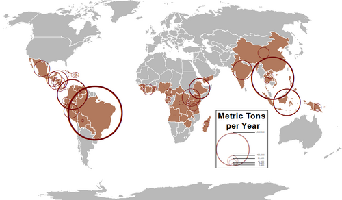

## Table of Contents

## What are the top coffee-producing countries in the world?

Coffee is grown in many countries around the world, but some countries produce more coffee than others. The top coffee-producing countries are Brazil, Vietnam, and Colombia. Brazil is the biggest coffee producer and grows a lot of coffee because it has a big area and good weather for coffee plants. Vietnam has become a big coffee producer in recent years, and it grows a type of coffee called Robusta. Colombia is famous for its coffee and grows a type of coffee called Arabica, which many people like because it tastes good.

These countries are important because they supply most of the coffee that people drink around the world. Brazil and Vietnam together produce more than half of all the coffee in the world. Colombia, even though it produces less than Brazil and Vietnam, is still very important because its coffee is known for its high quality. Other countries like Indonesia, Ethiopia, and Honduras also grow a lot of coffee, but they do not produce as much as the top three countries.

## How much coffee does each of these countries produce annually?

Brazil produces the most coffee in the world, making around 60 million bags of coffee each year. A bag of coffee is about 60 kilograms. This is a lot of coffee! Brazil can grow so much because it has a big area and the weather is good for coffee plants. Most of the coffee from Brazil is Arabica, which is a type that many people like because it tastes good.

Vietnam is the second biggest coffee producer, making about 30 million bags of coffee every year. Vietnam grows a lot of Robusta coffee, which is different from Arabica. Robusta coffee is strong and has more caffeine. Vietnam has become a big coffee producer in the last few years because it has good conditions for growing coffee and many farmers work hard to grow it.

Colombia produces around 14 million bags of coffee each year. Colombia is famous for its coffee because it is high quality and tastes good. Most of the coffee from Colombia is Arabica, just like Brazil. Even though Colombia produces less coffee than Brazil and Vietnam, it is still very important in the world of coffee because people love the taste of Colombian coffee.

## What types of coffee beans are primarily grown in these countries?

In Brazil, the main type of coffee bean grown is Arabica. Arabica beans are popular because they taste good and are used in many types of coffee drinks. Brazil grows a lot of Arabica because it has big areas with the right weather for these plants. Even though Brazil also grows some Robusta beans, Arabica is the most important one there.

Vietnam mostly grows Robusta coffee beans. Robusta beans are different from Arabica because they are stronger and have more caffeine. Vietnam has become a big coffee producer because it has good conditions for growing Robusta and many farmers work hard to grow these beans. Robusta from Vietnam is used in many coffee products around the world.

In Colombia, the primary type of coffee bean is also Arabica. Colombian Arabica is famous for its high quality and great taste. The country's unique climate and high altitudes help grow these beans, which are loved by coffee drinkers everywhere. While Colombia does grow a small amount of Robusta, Arabica is the star of Colombian coffee.

## What are the main regions within these countries known for coffee production?

In Brazil, the main regions for coffee production are Minas Gerais, São Paulo, and Espírito Santo. Minas Gerais is the biggest coffee-producing state in Brazil and grows a lot of Arabica coffee. São Paulo also grows a lot of Arabica, but it is known for its high-quality beans. Espírito Santo grows both Arabica and Robusta, but it is more famous for its Robusta coffee.

Vietnam's main coffee-growing regions are the Central Highlands, especially Dak Lak, Lam Dong, and Gia Lai. Dak Lak is the biggest coffee producer in Vietnam and grows a lot of Robusta coffee. Lam Dong and Gia Lai also grow a lot of Robusta, and these areas have good weather for coffee plants. The Central Highlands are important because they produce most of Vietnam's coffee.

In Colombia, the main coffee regions are Antioquia, Huila, and Tolima. Antioquia is famous for its coffee and grows a lot of high-quality Arabica beans. Huila is known for its unique coffee flavors because of its high altitudes. Tolima also grows Arabica and is important for Colombia's coffee production. These regions help make Colombian coffee famous around the world.

## How does the climate and geography of these countries contribute to coffee production?

Brazil's climate and geography are perfect for growing coffee. The country has a big area with different kinds of weather, but the parts where coffee grows best are warm and have a lot of rain. This is good for coffee plants because they need water to grow well. The highlands in Brazil, like in Minas Gerais, have the right temperature and rain to grow Arabica coffee, which likes cooler weather. The lower areas, like in Espírito Santo, are good for Robusta coffee, which can handle hotter weather. So, Brazil can grow a lot of coffee because it has many places with the right conditions.

Vietnam's Central Highlands are great for coffee because they have the right weather and soil. The area is high up, so it is cooler than the lowlands, but it still gets a lot of rain. This is perfect for Robusta coffee, which grows well in these conditions. The soil in the Central Highlands is also good for coffee plants because it has the right nutrients. Many farmers in Vietnam work hard to grow coffee, and the good weather and soil help them produce a lot of it.

Colombia's coffee regions have special climates and geography that help grow high-quality Arabica coffee. The country has many mountains, and coffee is grown at high altitudes where it is cooler. This cooler weather is perfect for Arabica beans, which need it to grow well. The regions like Antioquia and Huila also get a lot of rain, which is important for coffee plants. The different altitudes and climates in Colombia help create unique flavors in the coffee, making it famous around the world.

## What are the traditional coffee processing methods used in these countries?

In Brazil, the traditional way to process coffee is called the dry method or natural process. Farmers spread the coffee cherries out in the sun to dry. They turn the cherries often so they dry evenly. Once the cherries are dry, they use machines to remove the dried fruit and get the beans out. This method is common in Brazil because it is easy and does not need a lot of water. Some farmers also use the wet method, where they remove the fruit from the cherries before drying the beans, but the dry method is more traditional.

In Vietnam, the traditional way to process coffee is also the dry method. Farmers lay the coffee cherries out to dry in the sun. They keep turning the cherries to make sure they dry well. After drying, they use machines to take off the dried fruit and get to the beans. This method works well in Vietnam's climate. Some farmers use the wet method too, but the dry method is more common and traditional because it is simple and fits well with the local conditions.

In Colombia, the traditional way to process coffee is the wet method or washed process. Farmers remove the fruit from the coffee cherries right after [picking](/wiki/asset-class-picking) them. They put the beans in water to ferment, which helps remove the rest of the fruit. After fermenting, the beans are washed and then dried in the sun. This method helps make the coffee taste clean and bright, which is what Colombian coffee is famous for. While some farmers use the dry method, the wet method is more traditional in Colombia.

## How have coffee production techniques evolved in these countries over the last decade?

In Brazil, coffee production techniques have changed a lot over the last ten years. Farmers now use new technology to help them grow and process coffee better. They use machines to pick the coffee cherries, which is faster and more efficient than picking them by hand. Also, some farmers have started using the wet method more often because it can make the coffee taste better. They also use special equipment to check the quality of the beans and make sure they are the best they can be. These new ways help Brazil keep being the biggest coffee producer in the world.

In Vietnam, coffee production has also improved in the last decade. Farmers have started using better ways to grow and take care of their coffee plants. They use new kinds of fertilizers and better ways to control pests, which help the plants grow healthier. Some farmers have also started using the wet method more, just like in Brazil, to make their coffee taste better. Vietnam has also started to grow more Arabica coffee, along with the usual Robusta, to meet the demand for different kinds of coffee. These changes have helped Vietnam become a bigger and better coffee producer.

In Colombia, coffee production techniques have gotten more advanced too. Farmers use new technology to help them grow coffee in a way that is good for the environment. They use special methods to keep the soil healthy and the water clean. Some farmers have also started using machines to help with the wet processing method, making it easier and more efficient. Colombia has also worked on making their coffee even better by trying new ways to process the beans and experimenting with different kinds of coffee plants. These improvements help keep Colombian coffee known for its high quality and great taste.

## What role do these countries play in the global coffee market?

Brazil, Vietnam, and Colombia are very important in the global coffee market because they grow a lot of coffee. Brazil is the biggest coffee producer in the world and makes around 60 million bags of coffee every year. This is a lot of coffee, and it helps meet the demand for coffee all over the world. Brazil grows mostly Arabica coffee, which many people like because it tastes good. Vietnam is the second biggest producer and grows about 30 million bags of coffee each year. Vietnam grows mostly Robusta coffee, which is strong and has more caffeine. Both Brazil and Vietnam together produce more than half of all the coffee in the world, so they are very important for the global coffee supply.

Colombia, even though it produces less coffee than Brazil and Vietnam, plays a big role in the global coffee market too. Colombia makes about 14 million bags of coffee every year, and it is famous for its high-quality Arabica coffee. People all over the world love the taste of Colombian coffee, so it is very popular. Colombia's coffee is known for being grown in a way that is good for the environment, which makes it even more special. Because of its reputation for quality and taste, Colombian coffee has a big impact on the global coffee market, even if it produces less than the top two countries.

## What are the major challenges faced by coffee producers in these countries?

Coffee producers in Brazil, Vietnam, and Colombia face many challenges. One big problem is the weather. Sometimes, there can be too much rain or not enough rain, which can hurt the coffee plants. Also, diseases and pests can damage the plants and make it hard to grow good coffee. Another challenge is the price of coffee. The price can go up and down a lot, and this makes it hard for farmers to know how much money they will make. If the price is low, farmers might not make enough money to take care of their farms.

In Vietnam, farmers also have to deal with the challenge of growing mostly Robusta coffee. Robusta is not as expensive as Arabica, so farmers might not make as much money. They are trying to grow more Arabica to make more money, but it is hard because Arabica needs different weather and care. In Colombia, the challenge is to keep making high-quality coffee. It takes a lot of work and money to grow coffee in a way that is good for the environment, and sometimes farmers do not have enough money to do this. All these challenges make it hard for coffee producers in these countries to keep growing good coffee and making a living.

## How do government policies in these countries affect coffee production?

In Brazil, the government helps coffee farmers by giving them money to grow coffee and by making rules to make sure the coffee is good quality. The government also helps farmers learn new ways to grow coffee that are better for the environment. But sometimes, the government's rules can make it hard for small farmers to grow coffee because they need a lot of money to follow the rules. So, the government's help can be good, but it can also make things hard for some farmers.

In Vietnam, the government wants to grow more coffee and make it better. They give farmers money and help them learn new ways to grow coffee. The government also tries to make sure that the coffee is good quality so that Vietnam can sell more coffee to other countries. But, the government's rules can sometimes make it hard for farmers to grow different kinds of coffee, like Arabica, because it needs special care and the rules might not help with that.

In Colombia, the government works hard to help coffee farmers grow good coffee. They give money to farmers and help them learn how to grow coffee in a way that is good for the environment. The government also makes sure that Colombian coffee is known for being high quality all over the world. But, the rules can sometimes be hard for small farmers to follow because they need a lot of money and work to do everything the right way. So, the government's help can make a big difference, but it can also be a challenge for some farmers.

## What are the sustainability practices implemented in the coffee production of these countries?

In Brazil, farmers are working to make coffee production more sustainable. They use less water and chemicals to grow coffee, which helps keep the soil and water clean. Some farmers also plant trees around their coffee plants to protect them from the sun and wind. This is good for the environment because it helps keep the soil healthy and stops it from washing away. The government also helps by giving money to farmers who use these sustainable methods. This way, they can grow good coffee and take care of the land at the same time.

In Vietnam, farmers are trying new ways to grow coffee that are better for the environment. They use special kinds of fertilizers that do not harm the soil as much. Some farmers also plant different crops along with coffee to keep the soil healthy and stop pests from hurting the coffee plants. The government helps by teaching farmers about these new methods and giving them money to try them. This helps Vietnam grow more coffee in a way that is good for the land and the people who live there.

In Colombia, coffee farmers are known for using sustainable practices. They grow coffee in the shade of trees, which is good for the environment because it helps keep the soil and water clean. Farmers also use natural ways to control pests and diseases, like using helpful bugs instead of chemicals. The government helps by giving money and teaching farmers about these methods. This way, Colombian coffee stays high quality and the land stays healthy for future generations.

## How do these countries contribute to the innovation and development of new coffee varieties?

Brazil is always working on new kinds of coffee. They want to make coffee that tastes good and is easy to grow. Scientists in Brazil study different coffee plants to find the best ones. They mix different kinds of coffee plants to make new ones that can grow well in Brazil's weather. This helps farmers grow more coffee and make more money. Brazil also tries to grow coffee that needs less water and fewer chemicals, which is good for the environment. By doing this, Brazil helps make coffee better for everyone.

Vietnam is also working on new coffee varieties. They want to grow more Arabica coffee because it can be sold for more money than Robusta. Scientists in Vietnam are trying to find Arabica plants that can grow well in Vietnam's weather. They also work on making Robusta coffee better, so it tastes good and can be sold for more money. Vietnam's government helps by giving money to scientists and farmers to try these new kinds of coffee. This way, Vietnam can grow more coffee and help the world have more choices.

Colombia is famous for its coffee, and they are always trying to make it even better. They work on growing new kinds of Arabica coffee that taste great and can grow well in Colombia's mountains. Scientists mix different coffee plants to find the best ones. They also try to grow coffee that is good for the environment, using less water and chemicals. The government helps by giving money to farmers and scientists to try these new kinds of coffee. This helps keep Colombian coffee known for being high quality and helps the world enjoy new and better coffee.

## What is the role of algorithmic trading in the coffee market?

Algorithmic trading is significantly changing how coffee is traded on a global scale. By utilizing complex algorithms, traders can execute trades at high speed and with precision, taking into account vast quantities of data related to price movements, market trends, and other influential variables. This form of trading allows for decisions to be made in milliseconds, enhancing the overall efficiency of the market.

One of the key advantages of [algorithmic trading](/wiki/algorithmic-trading) is its ability to optimize trading strategies through the analysis of historical and real-time data. By implementing advanced algorithms, traders are able to identify patterns, statistical correlations, and anomalies in the market that may indicate potential trading opportunities. For instance, a typical algorithm might assess factors such as price [momentum](/wiki/momentum), [volatility](/wiki/volatility-trading-strategies), and [volume](/wiki/volume-trading-strategy) disparities to predict price movements and execute trades accordingly.

The algorithms used are often based on quantitative models that employ mathematical expressions to evaluate market conditions. A simple illustrative example is a Moving Average Crossover strategy, which uses moving averages to determine market trends. For example:

$$
\text{Signal} = \begin{cases} 
\text{Buy,} & \text{if } \text{Short-Term MA} > \text{Long-Term MA} \\
\text{Sell,} & \text{if } \text{Short-Term MA} < \text{Long-Term MA} 
\end{cases}
$$

Such strategies can be programmed in Python, using libraries like `pandas` and `numpy` to handle data manipulation and calculations. Here is a simplified Python snippet demonstrating the moving average crossover strategy:

```python
import pandas as pd

# Sample data: a DataFrame with a 'price' column
data['Short_MA'] = data['price'].rolling(window=20).mean()  # Short-term moving average
data['Long_MA'] = data['price'].rolling(window=50).mean()  # Long-term moving average

# Generate buy/sell signals
data['Signal'] = 0
data['Signal'][data['Short_MA'] > data['Long_MA']] = 1  # Buy
data['Signal'][data['Short_MA'] < data['Long_MA']] = -1  # Sell
```

By automating the trading process, algorithmic trading mitigates the potential for human error and emotional bias, providing a more consistent approach to trading decisions. This leads to optimized transaction costs, better execution prices, and improved market [liquidity](/wiki/liquidity-risk-premium).

Moreover, algorithmic trading provides new opportunities for coffee producers and exporters. As these stakeholders can respond more rapidly to market signals, they are better positioned to take advantage of favorable price movements. This responsiveness can improve their competitiveness and profitability in the market.

However, the adoption of algorithmic trading is not without challenges. The reliance on technology necessitates robust infrastructure and high-quality data feeds to function effectively. Additionally, there is a need for regulatory frameworks to ensure fair and stable market conditions, as the rapid trading enabled by algorithms can sometimes lead to unintended market instability.

In summary, algorithmic trading represents a technological advancement with profound implications for the coffee market. Its capacity to enhance trading efficiency and market responsiveness makes it a valuable tool for modernizing coffee trading practices on a global scale.

## References & Further Reading

[1]: Lewin, B., & Giovannucci, D. (2008). ["Coffee: Growing, Processing, Sustainable Production - A Guidebook for Growers, Processors, Traders, and Researchers."](https://papers.ssrn.com/sol3/papers.cfm?abstract_id=996111) Wiley-VCH.

[2]: International Coffee Organization. (2021). ["Coffee Development Report."](https://icocoffee.org/wp-content/uploads/2022/11/coffee-development-report-2021.pdf)

[3]: Jha, S., & Bacon, C. M. (2009). ["Shade Coffee: Update on a Disappearing Refuge for Biodiversity."](https://academic.oup.com/bioscience/article/64/5/416/2754235) BioScience, 59(8), 593-603.

[4]: Carvalhaes, N. (2020). ["The Coffee Guide."](https://www.researchgate.net/publication/355928597_The_Coffee_Guide_Fourth_Edition) International Trade Centre.

[5]: Minter, A. (2018). ["Introduction to Algorithmic Trading: How Algorithms Shape the Financial Markets."](https://www.researchgate.net/publication/378548435_Algorithmic_Trading_and_AI_A_Review_of_Strategies_and_Market_Impact)

[6]: Boreinstein, S., & R. Ferrer. (2021). ["Climate Change and Coffee: Using Climate-Smart Agriculture to Respond."](https://link.springer.com/article/10.1007/s11027-024-10139-z) Consumption Markets & Culture. 

[7]: World Bank Group. (2015). ["The Economic Impact of Climate Change on Coffee of Uganda."](https://www.worldbank.org/ext/en/home) World Bank Publications.