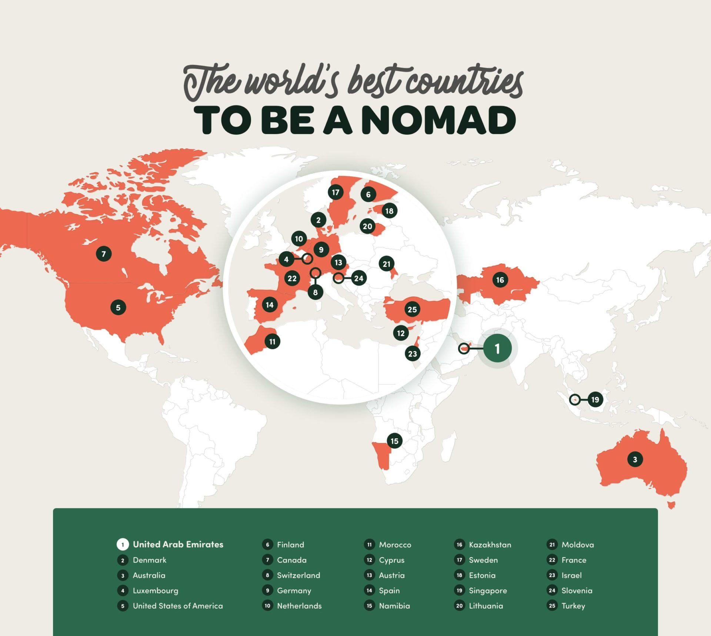

## Table of Contents

## What is a digital nomad?

A digital nomad is a person who works remotely and travels at the same time. They use technology like laptops and the internet to do their jobs from anywhere in the world. Instead of going to an office every day, they can work from a beach, a café, or a different country.

Many digital nomads have jobs in fields like writing, programming, or marketing. They can work for companies or be their own bosses. This lifestyle lets them explore new places while still earning money. It can be exciting but also challenging because they need to find good internet and a quiet place to work.

## Why might someone choose to become a digital nomad?

Someone might choose to become a digital nomad because they love to travel and explore new places. Instead of staying in one spot, they can see the world while still working. This lifestyle lets them experience different cultures, meet new people, and have new adventures every day. It's perfect for people who feel stuck in a regular office job and want more freedom and excitement in their lives.

Another reason is the flexibility that comes with being a digital nomad. They can set their own schedules and work from anywhere they want. This means they can take breaks to go for a walk, visit a local market, or just enjoy the scenery. For people who value their independence and don't like being tied to a desk, this way of life can be very appealing. It also allows them to balance work and personal life in a way that suits them best.

## What are the basic requirements for a country to be suitable for digital nomads?

For a country to be suitable for digital nomads, it needs to have good internet. Digital nomads need fast and reliable internet to do their jobs well. Without it, they can't work, so it's very important. The country should also be safe. Digital nomads want to feel safe when they travel and work in a new place. If a country has a lot of crime, it might not be a good choice for them.

Another important thing is the cost of living. If a country is too expensive, digital nomads might not be able to stay there for long. They need places where they can live and work without spending too much money. Also, it's good if the country has a digital nomad visa. This kind of visa makes it easier for digital nomads to stay in the country for a longer time. If a country has all these things, it can be a great place for digital nomads to live and work.

## How do visa regulations affect digital nomads' choice of country?

Visa regulations are very important for digital nomads when they choose a country to live and work in. Some countries have special visas just for digital nomads. These visas let them stay longer than a regular tourist visa. If a country has a digital nomad visa, it can be a big reason for digital nomads to choose that place. They don't have to worry about leaving every few months or breaking any rules.

On the other hand, if a country does not have a digital nomad visa, it can be harder for them to stay there for a long time. They might have to leave the country every few months and come back, which can be a hassle. This can make them choose a different country where the visa rules are easier for them. So, visa regulations can really affect where digital nomads decide to go.

## What are the top countries known for their digital nomad-friendly policies?

Some countries are very friendly to digital nomads because of their visa policies. Estonia is a top choice. They have an e-Residency program that lets digital nomads live and work there easily. Portugal is also popular. They offer a special visa called the D7 Visa, which is perfect for digital nomads. These countries make it simple for digital nomads to stay for a long time.

Another good country is Georgia. They have a one-year digital nomad visa that is easy to get. Mexico is also welcoming. They have a Temporary Resident Visa that digital nomads can use. Both countries have good internet and are not too expensive, so digital nomads like them a lot.

Costa Rica is another favorite. They have a special visa for digital nomads that lasts up to two years. Thailand also has a Long-Term Resident Visa that can be good for digital nomads. These countries offer a mix of good weather, low costs, and easy visa rules, making them great places for digital nomads to live and work.

## How does the cost of living influence the choice of country for digital nomads?

The cost of living is a big reason why digital nomads pick a country. If a place is too expensive, digital nomads might not be able to stay there for long. They need to find countries where they can live and work without spending too much money. For example, countries like Thailand and Mexico are popular because they are not too costly. Digital nomads can find cheap places to stay, eat good food for less money, and still have money left to save or travel more.

Also, the cost of living can affect how digital nomads enjoy their time in a new place. If a country is cheaper, they can try more things like local tours, eating out, and going to events. This makes their experience richer and more fun. On the other hand, if a country is too pricey, they might have to cut back on these fun activities. So, choosing a country with a lower cost of living can help digital nomads have a better and more enjoyable lifestyle.

## What infrastructure aspects (like internet speed, co-working spaces) are crucial for digital nomads?

Internet speed is very important for digital nomads. They need fast and reliable internet to do their jobs well. If the internet is slow or keeps cutting out, they can't work properly. This means they look for countries with good internet service. They also need a lot of data because they use the internet all day for work. So, having good internet is a must for digital nomads.

Co-working spaces are also crucial. These are places where digital nomads can go to work. They have desks, internet, and sometimes meeting rooms. Digital nomads like co-working spaces because they can work in a quiet and professional place. They can also meet other people who work online. This helps them feel less lonely and can even lead to new friendships or business opportunities. So, having good co-working spaces is important for digital nomads.

## How do safety and healthcare considerations impact a digital nomad's decision on where to live?

Safety is a big reason why digital nomads pick a place to live. They want to feel safe when they work and travel. If a country has a lot of crime, digital nomads might not want to go there. They look for places where they can walk around without worrying. A safe place helps them focus on their work and enjoy their time in a new country. So, safety is very important when they choose where to live.

Healthcare is also important for digital nomads. They need to know they can get good medical care if they get sick or hurt. Some countries have great hospitals and doctors, but they might be expensive. Digital nomads look for places where healthcare is good and not too costly. They might also get travel insurance to help pay for medical bills. Having good healthcare options makes them feel more secure and can influence where they decide to live.

## What are some lesser-known countries that are emerging as hotspots for digital nomads?

Some lesser-known countries that are becoming popular for digital nomads are Albania and Sri Lanka. Albania is in Europe and it's getting more attention because it's safe, has good internet, and is not expensive. Digital nomads can live in nice places by the sea and still have money left to enjoy the local food and culture. Sri Lanka is in Asia and it's also becoming a favorite. It has beautiful beaches, good internet in many areas, and low costs. Digital nomads can work from places like Colombo or the more relaxed areas like Galle.

Another country that is gaining popularity is Namibia in Africa. It's known for its amazing nature, like the Namib Desert and Etosha National Park. Namibia has good internet in the cities and is safe for digital nomads. The cost of living is also reasonable, which makes it a good choice. Digital nomads can work from places like Windhoek and then explore the stunning landscapes on their days off. These countries offer unique experiences and are becoming more known among digital nomads looking for new places to live and work.

## How do cultural and social environments affect digital nomads' experiences in different countries?

Cultural and social environments play a big role in how digital nomads feel about a country. When digital nomads move to a new place, they want to fit in and enjoy the local culture. If the people are friendly and welcoming, digital nomads feel more at home. They can make friends, learn about new traditions, and feel part of the community. On the other hand, if the culture is very different and hard to understand, digital nomads might feel lonely or out of place. They might miss their own culture and find it hard to connect with locals.

Also, the social environment can affect how digital nomads work and relax. In some countries, people might work long hours and not have much time for socializing. This can make it hard for digital nomads to meet new people or enjoy their free time. In other places, the social life might be more relaxed, with lots of events and activities. This can make it easier for digital nomads to have fun and meet others. So, the cultural and social environment can really change how digital nomads experience a new country, making it either a great place to live or a challenging one.

## What are the long-term trends in digital nomad destinations, and how are they expected to evolve?

Over the last few years, more and more digital nomads have been choosing places that are easy to live in and work from. Countries like Portugal, Thailand, and Mexico have become very popular because they have good internet, are safe, and are not too expensive. These places also have special visas for digital nomads, which makes it easier for them to stay longer. As more people learn about being a digital nomad, these countries keep getting more popular. But, as more digital nomads go to these places, the cost of living might go up, and it could get harder to find a place to stay.

In the future, we might see digital nomads looking for new places that are not as well-known yet. Countries like Albania, Sri Lanka, and Namibia are starting to become more popular. These places offer unique experiences and are still affordable. As more digital nomads want to find new and exciting places to live, these lesser-known countries could become the next big hotspots. Also, more countries might start offering digital nomad visas to attract these remote workers. This could make it easier for digital nomads to move around the world and explore new cultures while working.

## How can digital nomads contribute to and benefit from local economies in their host countries?

Digital nomads can help local economies by spending money on things like food, places to stay, and local services. When they live in a new country, they buy things from local shops and eat at local restaurants. This means more money stays in the community, which can help small businesses grow. They might also use local co-working spaces, which gives those businesses more customers. Sometimes, digital nomads teach or share their skills with locals, which can help the community learn new things and maybe even start their own businesses.

Digital nomads also benefit from local economies because they can live in places that are less expensive than their home countries. This means they can save money while still enjoying a good lifestyle. They can also try new foods, learn about different cultures, and have unique experiences that they might not find at home. By being part of the local economy, digital nomads can feel more connected to the places they visit and make friends with the people who live there. This makes their time as a digital nomad more enjoyable and meaningful.

## References & Further Reading

[1]: Bergstra, J., Bardenet, R., Bengio, Y., & Kégl, B. (2011). ["Algorithms for Hyper-Parameter Optimization."](https://dl.acm.org/doi/10.5555/2986459.2986743) Advances in Neural Information Processing Systems 24.

[2]: ["Advances in Financial Machine Learning"](https://www.amazon.com/Advances-Financial-Machine-Learning-Marcos/dp/1119482089) by Marcos Lopez de Prado

[3]: ["Evidence-Based Technical Analysis: Applying the Scientific Method and Statistical Inference to Trading Signals"](https://www.amazon.com/Evidence-Based-Technical-Analysis-Scientific-Statistical/dp/0470008741) by David Aronson

[4]: ["Machine Learning for Algorithmic Trading"](https://github.com/stefan-jansen/machine-learning-for-trading) by Stefan Jansen

[5]: ["Quantitative Trading: How to Build Your Own Algorithmic Trading Business"](https://books.google.com/books/about/Quantitative_Trading.html?id=j70yEAAAQBAJ) by Ernest P. Chan

[6]: Rapoza, K. (2021). ["Top Countries for Digital Nomads in 2021"](https://www.forbes.com/sites/duncanmadden/2021/01/12/the-top-ten-countries-to-be-a-digital-nomad/). Forbes.

[7]: Doz, Y. (2021). ["No, Remote Work Should Not Be the New Norm"](https://hbr.org/2021/10/the-realities-of-remote-work). INSEAD Knowledge.

[8]: MBO Partners. (2021). ["Digital Nomadism: A Rising Trend"](https://www.mbopartners.com/state-of-independence/2021-digital-nomads-research-brief/). MBO Partners Report.