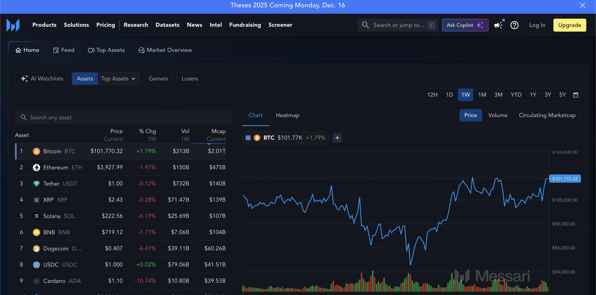

The year 2018 marked a significant period in the evolution of cryptocurrency trading, characterized by the integration of algorithmic trading into the burgeoning crypto markets. This year witnessed a transformation where algorithmic strategies began to redefine how trading was conducted. Algorithmic trading, known for its speed and precision, allowed traders to automate decision-making processes, making crypto trading more accessible and efficient for both novice and seasoned investors.

The crux of this transformation lay in the ability of algorithms to analyze vast amounts of data and execute trades at speeds unattainable by human counterparts. This development catered to the dynamic and highly volatile nature of cryptocurrency markets, offering strategies that could adapt swiftly to changing conditions. As a result, algorithmic trading not only expanded the possibilities within crypto investments but also paved the way for new participants to enter the market with reduced barriers.



Understanding the historical context of how algorithmic strategies impacted cryptocurrency trading in 2018 provides valuable insights into current market trends and potential future developments. This integration of technology and finance has set the stage for ongoing innovation and growth in the cryptocurrency space, emphasizing the importance of staying informed about technological advancements that continue to shape these markets.

## Table of Contents

## The Rise of Cryptocurrency Trading

In the late 2010s, cryptocurrencies emerged as a prominent topic in financial circles and the public's consciousness, with 2018 marking a particularly significant year. During this period, Bitcoin and other digital currencies like Ethereum transcended their initial tech-centric communities to become recognized globally and widely discussed in mainstream media. This expansion was characterized by increased interest from everyday individuals, known as retail investors, and more substantial engagement from institutional investors—organizations that manage large amounts of capital, such as banks and hedge funds.

The rise in cryptocurrency trading during this time was facilitated by a rapid expansion of crypto exchanges, platforms where users could buy, sell, and trade digital currencies. These exchanges played a crucial role in broadening access to crypto markets, providing more people the ability to engage in trading activities. New trading opportunities emerged as these exchanges proliferated, offering sophisticated tools and various financial instruments that mirrored traditional stock and [forex](/wiki/forex-system) trading systems but were adapted to the unique characteristics of digital currencies.

The inherent volatility of cryptocurrencies was a double-edged sword; it presented both risks and opportunities. On one hand, the market's tendency for significant price swings attracted investors looking to capitalize on short-term gains. On the other hand, it required investors to navigate a potentially treacherous landscape with substantial risks of loss. This volatility, driven by factors such as market speculation, technological developments, and regulatory news, offered potential for high returns, thereby drawing in a diverse group of participants, from tech-savvy millennials to seasoned traders.

As cryptocurrencies gained a reputation as viable assets, they transcended their original perception as niche investments. The legitimacy of digital currencies as an asset class was bolstered by growing acceptance from financial institutions and major corporations exploring blockchain technology's capabilities. This acceptance further fueled the market's expansion and the interest of new investors seeking diversification and growth potential in their portfolios.

Consequently, the [momentum](/wiki/momentum) obtained in 2018 not only transformed how cryptocurrencies were perceived but also laid the groundwork for their continued evolution and integration into global financial systems. This period was pivotal, setting the stage for the subsequent developments in [cryptocurrency](/wiki/cryptocurrency) trading and the financial industry's broader acceptance of digital assets.

## Understanding Algorithmic Trading

Algorithmic trading, often abbreviated as algo trading, represents a fundamental shift in how financial trades are conducted. By employing sophisticated computer algorithms, this form of trading allows for executing orders with high speed and rigorous precision, effectively reducing the need for human intervention. The underlying principle involves utilizing mathematical models and complex algorithms to analyze a vast array of market data, including price trends, trading volumes, and other relevant indicators, to make informed trading decisions.

The efficacy of [algorithmic trading](/wiki/algorithmic-trading) lies in its ability to identify and capitalize on market inefficiencies. Unlike traditional trading approaches, which rely heavily on human judgment, algo trading can process information far quicker than any individual trader, allowing it to exploit fleeting opportunities that might otherwise be missed. This capacity for rapid analysis and decision-making makes algorithmic trading particularly advantageous in markets characterized by high [volatility](/wiki/volatility-trading-strategies), such as cryptocurrencies.

Algorithmic trading has been a staple in stock markets for years, where it accounts for a significant [volume](/wiki/volume-trading-strategy) of trades. The transition to cryptocurrency markets was a natural progression, driven by the digital nature of cryptocurrencies and the similar trading infrastructures shared with stock markets. With the rise of cryptocurrencies in the late 2010s, algorithmic trading found a fertile ground to thrive. In 2018, this integration became more pronounced as both individual and institutional traders began adopting algorithmic strategies to contend with the pronounced volatility and unpredictability of crypto markets.

Python, due to its versatility and extensive libraries for financial analysis, is often the language of choice for developing trading algorithms. For instance, using libraries like NumPy and Pandas, traders can perform complex data analysis and manage large datasets efficiently. The following is a simplified example of how one might use Python to compute a moving average, a common component in algorithmic trading strategies:

```python
import pandas as pd

# Example price data
data = {'Date': ['2023-01-01', '2023-01-02', '2023-01-03'],
        'Close': [150, 155, 149]}
df = pd.DataFrame(data)

# Calculate moving average
df['Moving Average'] = df['Close'].rolling(window=2).mean()
print(df)
```

In this example, the `rolling` function computes the moving average over a specified window, a crucial operation that allows traders to identify trends and inform their trading algorithms. As the technology underpinning market analysis continues to advance, and as the cryptocurrency market evolves, the prevalence and sophistication of algorithmic trading are likely to expand. This growth is facilitated by continuous improvements in computational power and the increasing sophistication of algorithms, presenting a dynamic landscape for future developments in both technology and financial markets.

## Integration of Algo Trading in Crypto Markets in 2018

In 2018, algorithmic trading became increasingly prominent in the cryptocurrency sector due to its ability to address the inherent volatility of digital assets. This year marked a pivotal shift as traders started to incorporate advanced algorithms to enhance trading efficiency and manage risks associated with sharp price fluctuations. The adoption of algorithmic strategies allowed traders to execute trades with speed and accuracy beyond human capabilities, capitalizing on market opportunities that occur in fractions of a second.

One of the key factors that facilitated the integration of algorithmic trading in crypto markets was the availability of open Application Programming Interfaces (APIs) provided by various cryptocurrency exchanges. These APIs enabled developers to design and deploy robust trading systems that could interact directly with the exchanges, obtaining real-time data and executing trades automatically. The accessibility of these APIs reduced the barrier to entry for many traders, as they could efficiently develop and implement their algorithms without the need for intermediaries.

Additionally, the volatile nature of cryptocurrency markets in 2018 offered fertile ground for simple algorithmic strategies to thrive. Markets often displayed inefficiencies, such as price discrepancies between exchanges and sudden momentum shifts, that algorithms could exploit effectively. For instance, a basic [arbitrage](/wiki/arbitrage) algorithm could monitor prices across multiple exchanges and execute trades to profit from temporary price differences. Despite their simplicity, these algorithms proved quite profitable, leveraging small but consistent opportunities in a highly volatile market environment.

This democratization of trading was significant, as it allowed individuals with a strong understanding of coding and quantitative analysis to participate in markets previously dominated by institutional players. By utilizing algorithms, these technically savvy traders could compete with larger entities, enabling a more diverse landscape of market participants. This shift not only increased the [liquidity](/wiki/liquidity-risk-premium) and robustness of crypto markets but also fostered innovation in the development of new algorithmic strategies tailor-fitted for the unique challenges presented by digital currencies.

## Popular Algorithmic Strategies in Crypto Trading

Common algorithmic trading strategies in the cryptocurrency market include arbitrage, [market making](/wiki/market-making), and momentum trading, each presenting specific advantages and challenges.

**Arbitrage**

Arbitrage in cryptocurrency trading involves the simultaneous purchase and sale of an asset across different markets to profit from small price discrepancies. Given the decentralized and globally fragmented nature of cryptocurrency exchanges, prices of the same digital asset can vary significantly from one platform to another. This price variation creates opportunities for arbitrageurs to execute profitable trades. A commonly used form of arbitrage is triangular arbitrage, which involves three trades to exchange an initial currency for a second, then a third, and finally back to the initial currency, tapping into the relative differences in pricing across these exchanges. Implementing effective arbitrage requires high-speed execution and low latency access to various exchanges, making algorithmic tools and strategies ideal for capturing these fleeting opportunities.

**Market Making**

Market making in cryptocurrency revolves around providing liquidity by continuously placing buy and sell orders in exchange markets, thus facilitating smoother trading operations. Market makers profit primarily from the bid-ask spread, which is the difference between the buying price and the selling price of an asset. This strategy requires a balance between the volume of quoted trades (number of buy/sell orders placed) and the spread size to maintain profitability while managing risk exposure due to sudden market shifts. Algorithmic trading platforms are adept at managing these factors in real-time, automatically adjusting quotes in response to market trends and volume fluctuations, enhancing the efficiency and effectiveness of market-making operations.

**Momentum Trading**

Momentum trading leverages the inherent speed of algorithmic execution to capitalize on the continuation of existing market trends. This strategy is based on the assumption that assets which have shown a directional trend will likely continue in that trajectory in the short term. Algorithms evaluate historical pricing data and trading volume to identify strong momentum signals, entering trades that follow the trend direction and exiting upon signs of trend reversal. Algorithms can quickly adapt to new information, adjusting positions faster than manual trading methods and allowing traders to maximize gains from sustained market movements.

Each strategy brings its own set of challenges. For instance, arbitrage opportunities may be fleeting and require advanced technological infrastructure to capitalize efficiently. Market making exposes traders to inventory risk, where holding assets during volatile moves can lead to losses. Momentum trading depends heavily on accurately predicting trend durations, which can be difficult in highly volatile markets. Despite these challenges, algorithmic trading strategies in cryptocurrency have proven lucrative for those capable of mastering their complexities and managing the inherent risks.

## Challenges Faced in Algorithmic Crypto Trading

Algorithmic trading in cryptocurrencies, while profitable, faced a unique set of challenges, primarily due to the inherent volatility and technological infrastructure of the crypto markets.

Foremost among these challenges was the high volatility of cryptocurrencies, which often led to significant price swings. This extreme volatility necessitated robust risk management strategies to protect against substantial losses. Unlike traditional markets, where price movements tend to be more predictable, crypto markets could experience rapid shifts. Traders needed to employ advanced risk assessment tools and techniques, such as [value at risk](/wiki/var-value-at-risk) (VaR) and stress testing, to anticipate and mitigate potential losses. Additionally, employing stop-loss orders and dynamic hedging strategies were essential to manage sudden price changes effectively.

Alongside market volatility, technical issues presented another significant obstacle. Exchange downtime, particularly on less established platforms, could disrupt algorithm performance, leading to missed trading opportunities or unexpected losses. The decentralized and often unregulated nature of crypto exchanges meant that outages and other technical glitches were not uncommon. To combat this, traders diversified their trading activities across multiple exchanges, ensuring that no single point of failure could jeopardize their operations.

The rapid evolution of market dynamics was another hurdle that traders had to navigate. Constant changes in market conditions required algorithms to be frequently updated and optimized to maintain their competitive edge. This required a deep understanding of both [machine learning](/wiki/machine-learning) techniques and financial markets. Traders who could quickly adapt their algorithms to new market patterns were more likely to succeed.

Despite these challenges, those capable of managing the risks and adapting to the dynamic environment often thrived in the volatile world of cryptocurrency trading. The potential rewards were substantial for those who could effectively leverage technological tools and deploy sophisticated trading strategies. The ability to anticipate market movements through data-driven insights and rapid execution provided a significant advantage in the fast-paced crypto markets.

## The Future of Algo Trading in Cryptocurrencies

Advancements in [artificial intelligence](/wiki/ai-artificial-intelligence) (AI) and machine learning are poised to significantly transform algorithmic trading in cryptocurrencies. These technologies empower traders to develop sophisticated models that can analyze vast datasets, identifying intricate market patterns and potential opportunities quickly and accurately. AI algorithms have the capability to learn and adapt from historical trading data, continuously refining their strategies to account for evolving market conditions.

One significant area where AI and machine learning can impact future crypto trading strategies is complex data analytics. Machine learning models such as neural networks and ensemble methods could be employed to predict price movements by analyzing historical prices, trading volumes, and sentiment analysis derived from social media and news sources. An example of a simple machine learning approach in Python might involve using a decision tree classifier to predict whether the price of a cryptocurrency will go up or down:

```python
from sklearn.tree import DecisionTreeClassifier
from sklearn.model_selection import train_test_split

# Example feature set and labels, 'X' contains market data and 'y' the price direction
X, y = get_crypto_data()  

X_train, X_test, y_train, y_test = train_test_split(X, y, test_size=0.2, random_state=42)

clf = DecisionTreeClassifier()
clf.fit(X_train, y_train)
accuracy = clf.score(X_test, y_test)

print(f"Model Accuracy: {accuracy * 100:.2f}%")
```

As regulatory frameworks for cryptocurrencies mature globally, they may encourage greater participation from institutional investors. Increased regulatory clarity could enhance market stability and investor confidence, allowing these investors to use algorithmic trading strategies more comfortably. This influx of institutional capital could lead to deeper market liquidity, reduced volatility, and more efficient price discovery processes.

Moreover, the continuous evolution of blockchain technology itself presents new trading opportunities. Decentralized finance (DeFi) platforms, smart contracts, and tokenized assets are just a few examples of innovations that could be integrated into algorithmic trading strategies. These novel asset types and marketplaces can provide unique arbitrage opportunities and the potential for diversified trading strategies.

To successfully navigate the rapidly advancing landscape of cryptocurrency algo trading, traders must remain informed of technological developments and regulatory changes. Being adaptable in strategy formulation and execution will be essential to capitalize on the forthcoming opportunities and mitigate risks. The intersection of these cutting-edge technologies and financial trading provides an exciting frontier, promising efficiency gains and innovative trading methodologies for those equipped to handle them.

## Conclusion

The convergence of cryptocurrencies and algorithmic trading in 2018 marked a pivotal shift in how digital assets are traded. The precision and speed inherent to algorithmic trading systems introduced a level of efficiency in crypto markets that was previously unattainable. This technological evolution enabled traders to seize opportunities presented by the volatile nature of cryptocurrencies.

At the heart of this transformation was the ability of algorithms to perform complex computations and execute trades faster than humanly possible. This capability allowed traders to capitalize on fleeting market conditions, thus unlocking a myriad of new opportunities. The significance of this advancement cannot be overstated, as it laid the groundwork for the dynamic and fast-paced trading environment we observe today.

Understanding the historical context of 2018 is crucial for participants in contemporary markets. The lessons learned from this period offer valuable insights into navigating current market dynamics. The rapid adoption of algorithmic trading strategies during that time highlighted the importance of adaptability and informed decision-making. These principles remain essential for traders aiming to thrive in an ever-evolving market landscape.

Looking forward, the continued advancement of technology promises further innovation in algorithmic trading. As artificial intelligence and machine learning technologies develop, they are likely to enhance the sophistication of trading algorithms. This progress will likely attract more institutional investors to the crypto sphere, further formalizing and legitimizing the market. Additionally, the ongoing development of blockchain technology may introduce new mechanisms for trade execution and settlement.

Embracing the insights and innovations from 2018 can equip traders with the tools needed to adapt to future challenges and opportunities. By maintaining a forward-thinking mindset and leveraging the capabilities of advanced technologies, traders can position themselves to capitalize on the burgeoning potential within cryptocurrency markets.

## References & Further Reading

[1]: Narang, R. K. (2009). ["Inside the Black Box: The Simple Truth About Quantitative Trading"](https://onlinelibrary.wiley.com/doi/book/10.1002/9781118267738). John Wiley & Sons.

[2]: Lewis, M. (2014). ["Flash Boys: A Wall Street Revolt"](https://en.wikipedia.org/wiki/Flash_Boys). W. W. Norton & Company.

[3]: "Algorithmic Trading and DMA: An Introduction to Direct Access Trading Strategies" by Barry Johnson, 2010, 4Myeloma Press, London.

[4]: Gryko, C., & Luo, N. (2020). ["Cryptocurrency Trading & Investing: Beginners' Guide To Bitcoin & Altcoins"](https://academy.binance.com/en/articles/a-complete-guide-to-cryptocurrency-trading-for-beginners). Independently Published.

[5]: Burniske, C., & Tatar, J. (2017). ["Cryptoassets: The Innovative Investor's Guide to Bitcoin and Beyond"](https://www.amazon.com/Cryptoassets-Innovative-Investors-Bitcoin-Beyond/dp/1260026671). McGraw-Hill Education.

[6]: Deeleman, R. (2019). ["Breaking Through: Implementing Disruptive Customer Centricity"](https://link.springer.com/book/10.1057/9781137395511). 

[7]: "Python for Finance: Analyze Big Financial Data" by Yves Hilpisch, published by O'Reilly Media.