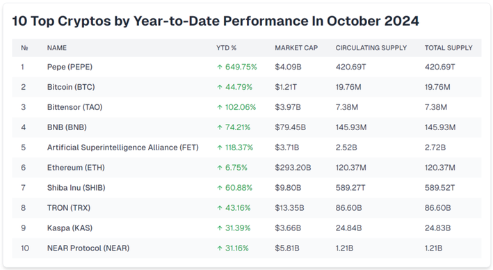

## Table of Contents

## What are the basic concepts of cryptocurrency that beginners should know before starting a trading course?

Cryptocurrency is a type of digital money that uses encryption techniques to secure transactions and control the creation of new units. It operates on a technology called blockchain, which is a public ledger that records all transactions across a network of computers. Unlike traditional money, cryptocurrencies are decentralized, meaning they are not controlled by any government or financial institution. Bitcoin is the most well-known cryptocurrency, but there are thousands of others, often referred to as altcoins.

Before starting a trading course, beginners should understand that the value of cryptocurrencies can be highly volatile. This means their prices can go up and down a lot in a short amount of time. It's important to do research and understand the risks involved. Trading involves buying and selling cryptocurrencies with the aim of making a profit. It requires knowledge of market trends, technical analysis, and sometimes a bit of luck. A good trading course will teach these skills and help you make informed decisions.

## How can beginners identify reputable cryptocurrency trading courses in October 2024?

In October 2024, beginners can identify reputable cryptocurrency trading courses by looking at reviews and ratings from other students. Websites like Udemy, Coursera, and even specialized platforms like CryptoUniversity often have user reviews that can give you an idea of the course quality. It's a good idea to read both positive and negative reviews to get a balanced view. Also, check if the course is taught by someone with real experience in cryptocurrency trading. Instructors who have a track record of successful trading or who are well-known in the crypto community are usually more trustworthy.

Another way to find a good [course](/wiki/best-algorithmic-trading-courses) is to see if it offers a clear syllabus and learning outcomes. A reputable course will explain what you will learn and how it will help you trade cryptocurrencies. Look for courses that cover the basics of blockchain technology, how to analyze market trends, and practical trading strategies. It's also important to check if the course is up-to-date. Cryptocurrency is a fast-changing field, so a course from 2024 should include the latest information and trends. Finally, consider if the course offers any kind of support or community, like a forum or group chat, where you can ask questions and learn from others.

## What are the key features to look for in a beginner-level cryptocurrency trading course?

When looking for a beginner-level [cryptocurrency](/wiki/cryptocurrency) trading course, it's important to find one that explains things in a simple way. The course should start with the basics, like what cryptocurrency is and how it works. It should teach you about blockchain technology and the different types of cryptocurrencies out there. A good course will also cover how to set up a wallet and how to make your first trade. It's helpful if the course uses easy examples and avoids using too many complicated words.

Another key feature to look for is practical lessons. The course should give you real examples of trading and let you practice with fake money before you start using real money. It should also teach you about the risks of trading and how to keep your investments safe. Look for courses that offer support, like a place to ask questions or a group to learn with. This can make learning easier and more fun. Remember, a good beginner course will take its time to make sure you understand everything before moving on to more advanced topics.

## Which intermediate courses offer the best insights into technical analysis for cryptocurrency trading?

For intermediate learners looking to dive deeper into technical analysis for cryptocurrency trading, "Technical Analysis Masterclass" on Udemy is a great choice. This course goes beyond the basics and teaches you how to use charts and patterns to predict price movements. It covers important tools like moving averages, RSI, and MACD, which are essential for understanding market trends. The instructor uses real-life examples to show how these tools work in practice, making it easier to apply what you learn to your own trading.

Another excellent course is "Crypto Trading: Advanced Technical Analysis" offered by CryptoUniversity. This course focuses on advanced charting techniques and how to use them to make better trading decisions. It includes lessons on Fibonacci retracement, Bollinger Bands, and candlestick patterns, which are crucial for spotting potential entry and [exit](/wiki/exit-strategy) points. The course also provides interactive quizzes and case studies, helping you to test your knowledge and see how these techniques can be applied in different market scenarios. Both courses are well-regarded and can give you the insights you need to improve your technical analysis skills in cryptocurrency trading.

## What advanced trading strategies are covered in top cryptocurrency trading courses for experienced traders?

For experienced traders, top cryptocurrency trading courses often cover advanced strategies like [arbitrage](/wiki/arbitrage) trading. This is when you buy a cryptocurrency on one exchange where it's cheaper and sell it on another where it's more expensive. These courses teach you how to spot these opportunities quickly and how to manage the risks involved. They also cover how to use automated trading bots to do arbitrage trading for you, which can save time and help you make more money.

Another strategy you'll learn about is [trend following](/wiki/trend-following). This involves using technical analysis to spot long-term trends in the market and making trades based on those trends. Courses will show you how to use tools like moving averages and trend lines to make better decisions. They also teach you about risk management, like setting stop-loss orders to protect your investments. These advanced courses are designed to help experienced traders take their skills to the next level and make more informed trading decisions.

## How do the top cryptocurrency trading courses in October 2024 incorporate real-time market simulation?

In October 2024, the top cryptocurrency trading courses use real-time market simulation to give students a hands-on learning experience. These courses have special software that lets you practice trading with fake money in a market that acts just like the real one. This means you can see how prices change and make trades based on what's happening right now. It's like playing a game, but it teaches you important skills you'll need when you start trading with real money.

These simulations are really helpful because they let you try out different strategies without losing any real money. You can make mistakes and learn from them in a safe environment. The courses often have instructors who watch what you're doing and give you tips on how to do better. This way, you get to practice and get feedback at the same time, which makes you a better trader when you're ready to go into the real market.

## What are the success rates of graduates from the leading cryptocurrency trading courses?

The success rates of graduates from leading cryptocurrency trading courses can vary a lot. Some courses say that up to 70% of their graduates make money from trading after finishing the course. But it's important to remember that these numbers can be hard to check and might not be the same for everyone. Success in trading depends on many things, like how much you practice, how well you understand the market, and even a bit of luck.

Even though the courses teach you a lot, making money from trading is not easy. It takes time and effort to get good at it. Some people might do really well and make a lot of money, while others might not see the same results. It's good to look at reviews and see what other students say about their experiences. This can give you a better idea of what to expect after you finish the course.

## Which courses provide the most comprehensive coverage of blockchain technology and its impact on trading?

"Blockchain and Cryptocurrency: Understanding the Technology and Its Impact" on Coursera is a great course for learning about blockchain technology and how it affects trading. This course starts with the basics of blockchain and explains how it works in simple terms. It covers different types of cryptocurrencies and how they use blockchain. The course also talks about how blockchain can make trading safer and more transparent. It uses real examples to show how blockchain technology is changing the way people trade and invest.

Another excellent course is "Blockchain Technology and Its Applications in Trading" offered by CryptoUniversity. This course goes into detail about how blockchain can be used in trading. It explains smart contracts, which are like digital agreements that automatically happen when certain conditions are met. The course also covers decentralized exchanges, which are trading platforms that don't need a middleman. It shows how these new technologies can make trading faster and cheaper. Both courses are well-regarded and give you a good understanding of how blockchain technology is changing the world of trading.

## How do the top courses address risk management and portfolio diversification in cryptocurrency trading?

The top cryptocurrency trading courses put a big focus on risk management. They teach you how to protect your money by setting stop-loss orders, which automatically sell your cryptocurrency if the price drops too much. They also talk about how much money you should put into trading, so you don't lose everything if things go wrong. These courses explain how to use different tools to understand the market better and make smarter decisions. They stress the importance of not putting all your money into one cryptocurrency, which can help you avoid big losses if that one goes down in value.

Portfolio diversification is another key topic in these courses. They show you how to spread your money across different cryptocurrencies to reduce risk. This means you might invest in Bitcoin, Ethereum, and some smaller cryptocurrencies at the same time. The courses explain how to balance your portfolio so that if one cryptocurrency doesn't do well, the others might still make money. They also teach you how to keep track of your investments and make changes as the market changes. This way, you can keep your portfolio healthy and increase your chances of making money over time.

## What are the costs associated with the top cryptocurrency trading courses, and are there any scholarships or financial aid options available?

The costs of the top cryptocurrency trading courses can vary a lot. Some courses on platforms like Udemy might cost around $100 to $200, while more advanced courses on specialized platforms like CryptoUniversity could be more expensive, sometimes reaching $500 or more. The price depends on what the course covers and how long it takes to finish. It's a good idea to look at what each course offers and see if it fits your budget and learning needs.

There are scholarships and financial aid options available for some of these courses. Websites like Coursera and Udemy sometimes offer financial aid or discounts if you can't afford the full price. You might need to fill out a form explaining why you need help, and if you qualify, they might give you a big discount or even let you take the course for free. It's worth checking the course website to see if they have any programs like this that can help you learn without spending too much money.

## How do the leading courses adapt their curriculum to the latest trends and regulatory changes in the cryptocurrency market?

The leading cryptocurrency trading courses keep their curriculum up-to-date by watching the market closely. They pay attention to new trends, like new cryptocurrencies that become popular or changes in how people trade. If something new happens, like a new type of trading strategy, they add it to the course. This way, students learn about the latest things in the crypto world. The courses also update their lessons to include new tools and technologies that traders use, so students can practice with the same tools that professionals use.

These courses also make sure to include information about new rules and laws that affect cryptocurrency trading. Governments around the world are always making new rules, and these can change how people trade. The courses explain these rules in simple terms so students understand how they might affect their trading. They might add new sections to the course or update old ones to cover these changes. This helps students stay safe and follow the law while they trade.

## What kind of ongoing support and community resources do the top cryptocurrency trading courses offer to their students?

The top cryptocurrency trading courses offer great ongoing support to help students learn and grow. They usually have a place online where students can ask questions and get help from instructors. This can be a forum or a chat group where you can talk to other students and share tips. Some courses even have live Q&A sessions where you can ask the instructor anything about trading. This support is really important because it helps you keep learning even after you finish the course.

These courses also give you access to community resources that can make a big difference in your trading journey. They might have groups on social media where you can join other traders and discuss what's happening in the market. Some courses offer special webinars or workshops that focus on new trends or strategies. This way, you can keep up with the latest in cryptocurrency trading and improve your skills over time. Being part of a community means you're never learning alone, which can make trading a lot more fun and successful.

## References & Further Reading

[1]: ["Advances in Financial Machine Learning"](https://books.google.com/books/about/Advances_in_Financial_Machine_Learning.html?id=oU9KDwAAQBAJ) by Marcos Lopez de Prado

[2]: Bergstra, J., Bardenet, R., Bengio, Y., & Kégl, B. (2011). ["Algorithms for Hyper-Parameter Optimization."](https://dl.acm.org/doi/10.5555/2986459.2986743) Advances in Neural Information Processing Systems 24.

[3]: ["Machine Learning for Algorithmic Trading"](https://github.com/PacktPublishing/Machine-Learning-for-Algorithmic-Trading-Second-Edition) by Stefan Jansen

[4]: ["Evidence-Based Technical Analysis: Applying the Scientific Method and Statistical Inference to Trading Signals"](https://www.amazon.com/Evidence-Based-Technical-Analysis-Scientific-Statistical/dp/0470008741) by David Aronson

[5]: ["Quantitative Trading: How to Build Your Own Algorithmic Trading Business"](https://books.google.com/books/about/Quantitative_Trading.html?id=j70yEAAAQBAJ) by Ernest P. Chan