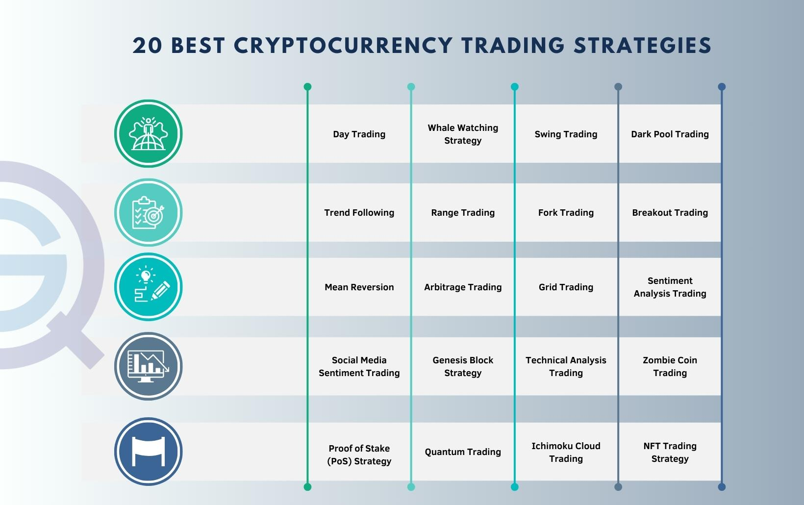

Cryptocurrency trading has undergone significant transformations, leading to the increasing adoption of algorithmic trading by both individual and institutional investors in 2024. The digital assets market, known for its volatility and rapid pace, presents a unique set of challenges that require a strategic approach to trading. Algorithmic trading, with its ability to process large datasets and execute trades at high speeds, offers a competitive edge in this fast-evolving landscape.

The pursuit of algorithmic strategies is becoming indispensable due to their potential to improve trading outcomes. By utilizing algorithms, traders can automate processes, reduce human error, and make decisions based on quantitative data rather than emotions. This strategic method enhances efficiency and enables market participants to capitalize on complex trading strategies, which are often too intricate to execute manually.



As the market evolves, acquiring up-to-date knowledge and skills is crucial. Online courses have emerged as essential tools for traders eager to gain proficiency in cryptocurrency and algorithmic trading. These courses offer a flexible and accessible way to learn, accommodating the schedules of both novices and experienced traders. They provide insights from industry experts and cover the latest trends and techniques, ensuring learners are well-equipped to navigate the dynamic trading environment.

Selecting the right course is imperative for mastering cryptocurrency and algorithmic trading. With the plethora of options available, prospective learners should consider the depth of content, the expertise of instructors, and the support offered to students. Aligning course offerings with individual trading objectives enhances the learning experience and increases the likelihood of achieving desired trading outcomes.

This guide aims to equip readers with the necessary knowledge to excel in cryptocurrency and algorithmic trading. By exploring vital aspects such as the industry's significance, available strategies, and top educational resources, the guide provides a comprehensive roadmap for those committed to advancing their trading capabilities in 2024 and beyond.

## Table of Contents

## The Growing Importance of Cryptocurrency Trading

The cryptocurrency market has continued its rapid expansion into 2024, solidifying its position as a significant player in global finance. This growth stems from a combination of technological advancements, increasing adoption of blockchain solutions, and heightened interest from various investor groups, both individual and institutional.

One of the primary drivers of heightened interest in [cryptocurrency](/wiki/cryptocurrency) trading is its potential for substantial returns, coupled with the decentralized nature of blockchain technology which offers transparency and security. As traditional markets become increasingly saturated, cryptocurrencies present new opportunities for profit that attract a diverse range of investors. Institutional investors, in particular, have entered the market in greater numbers, spurred by the development of more robust regulatory frameworks and the introduction of financial instruments like Bitcoin ETFs (Exchange-Traded Funds) that offer a more familiar and secure means of accessing crypto assets.

Key trends in 2024 influencing cryptocurrency trading strategies include the growing popularity of Decentralized Finance (DeFi) platforms, increased use of stablecoins, and advancements in blockchain scalability and interoperability. These developments have not only fueled the market's growth but also led to more sophisticated trading strategies. For instance, the adoption of [algorithmic trading](/wiki/algorithmic-trading) in cryptocurrencies is soaring due to its ability to handle complex datasets and execute trades at lightning speeds, minimizing the impact of human emotional biases.

However, the volatile nature of the cryptocurrency market poses significant challenges for traders. Price fluctuations can be dramatic, influenced by regulatory news, technological breakthroughs, or macroeconomic changes. This unpredictability necessitates a specialized knowledge of not only market trends and technologies but also complexities such as security risks and the operational differences among various exchanges. Traders must stay informed and possess a nuanced understanding of both the bespoke characteristics of cryptocurrencies and the broader financial landscape to navigate these challenges successfully.

In conclusion, the cryptocurrency market's growth trajectory is reshaping the financial sector, underlining the importance of continued education and specialization for those engaging in crypto trading. This dynamic and rapidly evolving market demands sophisticated strategies and tools, offering abundant opportunities for those equipped with the right knowledge and skills.

## What is Algorithmic Trading?

Algorithmic trading refers to the use of computer algorithms to execute trades in financial markets, including cryptocurrencies. These algorithms, often complex mathematical models, facilitate trade execution at speeds and frequencies impossible for a human trader. In the cryptocurrency market, algorithmic trading applies to the buying and selling of digital currencies on exchanges using pre-programmed instructions.

The basic principle of algorithmic trading involves automating the trade execution process based on a predefined set of parameters, such as timing, price, or quantity. This automation allows traders to execute orders rapidly and consistently, reducing the need for constant manual input. A simple example can be a moving average crossover strategy, where an algorithm triggers a buy order when a short-term moving average crosses above a long-term moving average. The automation aspect is particularly beneficial in cryptocurrency markets, known for high [volatility](/wiki/volatility-trading-strategies) and continuous operation, as it helps capitalize on fleeting opportunities that require quick action.

Algorithmic trading enhances efficiency by executing trades at optimal speeds and ensuring orders are placed with precision. By removing human intervention, algorithms mitigate emotional biases often associated with trading decisions, such as fear and greed, leading to more rational and objective trading actions. Additionally, these algorithms implement complex trading strategies like [arbitrage](/wiki/arbitrage), [trend following](/wiki/trend-following), or [statistical arbitrage](/wiki/statistical-arbitrage), which involve analyzing patterns and making decisions based on large volumes of data.

Popular algorithmic trading tools and platforms available in 2024 offer diverse functionalities tailored for traders. Platforms such as MetaTrader, TradingView's Pine Script, QuantConnect, and Kryll.io provide robust environments for developing, [backtesting](/wiki/backtesting), and deploying strategies. These tools support various programming languages, with Python being a favorite due to its simplicity and extensive libraries such as NumPy and pandas for financial data analysis, and TA-Lib for technical analysis.

By integrating algorithmic trading into their strategies, cryptocurrency traders can optimize their performance, leveraging technology to maintain competitive advantage in an increasingly dynamic market environment.

## Benefits of Online Courses in Cryptocurrency and Algo Trading

Online courses have emerged as a preferred method for learning about cryptocurrency and algorithmic trading, offering several notable benefits. Key among these is the flexibility and accessibility of online education, which makes it suitable for both beginners and seasoned traders. Unlike traditional classroom settings that may require fixed schedules and physical presence, online courses allow learners to access materials and lectures at their convenience. This flexibility is particularly advantageous for individuals who are balancing other commitments such as full-time jobs or family responsibilities. Additionally, the accessibility extends globally, meaning learners from different geographical locations can participate in courses offered by leading institutions and experts from around the world.

Another significant advantage of online courses in cryptocurrency and algorithmic trading is their ability to offer up-to-date content that aligns with the ever-evolving dynamics of the crypto market. The digital nature of online platforms allows for swift updates and integration of new information, ensuring that learners receive the most current insights and strategies relevant to the market. This is crucial in the fast-paced world of cryptocurrencies, where market conditions and technologies can change rapidly. Courses can be continuously refined to include the latest trends, tools, and regulatory changes, providing learners with cutting-edge knowledge that can directly impact their trading success.

Moreover, online courses provide a unique opportunity to learn from industry experts and gain insights that might not be readily available in traditional learning settings. These experts often bring a wealth of practical experience and insider knowledge, offering learners a chance to understand real-world applications of theoretical concepts. Through webinars, interactive sessions, and live demonstrations, participants can engage with practitioners who are actively involved in the cryptocurrency and algorithmic trading sectors. This type of learning environment not only enriches the educational experience but also bridges the gap between theory and practice, allowing learners to apply what they have learned to real trading scenarios effectively.

In summary, the flexibility, accessibility, up-to-date content, and expert insights provided by online courses make them an invaluable resource for anyone looking to enhance their skills and knowledge in cryptocurrency and algorithmic trading. Whether a newcomer to the field or an experienced trader seeking to refine strategies, online education offers tailored solutions to meet diverse learning needs.

## Top Online Courses for Cryptocurrency and Algo Trading in 2024

As the demand for knowledge in cryptocurrency and algorithmic trading surges, numerous online platforms have developed a variety of courses tailored to different skill levels and learning objectives. Below is a curated selection of some of the most reputable courses available in 2024, each providing a unique approach to mastering cryptocurrency and algorithmic trading.

1. **Algorithmic Cryptocurrency Trading with Python**
   - **Provider**: Coursera (offered by University of Michigan)
   - **Content**: This course focuses on using Python to develop algorithmic trading strategies tailored for cryptocurrency markets. It covers topics like data analysis, strategy formulation, and automated backtesting using Python libraries such as Pandas and NumPy.
   - **Designed For**: Intermediate traders with a basic understanding of Python looking to automate their trading strategies.
   - **Learning Outcomes**: By the end of the course, students will be able to create, implement, and backtest their own trading algorithms on historical data.
   - **Pricing**: Approximately $79 per month (Coursera subscription model)
   - **Duration**: 6 weeks (estimated 4-6 hours per week)
   - **Certification**: Verified certificate upon completion
   - **Reviews**: The course has been praised by students for its practical approach to coding and strategy development, with many reviews highlighting the depth of content provided in data handling and analysis.

2. **Introduction to Cryptocurrency and Blockchain Technology**
   - **Provider**: edX (offered by Berkeley Haas School of Business)
   - **Content**: This introductory course explores the fundamentals of cryptocurrency and blockchain technology. It covers the history, mechanics, and future potential of cryptocurrencies, including Bitcoin and Ethereum.
   - **Designed For**: Beginners with no prior knowledge of cryptocurrencies who wish to understand the basic concepts and technology behind them.
   - **Learning Outcomes**: Participants will gain a comprehensive understanding of blockchain technology and its financial applications.
   - **Pricing**: Free to audit; $99 for a verified certificate
   - **Duration**: 5 weeks (3-5 hours per week)
   - **Certification**: Verified certificate available
   - **Reviews**: Students appreciate the course’s detailed explanation of blockchain concepts and the credibility of content delivered by a reputable institution.

3. **Algorithmic Trading Strategies for Cryptocurrencies**
   - **Provider**: Udemy
   - **Content**: This course offers a hands-on approach to developing algorithmic trading strategies specifically for cryptocurrency markets. It includes strategy development, risk management, and performance metrics.
   - **Designed For**: Traders of all levels interested in refining their algorithmic trading skills with a focus on cryptocurrencies.
   - **Learning Outcomes**: Learners will be able to create and optimize trading strategies and understand the metrics to evaluate their performance.
   - **Pricing**: $49.99 (often discounted)
   - **Duration**: 12 hours of on-demand video content
   - **Certification**: Certificate of completion provided
   - **Reviews**: Users commend the practical examples and easy-to-follow instructions, which greatly help in the understanding of complex trading strategies.

4. **Cryptocurrency and Bitcoin Trading**
   - **Provider**: LinkedIn Learning
   - **Content**: This course covers the technical and analytical skills necessary for trading cryptocurrencies, with a focus on Bitcoin. It discusses market analysis, chart reading, and trading platforms.
   - **Designed For**: Novices wanting an accessible entry point to cryptocurrency trading.
   - **Learning Outcomes**: Students will learn how to navigate crypto exchanges, perform market analysis, and execute trades efficiently.
   - **Pricing**: Included with LinkedIn Learning subscription ($29.99/month)
   - **Duration**: 3 hours of video content
   - **Certification**: Certificate of completion available
   - **Reviews**: Praised for its concise and straightforward approach, making it suitable for learners who prefer a quick overview before diving deeper.

These courses provide essential skills and knowledge for anyone interested in advancing their understanding and proficiency in cryptocurrency and algorithmic trading. Whether you are a beginner or a seasoned trader, these resources offer valuable insights and practical applications to enhance your trading strategies.

## Choosing the Right Course for You

Selecting the right online [course](/wiki/best-algorithmic-trading-courses) for cryptocurrency and algorithmic trading requires careful consideration of individual learning goals and trading experience. The following guide provides essential criteria to help you make an informed decision.

Firstly, evaluate the depth of the course content. A comprehensive course should cover key aspects of cryptocurrency and algorithmic trading, including market fundamentals, programming basics, and algorithmic strategy development. Look for modules that address both theoretical concepts and practical applications, ensuring a balanced curriculum that caters to different learning needs.

Instructor expertise is another critical [factor](/wiki/factor-investing). Courses led by experienced professionals with a proven track record in trading and finance offer valuable insights that go beyond textbook theories. Research the instructors' backgrounds, their contributions to the industry, and any endorsements from reputable platforms. Experienced instructors can provide nuanced perspectives and up-to-date information aligned with the fast-evolving crypto markets.

Consider the learner support provided by the course. Access to resources such as discussion forums, live Q&A sessions, and one-on-one mentorship can significantly enhance the learning experience. Interactive elements allow students to engage actively with the material and clarify doubts, which is crucial for mastering complex topics.

Balancing affordability with the quality and comprehensiveness of the course material is essential. While premium courses often provide extensive resources and personalized support, they can be costly. Evaluate if the course offers a free trial or sample content to assess its value before committing financially. Look for discounts, scholarships, or bundle packages that make high-quality education more accessible.

Before enrolling, clearly define your trading objectives. Whether your goal is to gain a competitive edge in trading, automate trading processes, or simply understand market dynamics, aligning these objectives with the course offerings is crucial. For beginners, courses that introduce programming languages like Python alongside foundational trading concepts are beneficial. Advanced traders might seek courses that delve into specific algorithmic strategies, such as arbitrage or high-frequency trading.

By considering these factors—course content depth, instructor expertise, learner support, affordability, and alignment with personal objectives—you can select an online course that not only meets your educational needs but also empowers you to achieve strategic trading success in the rapidly advancing world of cryptocurrency and algorithmic trading.

## Algorithmic Trading Strategies to Learn in 2024

Algorithmic trading strategies have become pivotal in navigating the complex and often volatile cryptocurrency markets. In 2024, some of the most effective strategies are [market making](/wiki/market-making), arbitrage, and [momentum](/wiki/momentum) trading, each tailored to exploit specific market conditions. Understanding and implementing these strategies can substantially enhance trading efficacy and profitability.

Market making is a strategy where a trader provides [liquidity](/wiki/liquidity-risk-premium) by quoting both buy and sell prices for an asset. This approach is vital for reducing spreads and stabilizing prices. In crypto markets, where liquidity can be fragmented across various exchanges, market making not only aids in achieving tighter spreads but also offers profit from the bid-ask spread differential. Automated tools and algorithms can help traders by continuously adjusting their quotes based on the market conditions and enhancing their execution speed, thereby capitalizing on short-term market inefficiencies.

Arbitrage involves exploiting price differences of a single asset across multiple markets or exchanges. In the decentralized and often opaque landscape of cryptocurrency trading, arbitrage opportunities can arise due to discrepancies in asset prices. Simple arbitrage can be executed using algorithms to identify price variations between exchanges and execute trades that lock in profits. More complex forms, like statistical arbitrage, involve deploying sophisticated models to forecast short-term price movements based on historical data.

Momentum trading in cryptocurrencies capitalizes on strong price trends by buying assets that are rising and selling those that are dropping. This strategy is based on the idea that assets in motion tend to stay in motion. Algorithms can automate momentum trading through continuous analysis and tracking of moving averages and relative strength indices (RSIs) to execute trades quickly when a trend reversal is detected.

Learning and effectively implementing these strategies requires comprehensive education. Online courses offer modules on algorithmic trading tailored for cryptocurrency markets, covering the nuances of each strategy. These courses typically provide hands-on experience through coding exercises and simulation platforms, where traders apply the learned concepts in virtual trading environments.

Moreover, the importance of backtesting cannot be overstated. Backtesting involves simulating a trading strategy using historical data to assess its viability and performance before applying it in real-world scenarios. This practice helps traders refine strategies and improve risk management. Python, with libraries such as Backtrader and PyAlgoTrade, offers robust tools for backtesting. An example snippet for setting up a simple moving average cross strategy in Python might look like this:

```python
import backtrader as bt

class SmaCross(bt.SignalStrategy):
    def __init__(self):
        sma1 = bt.ind.SMA(period=10)
        sma2 = bt.ind.SMA(period=30)
        self.signal_add(bt.SIGNAL_LONG, sma1 > sma2)
        self.signal_add(bt.SIGNAL_SHORT, sma1 < sma2)

cerebro = bt.Cerebro()
cerebro.addstrategy(SmaCross)
data = bt.feeds.YahooFinanceData(dataname='BTC-USD', fromdate=datetime(2023, 1, 1), todate=datetime(2023, 12, 31))
cerebro.adddata(data)
cerebro.run()
cerebro.plot()
```

Continuing education is critical as the field of algorithmic trading is continuously evolving. Traders must stay updated with the latest technological advancements and adapt their strategies accordingly to maintain a competitive edge in the market. Through diligent practice and ongoing education, traders can enhance their skills and adapt to the rapidly changing cryptocurrency landscape.

## Conclusion and Future Outlook

Online courses have emerged as indispensable tools in empowering cryptocurrency traders with algorithmic trading skills. These courses provide accessible, up-to-date knowledge crucial for navigating the complex and fast-evolving landscape of cryptocurrency markets. The structured learning environment of online courses equips traders with the necessary technical expertise and strategic insights, enabling them to utilize sophisticated trading algorithms effectively. This knowledge aids not only in improving trading outcomes but also in managing risks inherent to the volatile nature of cryptocurrency markets.

Looking ahead, cryptocurrency and algorithmic trading are poised for significant transformations in 2024 and beyond. The advent of technologies such as [machine learning](/wiki/machine-learning), [artificial intelligence](/wiki/ai-artificial-intelligence), and blockchain advancements will continue to shape the trading ecosystem. These developments underscore the importance of continuous learning to remain competitive. As trading strategies grow more complex and market conditions shift, acquiring new skills and adapting to technological innovations become crucial.

The future will likely see further integration of decentralized finance (DeFi) elements, expanding opportunities and complexities in cryptocurrency trading. This will necessitate the continuous education of market participants, emphasizing algorithmic trading strategies that can efficiently navigate and capitalize on these changes. Furthermore, the increasing regulatory scrutiny in many regions highlights the need for traders to stay informed about compliance issues and market dynamics.

Traders are encouraged to invest in their education continuously. By doing so, they can improve their financial outcomes and maintain a competitive edge. Engaging with comprehensive online courses allows traders to stay abreast of the latest trends and technologies, fostering a proactive approach to trading. As the cryptocurrency landscape continues to evolve, lifelong learning and adaptability are essential for sustained success. Therefore, it is imperative for traders to seize the educational opportunities available, ensuring they are well-prepared to tackle future challenges and harness new possibilities in the world of cryptocurrency trading.

## References & Further Reading

[1]: ["Advances in Financial Machine Learning"](https://books.google.com/books/about/Advances_in_Financial_Machine_Learning.html?id=oU9KDwAAQBAJ) by Marcos Lopez de Prado

[2]: Bergstra, J., Bardenet, R., Bengio, Y., & Kégl, B. (2011). ["Algorithms for Hyper-Parameter Optimization."](https://dl.acm.org/doi/10.5555/2986459.2986743) Advances in Neural Information Processing Systems 24.

[3]: ["Machine Learning for Algorithmic Trading"](https://github.com/PacktPublishing/Machine-Learning-for-Algorithmic-Trading-Second-Edition) by Stefan Jansen

[4]: ["Evidence-Based Technical Analysis: Applying the Scientific Method and Statistical Inference to Trading Signals"](https://www.amazon.com/Evidence-Based-Technical-Analysis-Scientific-Statistical/dp/0470008741) by David Aronson

[5]: ["Quantitative Trading: How to Build Your Own Algorithmic Trading Business"](https://books.google.com/books/about/Quantitative_Trading.html?id=j70yEAAAQBAJ) by Ernest P. Chan