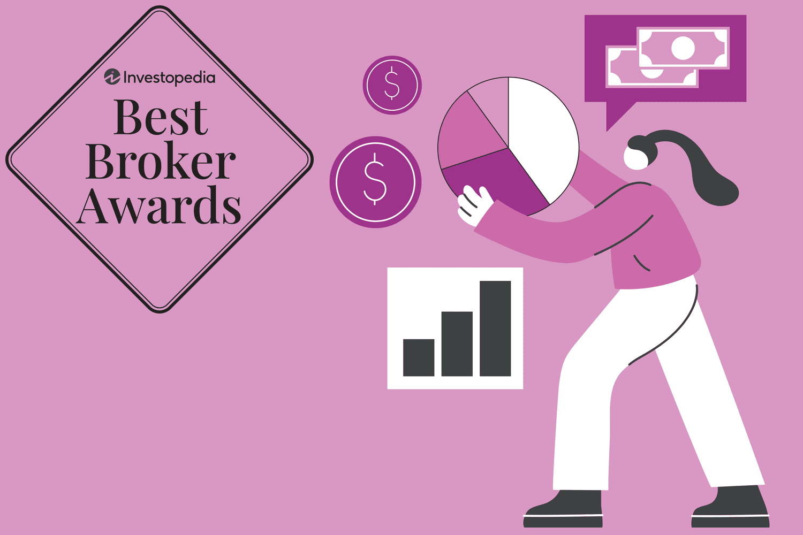

Trading platforms in 2024 represent a sophisticated convergence of technology, finance, and user-centric design, offering unparalleled opportunities and challenges for traders. The landscape is rapidly evolving, shaped by cutting-edge advancements that enhance trading efficiency and strategic execution for both day traders and algorithmic enthusiasts.

Day trading and algorithmic trading require platforms that offer speed, reliability, and comprehensive functionality. The right platform can significantly influence a trader’s success. For day traders, the ability to execute trades swiftly, capitalize on fleeting market movements, and manage risk is crucial. Meanwhile, algorithmic traders need robust systems capable of processing complex algorithms, backtesting strategies, and providing real-time data analytics.

In recent years, we have observed substantial strides in trading technologies. The integration of artificial intelligence (AI) and machine learning has revolutionized market analysis and predictive modeling, fostering more informed decision-making processes. Furthermore, enhancements in execution speed and data processing have reduced latency, a critical factor in high-frequency trading. Blockchain technology is also beginning to make waves, enabling greater transparency and decentralization in trading processes.

This guide examines these technological advancements and their ramifications for trading efficiency. Expect detailed discussions on how the latest innovations are shaping trading platforms, improving user experience, and redefining trading strategies. The integration of new technologies is making platforms more intuitive and accessible, lowering barriers to entry and fostering a more competitive trading ecosystem.

Finally, the impact of these advancements on trading efficiency cannot be overstated. With algorithms processing vast datasets and AI providing insights at speeds previously unimaginable, traders are now equipped to make quicker, more precise decisions. This shift not only enhances potential profitability but also mitigates risks associated with human error.

This comprehensive guide is designed to navigate traders through the dynamic terrain of modern trading platforms, equipping them with the knowledge to leverage contemporary tools and strategies effectively.

## Table of Contents

## The Evolution of Trading Platforms

Trading platforms have undergone significant transformations from their inception in traditional brokerage to today's advanced digital platforms. Historically, trading was limited to physical exchanges of financial instruments facilitated by brokers. These brokers acted as intermediaries between buyers and sellers, a process often characterized by delayed communications and less transparency.

The digital era ushered in electronic trading platforms, marking a significant leap toward efficiency and accessibility. By the late 20th century, online trading became prevalent, driven by the proliferation of personal computers and improved internet connectivity. E-trading platforms enabled direct access to market data, reducing the dependency on brokers and offering greater control to individual traders.

Key technological advancements leading up to 2024 have further shaped the trading landscape. Cloud computing has significantly enhanced data processing and storage capabilities, allowing traders to execute complex algorithms and access vast datasets with ease. Furthermore, advancements in mobile technology have empowered traders to manage portfolios and monitor market movements on-the-go via smartphones and tablets.

The integration of Artificial Intelligence (AI) and Machine Learning (ML) into trading platforms represents a pivotal development. AI enables the analysis of large volumes of market data in real-time, unveiling patterns and trends that might elude human analysis. ML algorithms can adapt and optimize trading strategies based on historical data and predictive modeling. For instance, an ML algorithm might use historical price data $P(t)$ to predict future prices using the equation:

$$
P(t+1) = \alpha \cdot P(t) + \beta \cdot P(t-1) + \gamma
$$

where $\alpha, \beta,$ and $\gamma$ are model parameters determined through machine learning.

These innovations have significantly impacted [day trading](/wiki/day-trading-spy) and [algorithmic trading](/wiki/algorithmic-trading) by enhancing speed, precision, and decision-making capabilities. Day traders benefit from platforms that offer rapid order execution and real-time analytics, while algorithmic traders leverage sophisticated tools to backtest strategies and automate trades based on predefined criteria.

Looking ahead, trading platforms are poised to evolve further beyond 2024. The integration of quantum computing could revolutionize trading by solving complex optimization problems far quicker than classical computers, potentially transforming risk assessment and strategy development processes. Additionally, blockchain technology may lead to more transparent and decentralized trading ecosystems, reducing the reliance on traditional financial institutions.

Overall, the evolution of trading platforms is characterized by increasing sophistication and efficiency, driven by rapid technological advancements that continue to reshape the dynamics of financial markets.

## Top Trading Platforms for Day Trading in 2024

As we enter 2024, choosing the right platform for day trading is crucial for maximizing trading efficiency and profitability. With numerous platforms claiming superiority, traders must be discerning in selecting the tools tailored to their needs. Here is a guide on essential criteria and comparative analysis of leading platforms making waves in the day trading scene.

### Criteria for Choosing the Best Day Trading Platforms

When selecting a day trading platform, several key factors should be considered:

1. **Trading Costs and Fees**: These include commission rates, spread costs, and any hidden fees that may impact net profits.
2. **Features and Tools**: The availability of advanced charting tools, technical indicators, and real-time market data.
3. **User Experience**: The interface's intuitiveness and ease of use, which are critical for timely decision-making.
4. **Execution Speed**: The platform’s ability to execute orders swiftly, reducing slippage and enhancing trade performance.
5. **Security**: Robust security protocols to protect user information and funds.
6. **Customer Support**: Access to reliable assistance when issues arise.

### Comparison of Leading Day Trading Platforms

In evaluating day trading platforms in 2024, several frontrunners emerge:

#### Platform 1: Features, Benefits, and Drawbacks

**TradingView**

**Features**: 
- Comprehensive charting tools and a vast library of custom script indicators.
- Social networking capabilities for sharing ideas with other traders.
- Cloud-based accessibility allowing access from any device.

**Benefits**:
- User-friendly interface with extensive customization options.
- Access to a range of global markets beyond just equities.

**Drawbacks**:
- The advanced features may require a premium subscription.
- Limited brokerage integration for placing trades directly from the platform.

#### Platform 2: Features, Benefits, and Drawbacks

**MetaTrader 5**

**Features**:
- Multi-asset platform allowing trading across equities, forex, and futures.
- Algorithmic trading capabilities supported by the MQL5 programming language.
- Integrated Economic Calendar and news feed.

**Benefits**:
- High degree of flexibility for scripting and backtesting strategies.
- Strong community support offering numerous plugins and add-ons.

**Drawbacks**:
- The learning curve can be steep for novice traders.
- The desktop version is required for fully utilizing the platform’s capabilities.

### Emerging Platforms to Watch Out for in Day Trading

As technology evolves, new platforms continue to emerge, challenging established giants. Noteworthy mentions for 2024 include:

- **TradeStation**: Known for its powerful analytics tools and trading apps library, TradeStation is gaining traction for its significant integration capabilities and low latency execution.

- **ThinkTrader**: With a strong focus on mobile trading, ThinkTrader offers a seamless mobile experience with sophisticated trading tools and risk management features, catering to the growing segment of traders who prefer trading on-the-go.

In conclusion, selecting the right day trading platform in 2024 depends largely on individual needs and priorities. Whether traders prioritize low fees, advanced features, or reliable customer support, these platforms exemplify the leading options crafted to enhance trading strategies in today's fast-paced markets.

## Algorithmic Trading Platforms: The Cutting Edge

A good algorithmic trading platform in 2024 is distinguished by its robust customization options, advanced API access, and comprehensive support. These platforms must cater to traders' diverse needs, enabling sophisticated strategy development, testing, and execution. The flexibility to tailor algorithms to specific trading styles and market conditions is crucial for success in this competitive field.

### Top Platforms for Algorithmic Trading in 2024: Features and Capabilities

#### Platform 1: Customization, API Access, and Support

The first platform leading the industry offers extensive customization capabilities. Users can develop complex trading algorithms tailored to specific market dynamics. The platform supports a myriad of asset classes, allowing traders to diversify their portfolios effectively. Its advanced API access facilitates seamless integration with external data sources and third-party applications, enhancing the platform's adaptability.

Customer support is another essential feature, providing technical assistance and educational resources to users. The platform's robust community forum and dedicated support team help traders resolve issues quickly, ensuring continuous and efficient trading operations.

#### Platform 2: Strategy Development, Testing, and Execution

The second platform excels in strategy development and execution. It offers a comprehensive suite of tools for creating, testing, and optimizing trading strategies. Historical data and [backtesting](/wiki/backtesting) capabilities allow traders to assess the viability of their algorithms before deploying them in live markets. This feature is crucial for minimizing risk and maximizing returns.

Execution speed and reliability are paramount, with the platform utilizing cutting-edge technology to ensure swift and accurate order processing. This is particularly important in high-frequency trading, where milliseconds can make a significant difference.

### Upcoming Trends and Innovations in Algo Trading Platforms

As technology advances, several trends and innovations are shaping the future of algorithmic trading platforms. One significant development is the increasing incorporation of [machine learning](/wiki/machine-learning) and [artificial intelligence](/wiki/ai-artificial-intelligence) (AI) into trading algorithms. These technologies enhance predictive accuracy by analyzing vast datasets and identifying complex patterns beyond human capability.

Another trend is the rise of decentralized platforms enabled by blockchain technology. These platforms offer greater transparency and security, as all transactions are recorded on a tamper-proof ledger. This innovation could transform traditional trading systems, promoting more equitable access to markets.

Quantum computing is also emerging as a potential game-changer in algorithmic trading. Its computational power could exponentially accelerate data processing and analysis, enabling traders to develop more sophisticated strategies in a fraction of the time.

In summary, the algorithmic trading platforms of 2024 are characterized by enhanced customization, advanced support systems, and cutting-edge technology integration. As new innovations continue to emerge, these platforms are poised to offer increasingly powerful tools for traders seeking to optimize their strategies and capitalize on market opportunities.

## Features to Look for in a Trading Platform

### User-interface and Ease of Use

An effective user-interface (UI) is crucial in a trading platform, dramatically influencing the user experience and trading efficiency. A platform with intuitive navigation, customizable dashboards, and clear data visualization allows traders to make informed decisions swiftly. Advanced features like drag-and-drop widgets and dark mode can further enhance usability. The ease with which a trader can execute orders, analyze data, and monitor multiple markets is often the difference between successful trades and missed opportunities.

### Security Features: Protecting Your Data and Investments

Security is a paramount concern in trading platforms, as they hold sensitive personal and financial data. Essential security features include two-[factor](/wiki/factor-investing) authentication (2FA), encrypted data transmission using protocols such as Secure Sockets Layer (SSL) or Transport Layer Security (TLS), and regular security audits. Platforms must ensure compliance with regulatory requirements, such as the General Data Protection Regulation (GDPR) for European users, to safeguard traders' data integrity and privacy effectively.

### Order Types, Execution Speed, and Reliability

A wide variety of order types, including market, limit, stop-loss, and trailing stop orders, is essential for executing precise trading strategies. The platform's execution speed and reliability determine how quickly and efficiently orders are fulfilled, which can be crucial during volatile market conditions. Algorithms can be employed to optimize these processes, minimizing slippage and ensuring orders are executed at the desired price points. Consistent uptime and low latency connections are critical for maintaining trust and competitiveness in trading environments.

### Mobile Trading and Platform Accessibility

With the growing trend towards mobile trading, platforms must offer robust applications compatible with various devices and operating systems, such as iOS and Android. Features like real-time notifications, biometric login, and seamless synchronization with desktop applications enable traders to manage their portfolios on the go. Accessibility features, such as voice commands and screen readers, can make these tools available to a broader audience, ensuring inclusivity in financial markets.

### Customer Support and Educational Resources

Responsive and knowledgeable customer support is vital for resolving technical issues and providing guidance on platform usage. Traders should have access to multiple channels of communication, including live chat, email, and phone support. Additionally, comprehensive educational resources, such as webinars, tutorials, and trading guides, equip traders with the necessary skills and knowledge to navigate the complexities of financial markets confidently. Platform providers can differentiate themselves by offering personalized coaching and advanced analytics tools for strategy development.

## How AI is Revolutionizing Day and Algo Trading

Artificial Intelligence (AI) has become a cornerstone in the evolution of trading strategies, particularly in day trading and algorithmic trading. The integration of AI technologies has transformed how traders analyze market trends, execute trades, and manage portfolios, leading to more efficient and effective trading outcomes.

### Role of AI in Analyzing Market Trends and Behaviors

AI significantly enhances the ability to analyze vast amounts of market data quickly and accurately. Machine learning algorithms and natural language processing are used to identify patterns and sentiments from diverse data sources such as news feeds, tweets, and market indicators. These patterns help in predicting future price movements, allowing traders to make informed decisions.

For instance, AI systems can employ [deep learning](/wiki/deep-learning) models to forecast stock prices by analyzing historical price data. These models often rely on time-series analysis, using methods such as Long Short-Term Memory (LSTM) networks to capture temporal dependencies and trends in financial datasets.

### AI-driven Trading Strategies and Their Success Rates

AI empowers traders to develop sophisticated trading strategies that adapt to market conditions. Quantitative models can be designed to identify [arbitrage](/wiki/arbitrage) opportunities, mean reversion signals, or [momentum](/wiki/momentum) plays, optimizing for risk-adjusted returns. Success rates of AI-driven strategies can vary, but they generally outperform traditional methods due to their ability to process large datasets and adapt in real-time.

A notable example is the use of AI in high-frequency trading ([HFT](/wiki/high-frequency-trading-strategies)), where algorithms execute thousands of trades per second, capitalizing on small price discrepancies. These strategies are especially successful in liquid markets where execution speed is crucial.

### Personalization and AI Advisors in Trading Platforms

AI enhances personalization in trading platforms by tailoring investment advice and strategies to individual traders' risk profiles and preferences. AI-based robo-advisors assess user data to recommend a basket of assets, providing a personalized investment approach. This customization increases user engagement and provides an entry point for novice traders into complex markets.

AI advisors often employ [reinforcement learning](/wiki/reinforcement-learning), where strategies are refined through trial and error, adjusting to feedback from market outcomes and user interactions.

### Potential Challenges and Ethical Considerations

Despite its advantages, AI in trading faces significant challenges. One of the primary concerns is the opacity of AI models, often described as "black boxes," where the decision-making process is not fully transparent. This lack of clarity can lead to trust issues among traders and investors.

Ethical considerations also arise from the potential for AI systems to exacerbate market [volatility](/wiki/volatility-trading-strategies), as seen in flash crashes. Moreover, the widespread use of AI trading tools may contribute to regulatory challenges, as they often operate beyond traditional oversight mechanisms.

### Real-world Examples of AI Success Stories in Trading

Several firms have successfully integrated AI into their trading operations. For example, Renaissance Technologies, a quant [hedge fund](/wiki/hedge-fund-trading-strategies), leverages machine learning to generate billions in profits through its Medallion Fund. Another success story is the use of sentiment analysis by Bridgewater Associates to inform macroeconomic strategies and portfolio construction, demonstrating the practical applications and profitability of AI in trading.

These examples depict how AI not only revolutionizes trading efficiency but also serves as a critical tool for gaining competitive advantage in today's fast-paced financial markets.

## Risk Management in Day and Algo Trading

Understanding risk is pivotal in day and algorithmic trading, as these environments are characterized by rapid market movements and frequent transactions. Effective risk management is crucial to preserving capital and ensuring consistent trading performance.

### Understanding Risk in the Fast-Paced Trading Environment

Risk in trading primarily arises from market volatility, [liquidity](/wiki/liquidity-risk-premium) fluctuations, and unforeseen news events. These factors can lead to significant price changes, impacting both individual trades and overall portfolio health. For day traders and algorithmic traders, rapid decision-making and execution are essential to navigate these risks.

### Tools and Features for Risk Management in Trading Platforms

Modern trading platforms offer a range of tools designed to mitigate risk:

1. **Stop-Loss and Take-Profit Orders**: These orders automatically close a position once it reaches a pre-set loss or gain, limiting potential losses and securing profits.

2. **Position Sizing Calculators**: These tools help traders determine the appropriate amount of capital to allocate to a trade based on risk tolerance and market conditions.

3. **Volatility Indicators**: Instruments like the Average True Range (ATR) and Bollinger Bands provide insights into market volatility, aiding traders in adjusting their risk parameters accordingly.

4. **Risk Assessment Dashboards**: Many platforms incorporate dashboards that provide real-time analytics on portfolio risk, including exposure to particular assets or sectors.

### The Importance of Backtesting and Strategy Optimization

Backtesting is the process of testing trading strategies on historical data to evaluate performance before deploying them in live markets. It helps in identifying potential flaws and optimizing strategies for better risk management. Key components of effective backtesting include:

- **Historical Data Quality**: Using high-quality, granular data ensures more accurate results.

- **Performance Metrics**: Metrics such as Sharpe Ratio, drawdown, and win/loss ratios provide critical insights into the efficacy and risk associated with strategies.

Optimization further refines these strategies, adapting them to changing market conditions and minimizing risk exposure.

### Psychological Aspects of Trading and How Platforms Can Help

Psychological factors such as fear, greed, and cognitive bias significantly impact trading decisions. Trading platforms aid in managing these aspects by offering:

- **Simulation Environments**: Demo accounts allow traders to practice and develop their skills without financial risk, reducing psychological pressure.

- **Automated Trading Features**: Algorithmic tools execute trades based on predefined criteria, limiting emotional decision-making.

- **Trading Journals and Analytics**: Platforms often include features that help traders review past trades, identify behavioral patterns, and make data-driven adjustments.

### Case Studies of Successful Risk Management Strategies

Several case studies highlight the importance of effective risk management:

- **Case Study A**: A high-frequency trading firm implemented an advanced risk management algorithm that dynamically adjusted position sizes based on real-time volatility, leading to a significant reduction in drawdowns during periods of market turbulence.

- **Case Study B**: A day trader utilized a combination of stop-loss orders and position-sizing strategies to stabilize returns. By rigorously adhering to these risk management rules, the trader achieved consistent profitability despite volatile market conditions.

In conclusion, risk management in day and algorithmic trading involves a comprehensive approach that includes the use of sophisticated tools, strategy optimization through backtesting, and addressing psychological factors. These elements collectively contribute to reducing potential losses and enhancing overall trading performance.

## The Future of Trading Platforms: What to Expect

Trading platforms are on the cusp of significant transformations driven by advancements in technology. The growth of decentralized trading platforms and integration with blockchain technology is reshaping how transactions are conducted. Blockchain provides a secure, transparent, and immutable ledger that ensures the reliability of trades without relying on centralized authorities. This decentralization reduces the costs associated with intermediaries and enhances access to global markets, empowering traders with more control over their assets.

Another significant development is the enhancement of real-time data analytics and decision-making tools. As trading becomes increasingly data-driven, the need for advanced analytical tools is paramount. These tools utilize large datasets to provide insights into market trends, enabling traders to make informed decisions swiftly. Machine learning algorithms are now capable of analyzing vast amounts of data in real time, offering predictive analytics that enhance trading strategies.

The role of quantum computing in future trading cannot be overstated. Quantum computers have the potential to solve complex computations much faster than classical computers. This capability could revolutionize trading by optimizing algorithms and strategies that were previously impossible due to computational limitations. Quantum computing could also improve encryption methods, enhancing security measures in trading platforms.

Predictions about the market adoption of new technologies are optimistic. As these technologies mature, their integration into trading platforms is expected to accelerate. Decentralized platforms are anticipated to increase in popularity as trust in blockchain grows. Similarly, advancements in AI and machine learning will likely see them become standard components in trading systems, providing traders with enhanced tools for strategy development.

Regulatory changes will also shape the future landscape of trading platforms. As the adoption of blockchain and AI increases, regulators are expected to implement frameworks to ensure transparency, security, and fairness. These regulatory measures will aim to protect investors and maintain the stability of financial markets while embracing innovation.

In summary, the future of trading platforms promises to be dynamic, driven by technological innovation and evolving regulatory landscapes. Traders must remain adaptable and informed to leverage these advancements effectively.

## Conclusion

In reviewing the advancements and transformations within trading platforms, several key points emerge. Trading platforms in 2024 have been significantly influenced by technological innovations such as artificial intelligence, machine learning, and blockchain integration. These technological advancements have contributed to more efficient, secure, and user-friendly trading environments. Both day trading and algorithmic trading have benefited from these changes, with enhanced features and tools that cater to a variety of trading strategies and risk management techniques.

For traders, continual learning and adaptation have become indispensable. As technology evolves, so does the complexity and potential of trading platforms. Traders are encouraged to remain informed about new tools and strategies that can optimize their trading performance. Leveraging modern trading tools, such as AI-driven analytics or sophisticated algo trading software, can provide a competitive edge in the fast-paced trading environment.

Despite these advancements, the landscape of trading platforms is continuously evolving. As new technologies emerge and regulations adapt, traders must remain flexible and open to integrating these changes into their trading practices. This adaptability is crucial for sustaining success and capitalizing on the opportunities these technological innovations offer.

Finally, we invite readers to actively engage with this evolving field. Comments, questions, and feedback are encouraged as they provide valuable insights and foster a community of informed and adaptable traders. By sharing experiences and knowledge, traders can collectively navigate and thrive within the dynamic world of trading platforms.

## References & Further Reading

[1]: Bergstra, J., Bardenet, R., Bengio, Y., & Kégl, B. (2011). ["Algorithms for Hyper-Parameter Optimization."](https://dl.acm.org/doi/10.5555/2986459.2986743) Advances in Neural Information Processing Systems 24.

[2]: ["Advances in Financial Machine Learning"](https://www.amazon.com/Advances-Financial-Machine-Learning-Marcos/dp/1119482089) by Marcos Lopez de Prado

[3]: ["Evidence-Based Technical Analysis: Applying the Scientific Method and Statistical Inference to Trading Signals"](https://www.wiley.com/en-us/Evidence+Based+Technical+Analysis%3A+Applying+the+Scientific+Method+and+Statistical+Inference+to+Trading+Signals-p-9780470008744) by David Aronson

[4]: ["Machine Learning for Algorithmic Trading"](https://github.com/PacktPublishing/Machine-Learning-for-Algorithmic-Trading-Second-Edition) by Stefan Jansen

[5]: ["Quantitative Trading: How to Build Your Own Algorithmic Trading Business"](https://books.google.com/books/about/Quantitative_Trading.html?id=j70yEAAAQBAJ) by Ernest P. Chan