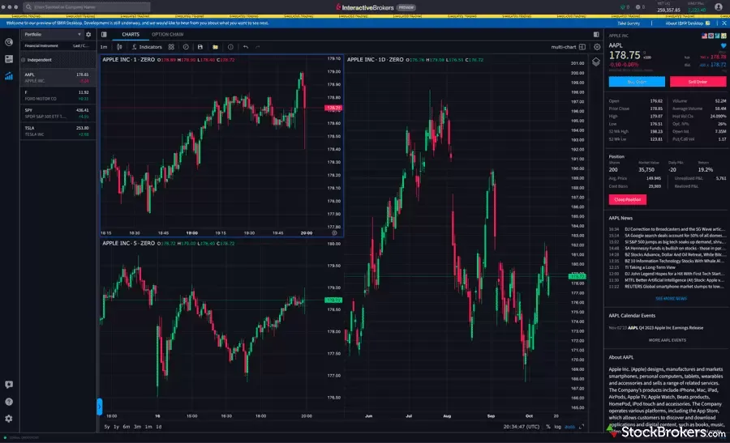

## Table of Contents

## What is day trading and why is it important to choose the right platform?

Day trading is when people buy and sell stocks or other financial things within the same day. They try to make money from small changes in prices. It's different from buying and holding onto things for a long time. Day traders need to watch the market closely and make quick decisions.

Choosing the right platform for day trading is important because it can affect how well you do. A good platform should be easy to use and fast, so you can make trades quickly without problems. It should also have good tools and information to help you make smart choices. If the platform is slow or hard to use, you might miss good chances to make money or make mistakes.

## What are the key features to look for in a day trading platform?

When looking for a day trading platform, speed and reliability are super important. You want a platform that lets you make trades fast and doesn't crash or slow down when the market gets busy. If the platform is slow, you might miss out on good chances to buy or sell. Also, it should be easy to use. A good platform has a simple design that makes it easy to find what you need and make trades without getting confused.

Another key feature is having good tools and information. A great day trading platform gives you charts, graphs, and real-time data to help you make smart choices. It should also let you set up alerts for certain prices or events, so you don't miss anything important. Plus, having access to educational resources and customer support can be really helpful, especially if you're new to day trading. These features can make a big difference in how well you do.

## How do beginner traders benefit from using specific day trading platforms?

Beginner traders can really benefit from using specific day trading platforms because these platforms often have tools that make trading easier to learn. For example, many platforms have demo accounts where you can practice trading without using real money. This lets you get a feel for how the market works and try out different strategies without risking your cash. Also, these platforms usually come with educational resources like tutorials, webinars, and guides that explain the basics of day trading and help you understand what you're doing.

Another way beginners benefit is through the user-friendly design of these platforms. A good platform is easy to navigate, so you don't get lost or confused when you're trying to make trades. It also has features like real-time data and charts that help you see what's happening in the market. This can make it easier for you to make smart decisions, even if you're new to trading. Plus, many platforms offer customer support, so if you have questions or run into problems, you can get help quickly.

## What are the top day trading platforms recommended for 2024?

For 2024, some of the top day trading platforms recommended for beginners and experienced traders alike are eToro, Robinhood, and Interactive Brokers. eToro is great because it's easy to use and has a feature called "CopyTrading" where you can copy what successful traders are doing. This can be really helpful if you're new to trading. Robinhood is another good choice, especially if you want to start with no minimum balance and enjoy commission-free trades. It's simple and user-friendly, making it perfect for beginners. Interactive Brokers is more for experienced traders because it offers a lot of advanced tools and lets you trade in many different markets around the world.

These platforms stand out because they offer different things that can help you with day trading. eToro's social trading features let you learn from others and see what works. Robinhood's straightforward design and low costs make it easy to get started without spending a lot of money. Interactive Brokers, on the other hand, gives you powerful tools and access to global markets, which can be great if you want to trade more advanced stuff. No matter which one you choose, make sure it fits what you need and how much experience you have with trading.

## How do fees and commissions impact the choice of a day trading platform?

Fees and commissions can really affect which day trading platform you pick. When you trade a lot, even small fees can add up and eat into your profits. Some platforms charge you for every trade you make, while others might have a flat fee or no fees at all. For example, Robinhood is popular because it offers commission-free trades, which can save you a lot of money if you're trading often. But, you need to look at all the fees, not just the trading ones. Some platforms might charge for things like withdrawing money or using certain tools, so it's important to know all the costs before you decide.

Choosing a platform with lower fees can help you keep more of your earnings, but you also need to think about what you get for those fees. A platform like Interactive Brokers might charge more, but it gives you access to lots of markets and advanced tools that can help you make better trades. On the other hand, if you're just starting out, you might be okay with a simpler platform that has lower or no fees. The key is to find a balance between what you pay and what you get in return, so you can trade effectively without losing too much to fees.

## What kind of tools and resources do the top platforms offer for technical analysis?

The top day trading platforms offer a variety of tools and resources for technical analysis that can help traders make better decisions. eToro, for example, provides a range of charting tools and indicators that let you see trends and patterns in the market. You can use these charts to look at different time frames and see how prices have moved in the past, which can help you guess where they might go next. Robinhood also has basic charting features, but they're easy to use and good enough for beginners to start learning about technical analysis. Interactive Brokers goes further with advanced charting tools and a wide selection of technical indicators, making it a great choice for experienced traders who want to dive deep into their analysis.

In addition to charting tools, these platforms often include other resources to help with technical analysis. eToro has a community where you can see what other traders are doing and learn from their strategies. This can be a big help if you're trying to understand how to use technical analysis in real trading situations. Robinhood offers educational content that explains technical analysis and how to use it, which can be useful for beginners. Interactive Brokers provides access to third-party research and analysis tools, which can give you even more detailed insights into the market. All these resources together can make a big difference in how well you can analyze the market and make smart trading choices.

## How do mobile trading apps compare to desktop platforms for day trading?

Mobile trading apps are great because they let you trade from anywhere using your phone or tablet. They're usually easy to use and have a simple design, so you can quickly check the market and make trades on the go. But, mobile apps might not have all the advanced tools and features that you get with a desktop platform. The screens are smaller, so it can be harder to see all the details and use complex charts. Also, if you're trading a lot, typing on a phone can be slower and more likely to cause mistakes.

Desktop platforms, on the other hand, give you more power and options for day trading. They have bigger screens and more room for detailed charts, lots of technical indicators, and other advanced tools that can help you analyze the market better. You can also set up multiple screens to keep an eye on different things at once, which can be really helpful for day trading. The downside is that you need to be at your computer to use them, so you can't trade as easily when you're away from your desk. In the end, choosing between a mobile app and a desktop platform depends on what you need and how you like to trade.

## What are the security measures implemented by leading day trading platforms?

Leading day trading platforms take security very seriously because they know how important it is to keep your money and personal information safe. They use strong encryption to protect your data when you're trading or just looking around on the platform. This means that your information is turned into a secret code that's hard for hackers to crack. They also have two-factor authentication, which adds an extra step to log in. You need to enter a code sent to your phone or another device, so even if someone knows your password, they can't get into your account without that code.

Besides encryption and two-factor authentication, these platforms often keep your money in separate accounts from their own money. This is called segregation of funds, and it means that if the platform has financial problems, your money is safer. They also watch for any strange activity on your account, like if someone is trying to log in from a new place or if there are a lot of failed login attempts. If they see anything suspicious, they might lock your account to keep it safe and then contact you to make sure everything is okay.

## How can experienced traders leverage advanced features of top platforms?

Experienced traders can make the most out of top platforms by using advanced charting tools and technical indicators. These tools let them see detailed patterns and trends in the market, which can help them make smarter trading choices. For example, Interactive Brokers offers a lot of different indicators and chart types that let traders look at the market from many angles. This can be really helpful when you're trying to figure out the best times to buy or sell. Experienced traders can also set up custom alerts for certain price levels or market events, so they don't miss out on important opportunities.

Another way experienced traders can use these platforms is by taking advantage of advanced order types and automated trading features. Platforms like Interactive Brokers let you use complex order types, like stop-loss and trailing stops, to manage your trades better and reduce risks. Automated trading, or algo trading, lets you set up rules for your trades, so the platform can make trades for you based on those rules. This can save you time and help you stick to your trading plan, even when the market is moving fast. By using these advanced features, experienced traders can trade more effectively and manage their portfolios better.

## What is the customer support like on these top day trading platforms?

Customer support on top day trading platforms like eToro, Robinhood, and Interactive Brokers is usually good but can be different for each one. eToro has a lot of ways to get help, like email, live chat, and a big community where you can ask other traders for advice. They also have a help center with lots of articles and guides to answer common questions. Robinhood's support is mostly through email and their app, but they also have a phone number you can call if you need to talk to someone right away. Their help center is easy to use and has information on how to do things on their platform.

Interactive Brokers offers really good support for experienced traders. They have 24/7 phone support, email, and live chat, so you can get help whenever you need it. They also have a lot of educational resources and a help center with detailed guides on how to use their advanced tools. No matter which platform you choose, good customer support can help you a lot, especially if you run into problems or have questions about trading.

## How do regulatory compliance and platform reliability affect platform selection?

Regulatory compliance is really important when you're choosing a day trading platform. It means the platform follows the rules set by financial authorities, like the SEC in the U.S. When a platform is regulated, it's safer for you because it has to keep your money separate from their money and follow strict rules to protect you. If a platform isn't regulated, it might be riskier because there's less protection for your money. So, always check if a platform is regulated before you start trading on it.

Platform reliability is also a big deal. You want a platform that works well and doesn't crash or slow down when the market is busy. If the platform is slow or keeps going offline, you might miss chances to make money or even lose money if you can't make trades when you need to. Top platforms like eToro, Robinhood, and Interactive Brokers are known for being reliable, but it's good to read reviews and see what other traders say about their experiences. Picking a reliable platform can make a big difference in how well you do with day trading.

## What future trends are expected to influence day trading platforms in 2024 and beyond?

In 2024 and beyond, one big trend that will affect day trading platforms is the use of artificial intelligence (AI) and machine learning. These technologies can help platforms give better advice and make trading easier. AI can look at a lot of data really fast and find patterns that might be hard for people to see. This means day trading platforms might start offering more personalized tips and help traders make better choices. Also, AI can help with things like setting up trades automatically, so traders don't have to watch the market all the time.

Another trend is the growing use of mobile trading apps. More and more people are using their phones to trade, so platforms are working to make their mobile apps better. They want to add more features and make the apps easier to use, even on small screens. This means traders can do more from their phones, like checking the market, making trades, and using tools for technical analysis. As mobile technology gets better, day trading platforms will keep improving their apps to give traders a good experience no matter where they are.

## What is the Evolution of Trading Platforms?

Trading platforms have undergone significant transformations from their inception in traditional brokerage to today's advanced digital platforms. Historically, trading was limited to physical exchanges of financial instruments facilitated by brokers. These brokers acted as intermediaries between buyers and sellers, a process often characterized by delayed communications and less transparency.

The digital era ushered in electronic trading platforms, marking a significant leap toward efficiency and accessibility. By the late 20th century, online trading became prevalent, driven by the proliferation of personal computers and improved internet connectivity. E-trading platforms enabled direct access to market data, reducing the dependency on brokers and offering greater control to individual traders.

Key technological advancements leading up to 2024 have further shaped the trading landscape. Cloud computing has significantly enhanced data processing and storage capabilities, allowing traders to execute complex algorithms and access vast datasets with ease. Furthermore, advancements in mobile technology have empowered traders to manage portfolios and monitor market movements on-the-go via smartphones and tablets.

The integration of Artificial Intelligence (AI) and Machine Learning (ML) into trading platforms represents a pivotal development. AI enables the analysis of large volumes of market data in real-time, unveiling patterns and trends that might elude human analysis. ML algorithms can adapt and optimize trading strategies based on historical data and predictive modeling. For instance, an ML algorithm might use historical price data $P(t)$ to predict future prices using the equation:

$$
P(t+1) = \alpha \cdot P(t) + \beta \cdot P(t-1) + \gamma
$$

where $\alpha, \beta,$ and $\gamma$ are model parameters determined through machine learning.

These innovations have significantly impacted [day trading](/wiki/day-trading-spy) and [algorithmic trading](/wiki/algorithmic-trading) by enhancing speed, precision, and decision-making capabilities. Day traders benefit from platforms that offer rapid order execution and real-time analytics, while algorithmic traders leverage sophisticated tools to backtest strategies and automate trades based on predefined criteria.

Looking ahead, trading platforms are poised to evolve further beyond 2024. The integration of quantum computing could revolutionize trading by solving complex optimization problems far quicker than classical computers, potentially transforming risk assessment and strategy development processes. Additionally, blockchain technology may lead to more transparent and decentralized trading ecosystems, reducing the reliance on traditional financial institutions.

Overall, the evolution of trading platforms is characterized by increasing sophistication and efficiency, driven by rapid technological advancements that continue to reshape the dynamics of financial markets.

## References & Further Reading

[1]: Bergstra, J., Bardenet, R., Bengio, Y., & Kégl, B. (2011). ["Algorithms for Hyper-Parameter Optimization."](https://dl.acm.org/doi/10.5555/2986459.2986743) Advances in Neural Information Processing Systems 24.

[2]: ["Advances in Financial Machine Learning"](https://www.amazon.com/Advances-Financial-Machine-Learning-Marcos/dp/1119482089) by Marcos Lopez de Prado

[3]: ["Evidence-Based Technical Analysis: Applying the Scientific Method and Statistical Inference to Trading Signals"](https://www.wiley.com/en-us/Evidence+Based+Technical+Analysis%3A+Applying+the+Scientific+Method+and+Statistical+Inference+to+Trading+Signals-p-9780470008744) by David Aronson

[4]: ["Machine Learning for Algorithmic Trading"](https://github.com/PacktPublishing/Machine-Learning-for-Algorithmic-Trading-Second-Edition) by Stefan Jansen

[5]: ["Quantitative Trading: How to Build Your Own Algorithmic Trading Business"](https://books.google.com/books/about/Quantitative_Trading.html?id=j70yEAAAQBAJ) by Ernest P. Chan