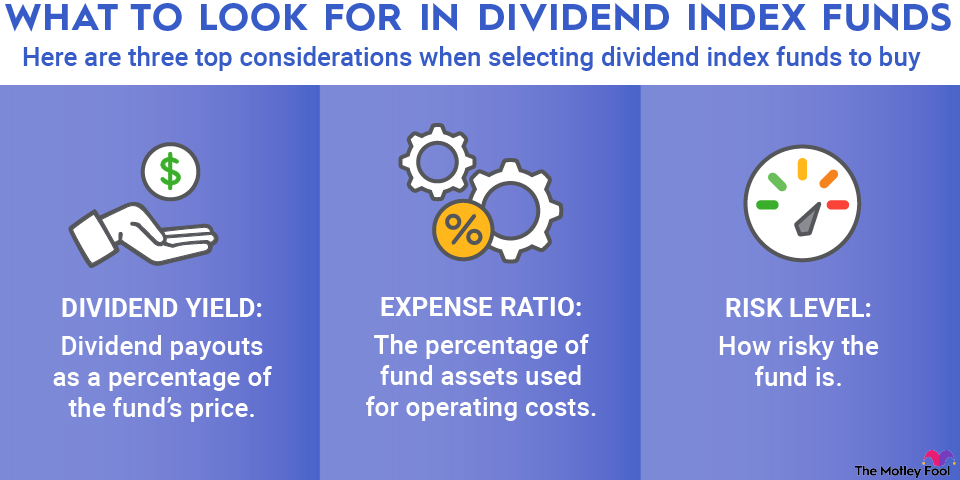

## Table of Contents

## What is a dividend index?

A dividend index is a type of stock market index that focuses on companies which pay dividends to their shareholders. Dividends are payments made by a company to its shareholders from its profits. A dividend index tracks the performance of these dividend-paying companies, giving investors an idea of how well these companies are doing overall.

People use dividend indexes to see how companies that regularly pay dividends are performing compared to the broader market. These indexes can be used to create investment products like mutual funds or exchange-traded funds (ETFs) that aim to mimic the performance of the index. This allows investors to invest in a diversified group of dividend-paying companies easily, without having to buy each stock individually.

## How do dividend indexes differ from other types of indexes?

Dividend indexes are different from other types of indexes because they focus only on companies that pay dividends. Other indexes might include all kinds of companies, whether they pay dividends or not. For example, the S&P 500 is a broad market index that includes the 500 largest companies in the U.S., regardless of whether they pay dividends. On the other hand, a dividend index like the Dow Jones U.S. Select Dividend Index includes only companies known for paying high dividends.

This focus on dividends means that dividend indexes are often used by investors who want steady income from their investments. These investors might be retirees or others who need regular payments to live on. In contrast, other types of indexes might be more appealing to investors looking for growth or those who are willing to take on more risk for potentially higher returns. So, while a tech-heavy index like the NASDAQ might attract investors interested in fast-growing tech companies, a dividend index would attract those who prefer the stability and income that dividends provide.

## What are the benefits of investing in dividend indexes?

Investing in dividend indexes can provide a steady income. When you invest in a dividend index, you're putting your money into a group of companies that pay dividends. These dividends are like little payments you get regularly, which can help you pay your bills or save up for something special. This is especially good for people who need money coming in every month, like retirees.

Another benefit is that dividend indexes can be less risky than other types of investments. Companies that pay dividends are often well-established and financially stable. They have a history of making profits and sharing those profits with their shareholders. So, by investing in a dividend index, you're spreading your money across many of these stable companies, which can make your investment safer than if you put all your money into just one or two companies.

Lastly, dividend indexes can help your money grow over time. When you reinvest the dividends you receive, you can buy more shares of the index. This means you'll get even more dividends in the future, and your investment can grow bigger and bigger. This is called compounding, and it's a powerful way to build wealth slowly but surely.

## Can you name some popular dividend indexes for beginners?

For beginners looking to invest in dividend indexes, the Dow Jones U.S. Select Dividend Index is a popular choice. This index focuses on companies that have paid high dividends for a long time. It's easy to invest in because you can buy an [ETF](/wiki/etf-trading-strategies) or a mutual fund that follows this index. This way, you don't have to pick individual stocks yourself.

Another good option for beginners is the S&P Dividend Aristocrats Index. This index includes companies that have increased their dividends every year for at least 25 years. These companies are very stable and reliable, which is great for someone just starting out. You can also invest in this index through ETFs or mutual funds, making it simple to get started.

Lastly, the FTSE High Dividend Yield Index is worth considering. This index includes companies from the FTSE that pay high dividends. It's a good way to get income from your investments. Like the other indexes, you can invest in it easily through ETFs or mutual funds. These options are all great for beginners because they offer a simple way to invest in dividend-paying companies.

## How are the companies selected for inclusion in a dividend index?

Companies are chosen for a dividend index based on certain rules that the index follows. For example, the Dow Jones U.S. Select Dividend Index picks companies that have paid high dividends for a long time. They look at how much money the company pays out in dividends and how stable those payments are. The goal is to find companies that give good, reliable income to investors.

The S&P Dividend Aristocrats Index has different rules. It includes companies that have increased their dividends every year for at least 25 years. This shows that the companies are not just paying dividends but are also growing their payments over time. This makes the index attractive to investors who want both income and growth.

Each dividend index has its own set of rules for [picking](/wiki/asset-class-picking) companies. These rules help make sure the index meets its goals, whether it's high income, growth, or both. By following these rules, the index can give investors a clear picture of how well dividend-paying companies are doing.

## What are the criteria for a company to be considered for a high dividend yield index?

A company is considered for a high dividend yield index if it pays a lot of money to its shareholders as dividends compared to its stock price. The dividend yield is calculated by dividing the annual dividend by the stock's current price. For example, if a company pays $2 in dividends each year and its stock price is $40, the dividend yield is 5%. Indexes like the FTSE High Dividend Yield Index look for companies with high yields, often setting a minimum yield requirement to make sure the companies provide good income to investors.

These indexes also check how stable the company's dividends are. They want to make sure the company can keep paying high dividends over time. This means they look at the company's financial health and history of dividend payments. A company that has been paying high dividends for many years is more likely to be included in the index. By choosing companies that meet these criteria, high dividend yield indexes aim to give investors a reliable source of income.

## How do dividend indexes perform compared to the broader market?

Dividend indexes often perform differently than the broader market. The broader market includes all kinds of companies, some that pay dividends and some that don't. Dividend indexes focus only on companies that pay dividends, so they can be more stable. When the stock market goes up and down a lot, dividend indexes might not go up as much, but they also might not go down as much. This is because the companies in dividend indexes are usually well-established and financially strong.

Over the long term, dividend indexes can be a good choice for investors who want steady income and less risk. While they might not grow as fast as the broader market during good times, they can provide more protection during bad times. This makes them a popular choice for people like retirees who need regular payments to live on. So, while dividend indexes might not always beat the broader market, they offer a different kind of benefit by focusing on income and stability.

## What are the risks associated with investing in dividend indexes?

Investing in dividend indexes can be a good way to get regular income, but there are risks you should know about. One risk is that the companies in the index might cut their dividends. This can happen if the company is not doing well financially. If a lot of companies in the index cut their dividends, the income you get from the index could go down, and the value of the index might drop too.

Another risk is that dividend indexes might not grow as fast as the broader market. This means you might miss out on bigger gains if you only invest in dividend indexes. Also, if interest rates go up, other investments like bonds might become more attractive, and people might sell their dividend index investments, causing the index to go down in value. It's important to think about these risks before you decide to invest in dividend indexes.

## How can dividend indexes be used in a diversified investment portfolio?

Dividend indexes can be a great part of a diversified investment portfolio because they help spread out your risk. When you invest in a dividend index, you're putting your money into a bunch of different companies that pay dividends. This means if one company does badly, it won't hurt your whole investment as much because you have money in many other companies too. This way, your portfolio can be more stable and less likely to lose a lot of money all at once.

Another way dividend indexes can help in a diversified portfolio is by providing regular income. If you need money coming in every month, like for living expenses, dividend indexes can give you that. They're often made up of companies that are financially strong and have a history of paying dividends. By including dividend indexes in your portfolio, you can get a steady flow of income while also keeping your investments spread out across different kinds of companies. This can make your overall investment strategy stronger and more balanced.

## What are some advanced strategies for investing in dividend indexes?

One advanced strategy for investing in dividend indexes is dividend reinvestment. When you get dividends from the companies in the index, you can use that money to buy more shares of the index. This way, your investment can grow bigger over time because you're getting more shares without spending extra money. This is called compounding, and it can make your investment grow a lot more than if you just took the dividend money and spent it. It's a good way to build wealth slowly but surely.

Another strategy is to use dividend indexes as part of a sector rotation strategy. This means you move your money between different sectors of the economy based on how they're doing. For example, if you think the energy sector is going to do well, you might invest more in a dividend index that focuses on energy companies. By doing this, you can try to get higher returns by picking the sectors that are doing the best at any given time. It can be a bit more complicated, but it can also help you make more money if you do it right.

## How do international dividend indexes compare to domestic ones in terms of yield and risk?

International dividend indexes can offer higher yields than domestic ones. This is because some countries have companies that pay bigger dividends. For example, companies in countries like Australia and the UK often pay higher dividends than companies in the U.S. So, if you invest in an international dividend index, you might get more money from dividends. But, you need to be careful because higher yields can sometimes mean higher risk.

Investing in international dividend indexes can be riskier than sticking to domestic ones. This is because you have to deal with things like currency changes. If the value of the foreign currency goes down compared to your home currency, the dividends you get might be worth less when you convert them back. Also, international markets can be more unpredictable because of different economic conditions and political situations in other countries. So, while you might get higher yields, you need to think about these extra risks before you invest in international dividend indexes.

## What role do dividend indexes play in long-term retirement planning?

Dividend indexes can be a big help in long-term retirement planning because they give you steady income. When you're retired, you might need money coming in every month to pay for things like food, bills, and fun activities. By investing in a dividend index, you get regular payments from the companies in the index. This can make your retirement more comfortable because you know you'll have money coming in without having to sell your investments.

Another good thing about dividend indexes for retirement is that they can be less risky than other investments. The companies in these indexes are often big and financially strong, so they're less likely to go down a lot in value. This can help keep your retirement savings safe. Plus, if you reinvest the dividends you get, your investment can grow over time, which means you'll have more money later in your retirement. So, dividend indexes can be a smart choice for making sure you have enough money to live on when you're no longer working.

## What is the role of dividends in an investment strategy?

Dividends represent a portion of a company's earnings that are distributed to shareholders, typically as cash payments or additional stock. This practice allows investors to receive a share of a company's profits, effectively generating income from their investment. Companies that pay dividends are often well-established entities with consistent profitability, as they maintain the financial stability necessary to support regular payouts.

Investors are drawn to dividend-paying stocks for their ability to provide a steady income stream, making them a cornerstone for those seeking stability and long-term growth in their portfolios. Dividend stocks are particularly appealing during periods of low-interest rates, where returns from traditional fixed-income investments, like bonds, may be less competitive.

The types of companies that frequently issue dividends include mature firms in industries such as utilities, consumer staples, and telecommunications. These sectors are known for their reliable cash flows, which enable them to sustain dividend payments even in adverse economic conditions. For example, companies like Procter & Gamble, Coca-Cola, and Johnson & Johnson are renowned for their regular dividend distributions.

When evaluating potential dividend investments, two primary financial metrics come into play: dividend yield and dividend payout ratio. The dividend yield, expressed as a percentage, is calculated using the formula:

$$
\text{Dividend Yield} = \left( \frac{\text{Annual Dividends Per Share}}{\text{Current Share Price}} \right) \times 100
$$

This ratio helps investors understand the return on investment from dividends alone relative to the stock's current price. A higher dividend yield can indicate a potentially rewarding investment but may also suggest underlying business challenges if it's significantly above industry norms.

The dividend payout ratio, another critical metric, measures the proportion of earnings paid out as dividends, calculated as:

$$
\text{Dividend Payout Ratio} = \left( \frac{\text{Dividends Per Share}}{\text{Earnings Per Share}} \right) \times 100
$$

A lower payout ratio might imply a company is retaining more earnings for growth, while a higher ratio can indicate a commitment to returning profits to shareholders. However, an excessively high payout ratio may be unsustainable, raising concerns about the company's future dividend payments if earnings decline.

In summary, dividends offer a reliable income source and can form a core component of a balanced investment strategy. By focusing on companies with solid financial histories and understanding key metrics like dividend yield and payout ratio, investors can make informed decisions to enhance their stock market success.

## Is Algorithmic Trading the Future of Investing?

Algorithmic trading, often referred to as algo trading, is a sophisticated practice in the financial markets that employs computer programs to automate trading decisions and executions based on established rules and criteria. This approach allows for the swift execution of trades, capitalizing on fleeting market opportunities with minimal human intervention. The method's high-speed and efficiency are its most lauded features, enabling trades to be executed at optimal prices while minimizing market impact and transaction costs.

The integration of [artificial intelligence](/wiki/ai-artificial-intelligence) (AI) into trading systems marks a significant advancement in this domain. AI can analyze vast datasets in real time, identifying trends and patterns that may not be apparent to human traders. Machine learning algorithms, a subset of AI, enhance this capability by improving over time as they process more data. These systems can predict market trends by analyzing historical data (X), financial news (Y), and even social media sentiment (Z). A simplified representation of such a prediction model could be expressed through a linear regression formula:

$$
\text{Price Change} = \beta_0 + \beta_1 \cdot X + \beta_2 \cdot Y + \beta_3 \cdot Z + \epsilon
$$

where $\beta_0$ is the intercept, $\beta_1, \beta_2, \beta_3$ are coefficients, and $\epsilon$ represents the error term.

Despite the advantages, [algorithmic trading](/wiki/algorithmic-trading) is not without its risks. Programming errors, known as bugs, can lead to unintended trading behaviors, potentially causing significant financial losses. These errors might arise from logical fallacies within the code or from erroneous data inputs. Additionally, market [volatility](/wiki/volatility-trading-strategies) can exacerbate these risks, as sudden, unpredictable market shifts may lead to substantial deviations from expected patterns, challenging the models' assumptions.

Managing these risks involves rigorous testing and validation of algorithms before deployment. Backtesting, which applies the trading algorithm to historical data, is essential to assess how the strategy performs under various market conditions. Moreover, implementing robust risk management protocols, such as stop-loss orders and real-time monitoring, can help mitigate potential losses.

Python, a popular programming language in this domain, offers numerous libraries like NumPy, pandas, and scikit-learn that facilitate the development and testing of trading algorithms. For instance, a basic example of [backtesting](/wiki/backtesting) a moving average crossover strategy using pandas might look like this:

```python
import pandas as pd

# Load historical data
data = pd.read_csv('historical_stock_data.csv')
data['Short_MA'] = data['Close'].rolling(window=50).mean()
data['Long_MA'] = data['Close'].rolling(window=200).mean()

# Signal generation
data['Signal'] = 0
data['Signal'][50:] = np.where(data['Short_MA'][50:] > data['Long_MA'][50:], 1, 0)
data['Position'] = data['Signal'].diff()

# Calculate returns
data['Strategy_Returns'] = data['Position'] * data['Close'].pct_change()

# Evaluate strategy
cumulative_returns = (data['Strategy_Returns'] + 1).cumprod()

print(cumulative_returns.iloc[-1])  # Print the final cumulative return
```

This simplified script demonstrates the practical application of a basic trading strategy, underscoring how algorithmic trading leverages technology to enhance decision-making and efficiency in financial markets. As technology continues to evolve, the fusion of AI and high-frequency trading is poised to play an increasingly pivotal role, shaping the future landscape of investment strategies.

## References & Further Reading

[1]: Farrell, M. (2008). ["Dividends: A Primer"](https://www.semanticscholar.org/paper/The-Dividend-Discount-Model%3A-A-Primer-Farrell/64dd46516c170969a5e257827c83f770a990d349) - Morningstar.

[2]: Bogle, J. C. (2017). ["The Little Book of Common Sense Investing: The Only Way to Guarantee Your Fair Share of Stock Market Returns"](https://www.amazon.com/Little-Book-Common-Sense-Investing/dp/1119404509) - John Wiley & Sons.

[3]: Chan, E. P. (2009). ["Quantitative Trading: How to Build Your Own Algorithmic Trading Business"](https://github.com/ftvision/quant_trading_echan_book) - John Wiley & Sons.

[4]: Vazirani, A. (2021). ["The Dividend Aristocrats: Reviewing this Exclusive List of Companies"](https://stockanalysis.com/list/dividend-aristocrats/) - Forbes.

[5]: Lopez de Prado, M. (2018). ["Advances in Financial Machine Learning"](https://www.amazon.com/Advances-Financial-Machine-Learning-Marcos/dp/1119482089) - John Wiley & Sons.