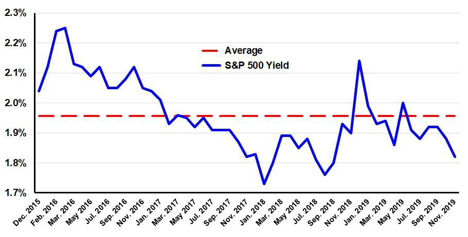

Investment in the stock market offers a range of methodologies that aim to maximize investor returns. Chief among these are dividend investing, index funds, and algorithmic trading, each presenting unique opportunities along with inherent risks. The dynamic interplay between these methods can often be the key to constructing a robust investment portfolio.

Dividend investing entails the acquisition of stocks from companies that regularly distribute a portion of their profits to shareholders in the form of dividends. This strategy is particularly attractive to those seeking a steady income stream, as well as long-term growth. Stability, typically offered by large, established firms, is a defining characteristic of dividend-paying stocks. Metrics such as dividend yield and payout ratio are crucial in assessing the viability of dividend stocks.



Index funds represent another strategy, allowing investors to buy into a collection of stocks mirroring a particular index, such as the S&P 500 or Dow Jones Industrial Average. This method offers broad market exposure, risk diversification, and often lower costs owing to their passive management style. Index funds can serve as a stable foundation for any investment strategy, appealing to both novice and seasoned investors.

Algorithmic trading, a more modern approach, uses sophisticated computer algorithms to execute trades based on defined criteria. Praised for its speed and precision, algo trading capitalizes on small market discrepancies and large data sets to optimize returns. The integration of artificial intelligence in these systems further enhances their predictive capabilities, although the potential for programming errors and market volatility introduces its own set of complexities.

Each of these strategies offers distinct advantages and can be leveraged individually or in combination to enhance portfolio performance. By understanding how dividends, index funds, and algorithmic models work together, investors can craft a strategy that aligns with their financial objectives and risk tolerance. Through thoughtful diversification and strategic planning, market participants can position themselves to thrive under diverse market conditions.

## Table of Contents

## Understanding Dividends as an Investment Strategy

Dividends represent a portion of a company's earnings that are distributed to shareholders, typically as cash payments or additional stock. This practice allows investors to receive a share of a company's profits, effectively generating income from their investment. Companies that pay dividends are often well-established entities with consistent profitability, as they maintain the financial stability necessary to support regular payouts.

Investors are drawn to dividend-paying stocks for their ability to provide a steady income stream, making them a cornerstone for those seeking stability and long-term growth in their portfolios. Dividend stocks are particularly appealing during periods of low-interest rates, where returns from traditional fixed-income investments, like bonds, may be less competitive.

The types of companies that frequently issue dividends include mature firms in industries such as utilities, consumer staples, and telecommunications. These sectors are known for their reliable cash flows, which enable them to sustain dividend payments even in adverse economic conditions. For example, companies like Procter & Gamble, Coca-Cola, and Johnson & Johnson are renowned for their regular dividend distributions.

When evaluating potential dividend investments, two primary financial metrics come into play: dividend yield and dividend payout ratio. The dividend yield, expressed as a percentage, is calculated using the formula:

$$
\text{Dividend Yield} = \left( \frac{\text{Annual Dividends Per Share}}{\text{Current Share Price}} \right) \times 100
$$

This ratio helps investors understand the return on investment from dividends alone relative to the stock's current price. A higher dividend yield can indicate a potentially rewarding investment but may also suggest underlying business challenges if it's significantly above industry norms.

The dividend payout ratio, another critical metric, measures the proportion of earnings paid out as dividends, calculated as:

$$
\text{Dividend Payout Ratio} = \left( \frac{\text{Dividends Per Share}}{\text{Earnings Per Share}} \right) \times 100
$$

A lower payout ratio might imply a company is retaining more earnings for growth, while a higher ratio can indicate a commitment to returning profits to shareholders. However, an excessively high payout ratio may be unsustainable, raising concerns about the company's future dividend payments if earnings decline.

In summary, dividends offer a reliable income source and can form a core component of a balanced investment strategy. By focusing on companies with solid financial histories and understanding key metrics like dividend yield and payout ratio, investors can make informed decisions to enhance their stock market success.

## Popular Dividend Stock Market Indexes

Dividend indexes provide investors with an opportunity to gain exposure to a diversified portfolio of dividend-paying stocks. These indexes, such as the Dow Jones U.S. Select Dividend Index and the S&P 500 Dividend Aristocrats Index, are structured to incorporate stocks from companies that consistently pay dividends. This section examines the inclusion criteria for these indexes and the potential benefits for risk-averse investors seeking consistent returns and a measure of stability.

### Inclusion Criteria for Dividend Indexes

**1. Dividend Growth and Stability:**  
Dividend-paying companies are often evaluated based on their history of dividend growth and the stability of these payments. The Dow Jones U.S. Select Dividend Index, for example, selects companies that have sustained high dividend yields and substantial margins on their dividend payments. Meanwhile, the S&P 500 Dividend Aristocrats Index requires its constituents to have increased dividends annually for at least 25 consecutive years.

**2. Financial Health and Profitability:**  
Indexes often assess the overall financial health and profitability of a company. This assessment includes metrics such as the payout ratio (the proportion of earnings paid out as dividends), which should be sustainable over the long term. A lower payout ratio is typically favored, as it indicates that the company retains sufficient earnings for reinvestment while still rewarding shareholders.

**3. Market Capitalization and Liquidity:**  
To be included in many of these indexes, companies must also pass thresholds for market capitalization and [liquidity](/wiki/liquidity-risk-premium). This ensures that the stocks are not only financially sound but also accessible to a wide range of investors, reducing the risk of substantial price [volatility](/wiki/volatility-trading-strategies) due to low trading volumes.

### Analyzing Popular Dividend Indexes

**Dow Jones U.S. Select Dividend Index:**  
This index is known for its emphasis on yield, selecting the top 100 U.S. companies by dividend yield. The selection process prioritizes stocks with consistent and substantial dividend payments while maintaining strong financial health. Such a focus on high yields makes this index particularly appealing to income-focused investors.

**S&P 500 Dividend Aristocrats Index:**  
Representing companies from the S&P 500 that have consistently increased their dividends annually, this index signifies financial robustness and reliability. Its constituents are well-established, often with significant market capitalizations, making it a benchmark for dividend stability.

**NASDAQ U.S. Dividend Achievers Select Index:**  
This index includes companies that have repeatedly increased their annual dividends over the last ten years. The focus here is not only on dividend increase but also on the company's ability to sustain this growth, providing investors with a reliable income stream and potential capital appreciation.

**S&P Global Dividends Opportunity Index:**  
Differing from the previously mentioned indexes, this index takes a global approach by capturing dividend-paying stocks from around the world. It offers geographic diversification, which can reduce portfolio risk by spreading investments across various markets and economic conditions.

### Investment Decisions

Analyzing the performance of these indexes helps guide investment strategies. Investors often consider historical returns, dividend growth rates, and the economic context of the included companies. When choosing which dividend index to invest in, one should examine the underlying criteria, historical performance, and potential for future dividend growth.

In summary, popular dividend stock market indexes provide structured avenues for investing in dividend-paying stocks, offering a means to achieve a steadier income stream and capital preservation, particularly suited for those with a risk-averse investment philosophy.

## Algorithmic Trading: The Future of Investing?

Algorithmic trading, often referred to as algo trading, is a sophisticated practice in the financial markets that employs computer programs to automate trading decisions and executions based on established rules and criteria. This approach allows for the swift execution of trades, capitalizing on fleeting market opportunities with minimal human intervention. The method's high-speed and efficiency are its most lauded features, enabling trades to be executed at optimal prices while minimizing market impact and transaction costs.

The integration of [artificial intelligence](/wiki/ai-artificial-intelligence) (AI) into trading systems marks a significant advancement in this domain. AI can analyze vast datasets in real time, identifying trends and patterns that may not be apparent to human traders. Machine learning algorithms, a subset of AI, enhance this capability by improving over time as they process more data. These systems can predict market trends by analyzing historical data (X), financial news (Y), and even social media sentiment (Z). A simplified representation of such a prediction model could be expressed through a linear regression formula:

$$
\text{Price Change} = \beta_0 + \beta_1 \cdot X + \beta_2 \cdot Y + \beta_3 \cdot Z + \epsilon
$$

where $\beta_0$ is the intercept, $\beta_1, \beta_2, \beta_3$ are coefficients, and $\epsilon$ represents the error term.

Despite the advantages, [algorithmic trading](/wiki/algorithmic-trading) is not without its risks. Programming errors, known as bugs, can lead to unintended trading behaviors, potentially causing significant financial losses. These errors might arise from logical fallacies within the code or from erroneous data inputs. Additionally, market volatility can exacerbate these risks, as sudden, unpredictable market shifts may lead to substantial deviations from expected patterns, challenging the models' assumptions.

Managing these risks involves rigorous testing and validation of algorithms before deployment. Backtesting, which applies the trading algorithm to historical data, is essential to assess how the strategy performs under various market conditions. Moreover, implementing robust risk management protocols, such as stop-loss orders and real-time monitoring, can help mitigate potential losses.

Python, a popular programming language in this domain, offers numerous libraries like NumPy, pandas, and scikit-learn that facilitate the development and testing of trading algorithms. For instance, a basic example of [backtesting](/wiki/backtesting) a moving average crossover strategy using pandas might look like this:

```python
import pandas as pd

# Load historical data
data = pd.read_csv('historical_stock_data.csv')
data['Short_MA'] = data['Close'].rolling(window=50).mean()
data['Long_MA'] = data['Close'].rolling(window=200).mean()

# Signal generation
data['Signal'] = 0
data['Signal'][50:] = np.where(data['Short_MA'][50:] > data['Long_MA'][50:], 1, 0)
data['Position'] = data['Signal'].diff()

# Calculate returns
data['Strategy_Returns'] = data['Position'] * data['Close'].pct_change()

# Evaluate strategy
cumulative_returns = (data['Strategy_Returns'] + 1).cumprod()

print(cumulative_returns.iloc[-1])  # Print the final cumulative return
```

This simplified script demonstrates the practical application of a basic trading strategy, underscoring how algorithmic trading leverages technology to enhance decision-making and efficiency in financial markets. As technology continues to evolve, the fusion of AI and high-frequency trading is poised to play an increasingly pivotal role, shaping the future landscape of investment strategies.

## Combining Strategies for Diversified Investments

Diversifying investments by combining strategies such as dividend stocks, index funds, and algorithmic trading can enhance a portfolio's robustness and growth potential. Each of these approaches contributes distinct advantages, allowing investors to build a portfolio capable of enduring market fluctuations and optimizing returns.

Dividend stocks offer a consistent income stream and the potential for capital appreciation. By selecting stocks with strong dividend yield and stable payout ratios, investors can achieve reliable returns, even during economic downturns. Large, established firms often pay dividends, making them a cornerstone of risk-averse investment strategies. Dividend stocks also provide a hedge against inflation, as they typically grow alongside or above inflation rates.

Index funds, on the other hand, deliver broad market exposure and diversification across numerous sectors and companies. These funds mirror the performance of specific indexes, such as the S&P 500, minimizing unsystematic risk associated with individual stocks. This alignment with market benchmarks offers investors steady, long-term growth potential with lower expense ratios compared to actively managed funds. The resilience of index funds is particularly beneficial when markets are volatile, as they tend to recover in line with the broader economy.

Algorithmic trading brings speed, precision, and efficiency to investment strategies by employing computer programs to execute trades instantaneously based on pre-defined criteria. This method optimizes trade timing, reduces human error, and leverages real-time data analysis to capture market opportunities. Algorithmic trading can adapt quickly to changing market conditions, which is crucial in maintaining a portfolio's agility and responsiveness.

By merging these strategies, investors can craft a balanced portfolio tailored to specific financial goals. A diversified approach may involve allocating a portion of the portfolio to high-dividend stocks, using index funds for broad market exposure, and deploying algorithmic trading for tactical positioning and enhanced returns. This combination leverages the consistent income from dividends, the stability of index funds, and the dynamic potential of algorithmic trading.

To implement this diversified strategy effectively:

1. **Asset Allocation**: Determining an appropriate ratio of dividend stocks, index funds, and algorithmic trading investments based on risk tolerance and investment horizon. For example, conservative investors might favor a higher proportion of dividend stocks and index funds, while risk-tolerant investors might allocate more to algorithmic trading.

2. **Rebalancing**: Regularly adjusting the portfolio to maintain the desired asset allocation and adapt to changing market conditions. This involves buying and selling assets to preserve diversification and capitalize on growth opportunities.

3. **Monitoring Performance**: Evaluating the performance of each component relative to the overall portfolio. Advanced analytics tools can help monitor the impact of algorithmic trading, dividend payments, and index fund movements.

In conclusion, combining dividend stocks, index funds, and algorithmic trading offers a comprehensive approach to investment that can withstand market turbulence while maximizing growth potential. By understanding and leveraging the synergies between these strategies, investors can achieve a diversified and resilient investment portfolio.

## Conclusion

Investment success in the stock market is fundamentally linked to an informed strategy and effective diversification. Each investment method—whether it be dividend investing, index funds, or algorithmic trading—presents distinct advantages and challenges, requiring a nuanced understanding to exploit their full potential.

Dividend investing is especially attractive for those seeking a steady income stream, as it involves investing in companies that regularly distribute part of their earnings to shareholders. This method provides the dual benefit of regular income and potential long-term appreciation, particularly when reinvesting dividends.

Index funds offer a diversified approach by allowing investors to invest in a basket of stocks that represents a specific index. This strategy reduces risks associated with individual stock performance and promotes a more passive investment style. By mirroring the performance of the broader market or specific sectors, index funds facilitate broad exposure and, historically, have shown resilience against market volatility.

Algorithmic trading leverages technology to execute trades based on pre-defined criteria, offering speed and efficiency. While the potential for rapid execution and reduced human error is noteworthy, the strategy demands robust infrastructure and careful risk management due to its susceptibility to programming errors and market volatility. Advanced systems may incorporate artificial intelligence for pattern recognition and market trend prediction, enhancing decision-making processes.

Integrating these strategies—dividend investing, index funds, and algorithmic trading—enables investors to build well-rounded portfolios. By balancing the stability of dividends, the broad exposure of index funds, and the technological edge of algorithmic trading, investors can optimize growth and mitigate risks. This approach empowers investors to craft portfolios aligned with specific financial goals and adaptable to diverse market conditions.

Ultimately, achieving success in stock market investments hinges on understanding and combining different approaches. This layered strategy not only reinforces portfolio robustness but also prepares investors to capitalize on opportunities while navigating challenges across varying economic landscapes.

## FAQs

### What are the key differences between dividend investing, index funds, and algorithmic trading?

Dividend investing, index funds, and algorithmic trading each present distinct approaches to stock market investment:

1. **Dividend Investing**: This strategy centers on purchasing shares in companies that pay regular dividends. Investors gain income from dividend payments, providing a steady income stream. The main appeal is stability and income generation, especially from large, established firms. Dividend investors focus on dividend yield, the ratio of a company’s annual dividend compared to its share price, and the dividend payout ratio, indicating how much of a company’s earnings are distributed as dividends.

2. **Index Funds**: Index funds aim to replicate the performance of a particular stock market index, such as the S&P 500. The benefit of investing in index funds is diversification, as they inherently spread risk across numerous stocks. Index funds offer a passive investment strategy, often with lower fees, appealing to long-term investors seeking broad market exposure without the need for active management.

3. **Algorithmic Trading**: This involves using computer algorithms to execute trades at a high speed and frequency. Algorithms follow a set of pre-defined rules to decide when to buy or sell securities. The appeal lies in its speed, efficiency, and the potential for higher returns by exploiting market conditions. However, it requires a deep understanding of programming and market behavior, along with consideration of market volatility and potential technical pitfalls.

### How does one manage the risks associated with algorithmic trading?

Managing risks in algorithmic trading involves several key practices:

1. **Thorough Testing**: Before deploying an algorithm, it is essential to test it extensively in different market conditions using historical data (backtesting) and simulated trading environments (paper trading).

2. **Error Handling**: Implement robust error-handling mechanisms to address potential technical problems such as connectivity issues or hardware failures that could lead to unintended trades.

3. **Algorithm Monitoring**: Continuous monitoring of the algorithm's performance is crucial. This involves setting up alerts for unusual activity and having manual overrides when necessary.

4. **Risk Management Protocols**: Establish clear risk management rules, such as setting stop-loss limits and position size limits to prevent significant losses.

5. **Diversification**: Just like with any trading strategy, diversifying the assets and strategies used in algorithmic trading can reduce overall risk.

### What factors should be considered when choosing a dividend index to invest in?

When selecting a dividend index, investors should assess the following factors:

1. **Dividend Yield and Growth**: Evaluate the historical dividend yield and growth rate of the index, as these reflect the potential for income generation over time.

2. **Index Composition**: Understand the types of companies included in the index, their industries, and the geographic regions they cover to ensure alignment with your risk tolerance and diversification needs.

3. **Criteria for Inclusion**: Analyze the inclusion criteria for the index, such as dividend history, payout ratios, and stability, to ensure they match your investment goals.

4. **Performance History**: Investigate the historical performance of the index in various market environments to understand how it may perform in the future.

5. **Expense Ratio**: Consider the expense ratio of any index funds or ETFs tracking the dividend index, as higher costs can erode returns over time.

By carefully analyzing these factors, investors can choose a dividend index that aligns with their income objectives and risk appetite.

## References & Further Reading

[1]: Farrell, M. (2008). ["Dividends: A Primer"](https://www.semanticscholar.org/paper/The-Dividend-Discount-Model%3A-A-Primer-Farrell/64dd46516c170969a5e257827c83f770a990d349) - Morningstar.

[2]: Bogle, J. C. (2017). ["The Little Book of Common Sense Investing: The Only Way to Guarantee Your Fair Share of Stock Market Returns"](https://www.amazon.com/Little-Book-Common-Sense-Investing/dp/1119404509) - John Wiley & Sons.

[3]: Chan, E. P. (2009). ["Quantitative Trading: How to Build Your Own Algorithmic Trading Business"](https://github.com/ftvision/quant_trading_echan_book) - John Wiley & Sons.

[4]: Vazirani, A. (2021). ["The Dividend Aristocrats: Reviewing this Exclusive List of Companies"](https://stockanalysis.com/list/dividend-aristocrats/) - Forbes.

[5]: Lopez de Prado, M. (2018). ["Advances in Financial Machine Learning"](https://www.amazon.com/Advances-Financial-Machine-Learning-Marcos/dp/1119482089) - John Wiley & Sons.