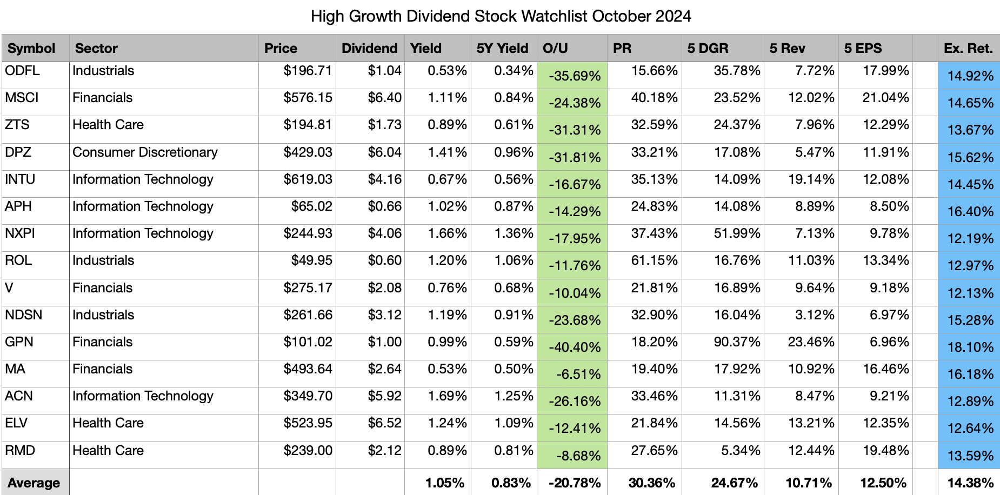

## Table of Contents

## What are dividend stocks and why are they important for investors?

Dividend stocks are shares of companies that pay out regular portions of their earnings to shareholders. These payments, called dividends, are usually given out every three months, but can also be paid monthly or yearly. Companies that pay dividends are often well-established and financially stable, which makes them attractive to many investors.

Dividends are important for investors because they provide a steady stream of income. This can be especially helpful for people who are retired or looking for a regular income from their investments. Additionally, reinvesting dividends can help grow an investor's portfolio over time. By using the dividends to buy more shares, investors can benefit from compound growth, which means their investment can grow faster as they earn dividends on an increasing number of shares.

## How do you identify a good dividend stock?

To find a good dividend stock, you need to look at a few important things. First, check the dividend yield, which is the percentage of the stock's price that the dividend represents. A higher yield can be good, but be careful because a very high yield might mean the stock price has dropped a lot, which could be a warning sign. Also, look at the company's history of paying dividends. Companies that have paid and increased dividends for many years are often more reliable.

Another thing to consider is the company's financial health. A good dividend stock comes from a company that makes steady profits and has enough money to keep paying dividends. You can look at the payout ratio, which shows how much of the company's earnings are paid out as dividends. A lower payout ratio usually means the company can keep paying dividends even if profits go down a bit. Also, think about the company's business and how it's doing in its industry. A strong, stable company in a growing industry is more likely to keep paying good dividends.

In short, finding a good dividend stock means checking the dividend yield, the company's history of paying dividends, its financial health, and its position in the industry. By looking at these things, you can find stocks that will give you a steady income and might grow over time.

## What are the key financial metrics to look at when evaluating dividend stocks?

When you want to evaluate dividend stocks, you should look at a few important financial numbers. One key number is the dividend yield, which tells you how much dividend you get for each dollar you spend on the stock. A good yield can be attractive, but be careful if it's too high because it might mean the stock price has fallen a lot, which could be a red flag. Another important number is the payout ratio, which shows what part of the company's earnings goes to dividends. A lower payout ratio means the company can keep paying dividends even if its profits drop a bit.

Also, look at the company's earnings growth. If a company's earnings are growing, it's more likely to keep paying and maybe even increasing its dividends. You can check the company's debt levels too. A company with too much debt might struggle to pay dividends if it has to use its money to pay off loans instead. Finally, consider the company's return on equity (ROE), which shows how well the company uses the money shareholders have invested to make profits. A higher ROE can mean the company is good at turning your investment into earnings, which is good for dividend stability and growth.

By looking at these numbers - dividend yield, payout ratio, earnings growth, debt levels, and return on equity - you can get a better idea of which dividend stocks are strong and likely to keep paying you well over time.

## Can you list the top dividend stocks for October 2024?

In October 2024, some of the top dividend stocks to consider are from well-known companies that have a strong history of paying dividends. One such company is Johnson & Johnson, a healthcare giant known for its consistent dividend increases over many years. Its current dividend yield is around 2.8%, and it has a payout ratio of about 45%, which shows it can keep paying dividends even if profits dip a bit. Another top pick is Procter & Gamble, a consumer goods company with a dividend yield of about 2.5% and a payout ratio of around 60%. Both companies are financially stable and have been paying dividends for decades, making them reliable choices for dividend investors.

Another strong contender for October 2024 is Coca-Cola, with a dividend yield of about 3.1% and a payout ratio of around 75%. Coca-Cola has a long history of increasing its dividends, which makes it attractive to those looking for steady income. Additionally, ExxonMobil, an energy company, offers a dividend yield of around 3.5% and a payout ratio of about 55%. Despite the ups and downs in the energy sector, ExxonMobil has maintained its dividends well, showing its financial strength. These companies are all good examples of top dividend stocks that can provide a reliable income stream for investors.

## What industries are the top dividend stocks from in October 2024?

In October 2024, the top dividend stocks come from a few key industries. One big industry is healthcare, with Johnson & Johnson being a top pick. Johnson & Johnson makes a lot of different healthcare products and has been paying good dividends for a long time. Another industry is consumer goods, where Procter & Gamble stands out. They make things like soap and diapers, and they have a strong history of paying dividends too.

Another industry to look at is beverages, with Coca-Cola being a top dividend stock. Coca-Cola has been increasing its dividends for many years, which is great for people looking for steady income. Finally, the energy industry also has a top dividend stock in ExxonMobil. Even though the energy market can be up and down, ExxonMobil has been good at keeping its dividends steady. These industries - healthcare, consumer goods, beverages, and energy - are where you'll find some of the best dividend stocks in October 2024.

## How have these top dividend stocks performed over the past year?

Over the past year, Johnson & Johnson has done well. Their stock price went up a bit, and they kept paying their dividends like they always do. This makes them a safe choice for people who want a steady income from their investments. The healthcare industry has been strong, and Johnson & Johnson has been a leader in it. They make a lot of money from their products, and this helps them keep paying good dividends.

Procter & Gamble and Coca-Cola also had a good year. Procter & Gamble's stock price stayed pretty steady, and they kept their dividends coming. They make everyday products that people always need, so their business is stable. Coca-Cola's stock price went up a little, and they raised their dividends again. People all over the world drink their products, so Coca-Cola can keep paying good dividends. Both companies are strong in their industries and good choices for dividend investors.

ExxonMobil had a tougher year because the energy market can be unpredictable. Their stock price went up and down, but they still managed to keep paying their dividends. This shows that ExxonMobil is a strong company, even when things get hard in the energy industry. They make a lot of money from oil and gas, and this helps them keep their dividends steady. Even with the ups and downs, ExxonMobil is still a good pick for people looking for dividend income.

## What are the dividend yields of the top stocks in October 2024?

In October 2024, Johnson & Johnson has a dividend yield of about 2.8%. This means for every $100 you spend on their stock, you get about $2.80 in dividends each year. Johnson & Johnson is a big company in the healthcare industry, and they have been paying dividends for a long time. Their steady business helps them keep paying good dividends.

Procter & Gamble has a dividend yield of around 2.5%. So, if you spend $100 on their stock, you get about $2.50 in dividends every year. They make everyday products like soap and diapers, and their business is very stable. Coca-Cola's dividend yield is about 3.1%, which means $3.10 in dividends for every $100 you invest. People all over the world drink their products, so Coca-Cola can keep paying good dividends. ExxonMobil has a dividend yield of around 3.5%, giving you $3.50 for every $100 you spend on their stock. Even though the energy market can be up and down, ExxonMobil has been good at keeping its dividends steady.

## How do the payout ratios of these top stocks influence their sustainability?

The payout ratio of a company tells us how much of its earnings it gives back to shareholders as dividends. A lower payout ratio means the company keeps more of its earnings, which can be good for the future. For example, Johnson & Johnson has a payout ratio of about 45%. This means they pay out less than half of their earnings as dividends. Because they keep a lot of their money, they can still pay dividends even if their profits go down a little. This makes their dividends more sustainable over time.

Procter & Gamble has a payout ratio of around 60%. They pay out a bit more of their earnings than Johnson & Johnson, but it's still not too high. This shows they have a good balance between paying dividends and keeping money for the future. Coca-Cola's payout ratio is about 75%, which is higher. They pay out most of their earnings, but they have been able to keep increasing their dividends for a long time. ExxonMobil's payout ratio is around 55%, which is in the middle. Even though the energy market can be unpredictable, this ratio helps them keep their dividends steady. Overall, these payout ratios show that these companies can keep paying dividends for a long time.

## What are the growth prospects for these top dividend stocks?

Johnson & Johnson has good growth prospects because they keep coming up with new healthcare products. They spend a lot on research and development, which helps them stay ahead in the healthcare industry. This means they can keep making money and growing their business. Even though the healthcare industry can be tough, Johnson & Johnson has a strong history and a lot of different products, so they are likely to keep growing.

Procter & Gamble and Coca-Cola also have good growth prospects. Procter & Gamble makes everyday products that people always need, like soap and diapers. They keep finding new ways to make their products better and reach more people around the world. Coca-Cola sells drinks all over the world, and they keep coming up with new flavors and ways to sell their products. Both companies have strong brands and a lot of customers, which helps them grow over time.

ExxonMobil's growth prospects can be a bit tricky because the energy market goes up and down a lot. But ExxonMobil is a big company with a lot of experience in the oil and gas industry. They are working on new ways to find and use energy, like renewable sources. If they can keep up with the changes in the energy industry, they might be able to grow their business and keep paying good dividends.

## How do macroeconomic factors affect the performance of dividend stocks in October 2024?

Macroeconomic factors can have a big impact on dividend stocks in October 2024. If the economy is doing well, with low unemployment and strong consumer spending, companies like Johnson & Johnson, Procter & Gamble, and Coca-Cola might see more people buying their products. This can help them make more money and keep paying good dividends. On the other hand, if interest rates go up, it might be harder for companies to borrow money, which could affect their ability to pay dividends. Also, if inflation is high, it can make it more expensive for companies to make their products, which might hurt their profits and dividends.

For energy companies like ExxonMobil, macroeconomic factors like oil prices can be really important. If oil prices go up, ExxonMobil can make more money and keep paying good dividends. But if oil prices go down, it might be harder for them to keep their dividends steady. Global events, like political changes or natural disasters, can also affect the energy market and ExxonMobil's performance. Overall, macroeconomic factors can make dividend stocks go up or down, depending on how they affect the companies' profits and ability to pay dividends.

## What are the risks associated with investing in these top dividend stocks?

Investing in top dividend stocks like Johnson & Johnson, Procter & Gamble, Coca-Cola, and ExxonMobil can have some risks. One big risk is that the stock price might go down. If the stock price drops a lot, the dividend yield might look high, but you could lose money on your investment. Another risk is that the company might cut its dividends. This can happen if the company's profits go down a lot or if they need to use their money for other things, like paying off debt. For example, if ExxonMobil has a tough time because oil prices drop, they might have to cut their dividends.

Another risk is changes in the economy. If the economy goes into a recession, people might buy fewer products from companies like Procter & Gamble and Coca-Cola. This could hurt their profits and make it harder for them to pay dividends. Also, if interest rates go up, it might be more expensive for companies to borrow money, which could affect their ability to pay dividends. For healthcare companies like Johnson & Johnson, new laws or regulations could make it harder for them to make money, which might affect their dividends too. So, even though these companies are strong, there are still risks to think about when investing in their dividend stocks.

## How can investors incorporate these top dividend stocks into a diversified portfolio?

Investors can add these top dividend stocks to a diversified portfolio by balancing them with other types of investments. For example, you might want to mix Johnson & Johnson, Procter & Gamble, Coca-Cola, and ExxonMobil with stocks from different industries like technology or finance. This helps spread out the risk because if one industry has a tough time, the others might do better. You could also include some bonds or real estate investments to make your portfolio even more diverse. This way, you get the steady income from dividend stocks while also having a chance to grow your money in other areas.

Another way to use these top dividend stocks is to decide how much of your money you want to put into each one. You might want to put more money into Johnson & Johnson because it has a lower payout ratio and a strong history of paying dividends. Or, you might choose to put a little less into ExxonMobil because the energy market can be unpredictable. By spreading your money across these stocks and other investments, you can build a portfolio that gives you a good mix of income and growth. This helps you feel more secure about your investments and can lead to better returns over time.

## What is the understanding of dividend stocks?

Dividend stocks are equity securities from companies that allocate a portion of their profits as dividends to shareholders. These stocks attract investors who seek a reliable income stream along with the opportunity for capital appreciation. Dividend-paying stocks have traditionally exhibited resilience amidst market volatility, often serving as a stabilizing component in investment portfolios.

**Key Metrics for Dividend Stocks**

When evaluating dividend stocks, investors typically examine several critical metrics:

1. **Dividend Yield**: This metric indicates how much a company pays out in dividends relative to its stock price and is expressed as a percentage. It can be calculated using the following formula:
$$
   \text{Dividend Yield} = \frac{\text{Annual Dividends per Share}}{\text{Price per Share}} \times 100

$$

   A higher dividend yield might suggest a good investment opportunity, providing higher income. However, exceedingly high yields can sometimes signal underlying financial distress within a company, necessitating a careful examination.

2. **Payout Ratio**: This ratio reveals the proportion of earnings paid out as dividends to shareholders. It is calculated as:
$$
   \text{Payout Ratio} = \frac{\text{Dividends per Share}}{\text{Earnings per Share}} \times 100

$$

   A payout ratio below 50% is generally considered sustainable, allowing the company to reinvest in its growth initiatives while still returning profits to shareholders. 

**Historical Performance**

Historically, dividend-paying stocks have exhibited a capacity to endure market fluctuations better than their non-dividend counterparts. During economic downturns, such stocks often continue to provide consistent dividend payouts, offering investors an income cushion. The reliability of dividend payments can provide peace of mind, particularly in volatile markets, and adds a layer of predictability to investment returns.

**Conclusion**

For investors aiming for a diversified portfolio, dividend stocks present a compelling option that can ensure regular income and the potential for value appreciation. By monitoring key metrics like dividend yield and payout ratios, alongside other financial indicators, investors can identify stocks that align best with their investment strategy and risk appetite. This disciplined approach can strengthen the overall portfolio, especially in uncertain market conditions.

## References & Further Reading

[1]: ["Advances in Financial Machine Learning"](https://books.google.com/books/about/Advances_in_Financial_Machine_Learning.html?id=oU9KDwAAQBAJ) by Marcos Lopez de Prado

[2]: ["Quantitative Trading: How to Build Your Own Algorithmic Trading Business"](https://books.google.com/books/about/Quantitative_Trading.html?id=j70yEAAAQBAJ) by Ernest P. Chan

[3]: Bergstra, J., Bardenet, R., Bengio, Y., & Kégl, B. (2011). ["Algorithms for Hyper-Parameter Optimization."](https://papers.nips.cc/paper/4443-algorithms-for-hyper-parameter-optimization) Advances in Neural Information Processing Systems 24.

[4]: ["Machine Learning for Algorithmic Trading"](https://github.com/PacktPublishing/Machine-Learning-for-Algorithmic-Trading-Second-Edition) by Stefan Jansen

[5]: ["Evidence-Based Technical Analysis: Applying the Scientific Method and Statistical Inference to Trading Signals"](https://www.amazon.com/Evidence-Based-Technical-Analysis-Scientific-Statistical/dp/0470008741) by David Aronson