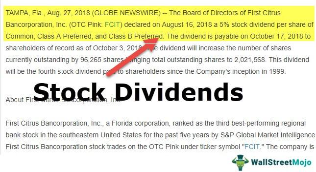

In an ever-evolving financial landscape, dividend stocks remain a prevalent choice among investors seeking both steady income and long-term growth. These stocks, typically from companies that return a portion of their profits to shareholders, have historically offered resilience during periods of market volatility. They provide a dual advantage: yielding regular income through dividends and offering potential capital appreciation. Their appeal persists as investors navigate through complex and often unpredictable economic cycles.

Alongside this, advancements in technology have ushered in a new era for trading and investment strategies, prominently featuring algorithmic trading (algo trading). Algo trading employs computer programs to automate trading decisions based on predefined criteria, enhancing the speed and precision of trade execution. By rapidly analyzing large datasets and eliminating emotional decision-making biases, algorithmic strategies offer investors refined tools to maximize returns while minimizing risks.



Approaching October 2024, it becomes imperative for investors to grasp the prevailing market trends and devise effective strategies to optimize their dividend stock investments. The integration of algorithmic approaches with traditional dividend stock strategies presents a modernized pathway to navigate the complexities of today's financial markets. This dual approach not only refines stock selection processes but also assists in identifying optimal entry and exit points, thereby enhancing overall portfolio performance.

This article explores the synergy between dividend stocks and algo trading, providing insights into constructing a robust investment portfolio. By understanding how algorithmic methods can be aligned with dividend stock strategies, investors can potentially unlock enhanced returns and adapt effectively to the shifting market dynamics of 2024.

## Table of Contents

## Understanding Dividend Stocks

Dividend stocks are equity securities from companies that allocate a portion of their profits as dividends to shareholders. These stocks attract investors who seek a reliable income stream along with the opportunity for capital appreciation. Dividend-paying stocks have traditionally exhibited resilience amidst market volatility, often serving as a stabilizing component in investment portfolios.

**Key Metrics for Dividend Stocks**

When evaluating dividend stocks, investors typically examine several critical metrics:

1. **Dividend Yield**: This metric indicates how much a company pays out in dividends relative to its stock price and is expressed as a percentage. It can be calculated using the following formula:
$$
   \text{Dividend Yield} = \frac{\text{Annual Dividends per Share}}{\text{Price per Share}} \times 100

$$

   A higher dividend yield might suggest a good investment opportunity, providing higher income. However, exceedingly high yields can sometimes signal underlying financial distress within a company, necessitating a careful examination.

2. **Payout Ratio**: This ratio reveals the proportion of earnings paid out as dividends to shareholders. It is calculated as:
$$
   \text{Payout Ratio} = \frac{\text{Dividends per Share}}{\text{Earnings per Share}} \times 100

$$

   A payout ratio below 50% is generally considered sustainable, allowing the company to reinvest in its growth initiatives while still returning profits to shareholders. 

**Historical Performance**

Historically, dividend-paying stocks have exhibited a capacity to endure market fluctuations better than their non-dividend counterparts. During economic downturns, such stocks often continue to provide consistent dividend payouts, offering investors an income cushion. The reliability of dividend payments can provide peace of mind, particularly in volatile markets, and adds a layer of predictability to investment returns.

**Conclusion**

For investors aiming for a diversified portfolio, dividend stocks present a compelling option that can ensure regular income and the potential for value appreciation. By monitoring key metrics like dividend yield and payout ratios, alongside other financial indicators, investors can identify stocks that align best with their investment strategy and risk appetite. This disciplined approach can strengthen the overall portfolio, especially in uncertain market conditions.

## The Growth of Algo Trading

Algorithmic trading involves the use of advanced computer algorithms to automatically execute trades based on pre-established criteria. This methodology has revolutionized the financial markets, providing a means for traders to manage vast volumes of data and execute transactions with remarkable speed. The capacity for rapid data processing enables [algorithmic trading](/wiki/algorithmic-trading) (algo trading) to capitalize on market conditions that might be invisible or inaccessible to manual traders. 

The appeal of algorithmic trading to investors is largely attributed to its potential to eliminate emotional biases. Emotional decision-making is a well-documented pitfall in investment strategies, often leading to irrational trades that deviate from a trader's original strategy. By relying on computer algorithms, investors can ensure that trades are executed based solely on objective criteria, thus minimizing human error. Algorithms are programmed to respond to specific signals from the market, allowing for efficient and precise decision-making that is not influenced by emotional responses to market fluctuations.

Several strategies underline the operation of algo trading. 

1. **Market Making**: This strategy involves placing limit orders to buy and sell simultaneously, aiming to capture the spread between the bid and ask price. Market makers profit from this spread by providing liquidity to the market.

2. **Trend Following**: Trend-following algorithms capitalize on market momentum by identifying trends in asset prices and executing trades in the direction of these trends. This strategy does not predict price levels but rather seeks to ride the trend as long as it continues.

3. **Arbitrage**: Arbitrage exploits price discrepancies between different markets or instruments. Algorithms quickly identify and act on these discrepancies, profiting from the price differences before the market corrects itself. 

Understanding the benefits and limitations of algo trading is essential for developing a successful investment strategy. While it offers the distinct advantage of processing and responding to data with unparalleled speed and accuracy, it is not without constraints. High-frequency trading, for instance, has come under scrutiny for contributing to market [volatility](/wiki/volatility-trading-strategies) and posing systemic risks. Additionally, algo trading requires substantial technological infrastructure and precise programming, which can incur significant costs. Human oversight remains necessary to adjust algorithms in response to changing market conditions and to interpret data more contextually when required.

Overall, the growth of algorithmic trading has reshaped modern finance, offering investors new methodologies for maximizing returns while managing risks. Its impact continues to evolve with technological advancements, promising even more sophisticated trading approaches in the future.

## Synergy Between Dividend Stocks and Algo Trading

Combining dividend stock investment with algorithmic trading can significantly enhance portfolio performance by leveraging data-driven decision-making and automated processes. Algorithmic trading provides several advantages that aid in refining dividend stock strategies. 

Firstly, algorithmic trading systems can efficiently identify stocks with consistent dividend growth by analyzing extensive historical data and financial indicators. Algorithms can automate the screening process to pinpoint stocks with strong fundamentals, such as growing earnings and cash flow, which are indicators of reliable dividend payments. This automated analysis reduces manual effort and increases the precision of stock selection.

Additionally, algo trading aids in determining optimal entry and [exit](/wiki/exit-strategy) points for dividend stocks. By assessing patterns and trends through technical analysis, algorithms can time purchases and sales to maximize returns. This is particularly beneficial in volatile markets where emotions can lead to impulsive decisions. For example, using moving averages or the Relative Strength Index (RSI), algorithms can generate signals for buying or selling dividend stocks based on market [momentum](/wiki/momentum) and trend reversals.

Case studies of successful dividend stock algorithms highlight their potential impact on investor returns. Consider a scenario where an algorithm is backtested over historical data, revealing its ability to consistently identify undervalued dividend stocks and execute trades that outperform the market. Such algorithms provide a competitive edge, allowing investors to capitalize on systematic patterns that may not be apparent through traditional analysis.

Customization and [backtesting](/wiki/backtesting) are critical for tailoring algorithms to individual investment goals and risk tolerances. Investors can modify parameters, such as the threshold for dividend yield or payout ratio, to align with their strategies. Backtesting algorithms over historical data ensures that they are robust and capable of functioning effectively under varying market conditions. For example, the use of Python with libraries like pandas and [backtrader](/wiki/backtrader) enables investors to simulate strategies and analyze performance outcomes:

```python
import pandas as pd
import backtrader as bt

class DividendStrategy(bt.SignalStrategy):
    def __init__(self):
        self.signal_add(bt.SIGNAL_LONG, self.data.dividend_yield() > 0.02)  # example criterion

cerebro = bt.Cerebro()
data = bt.feeds.PandasData(dataname=pd.DataFrame(...))  # historical data
cerebro.adddata(data)
cerebro.addstrategy(DividendStrategy)
cerebro.run()
```

Developing a successful dividend stock algorithm involves ongoing monitoring and adjustments. Market conditions continuously evolve, necessitating periodic updating of algorithms to ensure they reflect current economic realities. Regular evaluation can prevent strategy decay and enhance long-term profitability.

In sum, the synergy between dividend stock investment and algorithmic trading lies in the latter's ability to systematically adjust to market dynamics, thus improving decision-making and potential returns. This strategic combination enables investors to maintain a disciplined approach while aligning investments with precise, data-driven insights.

## Market Trends in October 2024

As October 2024 unfolds, various market trends are poised to shape dividend stocks and algorithmic trading strategies. Understanding these trends is crucial for investors aiming to adapt and optimize their portfolios effectively.

Economic indicators remain critical in determining market directions. In 2024, global economic conditions have been influenced by the unwinding of fiscal stimulus measures and inflationary pressures in numerous economies. Investors must closely monitor central bank policies, particularly interest rates, which are pivotal for dividend stock investments. Higher interest rates might challenge dividend stocks by making bonds and other fixed-income investments more attractive. However, historically, sectors such as utilities, consumer staples, and healthcare have shown resilience and continued to offer reliable dividend growth even in tighter monetary environments.

Geopolitical factors also play a substantial role in shaping market dynamics. In 2024, ongoing geopolitical tensions, such as trade negotiations between major economies and regional conflicts, could introduce volatility. These factors stress-test the robustness of dividend-paying companies, and investors should be vigilant in assessing geopolitical risks while crafting their strategies.

Technological advancements continue to revolutionize algo trading platforms, significantly impacting investor approaches. In 2024, enhancements in [machine learning](/wiki/machine-learning) and [artificial intelligence](/wiki/ai-artificial-intelligence) have enabled algorithms to process complex data more rapidly and accurately. Retail investors now have access to sophisticated algo trading tools that were once exclusive to institutional investors. These advancements have democratized trading, allowing individual investors to utilize data-driven strategies previously inaccessible to them.

Investors should consider sectors that exhibit potential for dividend growth amidst these trends. Technology and healthcare sectors, driven by innovation and aging demographics respectively, promise robust dividend prospects. Additionally, companies within the renewable energy sector could present attractive opportunities due to global sustainability initiatives, potentially offering lucrative dividends.

To navigate these evolving trends effectively, investors must remain vigilant, continuously monitoring economic indicators and geopolitical developments. Aligning dividend stock strategies with the latest advancements in algo trading can offer a competitive edge. By understanding and adapting to these market forces, investors can make informed strategic adjustments, optimizing returns and managing risks effectively.

## Building a Successful Dividend Stock Portfolio with Algo Trading

Building a successful dividend stock portfolio with algorithmic trading involves a strategic approach that aligns with individual investment objectives and an understanding of market dynamics. Here is a comprehensive guide to effectively managing and optimizing such a portfolio:

### Investment Objectives and Risk Appetite

Before integrating algorithmic trading for dividend stocks, clearly define your investment objectives and risk tolerance. Understanding these parameters will aid in selecting suitable dividend stocks and shaping algorithmic strategies that align with your financial goals. 

### Selecting and Programming Algorithms

Choosing the right algorithmic strategies is crucial for maximizing the potential of dividend stock investments. Here’s a step-by-step process to get started:

1. **Define the Criteria:** Determine essential factors such as dividend yield, payout ratio, dividend growth rate, and historical volatility. These metrics will guide the selection of dividend stocks.

2. **Develop the Algorithm:** Utilize programming languages like Python to create algorithms that can screen and monitor stocks based on the defined criteria. Below is a basic example of a Python script to filter stocks with desirable dividend characteristics:

   ```python
   import pandas as pd

   # Example dataset of stocks
   data = {
       'Stock': ['A', 'B', 'C'],
       'Dividend_Yield': [0.03, 0.05, 0.02],
       'Payout_Ratio': [0.6, 0.4, 0.7],
       'Dividend_Growth': [0.08, 0.05, 0.07]
   }

   df = pd.DataFrame(data)

   # Define desired criteria for stock selection
   selected_stocks = df[(df['Dividend_Yield'] > 0.03) & (df['Payout_Ratio'] < 0.65)]

   print(selected_stocks)
   ```

3. **Backtesting:** Before deployment, evaluate the algorithm’s effectiveness by backtesting it on historical data. This ensures the strategy is robust and capable of delivering intended outcomes.

### Diversification

Diversification is fundamental in mitigating risk and maximizing returns. By holding a variety of dividend stocks across different sectors and geographies, the impact of sector-specific volatility can be reduced. In the context of algorithms, diversification can involve programming strategies that simultaneously manage multiple stocks with different risk characteristics.

### Continuous Monitoring and Adjustment

Algorithmic trading requires continuous assessment and refinement to adapt to changing market conditions. Regularly monitor performance metrics and tweak algorithm parameters to address market shifts. Implement automated alert systems to notify you of significant performance deviations or changes in stock fundamentals.

### Cost Management

Effective cost management is crucial in ensuring algorithmic trading’s profitability. Consider the following:

- **Transaction Fees:** Be mindful of trading fees as frequent transactions can erode profits. Opt for brokers that offer competitive transaction pricing.
- **Software Expenses:** Factor in the costs of trading platforms and algorithmic tools. Some platforms may offer free usage, while others require subscriptions.
- **Infrastructure Costs:** Ensure computing resources and internet connectivity are robust to support algorithmic operations without interruptions.

By meticulously planning each aspect of the algorithmic trading process, investors can craft a dividend stock portfolio that not only targets steady income but also leverages technology to optimize returns.

## Conclusion

Dividend stocks continue to be a primary choice for income-focused investors due to their potential for delivering both stability and regular income returns. These stocks typically belong to established companies with a history of profit-sharing, which appeals to investors prioritizing consistent returns. Amidst fluctuating market conditions, dividend stocks offer a measure of reliability, contributing to their invaluable role in investment portfolios.

Simultaneously, algorithmic trading has emerged as a cutting-edge approach within the investment landscape, offering sophisticated techniques to refine and optimize strategies. By utilizing advanced algorithms and data analytics, investors can process large amounts of information efficiently, identifying patterns and trends that might be missed by human analysis alone. This technology-driven approach diminishes emotional biases and enhances decision-making capabilities, leading to potentially improved investment outcomes.

As we move towards October 2024, the strategic integration of dividend stocks and algorithmic trading presents considerable opportunities for portfolio growth and enhancement. Investors equipped with the insights and strategies discussed can effectively harness the advantages of both elements. By selectively incorporating algorithmic tools and continuously adjusting strategies based on market dynamics, investors can unlock new potential in their dividend stock portfolios.

To maximize these opportunities, investors must maintain an informed and adaptive approach. Staying updated with market trends, economic indicators, and advancements in trading technology is crucial. By leveraging the synergy between dividend stocks and algorithmic trading, investors can craft strategies that not only withstand market volatility but also capitalize on emerging opportunities in the financial landscape.

## References & Further Reading

[1]: ["Advances in Financial Machine Learning"](https://books.google.com/books/about/Advances_in_Financial_Machine_Learning.html?id=oU9KDwAAQBAJ) by Marcos Lopez de Prado

[2]: ["Quantitative Trading: How to Build Your Own Algorithmic Trading Business"](https://books.google.com/books/about/Quantitative_Trading.html?id=j70yEAAAQBAJ) by Ernest P. Chan

[3]: Bergstra, J., Bardenet, R., Bengio, Y., & Kégl, B. (2011). ["Algorithms for Hyper-Parameter Optimization."](https://papers.nips.cc/paper/4443-algorithms-for-hyper-parameter-optimization) Advances in Neural Information Processing Systems 24.

[4]: ["Machine Learning for Algorithmic Trading"](https://github.com/PacktPublishing/Machine-Learning-for-Algorithmic-Trading-Second-Edition) by Stefan Jansen

[5]: ["Evidence-Based Technical Analysis: Applying the Scientific Method and Statistical Inference to Trading Signals"](https://www.amazon.com/Evidence-Based-Technical-Analysis-Scientific-Statistical/dp/0470008741) by David Aronson