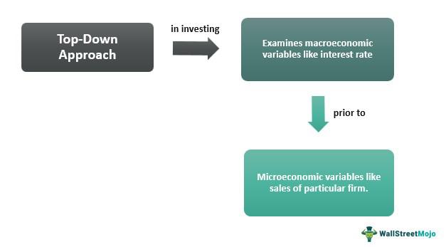

The landscape of investing is vast and varied, presenting a plethora of strategies that cater to diverse investment goals and risk appetites. Among these, the top-down approach stands out as a strategy that integrates financial analysis with macroeconomic perspectives. This methodology emphasizes the analysis of global and national economic indicators to guide investment decisions, gradually narrowing the focus from broad economic conditions to specific industries and individual securities. Unlike the bottom-up approach, which concentrates on company-specific factors first, the top-down approach prioritizes the larger economic picture as the initial filter for investment opportunities.

By providing a structured framework, the top-down approach aids investors in aligning their portfolios with macroeconomic trends, potentially enhancing decision-making and risk management. This strategy is particularly relevant in algorithmic trading, where mathematical models are utilized to interpret economic data and execute trades. Such integration of top-down analysis within investment strategy highlights not only tangible benefits but also presents challenges, which include the complexity of macroeconomic analysis and the sensitivity to global events.



In this article, we explore these aspects in detail, examining how the top-down approach can be effectively applied to investment strategies, especially in the context of modern algorithmic trading. This exploration aims to provide insights into the benefits and limitations associated with this approach, offering a comprehensive understanding of its role in navigating complex financial markets.

## Table of Contents

## Understanding the Top-Down Approach

The top-down approach in investment strategy commences with a broad macroeconomic analysis. This method involves thoroughly examining national and global economic indicators to form an overarching perspective on the economic landscape. Key metrics such as Gross Domestic Product (GDP) growth rates, inflation levels, employment statistics, and monetary policies from central banks are crucial. By assessing these indicators, investors can gauge the economic health of nations and predict future market movements.

In this strategy, the primary focus is on understanding broader economic conditions. Investors start by analyzing trends and patterns at a macro level before delving into more granular levels of analysis. This means evaluating the economic climate to identify which regions or sectors exhibit favorable conditions for potential investment. Once this macroeconomic foundation is built, attention is directed towards specific industries likely to benefit from the prevailing economic environment.

The top-down approach is often contrasted with the bottom-up approach. While the top-down strategy begins with a big-picture view, focusing on economies as a whole and gradually narrowing down to sectors and individual securities, the bottom-up approach works in the opposite manner. Bottom-up investors prioritize analyzing individual companies, scrutinizing financial statements and operational efficiencies before considering broader economic contexts.

By utilizing the top-down method, investors aim to align their investment choices with economic cycles. This alignment allows for strategic positioning across sectors that are anticipated to outperform due to macroeconomic trends, thereby optimizing the investment portfolio's potential for return based on comprehensive economic insights.

## Macroeconomic Analysis in a Top-Down Strategy

Macroeconomic analysis serves as a critical foundation in the top-down investment strategy, providing a broad overview of economic conditions that influence market dynamics. This analysis begins with the assessment of key economic indicators such as GDP growth, inflation rates, employment [statistics](/wiki/bayesian-statistics), and central bank policies.

**GDP Growth:** Gross Domestic Product (GDP) is a fundamental indicator of a country's economic performance, reflecting the total value of goods and services produced. Analysts examine GDP growth rates to evaluate economic health and potential expansion or contraction. A robust GDP growth often signals prosperous market conditions, whereas declining growth might indicate economic difficulties.

**Inflation Rates:** Inflation, the rate at which the general level of prices for goods and services rises, is a crucial factor in economic analysis. Persistent inflation can erode purchasing power and affect interest rates and consumer spending. Analysts utilize data such as the Consumer Price Index (CPI) or Producer Price Index (PPI) to forecast inflation trends, which directly influence investment decisions by impacting interest rates and asset valuations.

**Employment Statistics:** Employment levels provide insights into economic stability and consumer confidence. High employment rates usually reflect a strong economy, leading to increased consumer spending and investment opportunities. Conversely, rising unemployment can signal economic distress, decreasing disposable income and consumption.

**Central Bank Policies:** Central banks, through their monetary policies, significantly affect economic conditions. Adjustments in interest rates and quantitative easing measures are tools used to either stimulate or cool down the economy. Analysts track central bank statements and directives to anticipate changes in monetary policy, which can alter investment landscapes by influencing borrowing costs and liquidity.

By synthesizing these macroeconomic data points, analysts forecast overall market performances and identify regions or sectors poised to benefit from existing economic conditions. For instance, an economy experiencing strong GDP growth and low inflation may offer attractive investment opportunities in sectors such as technology or consumer goods. Conversely, sectors like utilities or healthcare might be more resilient in slower economic conditions. Through meticulous macroeconomic analysis, the top-down strategy helps investors allocate assets strategically, aiming to align with favorable economic trends and optimize returns.

## Sector and Industry Focus

Once favorable economic trends have been identified using a top-down approach, the next logical step is to focus on specific sectors and industries that are likely to benefit and outperform in the given economic environment. This analysis is crucial as it enables investors to channel their resources into areas that offer the highest potential for returns driven by broader economic conditions.

Key factors such as technological advancements and regulatory changes significantly impact sector performance. For instance, technological innovations may offer competitive advantages to certain industries, while regulatory changes can create opportunities or pose challenges. For example, advancements in renewable energy technology can bolster sectors related to clean energy, while stringent carbon emission regulations may hinder traditional fossil fuel industries.

Analyzing sector trends requires a comprehensive understanding of both specific industry dynamics and overarching technological and regulatory contexts. This approach can involve examining historical data and current trends to anticipate future performance. Investors often use quantitative models to predict sector performance, incorporating variables like technological change and regulation.

Below is a simplified Python example of how such a model might look when forecasting industry growth based on given factors:

```python
import numpy as np
import pandas as pd
from sklearn.linear_model import LinearRegression

# Example data: sector growth (in %) depending on technological impact and regulation change
data = {
    'Technological Impact': [1.5, 2.0, 2.5, 3.0, 3.5],
    'Regulation Change': [-1.0, -0.5, 0.0, 0.5, 1.0],
    'Sector Growth': [3.0, 3.5, 4.0, 4.5, 5.0]
}

df = pd.DataFrame(data)

X = df[['Technological Impact', 'Regulation Change']]
y = df['Sector Growth']

model = LinearRegression()
model.fit(X, y)

# Example prediction: new technological impact and regulation change
new_data = np.array([[3.1, 0.2]])
predicted_growth = model.predict(new_data)

print(f"Predicted Sector Growth: {predicted_growth[0]:.2f}%")
```

This code exemplifies how an investor might predict sector growth based on technological innovation and regulatory adjustments. The model depicted is elementary and primarily for illustrative purposes; real-world applications would incorporate broader datasets and more sophisticated algorithms.

Focusing on sector and industry trends is crucial in a top-down strategy, as it bridges macroeconomic analysis with actionable investment insights. Strategically timed investments in promising sectors can lead to enhanced portfolio performance, exploiting macroeconomic cycles effectively.

## Algorithmic Trading and Top-Down Strategies

Algorithmic trading integrates top-down analysis by utilizing macroeconomic data to inform trading strategies. This approach involves the use of sophisticated algorithms to process vast amounts of data, enabling traders to make informed decisions based on economic indicators like GDP growth, inflation trends, and [interest rate](/wiki/interest-rate-trading-strategies) changes.

Algo-traders develop models that are particularly sensitive to these macroeconomic signals. For instance, a model might incorporate GDP growth rates as a variable to predict stock market trends. An example Python function could be:

```python
def gdp_growth_impact(gdp_growth, sensitivity_factor):
    return gdp_growth * sensitivity_factor
```

Here, `gdp_growth` is the current GDP growth percentage, and `sensitivity_factor` determines how strongly this rate affects investment decisions.

A prominent aspect of [algorithmic trading](/wiki/algorithmic-trading) within the top-down framework is sector rotation. This strategy involves dynamically shifting investments across industries based on anticipated changes in economic cycles. By analyzing economic indicators, traders are able to predict which sectors will perform well in specific phases of the economic cycle. For instance, during economic expansion, cyclical sectors like consumer discretionary and industrials might be favored, whereas in a downturn, defensive sectors like utilities or healthcare could be prioritized.

The integration of these economic insights into algorithmic models allows for the execution of trades that align with anticipated macroeconomic changes. By continually adapting to new data and predictions, algo-traders can streamline investment portfolios, optimizing them for performance in varying economic contexts. This approach not only enhances decision-making but also contributes to more efficient risk management in trading operations.

## Benefits of the Top-Down Approach

The top-down approach offers several benefits that make it an attractive strategy for investors seeking to align their portfolios with broader economic trends. By providing a comprehensive perspective that begins with macroeconomic analysis, this approach aids in informed decision-making processes. Investors can evaluate national and global economic indicators such as GDP growth, inflation rates, and employment statistics before making decisions at the sector and industry levels. This helps them form a holistic view of the market landscape, ensuring that investments are supported by robust economic rationale.

This methodology significantly facilitates risk management by allowing for diversification across various sectors and regions. For example, by investing in sectors at different stages of the economic cycle, investors can potentially mitigate risks associated with sector-specific downturns. If one sector underperforms due to economic conditions or unforeseen events, other sectors aligned with positive economic trends can balance the overall portfolio performance. This diversification acts as a buffer against localized economic shocks.

Another key advantage of the top-down approach is its ability to align with economic cycles, which can stabilize returns over time. As macroeconomic indicators shift, the top-down strategy can guide investors to adjust their portfolios in anticipation of these changes. By adapting to the cyclical nature of economies—expansion, peak, contraction, and trough—investors can optimize their holdings to capture growth during expansions and protect against losses during contractions. This cyclical alignment increases the likelihood of achieving steady returns throughout different phases of the economic cycle.

Overall, the top-down approach equips investors with strategic insights that can enhance the resilience and performance of their investment portfolios, allowing them to navigate complex and fluctuating market conditions efficiently.

## Challenges and Limitations

The top-down approach to investing, while providing a broad perspective on macroeconomic trends, is not without its challenges and limitations. Analyzing macroeconomic trends requires a deep understanding of economics and significant expertise. Investors must interpret vast amounts of data, such as gross domestic product (GDP) growth, inflation rates, and employment statistics, which can be complex and evolving. Even with sophisticated models, accurately predicting how these variables will interact and influence markets is difficult. Economic indicators do not operate in isolation, and their interplay adds layers of complexity to the analysis.

Moreover, investment strategies based on the top-down approach are inherently sensitive to global events. Geopolitical tensions, policy shifts by central banks, or unexpected natural disasters can lead to rapid changes in economic conditions, which can unpredictably impact investments. These events often come with little warning, and their effects can cascade through global markets, sometimes rendering existing analyses obsolete.

Another significant limitation is the potential over-reliance on broader economic trends. While macroeconomic insights are crucial, they might overshadow important microeconomic factors. For instance, a focus on high-level economic data might overlook the intrinsic value or innovation potential of individual companies. This can lead to missed investment opportunities, as specific company strengths or weaknesses are not adequately considered. The challenge lies in maintaining a balanced perspective, integrating macroeconomic foresight with an understanding of company-specific fundamentals.

In conclusion, while the top-down approach provides a structured framework grounded in economic theory, its effectiveness can be undermined by the complexities of economic analysis, sensitivity to global events, and the risk of neglecting microeconomic nuances. Investors must exercise caution and complement their macroeconomic analysis with a keen awareness of industry and company-specific insights.

## Real-World Applications and Case Studies

Bridgewater Associates is renowned for its meticulous implementation of the top-down approach in its macroeconomic strategies. Founded by Ray Dalio in 1975, the firm has successfully navigated global financial markets by prioritizing macroeconomic indicators to inform its investment decisions. Bridgewater's strategy emphasizes a deep understanding of global economies, analyzing key metrics such as GDP growth, inflation rates, and monetary policies to predict market trends. This macro-focused perspective allows Bridgewater to identify and capitalize on favorable investment opportunities across various regions and sectors. The firm's flagship [hedge fund](/wiki/hedge-fund-trading-strategies), Pure Alpha, is a testament to its effective use of the top-down approach, consistently delivering returns by aligning investments with macroeconomic forecasts.

Similarly, Lazard Asset Management effectively integrates top-down analysis within its investment methodologies. Lazard focuses on identifying economic themes and trends that are likely to drive markets over the long term. By starting with a broad analysis of global economic conditions, the firm narrows its investment choices to sectors and regions expected to benefit most from these macroeconomic trends. Lazard's approach involves a rigorous examination of economic data and policy developments to forecast the performance of different asset classes. This enables the firm to construct diversified portfolios that reflect an informed view of potential macroeconomic scenarios.

Both Bridgewater Associates and Lazard Asset Management illustrate the practical application of top-down investing in aligning portfolios with macroeconomic ideas. Their strategies underscore the importance of macroeconomic analysis as a cornerstone of informed investment decision-making, highlighting how a structured framework can help navigate the complexities of global financial markets. By leveraging comprehensive economic insights, these firms exemplify how top-down methodologies can create robust investment strategies that respond adeptly to changing market conditions.

## Conclusion

Top-down investment strategies offer a structured framework for aligning investments with macroeconomic trends. These strategies begin with a broad analysis of economic indicators, such as GDP growth, inflation, and employment rates, which sets the stage for informed investment decisions. By providing a macroeconomic perspective first, investors are better equipped to understand the larger economic cycles and identify sectors poised for growth.

While these strategies present unique challenges, primarily due to the complexity and expertise required to interpret macroeconomic data accurately, they offer robust tools for risk management. One key advantage is the potential for diversification across various sectors and regions, mitigating risks associated with concentrating investments in a single area. Additionally, by aligning investment choices with economic cycles, investors may achieve more stable returns over time, as they adjust their portfolios to match predicted economic trends.

Understanding the top-down approach is crucial for investors aiming to navigate complex financial markets effectively. This strategic perspective allows for an anticipatory stance in investing, whereby decisions are based on the expected future state of the market rather than solely on historical performance. By integrating these insights, investors can enhance their ability to weather economic fluctuations and optimize their investment outcomes.

## References & Further Reading

[1]: Mauboussin, M. J., & Callahan, D. (2015). ["Dispatches from the Front: The Role of Macro Analysis in Portfolio Management."](https://www.semanticscholar.org/author/Michael-J.-Mauboussin/72179334) Morgan Stanley Investment Management.

[2]: Leinweber, D. (2009). ["Nerds on Wall Street: Math, Machines and Wired Markets."](https://archive.org/details/nerdsonwallstree0000lein) John Wiley & Sons.

[3]: Treynor, J. L., & Mazuy, K. K. (1966). ["Can Mutual Funds Outguess the Market?"](https://www.semanticscholar.org/paper/Can-mutual-funds-outguess-the-market-Harvard-Review-Treynor-Mazuy/46f77dbcc3c07c1475640aa0a4ef4a957c026d99) Harvard Business Review, 44(4), 131-136.

[4]: Bodie, Z., Kane, A., & Marcus, A. J. (2014). ["Investments."](https://www.mheducation.com/highered/product/Investments-Bodie.html) McGraw-Hill Education.

[5]: Dalio, R. (2017). ["Principles: Life and Work."](https://www.amazon.com/Principles-Life-Work-Ray-Dalio/dp/1501124021) Simon & Schuster.

[6]: Asness, C. S., Moskowitz, T. J., & Pedersen, L. H. (2013). ["Value and Momentum Everywhere."](https://onlinelibrary.wiley.com/doi/abs/10.1111/jofi.12021) The Journal of Finance, 68(3), 929-985.

[7]: Fabozzi, F. J., & Focardi, S. M. (2008). ["The Mathematics of Financial Modeling and Investment Management."](https://archive.org/download/mathematics_202103/%28Wiley%20Finance%20060%29The%20Mathematics%20of%20Financial%20Modeling%20and%20Investment%20Management.pdf) Wiley.

[8]: Ellis, C. D. (1975). ["The Loser's Game."](https://www.empirical.net/wp-content/uploads/2012/06/the_losers_game.pdf) Harvard Business Review.

[9]: Brinson, G. P., Hood, L. R., & Beebower, G. L. (1986). ["Determinants of Portfolio Performance."](https://www.semanticscholar.org/paper/Determinants-of-Portfolio-Performance-Brinson-Hood/ef3a2d1bfbe55685903e538bcf329993eeb958d3) Financial Analysts Journal, 42(4), 39-44.