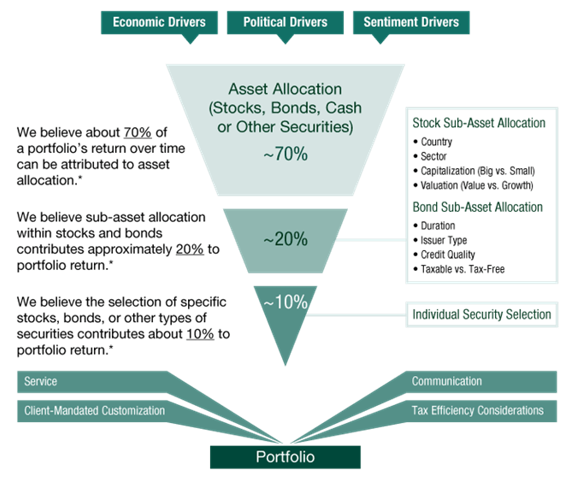

## Table of Contents

## What is a top-down investment strategy?

A top-down investment strategy is a way of choosing where to invest money by starting with a big picture view of the world. Instead of looking at individual companies first, investors using this strategy begin by looking at the overall economy, different countries, and big industries. They try to figure out which parts of the world or which industries are likely to do well in the future. For example, they might decide that technology or healthcare will grow a lot, so they focus on those areas.

After deciding on the big trends, investors then look for specific companies within those promising industries or countries. They might choose to buy stocks, bonds, or other investments in those companies. This approach can help investors make decisions based on broad economic changes and trends, rather than just looking at how a single company is doing. It's like planning a trip by first choosing the country and then picking the cities to visit, rather than starting with a specific hotel.

## How does a top-down investment strategy differ from a bottom-up approach?

A top-down investment strategy and a bottom-up approach are two different ways to pick investments. In a top-down strategy, investors start by looking at the big picture. They analyze the global economy, different countries, and major industries to find out which ones are likely to do well. Once they decide on promising areas, they then look for specific companies within those areas to invest in. It's like planning a trip by first choosing the country and then picking the cities to visit.

On the other hand, a bottom-up approach starts with individual companies. Investors using this method look closely at a company's financial health, its products, management, and growth potential without worrying much about the broader economic trends. They believe that a good company can do well even if the overall industry or economy is struggling. It's like planning a trip by choosing a great hotel first and then figuring out which city it's in.

Both strategies have their strengths and can be useful depending on what an investor is looking for. A top-down approach can help capture big trends and economic shifts, while a bottom-up approach can uncover hidden gems that might be overlooked by others.

## What are the key steps involved in implementing a top-down investment strategy?

To implement a top-down investment strategy, you start by looking at the big picture of the world's economy. You study things like how fast different countries are growing, what's happening with interest rates, and which industries are doing well. You might decide that technology or healthcare is going to grow a lot in the future. Once you figure out which parts of the world or which industries look promising, you move on to the next step.

After deciding on the big trends, you then look for specific companies within those promising areas. You might choose to invest in stocks, bonds, or other types of investments in those companies. The idea is to pick the best companies that fit into the trends you've identified. This way, you're hoping to benefit from the overall growth of those industries or countries.

In summary, a top-down investment strategy involves first understanding the global economic environment and then narrowing down to specific industries and companies. It's about seeing the forest before focusing on the trees, and it can help you make investment decisions based on broad trends rather than just individual company performance.

## What economic indicators should be considered in a top-down analysis?

In a top-down investment strategy, you need to look at big economic indicators to understand the overall health of the economy. Some important ones are GDP growth rates, which tell you how fast a country's economy is growing. Unemployment rates are also key because they show how many people are out of work. Inflation rates are crucial too, as they tell you how fast prices are going up. Interest rates set by central banks can affect borrowing costs and influence economic activity. You should also consider consumer confidence, which shows how people feel about their financial future, and trade balances, which tell you if a country is exporting more than it's importing.

Once you have a good grasp of these big indicators, you can start to see which parts of the world or which industries might do well. For example, if a country has strong GDP growth and low unemployment, it might be a good place to invest. If inflation is high, you might want to look at industries that can pass on higher costs to customers, like consumer goods companies. Interest rates can affect sectors like real estate and banking, so keeping an eye on them helps you understand where to put your money. By looking at these indicators, you can make smarter choices about where to invest based on the bigger economic picture.

## How can global economic trends influence a top-down investment strategy?

Global economic trends can really shape a top-down investment strategy. When you're looking at the big picture, you want to see which parts of the world are doing well. For example, if a country's economy is growing fast, it might be a good place to invest. Things like how fast the economy is growing (GDP growth), how many people are out of work (unemployment rates), and how fast prices are going up (inflation rates) can tell you a lot. If you see that a country has strong growth and low unemployment, you might decide to put your money there because it looks like a safe bet.

These trends also help you pick which industries to focus on. If you notice that technology is booming around the world, you might want to invest in tech companies. Or if healthcare is growing because of an aging population, that could be a good area too. By looking at these big trends, you can figure out where to put your money to take advantage of what's happening globally. It's all about seeing the big changes and then finding the best places to invest within those changes.

## What role does sector analysis play in a top-down investment approach?

Sector analysis is a big part of a top-down investment approach. It's like looking at different parts of the economy to see which ones are doing well or might do well in the future. When you use a top-down strategy, you start by looking at the whole world's economy and then zoom in on specific countries or regions. After that, you look at different sectors, like technology, healthcare, or energy, to see which ones are growing fast or have good future prospects. By understanding which sectors are strong, you can decide where to put your money to take advantage of those trends.

Once you've figured out which sectors look promising, you then look for specific companies within those sectors to invest in. For example, if you see that the technology sector is booming, you might choose to invest in tech companies that are doing well or have good growth potential. Sector analysis helps you narrow down your choices and focus on the areas of the economy that are likely to perform well. This way, you're not just guessing where to invest; you're making smart choices based on big economic trends and the health of different sectors.

## How can an investor use top-down strategy to identify promising industries?

In a top-down investment strategy, an investor starts by looking at the big picture of the world's economy. They check things like how fast different countries are growing, how many people are out of work, and how fast prices are going up. By understanding these big trends, the investor can figure out which parts of the world are doing well. For example, if a country has a strong economy with low unemployment, it might be a good place to invest. Once they know which countries look promising, they can then focus on the different industries within those countries.

After [picking](/wiki/asset-class-picking) the right countries, the investor looks at different sectors like technology, healthcare, or energy to see which ones are growing fast or have good future prospects. They might notice that technology is booming because more people are using smartphones and computers. Or they might see that healthcare is growing because of an aging population. By understanding which sectors are strong, the investor can decide to put their money into those areas. This way, they're not just guessing where to invest; they're making smart choices based on big economic trends and the health of different industries.

## What are the advantages of using a top-down investment strategy?

Using a top-down investment strategy has some big advantages. First, it helps you see the big picture. You start by looking at the whole world's economy and figuring out which countries or regions are doing well. This can help you spot big trends early, like when a country's economy is growing fast or when a certain industry is booming. By understanding these big trends, you can make smarter choices about where to put your money. It's like planning a trip by first choosing the country and then picking the cities to visit, which can help you avoid missing out on big opportunities.

Another advantage is that it helps you focus on the most promising industries. Once you've figured out which parts of the world are doing well, you can then look at different sectors like technology, healthcare, or energy. By understanding which sectors are strong, you can decide to invest in those areas that are likely to grow. This way, you're not just guessing where to invest; you're making choices based on solid economic trends. It's a good way to take advantage of what's happening around the world and can lead to better investment decisions.

## What are the potential pitfalls or limitations of a top-down investment strategy?

A top-down investment strategy has some potential pitfalls. One big problem is that it can miss out on good opportunities in smaller companies or industries that aren't part of the big trends. If you're only looking at the big picture, you might not see a small company that's doing really well. Also, this strategy relies a lot on predicting big economic trends, which can be hard to do right. If your predictions are wrong, you could end up investing in the wrong places and lose money.

Another limitation is that top-down strategies can be slow to react to changes. Since you're focusing on big trends, it might take a while to notice that things are changing in smaller ways. For example, if a new technology comes out that changes an industry, a top-down investor might not see it right away. This can mean missing out on new opportunities or holding onto investments that are no longer good. It's important to keep an eye on the big picture, but also be ready to adjust your strategy if things change.

## How can an investor adjust a top-down strategy based on changing market conditions?

An investor can adjust a top-down strategy by keeping an eye on big changes in the world's economy. If they see that a country they thought was doing well is starting to slow down, they might want to move their money to another country that's doing better. Or if they notice that an industry they picked isn't growing like they thought it would, they can look for a different industry that's doing well. It's all about staying flexible and being ready to change their plans based on new information.

Another way to adjust is by checking the smaller details within the big trends. For example, if a new technology comes out that could change an industry, the investor should think about how it might affect their investments. They might need to sell some stocks and buy others that will do better with the new technology. By always looking at both the big picture and the smaller changes, an investor can keep their strategy working well even when the market changes.

## Can you provide a case study example of a successful top-down investment strategy?

In the early 2000s, a big investment firm noticed that China's economy was growing really fast. They saw that the country was becoming a major player in the world, with lots of people moving to cities and buying new things. The firm decided to use a top-down strategy, focusing on China first. They looked at different industries and saw that the demand for cars was going up a lot because more people could afford them. So, they decided to invest in Chinese car companies like BYD and Geely. Over the next few years, these companies did really well, and the firm made a lot of money from their investments.

Another example is from the 2010s when a group of investors saw that technology was changing the world. They used a top-down approach to look at the global economy and noticed that more and more people were using smartphones and the internet. They decided to focus on the technology sector, especially companies that were making software and services for these devices. They invested in big tech companies like Apple, Google, and Amazon. As technology kept growing, these companies became even more valuable, and the investors saw huge returns on their investments. This shows how looking at big trends can help investors pick the right places to put their money.

## How can advanced data analytics and technology enhance the effectiveness of a top-down investment strategy?

Advanced data analytics and technology can really help make a top-down investment strategy better. They let investors look at huge amounts of information from around the world quickly and easily. For example, they can use special computer programs to study things like how fast different countries are growing, how many people are out of work, and how fast prices are going up. This helps them see the big picture more clearly and spot trends that they might miss otherwise. By using these tools, investors can make smarter choices about which countries or industries to focus on, based on solid data instead of just guessing.

Also, technology can help investors keep up with changes in the market. They can use real-time data to see when things are changing and adjust their strategy quickly. For example, if a new technology comes out that could change an industry, they can use data analytics to understand how it might affect their investments. This way, they can move their money to new opportunities or away from areas that are no longer doing well. By staying on top of the latest information, investors can keep their top-down strategy working well even when the world is changing fast.

## References & Further Reading

[1]: Mauboussin, M. J., & Callahan, D. (2015). ["Dispatches from the Front: The Role of Macro Analysis in Portfolio Management."](https://www.semanticscholar.org/author/Michael-J.-Mauboussin/72179334) Morgan Stanley Investment Management.

[2]: Leinweber, D. (2009). ["Nerds on Wall Street: Math, Machines and Wired Markets."](https://archive.org/details/nerdsonwallstree0000lein) John Wiley & Sons.

[3]: Treynor, J. L., & Mazuy, K. K. (1966). ["Can Mutual Funds Outguess the Market?"](https://www.semanticscholar.org/paper/Can-mutual-funds-outguess-the-market-Harvard-Review-Treynor-Mazuy/46f77dbcc3c07c1475640aa0a4ef4a957c026d99) Harvard Business Review, 44(4), 131-136.

[4]: Bodie, Z., Kane, A., & Marcus, A. J. (2014). ["Investments."](https://www.mheducation.com/highered/product/Investments-Bodie.html) McGraw-Hill Education.

[5]: Dalio, R. (2017). ["Principles: Life and Work."](https://www.amazon.com/Principles-Life-Work-Ray-Dalio/dp/1501124021) Simon & Schuster.

[6]: Asness, C. S., Moskowitz, T. J., & Pedersen, L. H. (2013). ["Value and Momentum Everywhere."](https://onlinelibrary.wiley.com/doi/abs/10.1111/jofi.12021) The Journal of Finance, 68(3), 929-985.

[7]: Fabozzi, F. J., & Focardi, S. M. (2008). ["The Mathematics of Financial Modeling and Investment Management."](https://archive.org/download/mathematics_202103/%28Wiley%20Finance%20060%29The%20Mathematics%20of%20Financial%20Modeling%20and%20Investment%20Management.pdf) Wiley.

[8]: Ellis, C. D. (1975). ["The Loser's Game."](https://www.empirical.net/wp-content/uploads/2012/06/the_losers_game.pdf) Harvard Business Review.

[9]: Brinson, G. P., Hood, L. R., & Beebower, G. L. (1986). ["Determinants of Portfolio Performance."](https://www.semanticscholar.org/paper/Determinants-of-Portfolio-Performance-Brinson-Hood/ef3a2d1bfbe55685903e538bcf329993eeb958d3) Financial Analysts Journal, 42(4), 39-44.