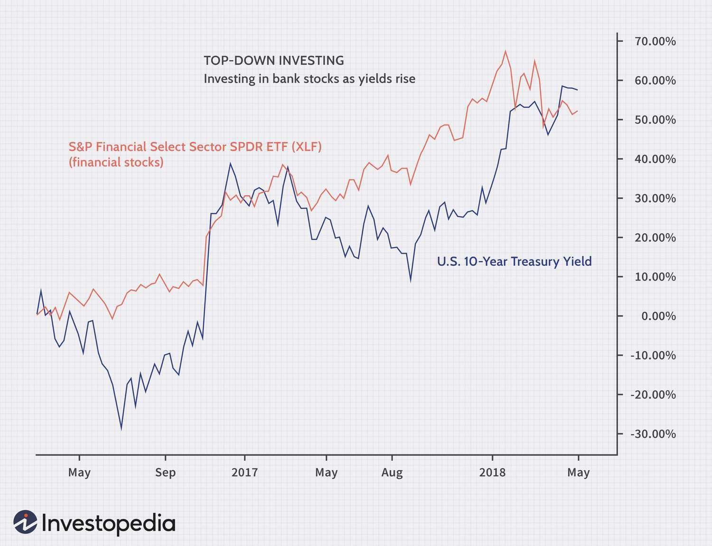

Investing in the financial markets requires a strategic approach to maximize returns while effectively managing risks. Investors have a variety of strategies to consider, each with its own methodology and focus. Two widely adopted techniques are top-down and bottom-up investing. Top-down investing emphasizes a macroeconomic perspective, starting with broader economic indicators to identify promising sectors before narrowing down to individual companies. In contrast, bottom-up investing prioritizes a microeconomic viewpoint, concentrating on the financial health and potential of individual companies regardless of industry trends.

Alongside these traditional strategies, algorithmic trading has emerged as a modern approach, utilizing technology and data analysis to inform and execute investment decisions. This strategy leverages computer algorithms to process vast amounts of financial data, enabling investors to act with speed and precision that surpasses human capabilities. 



This article will examine the principles and methodologies underlying top-down and bottom-up investing, elucidate their differences, and explore how algorithmic trading is revolutionizing contemporary investment practices. By understanding these strategies, investors can make informed decisions that align with their goals and adapt to the complexities of today's financial markets.

## Table of Contents

## What is Top-Down Investing?

Top-down investing is an investment strategy that commences with a broad analysis of macroeconomic factors to identify attractive sectors and industries before narrowing down to individual companies. This approach focuses on understanding general economic indicators, such as Gross Domestic Product (GDP) growth, interest rates, inflation, and other global economic trends, to predict which sectors might experience growth. For example, if interest rates are low, sectors like real estate or utilities, which often benefit from reduced borrowing costs, may present potential investment opportunities.

The top-down methodology entails a three-step process. Initially, investors assess the health and direction of the overall economy by considering variables such as fiscal policies, geopolitical events, and currency fluctuations. This macroeconomic analysis aims to determine the overall economic environment and identify sectors likely to thrive under current conditions.

After determining favorable sectors, the investor identifies industries within those sectors that are best positioned for growth. This second step involves evaluating industry-specific trends, such as technological advancements or regulatory changes, which might impact future performance. For instance, a surge in digital transformation might favor the technology industry over more traditional sectors.

Finally, within the chosen industries, investors select specific companies that are poised to benefit from the predicted trends. This involves analyzing individual firms’ competitive positioning, growth strategies, and financial health. Despite its systematic approach, top-down investing may inadvertently overlook robust companies that, although fundamentally strong, do not fit within the prevailing macroeconomic framework and sectoral trends.

While this strategy is acclaimed for its ability to uncover broad market trends and allocate resources accordingly, it may fail to capture microeconomic factors that underscore the performance of individual entities. As a result, top-down investors must be cognizant of the potential to miss out on lucrative opportunities presented by companies that excel irrespective of broader economic conditions.

## Understanding Bottom-Up Investing

Bottom-up investing is an investment strategy that prioritizes the analysis of individual companies over the broader market or economic conditions. At the core of this approach is the belief that a company's intrinsic value—determined by its fundamental characteristics like financial health, management quality, and competitive position—can predict its potential for growth and profitability, independent of the economic environment.

Investors using a bottom-up strategy typically conduct a thorough financial analysis of a company. This may include reviewing financial statements such as the balance sheet, income statement, and cash flow statement to assess profitability, [liquidity](/wiki/liquidity-risk-premium), and solvency. Key financial ratios such as the Price-to-Earnings (P/E) ratio, Return on Equity (ROE), and the Current Ratio might be calculated to provide further insights into the company's financial standing. The P/E ratio, for example, is a commonly used metric that indicates how much investors are willing to pay per dollar of earnings, which can shed light on the company’s valuation in comparison to its peers.

Management quality is another critical [factor](/wiki/factor-investing) in bottom-up investing. Investors often evaluate the experience of the company's leaders, their track record in executing business strategies, and their ability to adapt to challenges. Effective management teams are generally viewed as a catalyst for driving the company's success and long-term growth.

Competitive position is also meticulously assessed. This involves analyzing the company’s market share, the strength of its product or service offerings, its pricing power, and its ability to maintain competitive advantages against rivals. Companies with strong moats—unique advantages that protect them from competition—are especially attractive in bottom-up analysis.

Bottom-up investing is particularly favored for its potential to identify undervalued stocks—those trading below their intrinsic value—regardless of prevalent market or economic conditions. This strategy is instrumental in uncovering 'hidden gems,' which are stocks with growth potential that may not be evident at the macroeconomic level. Such an approach can lead investors to discover opportunities in companies that might be obscured by broader market trends.

In conclusion, bottom-up investing demands a detailed understanding of individual companies but offers the promise of superior returns by capitalizing on the intrinsic strengths of undervalued stocks. By focusing on microeconomic factors and the distinct attributes of companies themselves, this strategy extends an opportunity to outperform the broader market through astute, company-specific investment decisions.

## Comparing Top-Down and Bottom-Up Strategies

Top-down and bottom-up investment strategies represent two fundamentally different approaches to analyzing financial markets, each offering unique perspectives and opportunities. 

Top-down strategies emphasize a macroeconomic viewpoint, beginning with an analysis of broad economic indicators such as GDP growth, interest rates, and inflation. Investors using this approach first identify promising sectors by assessing overall economic health and sector-specific trends. Once attractive sectors are identified, investors focus on selecting the most promising companies within these sectors. The primary advantage of this method is its ability to capitalize on overarching economic trends that often drive significant market movements. However, it may overlook companies that do not align with larger economic narratives but have strong intrinsic potential.

In contrast, bottom-up strategies concentrate on microeconomic factors, starting with individual companies rather than economic trends. Investors utilizing this strategy conduct thorough due diligence, examining aspects such as financial statements, management quality, and competitive positioning. This approach aims to identify undervalued equities with strong fundamentals that can outperform, irrespective of broader economic conditions. The bottom-up method is particularly effective in uncovering niche opportunities or 'hidden gems' that may not be apparent from a macro perspective. However, it requires a detailed and comprehensive analysis of individual companies, which can be time-consuming and resource-intensive.

Many investors consider a hybrid approach, integrating both top-down and bottom-up perspectives to build a diversified portfolio. By doing so, they aim to balance broad economic insights with company-specific analysis, potentially enhancing returns and reducing risks. This strategy allows investors to leverage the strengths of both methods—using top-down insights to identify the most promising sectors and bottom-up analysis to select individual stocks within those sectors. This alignment can optimize portfolio performance by mitigating the limitations inherent to each standalone approach. 

In sum, both strategies provide valuable tools for investment analysis, with top-down focusing on macroeconomic trends and bottom-up targeting microeconomic details. The choice between them often depends on the investor's objectives, expertise, and risk tolerance, though combining elements of both can offer a comprehensive investment approach.

## Algorithmic Trading: A Technological Revolution

Algorithmic trading has transformed modern investing by harnessing computer algorithms to analyze and execute trades with unprecedented speed and precision. By leveraging sophisticated software, [algorithmic trading](/wiki/algorithmic-trading) can conduct transactions at speeds and frequencies far exceeding human capabilities. This approach systematically processes vast amounts of data to optimize investment strategies, integrating both top-down and bottom-up analyses. The core advantage of algorithmic trading is its ability to operate based on predefined criteria, minimizing human error and emotional bias, which often impede traditional trading methods.

Algorithmic trading strategies typically utilize statistical models and quantitative analysis to identify market opportunities. These strategies range from simple moving averages to complex [machine learning](/wiki/machine-learning) algorithms. Python, a popular language in this field, enables rapid development and deployment of such strategies. For example, a basic algorithmic trading strategy could involve using moving averages to determine buy or sell signals. Below is a simple Python code snippet illustrating this concept:

```python
import pandas as pd
import numpy as np

# Load historical stock data
data = pd.read_csv('historical_stock_data.csv')
data['Moving Average'] = data['Close'].rolling(window=20).mean()

# Generate trading signals
signals = np.where(data['Close'] > data['Moving Average'], 1, 0)

# Display the trading signals
data['Signal'] = signals
print(data[['Date', 'Close', 'Moving Average', 'Signal']])
```

This code calculates a 20-day moving average on historical stock data and generates trading signals based on whether the stock's closing price is above or below this average—a simplistic but effective method used in algorithmic trading.

Algorithmic trading's ability to digest and act on large volumes of data makes it particularly suited for dynamic and volatile markets. By effectively merging top-down macroeconomic trends with bottom-up company-level insights, algorithmic models can provide comprehensive understanding and execution strategies. Moreover, the discipline imposed by algorithmic systems helps investors avoid common pitfalls associated with emotional trading, contributing to more systematic and disciplined investing.

The technological advances in computing power, data storage, and algorithmic design have made algorithmic trading an essential tool for both institutional and retail investors. As the financial markets continue to evolve, the adoption of algorithmic trading strategies is expected to grow, offering opportunities to further streamline operations and enhance decision-making processes.

## When to Use Each Approach

Top-down investing is often selected by investors who are keen on capitalizing on economic cycles and broad market opportunities. This approach entails beginning at a macro level, evaluating economic indicators such as GDP growth, interest rates, and inflation. By identifying favorable sectors driven by these economic factors, investors can position themselves to benefit from larger trends. For instance, during a period of economic expansion, sectors like technology and consumer goods may present lucrative opportunities. Conversely, during downturns, more defensive sectors such as utilities or healthcare may be prioritized.

Bottom-up investing is preferred by those seeking long-term growth, particularly investors who possess in-depth knowledge and expertise in analyzing individual companies. This strategy involves a detailed examination of company-specific metrics such as financial statements, management quality, and competitive positioning. Investors aim to find undervalued stocks with strong fundamentals that have the potential to outperform irrespective of broader economic conditions. Such an approach suits investors with a keen interest in research and a focus on equity analysis rather than macroeconomic trends.

Algorithmic trading provides a different angle by leveraging technology to enhance efficiency and precision in executing trades. It is well-suited for tech-savvy investors who can develop or utilize advanced algorithms capable of processing and analyzing large datasets at high speeds. This method combines elements of both top-down and bottom-up analysis and is characterized by systematic execution, minimizing human error. Algorithmic trading strategies often include employing quantitative models to identify mispricing or market inefficiencies, thus allowing investors to capitalize on rapid market movements.

In summary, the choice of an investment approach should align with the investor's specific objectives and expertise. Those interested in macroeconomic cycles may find top-down investing more appropriate, while those focused on firm-specific attributes and long-term prospects might prefer a bottom-up strategy. Meanwhile, algorithmic trading serves those who can handle the technical demands and are seeking a more data-driven approach to investing.

## Benefits and Limitations

Top-down investing offers a comprehensive macroeconomic perspective, focusing on large-scale trends that can guide strategic decisions. By analyzing factors such as GDP growth, inflation rates, and global economic indicators, top-down investors can identify potentially lucrative sectors. However, this approach can sometimes lead to missed opportunities with individual stocks that excel independently of their sector's outlook. Such a macro-level strategy may overlook robust entities thriving in what are considered non-prominent industries.

On the other hand, bottom-up investing is centered around in-depth analysis of individual companies. This approach examines financial statements, management quality, and market competitiveness, aiming to find undervalued stocks with substantial growth potential. While this methodology can uncover high-performing stocks often missed by sector-focused investors, it necessitates a significant investment of time and effort. The extensive research and comprehensive analysis required can be a limitation for those with limited resources or without sufficient expertise in specific market segments.

Algorithmic trading represents a technologically advanced strategy that leverages complex mathematical models and computer algorithms to execute trades. This methodology can incorporate both top-down and bottom-up analyses, processing vast amounts of market data at speeds unattainable by human traders. While algorithmic trading enhances precision and efficiency, it also demands significant technical knowledge and access to sophisticated computational infrastructure. The initial setup and ongoing maintenance of algorithms require expertise in programming and financial modeling, making it an option primarily for those with a strong technical background. Furthermore, potential technical issues or model limitations pose additional risks, necessitating thorough testing and adaptation to changing market conditions.

## Conclusion

Selecting an appropriate investing strategy is a vital step for any investor, demanding a keen understanding of one's personal financial objectives, risk tolerance, and available resources. The top-down strategy provides a broad perspective, focusing on macroeconomic trends to identify sectors poised for growth. It's advantageous for investors keen on taking advantage of economic cycles, yet might miss companies thriving outside these cycles.

Conversely, the bottom-up strategy is tailored for those willing to commit time to meticulous company analysis, emphasizing individual financial performance over broader economic conditions. This strategy is ideal for identifying undervalued stocks and achieving long-term growth, which may be particularly rewarding for investors with a strong analytical background in evaluating companies.

Algorithmic trading represents a modern avenue, merging technology with investment strategies to make data-driven decisions at unprecedented speeds and scale. This approach suits tech-savvy investors, offering efficiency and the potential to minimize human errors. However, it requires significant technical expertise and computational resources, including the creation and maintenance of complex algorithms.

Ultimately, choosing a strategy—or a combination thereof—depends on the alignment of these methodologies with an investor's profile and financial ambitions. By integrating these approaches thoughtfully, investors can enhance their ability to steer through the multifaceted nature of global financial markets, potentially increasing their chances of achieving desired investment outcomes.

## References & Further Reading

[1]: ["Quantitative Value: A Practitioner's Guide to Automating Intelligent Investment and Eliminating Behavioral Errors"](https://www.amazon.com/Quantitative-Value-Web-Site-Practitioners/dp/1118328078) by Wesley R. Gray and Tobias E. Carlisle

[2]: ["Top-Down Analysis on a Monthly Basis: Macroeconomic Updates With a Microeconomic Flair"](https://corporatefinanceinstitute.com/resources/management/top-down-analysis/) by John H. Baughn, CFA Institute

[3]: ["Common Stocks and Uncommon Profits and Other Writings"](https://www.amazon.com/Common-Stocks-Uncommon-Profits-Writings/dp/0471445509) by Philip A. Fisher

[4]: Chan, Ernest P. (2009). ["Quantitative Trading: How to Build Your Own Algorithmic Trading Business."](https://github.com/ftvision/quant_trading_echan_book) Wiley.

[5]: Jansen, Stefan. (2018). ["Machine Learning for Algorithmic Trading: Predictive Models to Extract Signals from Market and Alternative Data for Systematic Trading Strategies with Python."](https://github.com/stefan-jansen/machine-learning-for-trading) Packt Publishing.