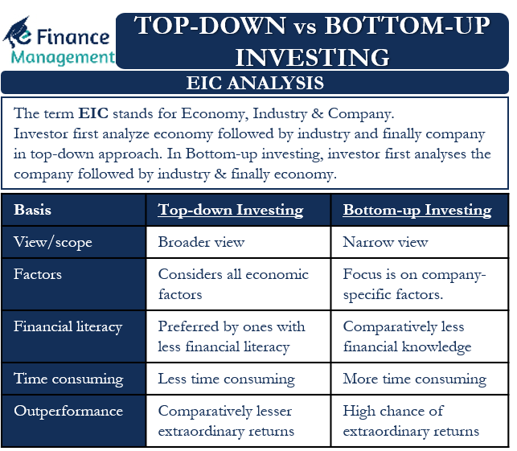

## Table of Contents

## What is top-down investing?

Top-down investing is a way of choosing investments by looking at the big picture first. Instead of focusing on individual companies right away, investors start by looking at the overall economy, different industries, and then finally at specific companies. They might look at things like how fast the economy is growing, what the government is doing, and which industries are doing well. This helps them decide which sectors or industries are likely to do better in the future.

Once they have a good idea of which sectors are promising, top-down investors then look for the best companies within those sectors. For example, if they think the technology sector will grow a lot, they might look for the best tech companies to invest in. This approach can be useful because it helps investors see the bigger trends and make more informed decisions about where to put their money.

## What is bottom-up investing?

Bottom-up investing is when investors look at individual companies first, instead of starting with the big picture like the economy or industries. They focus on the details of a company, like how well it's managed, how much money it's making, and if it's a good value. They believe that a great company can do well even if the economy or its industry isn't doing great.

This approach is different from top-down investing because it doesn't start with broad trends. Instead, bottom-up investors think that by finding the best companies, they can make money no matter what's happening in the world. They spend a lot of time researching and understanding the companies they invest in, hoping to find hidden gems that others might miss.

## How do top-down and bottom-up investing differ?

Top-down and bottom-up investing are two different ways to choose investments. Top-down investing starts with looking at the big picture. Investors who use this method first look at the whole economy, then at different industries, and finally at individual companies. They try to figure out which parts of the economy or which industries will do well in the future. For example, if they think the technology sector will grow, they'll look for the best companies in that sector to invest in.

On the other hand, bottom-up investing begins with individual companies. Investors using this approach focus on the details of a specific company, like how it's managed, its profits, and its value. They believe that a strong company can succeed even if the economy or its industry isn't doing well. These investors spend a lot of time researching companies to find the best ones, thinking that the overall economy or industry trends don't matter as much as the company's own performance.

In simple terms, top-down investors start broad and zoom in, while bottom-up investors start with the details and work their way out. Both methods have their own advantages, and some investors even use a mix of both to make their investment decisions.

## What are the main steps involved in a top-down investment approach?

In a top-down investment approach, the first step is to look at the big picture of the economy. Investors start by studying things like how fast the economy is growing, what the government is doing with interest rates, and what's happening in the world that could affect businesses. They might use reports and data to figure out if the economy is going to get better or worse. By understanding these big trends, they can decide which parts of the economy might do well in the future.

After figuring out the overall economic situation, the next step is to look at different industries. Investors try to find out which industries are likely to grow because of the economic trends they've identified. For example, if they think people will spend more money, they might look at industries like consumer goods or technology. Once they know which industries look promising, they start looking for the best companies within those industries.

Finally, investors focus on individual companies within the chosen industries. They look at things like how much money the company is making, how well it's managed, and if its stock is a good value. By the time they get to this step, they have a good idea of which industries are likely to do well, so they can pick the best companies in those industries to invest in. This way, they hope to make money by riding the wave of the economy's growth.

## What are the main steps involved in a bottom-up investment approach?

In a bottom-up investment approach, investors start by looking at individual companies. They don't worry about the big picture of the economy or which industries are doing well. Instead, they focus on the details of each company. They study things like how much money the company is making, how well it's run, and if its stock is a good deal. They believe that if a company is strong and well-managed, it can do well even if the economy or its industry isn't doing great.

Once they find a company they like, they dig deeper. They look at the company's financial reports, talk to its managers, and learn about its products or services. They want to make sure the company is a good investment, no matter what's happening in the world. By focusing on the details of the company, they hope to find hidden gems that other investors might miss. This way, they think they can make money by [picking](/wiki/asset-class-picking) the best companies, even if the economy or industry isn't doing well.

## What types of investors typically use a top-down strategy?

Investors who like to see the big picture often use a top-down strategy. These are usually people who work at big investment firms or manage a lot of money for other people. They look at things like how the economy is doing, what the government is doing with interest rates, and which industries are growing. By understanding these big trends, they can decide which parts of the economy to invest in. This helps them make smart choices about where to put their money.

Some investors who use a top-down approach are called macro investors. They focus on things like how countries are doing, what's happening with money around the world, and big events that can change the economy. They think that by figuring out these big trends, they can find good places to invest. This way of investing is good for people who want to understand the whole economy before they pick specific companies to invest in.

## What types of investors typically use a bottom-up strategy?

Investors who like to look at the details of companies often use a bottom-up strategy. These are usually people who spend a lot of time researching and understanding individual businesses. They might be called value investors, who look for companies that are a good deal, or growth investors, who look for companies that are growing fast. They believe that by finding the best companies, they can make money no matter what's happening in the economy or their industry.

These investors often work on their own or in small teams, where they can focus on the specifics of each company. They look at things like how much money a company is making, how well it's run, and if its stock is priced right. They think that a great company can do well even if the economy isn't doing great. This approach is good for people who enjoy digging into the details and finding hidden gems that others might miss.

## Can you give an example of a successful top-down investment?

Imagine a big investment firm in 2010. They looked at the whole world and saw that technology was changing fast. People were using more smartphones, and the internet was getting bigger every day. The firm thought that the technology industry would keep growing, so they decided to invest in it. They looked at different parts of technology and thought that companies making smartphones and software would do well. So, they bought stocks in companies like Apple and Microsoft.

Their top-down approach paid off. Over the next few years, the technology industry grew a lot. More and more people bought smartphones and used the internet, which helped companies like Apple and Microsoft make more money. The stocks of these companies went up, and the investment firm made a lot of money from their top-down investment. By looking at the big picture first, they were able to ride the wave of the growing technology industry.

## Can you give an example of a successful bottom-up investment?

Imagine an investor in 2009 who found a small company called Netflix. This investor didn't care about the big picture of the economy or what was happening in the entertainment industry. They just looked at Netflix and saw that it was doing something new. Instead of renting movies from stores, people could watch them at home through the mail or online. The investor thought Netflix was a great company with a smart idea, even though it was small and not many people knew about it yet.

So, the investor bought Netflix stock. Over the next few years, Netflix grew a lot. More and more people started using their service, and the company became really popular. The stock price went up a lot, and the investor made a lot of money. By focusing on the details of Netflix and believing in its future, the investor found a hidden gem that paid off big time.

## What are the advantages of top-down investing?

Top-down investing helps investors see the big picture. They look at how the whole economy is doing and which industries are growing. This way, they can find the best places to put their money. For example, if they see that the technology industry is getting bigger, they can invest in tech companies. This can be a good way to make money because they are riding the wave of big trends.

Another advantage of top-down investing is that it can help investors avoid big problems. If they see that the economy is going to get worse, they can move their money to safer places. This can help them protect their investments. Big investment firms often use this approach because they need to manage a lot of money and want to make smart choices based on what's happening in the world.

## What are the advantages of bottom-up investing?

Bottom-up investing lets investors find great companies that might be overlooked by others. They look closely at each company, seeing how much money it makes, how well it's run, and if its stock is a good deal. By focusing on the details, they can find hidden gems that other investors might miss. This can lead to big wins, like when someone invested in a small company like Netflix early on and made a lot of money as it grew.

Another advantage of bottom-up investing is that it can help investors make money even when the economy isn't doing well. If they pick a strong company, it can still do well even if other parts of the economy are struggling. This approach is good for people who like to dig deep into the details and believe that a great company can succeed no matter what's happening in the world.

## How might an investor blend top-down and bottom-up strategies for optimal results?

An investor might blend top-down and bottom-up strategies by first looking at the big picture of the economy and then zooming in on individual companies. They start by figuring out which industries are likely to grow because of things like how fast the economy is growing or what the government is doing. For example, if they see that the technology sector is getting bigger, they know that's a good place to look for investments. Once they have a list of promising industries, they then use a bottom-up approach to find the best companies within those industries. They look at the details of each company, like how much money it's making and how well it's run, to pick the best ones.

By using both strategies together, the investor can make smart choices based on big trends and also find great companies that might be overlooked by others. This way, they can ride the wave of the economy's growth and still find hidden gems that could do well no matter what's happening in the world. This blend of top-down and bottom-up investing can help them make more money and protect their investments better.

## References & Further Reading

[1]: ["Quantitative Value: A Practitioner's Guide to Automating Intelligent Investment and Eliminating Behavioral Errors"](https://www.amazon.com/Quantitative-Value-Web-Site-Practitioners/dp/1118328078) by Wesley R. Gray and Tobias E. Carlisle

[2]: ["Top-Down Analysis on a Monthly Basis: Macroeconomic Updates With a Microeconomic Flair"](https://corporatefinanceinstitute.com/resources/management/top-down-analysis/) by John H. Baughn, CFA Institute

[3]: ["Common Stocks and Uncommon Profits and Other Writings"](https://www.amazon.com/Common-Stocks-Uncommon-Profits-Writings/dp/0471445509) by Philip A. Fisher

[4]: Chan, Ernest P. (2009). ["Quantitative Trading: How to Build Your Own Algorithmic Trading Business."](https://github.com/ftvision/quant_trading_echan_book) Wiley.

[5]: Jansen, Stefan. (2018). ["Machine Learning for Algorithmic Trading: Predictive Models to Extract Signals from Market and Alternative Data for Systematic Trading Strategies with Python."](https://github.com/stefan-jansen/machine-learning-for-trading) Packt Publishing.