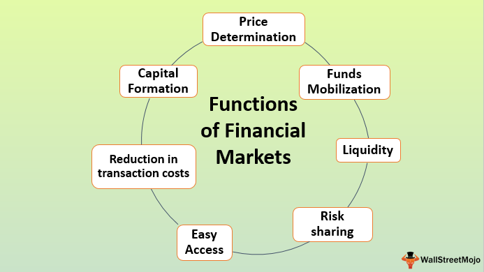

In the rapidly evolving world of finance, understanding the different financial functions, types, and emerging technologies like algorithmic trading is crucial. Financial systems underpin the global economy and involve various core operations such as banking, investments, and savings, each designed to meet specific needs and contribute to economic stability and growth. As these operations continue to digitize, they bring about significant advancements in terms of speed, accessibility, and security.

The ascent of new financial types, including diverse instruments such as stocks, bonds, mutual funds, and derivatives, has diversified the investment landscape. Each type suits different investment strategies, risk profiles, and return expectations, allowing investors to tailor their approaches based on specific objectives and tolerances. Understanding these types is fundamental for making informed decisions in trading and investing.



In parallel, the advent of algorithmic trading has marked a pivotal transformation in financial markets. By employing sophisticated algorithms to execute trades, this technology minimizes human intervention, thereby reducing emotional biases and enhancing accuracy and efficiency. Such advances have fundamentally changed how trades are executed, analyzed, and settled, positioning algorithmic trading as a cornerstone of modern financial markets.

This article aims to explore these key components of finance and their integration. By the end, readers will have a comprehensive understanding of financial functionalities, various financial types, and the disruptive potential of algorithmic trading, thereby equipping them to navigate the complexities and opportunities in today's financial environment.

## Table of Contents

## Understanding Financial Functionality

Financial functionality encompasses a range of core processes essential for the operation of financial systems. These include banking, investment, savings, loans, and credit, each serving unique roles and catering to distinct needs within the economy.

Banking provides the backbone for financial transactions, offering services that include deposit accounts, payment systems, and financial advice. Banks serve as intermediaries between savers and borrowers, facilitating the flow of funds that is crucial for economic activity. Investment services enable individuals and institutions to allocate resources towards assets that have the potential to yield profitable returns over time. This function is vital for wealth accumulation and the allocation of capital to productive uses.

Savings products, offered by financial institutions, allow individuals to securely store funds for future use, often with interest earnings. They are an essential component of personal financial management, supporting future consumption and providing a cushion against unexpected expenses.

Loans and credit form another cornerstone of financial functionality, as they provide necessary [liquidity](/wiki/liquidity-risk-premium) and purchasing power to individuals and businesses. Access to credit allows households to acquire major assets like homes and vehicles, while businesses can leverage loans for expansion, innovation, or working capital needs.

Efficient financial functionalities are vital for maintaining economic stability and fostering growth. They create a framework where individuals and enterprises can exploit opportunities and manage risks more effectively. The evolution towards digital finance has accelerated this efficiency, introducing innovations that improve speed, accessibility, and security of financial services.

Digitization has transformed traditional financial services through technologies such as online banking, mobile payments, and digital wallets. These technologies have expanded access to financial services, particularly in underserved regions, by enabling real-time transactions and reducing the need for physical infrastructure. Enhanced security measures, like biometric authentication and blockchain, have also been integrated to safeguard against fraud and ensure the integrity of financial transactions.

For example, the implementation of blockchain technology can enhance the transparency and security of financial transactions. Blockchain's decentralized architecture reduces the risk of data tampering, making it an attractive option for organizations aiming to improve trust and reliability in financial processes.

In conclusion, financial functionalities are the bedrock of modern economies, supporting a wide range of activities and enabling strategic financial planning for various stakeholders. The ongoing digitization of these functions promises even greater efficiency, inclusivity, and security in the financial systems of the future.

## Exploring Financial Types

In today's financial landscape, understanding the diverse types of financial instruments and investments is crucial for making informed decisions. The primary categories include stocks, bonds, mutual funds, and derivatives, each offering distinct opportunities and risks.

Stocks, or equities, represent ownership in a company and entitle investors to a portion of the company's profits through dividends and capital appreciation. They are characterized by their high return potential but also come with higher risks due to market [volatility](/wiki/volatility-trading-strategies). Investors select stocks based on their risk tolerance and growth expectations, often employing strategies like value investing or growth investing.

Bonds are fixed-income securities that involve lending money to an entity, typically a government or corporation, in exchange for periodic interest payments and the return of the principal amount at maturity. Bonds are generally considered less risky than stocks and are thus suitable for conservative investors seeking stable income. They vary in terms, credit quality, and interest rates, influencing their yield and risk profile.

Mutual funds pool money from multiple investors to purchase a diversified portfolio of stocks, bonds, or other securities, managed by professional fund managers. This diversification helps mitigate risks, making mutual funds an attractive option for investors who prefer a hands-off approach. They come in various types, such as equity funds, bond funds, and balanced funds, each aligning with different investment objectives.

Derivatives, such as futures, options, and swaps, are financial contracts whose value derives from underlying assets like stocks, bonds, or commodities. These instruments are primarily used for hedging risk or speculating on price movements. Derivatives can be complex and require a sophisticated understanding of markets, but they offer the potential for significant returns and are an essential tool for risk management.

Each type of financial instrument serves distinct investment goals, risk profiles, and returns expectations. By understanding their characteristics and advantages, investors can better align their portfolios with their financial objectives, navigating the complexities of the financial market with confidence.

 to Algorithmic Trading

Algorithmic trading, commonly referred to as algo trading, represents a transformative shift in the trading industry by leveraging pre-programmed algorithms to conduct trades at high speeds and efficiencies. This approach reduces the necessity for direct human intervention in trading decisions, thereby minimizing emotional biases and enhancing precision. The utilization of algorithms allows traders to process vast amounts of data and operate in markets around the clock without fatigue, leading to optimized trade executions.

### How Algorithmic Trading Works

Algorithmic trading operates through a series of sophisticated algorithms that can process market data, identify trading signals, and execute orders at exceptionally high speeds. These algorithms are typically programmed using complex mathematical models and statistical analysis techniques. The process begins with data collection, where real-time market data feeds are analyzed to identify pricing, [volume](/wiki/volume-trading-strategy), and timing patterns. Once a potential trading opportunity is detected, the algorithm triggers a trade according to predefined criteria, thus ensuring consistency and discipline.

### Historical Context and Importance

The concept of [algorithmic trading](/wiki/algorithmic-trading) can be traced back to the 1970s with the introduction of electronic trading platforms. Over the decades, technological advancements have played a crucial role in its evolution. The acceleration of computational power and advancements in quantitative finance have made it feasible to execute trades at microsecond intervals, largely influencing modern financial markets. In today's context, algorithmic trading accounts for a significant portion of trading volumes across global exchanges, underscoring its critical role in market dynamics.

### Key Aspects of Algorithmic Trading

1. **Data Analysis**: The cornerstone of algorithmic trading is robust data analysis. Algorithms are designed to parse through historical and real-time data to recognize patterns or signals, such as price trends, discrepancies, and market conditions, which traditional trading methods might overlook.

2. **Execution Speed**: One of the key advantages of algorithmic trading is its ability to execute orders in fractions of a second. This speed is crucial in taking advantage of fleeting market opportunities and maintaining competitiveness in fast-moving environments.

3. **Decision-Making Processes**: The decision-making in algorithmic trading is based on systematic backtesting and forward testing to ensure that strategies are viable under different market conditions. Algorithms are continually refined and adjusted to adapt to market changes, enhancing their predictive capabilities and performance.

Algorithmic trading continues to grow in significance, reshaping the trading landscape and influencing market structures globally. By integrating cutting-edge technologies and sophisticated strategies, it offers traders improved accuracy, efficiency, and the ability to manage risks effectively. As financial markets continue to harness technology, understanding the inner workings and implications of algorithmic trading becomes imperative for financial professionals and participants alike.

## Types of Algorithmic Trading Strategies

Algorithmic trading strategies are essential components of modern financial markets, leveraging advanced computational techniques to capitalize on market movements and inefficiencies. Below are some of the most prevalent strategies in algorithmic trading:

1. **Trend-Following Strategies**: These strategies are based on the principle that markets exhibit trends, and thus, by identifying and following these trends, one can potentially achieve gains. Trend-following does not require predictions or forecasts; instead, it aims to capture profits through the market's momentum. Typically, moving averages and breakout strategies are popular methods within this category. For example, a simple moving average crossover strategy involves buying when a shorter-term moving average crosses above a longer-term moving average and selling when the opposite occurs.

2. **Mean Reversion Strategies**: Mean reversion assumes that asset prices will revert to their historical mean over time. This strategy identifies when an asset is overbought or oversold relative to its historical average. Traders use statistical techniques such as Bollinger Bands or the Relative Strength Index (RSI) to detect these conditions. For instance, if an asset price deviates significantly from its long-term average, mean reversion strategies would suggest taking a position anticipating a return to the average.

3. **Arbitrage Strategies**: Arbitrage takes advantage of price discrepancies across different markets or instruments. An arbitrage strategy might involve buying an asset in one market where the price is lower and simultaneously selling it in another market where the price is higher. Arbitrage opportunities are typically very short-lived, requiring algorithmic systems to execute trades rapidly. Some common forms of arbitrage include statistical arbitrage, triangular arbitrage in forex markets, and convertible arbitrage with options and underlying securities.

Understanding these strategies involves not only theory but also practical considerations in design, testing, and implementation. Algorithms need to be back-tested using historical data to ensure their effectiveness under various market conditions. Here's a basic example of a moving average crossover strategy in Python using the Pandas and NumPy libraries:

```python
import pandas as pd
import numpy as np

# Sample data: Load your historical price data into this DataFrame
data = pd.DataFrame({'price': [/* price data here */]})

# Calculate moving averages
short_window = 40
long_window = 100

data['short_mavg'] = data['price'].rolling(window=short_window, min_periods=1, center=False).mean()
data['long_mavg'] = data['price'].rolling(window=long_window, min_periods=1, center=False).mean()

# Create signals
data['signal'] = np.where(data['short_mavg'] > data['long_mavg'], 1.0, 0.0)
data['positions'] = data['signal'].diff()

# Plot the signals
import matplotlib.pyplot as plt

plt.figure(figsize=(12, 8))
plt.plot(data['price'], label='Price')
plt.plot(data['short_mavg'], label=f'Short {short_window} Day MA')
plt.plot(data['long_mavg'], label=f'Long {long_window} Day MA')
plt.plot(data[data['positions'] == 1].index, data['short_mavg'][data['positions'] == 1], '^', markersize=10, color='g', label='Buy Signal')
plt.plot(data[data['positions'] == -1].index, data['short_mavg'][data['positions'] == -1], 'v', markersize=10, color='r', label='Sell Signal')
plt.title('Algorithmic Trading Strategy')
plt.legend()
plt.show()
```

Effectively implementing these strategies requires a comprehensive understanding of market dynamics, robust risk management practices, and continuous adaptation to market changes. As technology progresses, algorithmic trading will continue to evolve, offering new opportunities and challenges in financial markets.

## Advantages and Disadvantages of Algorithmic Trading

Algorithmic trading, commonly referred to as algo trading, revolutionizes the trading landscape by using computer algorithms to execute orders with speed and precision unattainable by human traders. This section analyzes both the advantages and disadvantages of algorithmic trading in the financial markets.

**Advantages**

1. **Speed and Efficiency:** One of the most prominent benefits of algorithmic trading is the speed at which trades are executed. Algorithms can analyze multiple market conditions simultaneously and execute trades in fractions of a second. This efficiency allows traders to take advantage of fleeting opportunities in the market without delay.

2. **Accuracy and Precision:** By relying on predetermined criteria coded into algorithms, trades are executed with high precision, minimizing human errors that could arise from manual trading processes. This accuracy ensures that trades are carried out as intended, reducing the potential for costly mistakes.

3. **Data Analysis Capability:** Algorithmic trading systems can handle vast amounts of data at high speeds, allowing them to analyze complex market trends and patterns more effectively than human traders. This capability provides traders with deeper insights and a competitive edge in decision-making.

4. **Emotion Reduction:** Trading can be influenced significantly by human emotions such as fear or greed, which often lead to irrational decisions. Algorithms execute trades based on predefined rules and logic, thereby minimizing emotional bias and leading to more disciplined trading strategies.

**Disadvantages**

1. **Technology Dependence:** Algorithmic trading is heavily reliant on sophisticated technology and infrastructure. Any malfunction, such as software glitches or connectivity issues, can lead to significant losses. Traders must invest in robust systems and regular maintenance to mitigate such risks.

2. **System Failures:** Any system failure, be it hardware or software, can cause execution delays or erroneous trades. These failures can have severe financial implications, especially if large quantities of trades are involved. Contingency measures and system redundancies are vital to mitigate these risks.

3. **Ethical Concerns with High-Frequency Trading (HFT):** HFT, a subset of algorithmic trading, raises ethical and regulatory concerns due to its nature of executing thousands of trades per second. Critics argue that HFT contributes to market volatility and may provide an unfair advantage to those with superior technology access, potentially leading to an uneven playing field.

4. **Market Impact and Liquidity Issues:** While algorithmic trading can provide liquidity, it might also exacerbate market volatility, especially during periods of instability. Large automated trades can trigger chain reactions, impacting prices more significantly than anticipated.

In conclusion, algorithmic trading plays an integral role in modern financial markets by enhancing speed, efficiency, and reducing human error. Yet, it also introduces challenges related to technology reliance and ethical considerations. A balanced approach that incorporates strong technological infrastructure and regulatory compliance is essential for harnessing the benefits of algorithmic trading while minimizing its drawbacks.

## The Future of Finance and Algorithmic Trading

As technology continues to advance, the integration of [artificial intelligence](/wiki/ai-artificial-intelligence) (AI) and [machine learning](/wiki/machine-learning) (ML) in algorithmic trading is expected to deepen, heralding transformative changes in the financial industry. AI and ML technologies enable systems to analyze complex datasets, recognize patterns, and make decisions with unprecedented speed and accuracy. This capability is crucial in financial markets, where the ability to process information rapidly can significantly enhance trading strategies and outcomes.

#### Enhanced Financial Functionalities and Innovation

The future of finance anticipates an array of innovations designed to enhance financial functionalities and introduce new types of financial instruments. Developments in blockchain technology, for example, could lead to more secure and transparent transactions, further building trust in financial systems. Additionally, the creation of digital currencies and tokenized assets represents an emerging frontier, offering alternative investment opportunities and potentially reshaping traditional financial ecosystems.

One promising area is the potential for enhanced predictive analytics in trading strategies. By leveraging large datasets, machine learning algorithms can identify subtle market trends and predict price movements with increasing accuracy. The following Python code snippet demonstrates a basic linear regression model that could serve as a foundation for more sophisticated predictive analytics in trading:

```python
import numpy as np
from sklearn.model_selection import train_test_split
from sklearn.linear_model import LinearRegression

# Sample dataset: historical prices and volumes
X = np.array([[1, 200], [2, 220], [3, 230], [4, 240], [5, 250]])
y = np.array([210, 215, 228, 232, 235])

# Split dataset into training and test sets
X_train, X_test, y_train, y_test = train_test_split(X, y, test_size=0.2, random_state=42)

# Create linear regression model
model = LinearRegression()
model.fit(X_train, y_train)

# Predict future trends
predictions = model.predict(X_test)
print(predictions)
```

#### Regulatory Challenges and Ethical Considerations

The evolving landscape of algorithmic trading is not without challenges. Regulatory bodies are increasingly scrutinizing the use of AI and ML to ensure fairness, transparency, and accountability in financial markets. High-frequency trading ([HFT](/wiki/high-frequency-trading-strategies)), a subset of algorithmic trading, has raised concerns due to its potential to disrupt market stability. Ethical considerations, such as the impact of automation on employment in the finance sector, also come into play.

Policymakers are tasked with creating a regulatory framework that balances innovation with investor protection. This includes implementing standardized protocols and guidelines for algorithmic traders to prevent market manipulation and ensure the ethical use of AI.

#### Future Trends and Potential Impact

The future of algorithmic trading and finance will likely be shaped by continued technological advancements and regulatory adaptation. Emerging trends, such as quantum computing, could revolutionize data processing speeds, enabling even more complex models and simulations in trading strategies. Moreover, the increasing availability of [alternative data](/wiki/best-alternative-data) sources, such as social media sentiment and satellite imagery, can provide valuable insights previously untapped by traditional financial data.

As these technologies evolve, the integration of AI and machine learning will likely converge with other technological developments, fostering a more inclusive, efficient, and resilient financial ecosystem. Investors, financial institutions, and regulators must remain agile, adapting to changes while leveraging these innovations to optimize investment strategies and safeguard market integrity.

## Conclusion

Understanding financial functionality, types of financial instruments, and the role of algorithmic trading is essential in today’s finance world. These elements form the backbone of modern financial systems, enabling businesses and individuals to manage resources, seek growth, and mitigate risks. Among these, algorithmic trading stands as a critical component of financial market operations, providing unprecedented efficiency and rigor in executing trades. It showcases how technology can transform traditional practices, offering speed and accuracy that manual trading cannot match.

Algorithmic trading, while being only one facet of technological evolution, has a significant impact on how financial markets operate. It leverages advanced algorithms and computational power to analyze data and execute trades, reducing the likelihood of human error and emotional biases. This approach leads to more disciplined trading strategies, influencing market liquidity and price dynamics extensively. As technology advances, algorithmic trading will likely integrate more sophisticated tools, including artificial intelligence and machine learning. These enhancements promise to elevate the precision and adaptability of trading strategies further.

For investors and professionals, staying informed about these developments is crucial for navigating the complexities of today's financial environment. Knowledge of financial functionalities and the latest trading technologies equips them to make informed decisions, adapt to market changes, and capitalize on opportunities. Understanding the interplay between different financial instruments, regulatory shifts, and technological advancements is vital for maintaining a competitive edge in the market.

This comprehensive insight into financial functionalities and algorithmic trading not only aids in current decision-making but also prepares stakeholders for the future of finance. As the financial landscape continues to evolve, those who are well-versed in these areas will be better positioned to exploit new opportunities, manage risks effectively, and drive growth. This understanding is not just beneficial; it is essential for active participation in a rapidly changing financial world.

## References & Further Reading

[1]: Bergstra, J., Bardenet, R., Bengio, Y., & Kégl, B. (2011). ["Algorithms for Hyper-Parameter Optimization."](https://dl.acm.org/doi/10.5555/2986459.2986743) Advances in Neural Information Processing Systems 24.

[2]: ["Advances in Financial Machine Learning"](https://www.amazon.com/Advances-Financial-Machine-Learning-Marcos/dp/1119482089) by Marcos Lopez de Prado

[3]: ["Evidence-Based Technical Analysis: Applying the Scientific Method and Statistical Inference to Trading Signals"](https://www.amazon.com/Evidence-Based-Technical-Analysis-Scientific-Statistical/dp/0470008741) by David Aronson

[4]: ["Machine Learning for Algorithmic Trading"](https://github.com/stefan-jansen/machine-learning-for-trading) by Stefan Jansen

[5]: ["Quantitative Trading: How to Build Your Own Algorithmic Trading Business"](https://www.amazon.com/Quantitative-Trading-Build-Algorithmic-Business/dp/1119800064) by Ernest P. Chan