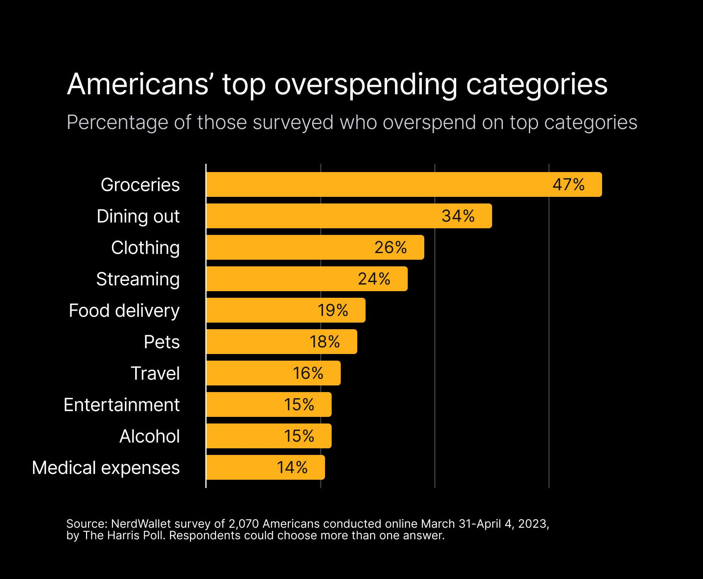

## Table of Contents

## What is Top Finance and what is its purpose?

Top Finance is a financial management app that helps people keep track of their money. It lets you see where your money goes, set budgets, and plan for the future. The app is easy to use and works on phones and computers, so you can check your finances anytime, anywhere.

The main purpose of Top Finance is to help people manage their money better. It does this by showing you all your spending in one place, so you can see if you're spending too much on things like eating out or shopping. It also helps you save money by setting savings goals and reminding you to stick to your budget. By using Top Finance, people can feel more in control of their finances and make smarter money choices.

## How does Top Finance work as a financial management tool?

Top Finance works by letting you put all your money information into one app. You can add your bank accounts, credit cards, and even cash spending. The app then shows you where your money is going every month. It sorts your spending into groups like food, bills, and fun stuff. This way, you can see if you're spending too much in one area and need to cut back.

The app also helps you plan your money better. You can set budgets for different things, like how much you want to spend on groceries each week. Top Finance will keep track of this for you and warn you if you're about to go over your limit. Plus, you can set savings goals, like saving for a new phone or a vacation. The app will show you how close you are to reaching your goals and give you tips on how to save more money.

## What are the basic features of Top Finance for beginners?

Top Finance is a helpful app for people who want to start managing their money better. It lets you add your bank accounts and credit cards so you can see all your money in one place. The app shows you how much you spend on different things like food, bills, and fun stuff. This way, you can see if you're spending too much in one area and need to spend less.

The app also helps you set budgets. You can decide how much you want to spend on things like groceries or going out. Top Finance will keep track of this for you and let you know if you're about to spend too much. It's a good way to make sure you don't go over your budget.

Another useful feature is setting savings goals. You can tell the app you want to save for something, like a new phone or a trip. Top Finance will show you how close you are to reaching your goal and give you tips on how to save more money. This makes saving fun and helps you reach your goals faster.

## Can you explain the user interface of Top Finance?

The user interface of Top Finance is designed to be easy to use, even if you're new to managing your money. When you open the app, you see a main screen that shows you a quick overview of your money. At the top, there's a summary of your total balance and how much you've spent this month. Below that, you can see your spending broken down into categories like food, bills, and fun stuff. Each category has a color, so it's easy to see where your money is going.

On the side of the screen, there are buttons that let you go to different parts of the app. One button takes you to your budget page, where you can see how much you've set for different things and how much you've spent so far. Another button leads to your savings goals, showing you how close you are to reaching them. Everything is laid out in a simple way, so you can find what you need without getting confused.

If you want to add a new expense or see more details, you can tap on any category or button. The app will show you more information and let you add new things easily. The colors and layout stay the same throughout the app, so it's always easy to understand. Top Finance makes it simple to keep track of your money and stay on top of your budget.

## What are the different categories of financial management in Top Finance?

Top Finance helps you manage your money by sorting it into different categories. The main categories are things like food, bills, and fun stuff. Food includes what you spend on groceries and eating out. Bills cover things like rent, electricity, and phone bills. Fun stuff is for things like movies, games, and going out with friends. By putting your spending into these groups, you can see where your money goes each month and if you need to spend less in one area.

Another important category is savings. Top Finance lets you set savings goals for things like a new phone or a vacation. The app shows you how close you are to reaching your goals and gives you tips on how to save more money. This makes saving fun and helps you reach your goals faster. By keeping track of your savings, you can feel more in control of your money and plan for the future.

Lastly, Top Finance helps you set budgets for different things. You can decide how much you want to spend on groceries, going out, or any other category. The app will keep track of this for you and let you know if you're about to spend too much. This way, you can make sure you don't go over your budget and can save more money for the things that matter to you.

## How can Top Finance help in budgeting and expense tracking?

Top Finance helps you make a budget by letting you decide how much you want to spend on different things each month. You can set a budget for groceries, bills, fun stuff, and anything else you want. The app keeps track of what you spend and shows you how much you have left in each category. If you're about to spend more than you planned, Top Finance will warn you. This helps you stay within your budget and save money for important things.

The app also makes it easy to track your expenses. When you spend money, you can add it to Top Finance and see where it goes. The app sorts your spending into categories like food, bills, and fun stuff. This way, you can see if you're spending too much in one area and need to cut back. By keeping track of your expenses, you can make better choices about where to spend your money and save more for the future.

## What advanced functionalities does Top Finance offer for intermediate users?

Top Finance has some cool features for people who know a bit about managing money. One of these is the ability to make detailed reports. You can look at your spending over time and see patterns. For example, you might notice you spend more on eating out during weekends. This helps you plan better and save money where you can. Another feature is the option to set up different accounts within the app. You can keep your personal money separate from money for a project or a business, which makes it easier to manage different parts of your finances.

Another advanced feature is the ability to set up alerts for specific spending limits. If you want to keep an eye on how much you spend on things like shopping or entertainment, Top Finance can send you a notification when you're getting close to your limit. This helps you stay in control and avoid overspending. Additionally, the app lets you connect with other financial tools and apps, so you can get a full picture of your money. By using these features, intermediate users can get more out of Top Finance and make smarter financial decisions.

## How does Top Finance integrate with other financial services or apps?

Top Finance makes it easy to work with other money apps and services. You can connect your bank accounts and credit cards to the app, so all your money information shows up in one place. This way, you don't have to switch between different apps to see how much money you have. Top Finance also works with other budgeting and investment apps, so you can get a full picture of your money. For example, if you use an investment app, you can see how your investments are doing right in Top Finance.

By linking with other financial tools, Top Finance helps you keep track of everything without getting confused. You can see your spending, savings, and investments all together. This makes it easier to plan your money and make smart choices. Whether you're saving for a big goal or just trying to spend less on eating out, having all your financial information in one place helps you stay on top of things.

## What are the security measures implemented in Top Finance to protect user data?

Top Finance takes your safety very seriously. They use strong security measures to keep your money information safe. When you add your bank accounts and credit cards, the app uses encryption to protect your data. This means your information is turned into a secret code that only Top Finance can understand. They also use two-factor authentication, which means you need to enter a special code sent to your phone to log in. This makes it much harder for anyone else to get into your account.

Another way Top Finance keeps your data safe is by following strict rules about how they handle your information. They only collect the information they need to help you manage your money, and they don't share it with anyone else without your permission. The app is also regularly checked by security experts to make sure everything is safe. By using these methods, Top Finance makes sure your money information stays private and secure.

## How can expert users customize Top Finance to meet specific financial needs?

Expert users can customize Top Finance to fit their specific financial needs in many ways. They can create custom categories for their spending, so they can track things that are important to them. For example, if they want to keep an eye on how much they spend on hobbies or travel, they can make a special category just for that. They can also set up different budgets for different time periods, like weekly or yearly budgets, to help them plan their money better. This way, they can see if they're on track to meet their financial goals.

Another way expert users can tailor Top Finance is by using the advanced reporting features. They can make detailed reports to see how their spending changes over time and find patterns that can help them save money. For instance, they might notice they spend more on certain things during certain months and can plan their budget around that. They can also set up custom alerts for specific spending limits, so they get a warning if they're about to spend too much in a category they care about. By using these customization options, expert users can make Top Finance work exactly how they need it to manage their money better.

## What kind of financial reports and analytics can be generated using Top Finance?

Top Finance helps you see your money in many ways by making different kinds of reports. You can look at a report that shows you how much you spent each month and where it went. This report can break down your spending into categories like food, bills, and fun stuff. You can also see how your spending changes over time, so you can spot patterns. For example, you might see that you spend more on eating out during the summer. This helps you plan better and save money where you can.

Another type of report you can make is a budget report. This shows you how well you're sticking to the budgets you set for different things. If you set a budget for groceries, the report will tell you if you're spending too much or if you have money left over. You can also make a savings report to see how close you are to reaching your savings goals. This can show you how much you've saved each month and give you tips on how to save more. By using these reports, you can make smarter choices about your money and reach your financial goals faster.

## How does Top Finance compare to other leading financial management tools in the market?

Top Finance is a great app for managing your money, and it compares well with other leading financial management tools like Mint and YNAB (You Need A Budget). One of the things that makes Top Finance stand out is how easy it is to use. The app has a simple design that makes it easy for anyone to see where their money is going and set budgets. It also lets you connect with other financial apps and services, so you can get a full picture of your money. This is similar to Mint, which also connects with many banks and financial tools, but Top Finance's interface is often seen as more user-friendly.

Another way Top Finance compares to other tools is in its customization options. While YNAB is known for its strict budgeting method, Top Finance lets expert users make their own spending categories and set up detailed reports. This means you can tailor the app to fit your specific financial needs, which is something not all apps offer. Also, Top Finance's security measures, like encryption and two-factor authentication, are strong and similar to what you'd find in other top apps. Overall, Top Finance is a solid choice that combines ease of use with powerful features, making it a good option for anyone looking to manage their money better.

## References & Further Reading

[1]: Bergstra, J., Bardenet, R., Bengio, Y., & Kégl, B. (2011). ["Algorithms for Hyper-Parameter Optimization."](https://dl.acm.org/doi/10.5555/2986459.2986743) Advances in Neural Information Processing Systems 24.

[2]: ["Advances in Financial Machine Learning"](https://www.amazon.com/Advances-Financial-Machine-Learning-Marcos/dp/1119482089) by Marcos Lopez de Prado

[3]: ["Evidence-Based Technical Analysis: Applying the Scientific Method and Statistical Inference to Trading Signals"](https://www.amazon.com/Evidence-Based-Technical-Analysis-Scientific-Statistical/dp/0470008741) by David Aronson

[4]: ["Machine Learning for Algorithmic Trading"](https://github.com/stefan-jansen/machine-learning-for-trading) by Stefan Jansen

[5]: ["Quantitative Trading: How to Build Your Own Algorithmic Trading Business"](https://www.amazon.com/Quantitative-Trading-Build-Algorithmic-Business/dp/1119800064) by Ernest P. Chan