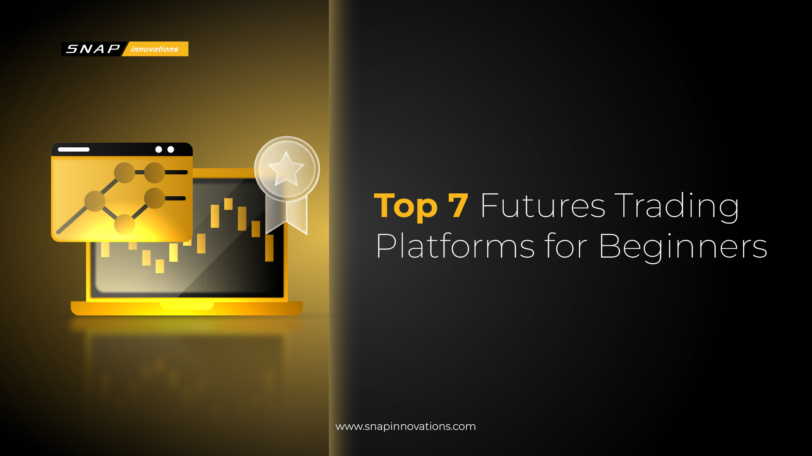

## Table of Contents

## What are futures trading platforms and why are they important?

Futures trading platforms are online systems where people can buy and sell futures contracts. Futures contracts are agreements to buy or sell something at a future date for a set price. These platforms make it easy for traders to enter and exit trades quickly from anywhere with an internet connection. They usually have tools and charts to help traders make smart choices about when to buy and sell.

These platforms are important because they help people manage risk and plan for the future. For example, a farmer might use a futures contract to lock in a price for their crops before they are harvested. This way, they know how much money they will get, even if prices drop later. Investors and companies also use futures to protect themselves from price changes in things like oil, gold, or stock indexes. Futures trading platforms make it easier for everyone to use these important financial tools.

## How do beginners get started with futures trading on these platforms?

To get started with futures trading, beginners should first choose a reliable futures trading platform. Look for platforms that are user-friendly and offer educational resources like tutorials and guides. Once you've selected a platform, you'll need to open an account. This usually involves filling out an application and providing some personal information. After your account is approved, you'll need to deposit money into it. This is called your margin, and it's the money you use to trade futures.

Next, it's important to learn the basics of futures trading. Many platforms offer demo accounts where you can practice trading without risking real money. Use these to get familiar with how the platform works and to try out different trading strategies. As you learn, start with small trades to minimize risk. Remember, futures trading can be complex and risky, so take your time to understand the market and never invest more than you can afford to lose.

## What are the key features to look for in a top futures trading platform?

When choosing a top futures trading platform, one of the key features to look for is a user-friendly interface. A good platform should be easy to navigate, even for beginners. It should have clear menus, simple trading tools, and helpful guides or tutorials. Another important feature is reliability. The platform should work well without crashing or slowing down, especially during busy trading times. It should also have strong security measures to keep your money and personal information safe.

Additionally, a top futures trading platform should offer a wide range of futures contracts to trade. This gives you more options and flexibility in your trading strategy. Good customer support is also crucial. You should be able to get help quickly if you have questions or run into problems. Lastly, look for platforms that provide educational resources and demo accounts. These can help you learn and practice trading without risking real money. By considering these features, you can find a platform that meets your needs and helps you succeed in futures trading.

## How do the fee structures vary across different futures trading platforms?

Fee structures can be different on various futures trading platforms. Some platforms charge a flat fee for each trade you make. This means you pay the same amount no matter how big or small your trade is. Other platforms might use a tiered fee system, where the fee changes based on how much you trade. If you trade a lot, you might pay less per trade. There are also platforms that charge a percentage of the trade value. This means the more money you trade, the more you pay in fees.

In addition to trading fees, some platforms have other charges to think about. There might be fees for withdrawing money from your account or for keeping your account open if you're not trading much. Some platforms also charge for using certain tools or data services. It's important to look at all the fees a platform charges, not just the trading fees, to understand the total cost of using that platform.

## What are the security measures implemented by leading futures trading platforms?

Leading futures trading platforms use strong security measures to keep your money and information safe. They use encryption to protect your data when you log in and make trades. This means your information is turned into a code that's hard for hackers to understand. They also use two-[factor](/wiki/factor-investing) authentication, which means you need two ways to prove it's really you before you can access your account. This could be a password and a code sent to your phone. These platforms also keep an eye out for strange activity, like someone trying to log in from a new place or making big trades at odd times. If they see something fishy, they might lock your account to keep it safe.

Another important security measure is keeping your money in separate accounts. This means your money is not mixed with the platform's money, so if the platform has money problems, your money is still safe. They also have insurance to protect your money if something goes wrong. Leading platforms follow strict rules set by financial regulators, which means they have to meet certain security standards. They also do regular checks to make sure their security is working well. By using these measures, leading futures trading platforms work hard to keep your money and information safe.

## Can you compare the user interfaces of the top futures trading platforms?

The user interfaces of top futures trading platforms like TD Ameritrade's Thinkorswim, [Interactive Brokers](/wiki/interactive-brokers-api)' Trader Workstation, and NinjaTrader vary but share some common features. Thinkorswim is known for its clean and modern look, with easy-to-use menus and customizable charts. It's great for both beginners and experienced traders because it's simple but also has lots of advanced tools. Interactive Brokers' Trader Workstation, on the other hand, can look a bit busy with lots of information on the screen. It's very powerful and has many options for advanced traders, but it might be a bit hard for beginners to figure out at first. NinjaTrader has a straightforward interface that's easy to navigate, with clear tabs and a focus on trading tools. It's good for people who want a simple but effective platform.

Each platform tries to make trading easy in its own way. Thinkorswim and NinjaTrader are good choices if you want something that's easy to use right away. Thinkorswim has a lot of educational resources built into the platform, which can help you learn as you trade. NinjaTrader is praised for its simplicity and the ability to quickly place trades. Interactive Brokers' Trader Workstation might take some time to get used to, but once you learn it, you can do a lot of different things with it. It's best for people who need a lot of control over their trades and want to use advanced strategies.

## How do mobile trading apps from these platforms enhance the trading experience?

Mobile trading apps from platforms like TD Ameritrade's Thinkorswim, Interactive Brokers, and NinjaTrader make trading easier because you can do it from your phone or tablet. These apps let you check your trades, make new trades, and see how the market is doing no matter where you are. For example, Thinkorswim's mobile app has a simple design that's easy to use on a small screen. It has tools like charts and alerts that help you make smart choices about buying and selling. NinjaTrader's app is also easy to use and lets you quickly place trades on the go. Interactive Brokers' app is packed with features and might be a bit more complicated, but it gives you a lot of control over your trades.

These apps also help you stay updated with the market. You can set up notifications to tell you when prices change or when it's time to make a trade. This means you don't have to watch the market all the time; the app can tell you when something important happens. Thinkorswim's app even has educational resources, so you can learn more about trading while you're away from your computer. Overall, mobile trading apps make it easier and more convenient to trade futures, helping you manage your investments no matter where you are.

## What advanced tools and analytics are available for expert traders on these platforms?

Expert traders on platforms like TD Ameritrade's Thinkorswim, Interactive Brokers, and NinjaTrader have access to many advanced tools and analytics. Thinkorswim offers features like customizable charts, technical analysis tools, and [backtesting](/wiki/backtesting) capabilities. This means traders can test their trading strategies using past data to see how they would have worked. Thinkorswim also has a paper trading feature where traders can practice without using real money. Interactive Brokers provides advanced charting, real-time market data, and a tool called OptionTrader that helps with options trading. They also have an API that lets traders build their own trading programs. NinjaTrader has advanced charting, market analytics, and the ability to automate trading strategies with their NinjaScript language.

These platforms also offer sophisticated risk management tools. Thinkorswim has features like the Probability Calculator, which helps traders understand the likelihood of different outcomes for their trades. Interactive Brokers offers risk navigation tools that show how different market scenarios could affect a trader's portfolio. NinjaTrader provides real-time margin monitoring, which helps traders keep track of how much money they need to keep in their account to cover their trades. All these tools help expert traders make better decisions, manage their risks, and potentially improve their trading performance.

## How do the customer support services of these platforms cater to different trader needs?

The customer support services at TD Ameritrade's Thinkorswim, Interactive Brokers, and NinjaTrader are designed to help traders in different ways. Thinkorswim offers 24/7 support through phone, email, and live chat. They also have a lot of educational resources like webinars and tutorials, which are great for beginners who need to learn more about trading. If you're an experienced trader, you can get help with more complex questions and even talk to a trading specialist. Interactive Brokers also provides 24/7 support, but they focus more on serving experienced traders. They have a help center with lots of detailed information and a ticket system for specific issues. Their support team can help with advanced trading questions and technical problems.

NinjaTrader's customer support is available during business hours and offers phone, email, and live chat options. They have a strong focus on helping traders set up and use their platform, which is good for people who are new to NinjaTrader. They also have a community forum where traders can ask questions and share tips. All three platforms try to meet the needs of different types of traders, from beginners who need basic help to experts who need detailed answers to complex questions.

## What are the integration capabilities of these platforms with other financial tools and systems?

TD Ameritrade's Thinkorswim, Interactive Brokers, and NinjaTrader can all connect with other financial tools and systems to help traders work better. Thinkorswim lets you use its API to build your own trading programs or connect with other software. This means you can set up your own tools to do things like track the market or make trades automatically. Thinkorswim also works well with other TD Ameritrade tools, so you can easily move between different parts of your account. Interactive Brokers has a strong API that lets traders connect with lots of other systems. They can use this to make their own trading software or to link up with other financial services they use. This is really helpful for traders who want to manage everything in one place.

NinjaTrader also offers good integration options. It has its own programming language called NinjaScript that lets you create custom tools and strategies. You can use this to make your trading more automatic and efficient. NinjaTrader also works well with other trading platforms and data providers, so you can bring in information from different sources to help you make better trading decisions. All these platforms try to make it easy for traders to use other tools and systems to improve their trading experience.

## How do regulatory compliance and licensing affect the choice of a futures trading platform?

Regulatory compliance and licensing are really important when choosing a futures trading platform. They make sure the platform follows the rules set by financial authorities. This means the platform has to be honest and safe. If a platform is regulated, it has to meet certain standards to protect your money and keep your information private. For example, in the United States, platforms need to be registered with the Commodity Futures Trading Commission (CFTC) and be a member of the National Futures Association (NFA). If a platform doesn't follow these rules, you might lose your money or have your personal information stolen. So, it's a good idea to pick a platform that is properly regulated and licensed.

Choosing a platform that follows the rules also means you can trust it more. Regulated platforms have to report what they're doing to the authorities, so they can't do anything sneaky. This can give you peace of mind when you're trading. Also, if something goes wrong, you have a place to go for help. For example, if you have a problem with a regulated platform, you can complain to the regulator. This makes it easier to get your issue fixed. So, when you're [picking](/wiki/asset-class-picking) a futures trading platform, make sure to check if it's regulated and licensed to keep your trading safe and fair.

## What trends and innovations are expected in futures trading platforms by 2024?

By 2024, futures trading platforms are expected to see a lot of new trends and innovations. One big trend is the use of [artificial intelligence](/wiki/ai-artificial-intelligence) (AI) and [machine learning](/wiki/machine-learning). These technologies can help traders by looking at lots of data quickly and finding patterns that people might miss. This can make trading easier and help traders make better choices. Another trend is better mobile apps. More and more people want to trade on their phones, so platforms are working to make their apps faster and easier to use. They're also adding more features to these apps, like better charts and tools, so traders can do more from their phones.

Another important innovation is blockchain technology. Some platforms are starting to use blockchain to make trading safer and more transparent. This can help stop fraud and make sure trades are recorded correctly. Also, there's a push for more personalized trading experiences. Platforms are using data to learn about each trader and give them advice and tools that fit their needs. This can help traders do better by getting help that's just right for them. Overall, these trends and innovations are making futures trading platforms smarter, safer, and easier to use.

## What is Understanding Futures Trading?

Futures contracts are fundamental instruments in financial markets, representing legal agreements to buy or sell an asset at a predetermined price on a specified future date. These contracts cover a wide range of assets, including commodities, currencies, indices, and financial instruments, enabling traders and investors to capitalize on price movements.

**Futures as Legal Agreements**

A futures contract obligates the holder to transact an asset at a future point, mitigating uncertainties associated with market fluctuations. For example, a wheat farmer might sell a futures contract to lock in a price and secure revenue, while a bread manufacturer might buy the contract to hedge against rising wheat prices. Both parties agree to exchange the asset at the contract's expiration, solidifying the position in advance.

**Hedging and Speculation**

Futures serve two primary purposes in markets: hedging and speculation. Hedging involves using futures to protect against adverse price changes. For instance, an investor holding stocks might go short on index futures to mitigate the risk of a market downturn. Speculators, on the other hand, seek to profit from price changes, leveraging futures contracts without the intention of possessing the underlying asset. This potential for profit stems from correctly anticipating price directions, exploiting contracts to capitalize on forecasted trends.

**Significance of Leverage**

Leverage is a defining characteristic of futures trading, amplifying both potential gains and risks. When traders enter futures contracts, they may only need to deposit a fraction of the contract's total value, known as margin. This allows control over a larger position than feasible with the available capital. For instance, with a margin of 10%, a trader controlling a $100,000 futures contract would only need to deposit $10,000. The formula for leverage $L$ is:

$$
L = \frac{\text{Contract Value}}{\text{Margin Deposit}}
$$

While leverage enhances profit opportunities, as small price movements can yield substantial returns, it also intensifies risks, as adverse movements can lead to significant losses.

**Understanding Risks**

Engaging in futures trading involves inherent risks due to high leverage and market [volatility](/wiki/volatility-trading-strategies). Traders must evaluate the potential for substantial losses, which could exceed initial investments. Such risks necessitate rigorous risk management strategies, including stop-loss orders and position sizing, to safeguard against severe downturns. Continuous market analysis and disciplined trading practices are vital in mitigating these risks. 

In conclusion, futures trading is a dynamic market activity offering both hedging capabilities and speculative opportunities. Understanding how these contracts function, their benefits, and associated risks is critical for traders aiming to navigate futures markets effectively.

## What are the features and benefits of leading platforms?

When evaluating futures trading platforms, understanding the features and benefits they offer is crucial to finding a tool that aligns with your trading goals. Key aspects include backtesting capabilities, trading algorithms, market access, execution speed, reliability, support systems, user interface, and educational resources.

Backtesting is an essential feature for traders implementing algorithmic strategies. This allows users to test how their trading strategies would have performed using historical data before risking real capital. Platforms such as NinjaTrader offer robust backtesting features, enabling traders to refine their strategies by simulating different market conditions. By running a variety of scenarios, traders can optimize their strategies to improve performance metrics such as the Sharpe ratio, which measures risk-adjusted return:

$$
\text{Sharpe Ratio} = \frac{E[R_p - R_f]}{\sigma_p}
$$

Where $E[R_p - R_f]$ represents the expected return of the portfolio minus the risk-free rate, and $\sigma_p$ is the standard deviation of the portfolio’s excess return.

Algorithmic trading features vary among platforms. Interactive Brokers provides a sophisticated [algorithmic trading](/wiki/algorithmic-trading) interface supporting a wide array of complex trading algorithms, allowing traders to execute multiple orders automatically based on predetermined criteria. The platform also offers an API that enables users to integrate custom algorithms implemented in Python, enhancing the flexibility and customization available to traders.

Market access is another vital component. The top platforms provide extensive reach to various futures markets globally, ensuring traders can diversify their portfolios and take advantage of different market opportunities. More advanced platforms may offer direct market access (DMA), granting users the ability to view order [books](/wiki/algo-trading-books) and trade directly on the exchange.

Execution speed and reliability are non-negotiable for traders relying on algorithmic strategies. Fast execution can be the difference between profit and loss in high-frequency trading. TradeStation is renowned for its execution speed and stability, ensuring trades are executed rapidly and reliably. Additionally, their support systems provide a safety net, offering assistance to users through comprehensive customer service and technical support.

A user-friendly interface can significantly enhance the trading experience for both beginners and advanced traders. Platforms like E*TRADE are designed with intuitive interfaces that make navigation seamless, accompanied by customizable dashboards that allow traders to tailor their workspace. For advanced users, platforms such as TradeStation offer sophisticated charting tools and analytics that cater to their need for detailed technical analysis.

Educational resources are essential for traders at all levels. Many leading platforms provide rich educational content, including webinars, tutorials, and articles, helping traders to expand their knowledge base and improve their trading skills. Simulated trading environments, also known as paper trading accounts, play a crucial role in learning. They allow traders to practice and refine their strategies without financial risk, providing valuable hands-on experience.

In conclusion, the features and benefits of leading futures trading platforms revolve around providing robust tools for analysis, execution, and education, ensuring traders have everything they need to succeed in today's demanding markets.

## References & Further Reading

[1]: ["Algorithms for Hyper-Parameter Optimization"](https://dl.acm.org/doi/10.5555/2986459.2986743) by Bergstra, J., Bardenet, R., Bengio, Y., & Kégl, B., Advances in Neural Information Processing Systems 24.

[2]: ["Advances in Financial Machine Learning"](https://www.amazon.com/Advances-Financial-Machine-Learning-Marcos/dp/1119482089) by Marcos Lopez de Prado.

[3]: ["Evidence-Based Technical Analysis: Applying the Scientific Method and Statistical Inference to Trading Signals"](https://www.amazon.com/Evidence-Based-Technical-Analysis-Scientific-Statistical/dp/0470008741) by David Aronson.

[4]: ["Machine Learning for Algorithmic Trading"](https://github.com/PacktPublishing/Machine-Learning-for-Algorithmic-Trading-Second-Edition) by Stefan Jansen.

[5]: ["Quantitative Trading: How to Build Your Own Algorithmic Trading Business"](https://www.amazon.com/Quantitative-Trading-Build-Algorithmic-Business/dp/1119800064) by Ernest P. Chan.