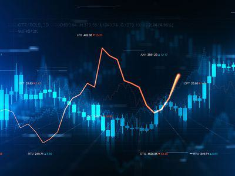

Futures trading has undergone a dramatic evolution, establishing itself as an indispensable tool for both hedgers—those seeking to protect their investments against price fluctuations—and speculators aiming to profit from market movements. Traditionally seen as complex and accessible only to experienced traders, futures trading has been transformed by the advent of algorithmic trading, or algo trading. This technology-driven approach uses advanced algorithms to execute trades at speeds and frequencies that would be impossible for a human trader. 

As we approach 2024, the integration of algorithmic strategies within futures trading platforms signifies a pivotal shift. Traders now have the ability to leverage sophisticated systems for enhanced precision and efficiency. This combination of futures and algo trading allows for an optimized trading experience that minimizes human error and maximizes potential profitability. 



In this article, we will examine the premier futures trading platforms for 2024, with a focus on their support and facilitation of algo trading. By analyzing the distinct features, advantages, and drawbacks of various platforms, we aim to highlight their significance for traders across different levels of expertise. This guide is structured to assist traders in selecting the platform that best aligns with their individual trading needs and objectives, ensuring they are equipped to harness the power of algorithmic trading in futures markets effectively.

## Table of Contents

## Understanding Futures Trading

Futures contracts are fundamental instruments in financial markets, representing legal agreements to buy or sell an asset at a predetermined price on a specified future date. These contracts cover a wide range of assets, including commodities, currencies, indices, and financial instruments, enabling traders and investors to capitalize on price movements.

**Futures as Legal Agreements**

A futures contract obligates the holder to transact an asset at a future point, mitigating uncertainties associated with market fluctuations. For example, a wheat farmer might sell a futures contract to lock in a price and secure revenue, while a bread manufacturer might buy the contract to hedge against rising wheat prices. Both parties agree to exchange the asset at the contract's expiration, solidifying the position in advance.

**Hedging and Speculation**

Futures serve two primary purposes in markets: hedging and speculation. Hedging involves using futures to protect against adverse price changes. For instance, an investor holding stocks might go short on index futures to mitigate the risk of a market downturn. Speculators, on the other hand, seek to profit from price changes, leveraging futures contracts without the intention of possessing the underlying asset. This potential for profit stems from correctly anticipating price directions, exploiting contracts to capitalize on forecasted trends.

**Significance of Leverage**

Leverage is a defining characteristic of futures trading, amplifying both potential gains and risks. When traders enter futures contracts, they may only need to deposit a fraction of the contract's total value, known as margin. This allows control over a larger position than feasible with the available capital. For instance, with a margin of 10%, a trader controlling a $100,000 futures contract would only need to deposit $10,000. The formula for leverage $L$ is:

$$
L = \frac{\text{Contract Value}}{\text{Margin Deposit}}
$$

While leverage enhances profit opportunities, as small price movements can yield substantial returns, it also intensifies risks, as adverse movements can lead to significant losses.

**Understanding Risks**

Engaging in futures trading involves inherent risks due to high leverage and market [volatility](/wiki/volatility-trading-strategies). Traders must evaluate the potential for substantial losses, which could exceed initial investments. Such risks necessitate rigorous risk management strategies, including stop-loss orders and position sizing, to safeguard against severe downturns. Continuous market analysis and disciplined trading practices are vital in mitigating these risks. 

In conclusion, futures trading is a dynamic market activity offering both hedging capabilities and speculative opportunities. Understanding how these contracts function, their benefits, and associated risks is critical for traders aiming to navigate futures markets effectively.

## The Evolution of Algo Trading

Algorithmic trading, or algo trading, is a trading strategy that employs computer programs to execute trades following a set of predefined instructions based on variables such as timing, price, and [volume](/wiki/volume-trading-strategy). Its relevance in modern markets is underpinned by its ability to process vast amounts of data at speeds and efficiencies far surpassing human capabilities. This technological advancement has transformed trading strategies across global financial markets.

At its core, [algorithmic trading](/wiki/algorithmic-trading) employs complex mathematical models and high-speed data networks to automate and optimize trade execution. These algorithms can analyze market conditions, identify trading opportunities, and execute trades within milliseconds. The speed advantage, often crucial in highly volatile markets, allows traders to capitalize on momentary price discrepancies that manual trading would likely miss. Moreover, algorithms minimize human intervention, thereby reducing the potential for emotional biases and errors that can detrimentally affect trading decisions.

The benefits of algo trading are numerous. Its ability to execute trades at a higher speed is critical, given that even fractions of a second can make a significant difference in market conditions. Efficiency is another major advantage, with algorithms capable of running 24/7, scanning multiple markets and securities simultaneously without fatigue. This consistent monitoring increases the accuracy and reliability of trading strategies. By eliminating human error, algorithmic trading ensures that orders are executed precisely as intended, reducing the likelihood of costly mistakes typical in manual trading.

The history of algo trading traces back to the 1970s when the New York Stock Exchange (NYSE) introduced electronic trading systems. However, it gained widespread popularity in the 1990s with the advent of more sophisticated computing technologies and data analytics tools. Over the years, the algorithms have become more intricate, incorporating [machine learning](/wiki/machine-learning) techniques and big data analytics to predict market trends and optimize strategies further.

A significant milestone in the evolution of algo trading is its increasing accessibility to retail traders. Once the domain of large financial institutions with vast resources, algo trading platforms have become user-friendly and affordable, enabling individual traders to deploy automated strategies with relative ease. Retail algo trading platforms often come equipped with intuitive interfaces, educational resources, and [backtesting](/wiki/backtesting) capabilities that allow traders to develop, test, and refine their algorithms without the need for extensive programming knowledge.

The democratization of algorithmic trading has contributed to the rise of so-called "citizen traders," individuals who harness technological advancements to interact with financial markets in ways previously reserved for professional traders. This shift has been facilitated by platform developers focusing on user experience, ensuring that complex algorithmic functionalities are accessible to novices and seasoned traders alike.

In summary, the evolution of algo trading reflects technological progress and the increasing emphasis on speed and efficiency in modern markets. By leveraging advanced computational techniques, traders can execute strategies that significantly enhance profitability and market precision. As algorithmic trading continues to evolve, its role in shaping the future of financial markets remains indispensable.

## Top Futures Trading Platforms for 2024

When evaluating the best futures trading platforms for 2024, key criteria such as technology, fees, and user experience are essential. These factors play a significant role in determining the overall effectiveness and suitability of a platform for both novice and experienced traders.

### Interactive Brokers

[Interactive Brokers](/wiki/interactive-brokers-api) stands out as a comprehensive trading platform offering extensive market access and competitive pricing. Known for its broad range of tradable assets and global market reach, it supports seamless algorithmic trading through advanced APIs. Interactive Brokers excels in providing low commission rates, which can significantly benefit high-frequency traders. The platform's technology infrastructure ensures fast execution speeds, crucial for futures trading, where market conditions can change rapidly.

### NinjaTrader

NinjaTrader is distinguished for its cost-effective pricing structure and robust trading features, making it a preferred choice among traders seeking value and performance. It provides extensive tools for technical analysis and supports advanced algorithmic strategies. A key feature of NinjaTrader is its customizability, allowing traders to develop and test personalized trading algorithms. Users can access a wealth of data and utilize backtesting to refine their strategies before live deployment.

### E*TRADE

E*TRADE is ideally suited for beginner futures traders, with a strong emphasis on educational resources. Its user-friendly interface and comprehensive learning materials empower new traders to understand the intricacies of futures markets. E*TRADE offers a range of trading tools, albeit not as advanced as other platforms, making it an excellent starting point for those new to futures trading. Additionally, E*TRADE's customer service is highly rated, providing essential support for novices.

### TradeStation

TradeStation is best suited for experienced traders seeking advanced charting and analytic tools. Its robust platform supports sophisticated algorithmic trading through its EasyLanguage programming environment, which allows traders to develop custom indicators and strategies. TradeStation offers powerful visualization tools that enable traders to conduct in-depth market analysis. Its premium features and execution capabilities cater to seasoned traders who require advanced functionality to implement complex trading strategies.

These platforms exemplify the diversity of options available for futures trading in 2024, each catering to specific needs and preferences of traders. The choice of platform should be made based on an individual's trading goals, experience level, and technical requirements.

## Features and Benefits of Leading Platforms

When evaluating futures trading platforms, understanding the features and benefits they offer is crucial to finding a tool that aligns with your trading goals. Key aspects include backtesting capabilities, trading algorithms, market access, execution speed, reliability, support systems, user interface, and educational resources.

Backtesting is an essential feature for traders implementing algorithmic strategies. This allows users to test how their trading strategies would have performed using historical data before risking real capital. Platforms such as NinjaTrader offer robust backtesting features, enabling traders to refine their strategies by simulating different market conditions. By running a variety of scenarios, traders can optimize their strategies to improve performance metrics such as the Sharpe ratio, which measures risk-adjusted return:

$$
\text{Sharpe Ratio} = \frac{E[R_p - R_f]}{\sigma_p}
$$

Where $E[R_p - R_f]$ represents the expected return of the portfolio minus the risk-free rate, and $\sigma_p$ is the standard deviation of the portfolio’s excess return.

Algorithmic trading features vary among platforms. Interactive Brokers provides a sophisticated algorithmic trading interface supporting a wide array of complex trading algorithms, allowing traders to execute multiple orders automatically based on predetermined criteria. The platform also offers an API that enables users to integrate custom algorithms implemented in Python, enhancing the flexibility and customization available to traders.

Market access is another vital component. The top platforms provide extensive reach to various futures markets globally, ensuring traders can diversify their portfolios and take advantage of different market opportunities. More advanced platforms may offer direct market access (DMA), granting users the ability to view order [books](/wiki/algo-trading-books) and trade directly on the exchange.

Execution speed and reliability are non-negotiable for traders relying on algorithmic strategies. Fast execution can be the difference between profit and loss in high-frequency trading. TradeStation is renowned for its execution speed and stability, ensuring trades are executed rapidly and reliably. Additionally, their support systems provide a safety net, offering assistance to users through comprehensive customer service and technical support.

A user-friendly interface can significantly enhance the trading experience for both beginners and advanced traders. Platforms like E*TRADE are designed with intuitive interfaces that make navigation seamless, accompanied by customizable dashboards that allow traders to tailor their workspace. For advanced users, platforms such as TradeStation offer sophisticated charting tools and analytics that cater to their need for detailed technical analysis.

Educational resources are essential for traders at all levels. Many leading platforms provide rich educational content, including webinars, tutorials, and articles, helping traders to expand their knowledge base and improve their trading skills. Simulated trading environments, also known as paper trading accounts, play a crucial role in learning. They allow traders to practice and refine their strategies without financial risk, providing valuable hands-on experience.

In conclusion, the features and benefits of leading futures trading platforms revolve around providing robust tools for analysis, execution, and education, ensuring traders have everything they need to succeed in today's demanding markets.

## Leveraging Algo Trading on Futures Platforms

Implementing algorithmic trading strategies on futures platforms requires careful selection of the right platform, deep understanding of the technical requirements, and consideration of specific factors that impact trading success. Algorithmic trading, by leveraging advanced computational algorithms, can execute trades at speeds and frequencies impractical for human traders. This section will guide you through the process of leveraging algo trading on these platforms.

### Comparison of Algo Trading Capabilities: TradeStation vs. Interactive Brokers

TradeStation and Interactive Brokers are two prominent platforms that cater to algorithmic traders with distinctive features. TradeStation provides a comprehensive suite of tools for developing and executing algorithmic strategies. It offers EasyLanguage, its proprietary programming language, which is intuitive for traders without formal programming expertise. This platform excels in providing robust backtesting features and access to a wide array of futures contracts.

Interactive Brokers, on the other hand, is known for its extensive market access and low-cost trading options. It offers the Trader Workstation (TWS) with API support, allowing traders to implement complex strategies using languages such as Python, Java, and C++. Interactive Brokers is suitable for those who require direct market access and the ability to build sophisticated trading models that can automatically trade across global exchanges.

### Technical Requirements for Successful Algorithmic Trades

To set up and run successful algorithmic trades, traders need to meet several technical requirements. Firstly, a stable and high-speed internet connection is crucial to ensure rapid execution of trades and to capitalize on market opportunities. Additionally, a computer with sufficient processing power and memory is needed to handle the computational demands of running algorithms continuously.

Moreover, traders should make use of robust trading software that can handle algorithm requirements such as latency, execution speed, and real-time data processing. Interactive Brokers and TradeStation both offer APIs that facilitate the connection between the trading platform and custom algorithms, allowing for seamless trade execution. The following is a simple Python code snippet illustrating how an algorithm might connect to Interactive Brokers' API to place trades:

```python
from ibapi.client import EClient
from ibapi.wrapper import EWrapper
from ibapi.contract import Contract

class AlgoTradingApp(EWrapper, EClient):
    def __init__(self):
        EClient.__init__(self, self)

    def place_futures_trade(self):
        contract = Contract()
        contract.symbol = "ES"
        contract.secType = "FUT"
        contract.exchange = "GLOBEX"
        # add additional contract details here

        self.placeOrder(1, contract, self.create_order())

    def create_order(self):
        order = Order()
        order.action = "BUY"
        order.totalQuantity = 1
        order.orderType = "MKT"
        return order

app = AlgoTradingApp()
app.connect("127.0.0.1", 7496, 0)
app.run()
```

### Key Considerations for Traders

When employing algorithmic strategies in futures markets, traders must consider several key factors:

1. **Strategy Development and Testing**: Algorithmic strategies should be rigorously tested against historical data to validate their effectiveness before deployment in live markets. Backtesting tools provided by platforms like TradeStation help simulate the performance of algorithms under various market conditions.

2. **Risk Management**: Futures trading is inherently risky due to leverage. Implementing features such as stop-loss orders and setting predefined risk parameters can mitigate potential losses.

3. **Regulatory Compliance**: Ensuring compliance with trading regulations is vital. Traders need to be aware of the legalities surrounding algorithmic trading in their regions, including reporting and audit requirements.

4. **Market Conditions**: Algorithm performance can vary with different market conditions. Continuous monitoring and adjustment of parameters in response to market volatility or structural changes is essential to maintain profitability.

These components form the foundation of successful algorithmic trading in futures markets, allowing traders to harness technology's power for competitive advantage.

## Choosing the Right Platform for You

When selecting a futures trading platform tailored to individual needs, traders must consider several factors. The right platform can significantly enhance trading efficiency, while a poor choice may result in unnecessary costs and complexity.

**Evaluating Commission Structures, Margin Requirements, and Overall Costs**

Firstly, understanding commission structures is crucial. Many platforms charge fees per trade, which can accumulate quickly for active traders. For instance, if a platform charges $0.50 per contract, a trader executing 1,000 contracts per month would incur a monthly cost of $500 solely for commissions. It's essential to compare these costs against other platforms to find the most cost-effective option.

In addition, margin requirements determine the amount of capital needed to maintain open positions. Lower margin requirements allow traders to leverage their capital more effectively but also increase the risk of margin calls. For example, if a futures contract requires a 5% margin and the contract size is $100,000, the trader needs to have $5,000 as a margin. Different platforms may offer varying margin levels, so it's important to select one that aligns with your risk tolerance and trading strategy.

Overall cost evaluation goes beyond commissions and margins. Traders should also account for data feed fees, withdrawal charges, and any hidden costs that may arise with platform usage. Calculating these expenses ensures that traders choose a financially viable platform tailored to their trading volume and style.

**The Role of Customer Support and Additional Services in Decision Making**

Effective customer support can be indispensable, especially during critical trading situations. A responsive support team helps troubleshoot issues swiftly, reducing potential downtime that can impact trading decisions. Platforms offering round-the-clock support via multiple channels—such as phone, chat, and email—typically provide better service reliability.

Additional services, such as educational resources and research tools, can significantly enhance trader effectiveness. Many platforms offer webinars, tutorials, and market analysis that are invaluable for both beginners and experienced traders. These resources aid in developing better trading strategies and understanding market dynamics, making them a key consideration in platform selection.

**Tips for Test-Driving Platforms Using Demo Accounts Before Making a Commitment**

Before committing to a platform, utilizing demo accounts can be an insightful approach. Demo accounts simulate real trading environments without financial risk, allowing users to evaluate the platform's features and usability. This testing phase is crucial for understanding execution speed, data interface design, and the overall trading experience offered by the platform.

A demo account helps traders assess whether the platform’s tools and functionalities match their trading needs. It is advisable to run sample trades and experiment with algorithms during this trial to observe how the platform performs under simulated conditions. This preliminary exploration helps in making an informed decision, ensuring the selected platform aligns with one's trading strategy and preferences.

By focusing on these factors—commission structures, margin requirements, customer support, additional services, and demo account feedback—traders can select a futures trading platform that best suits their individual needs and enhances their trading prospects.

## Final Thoughts

As 2024 approaches, futures trading platforms continue to evolve, integrating advanced algorithmic trading capabilities to serve traders more effectively. Significant platforms such as Interactive Brokers, NinjaTrader, E*TRADE, and TradeStation provide a diverse range of features catering to algorithmic trading. Interactive Brokers is noted for its extensive market access and attractive commission structure, making it appealing to both retail and professional traders. NinjaTrader offers competitive pricing and robust trading features, ideal for cost-conscious traders who demand flexibility. E*TRADE's focus on education makes it an excellent option for beginners entering the futures trading arena, while TradeStation's advanced analytics and charting tools are well-suited for seasoned traders.

Selecting the appropriate platform requires an evaluation of individual needs and trading preferences. It is vital to scrutinize commission structures, available features, and user support. Traders are encouraged to utilize demo accounts to experience platforms firsthand without financial risk, ensuring compatibility with their trading style and objectives.

Continual learning and adaptability are essential in navigating the dynamic futures markets. Staying informed about market trends and technological advancements can provide traders with a competitive edge. Leveraging educational resources and participating in community support networks can facilitate knowledge sharing and development of trading skills. Resources such as webinars, forums, and dedicated support teams can enhance traders' understanding of both the technical and strategic aspects of futures trading.

Looking ahead, the future of futures trading will be increasingly intertwined with technological advancements. Algorithmic trading is set to play a central role, offering efficiency, speed, and precision that manual trading cannot match. Embracing technology while maintaining a solid foundation in market principles will be crucial for traders aiming to thrive in this evolving landscape. As such, a commitment to ongoing education and strategic evaluation of trading platforms will serve traders well in achieving long-term success.

## Frequently Asked Questions

### What are the risks associated with futures trading?

Futures trading involves significant risk due to the leverage nature of the contracts. Leverage allows traders to control a large position with a relatively small amount of capital, magnifying both potential profits and losses. For instance, a minor adverse price movement can lead to substantial financial loss, potentially exceeding the initial investment. Traders also face market risk, where price fluctuations are unpredictable, and [liquidity](/wiki/liquidity-risk-premium) risk, which arises if it becomes difficult to find a buyer or seller for the contract at the desired price. Understanding these risks is crucial to manage potential financial exposure effectively.

### How can algorithmic trading improve my futures trading experience?

Algorithmic trading enhances futures trading by automating the execution of trades based on pre-defined criteria, which eliminates human emotion and error during decision-making processes. Algorithms can process vast amounts of data at high speeds to identify trading opportunities that may otherwise be missed in manual trading. Additionally, they can backtest strategies over historical data to optimize performance before live trading. This speed and efficiency not only increase potential profitability but also enable traders to remain competitive in today's fast-paced markets.

### What are the costs involved with using a futures trading platform?

The costs associated with futures trading platforms can vary widely, encompassing commission fees per trade, data feed fees, and platform subscription fees. Other possible costs include exchange fees and potential charges for advanced trading features or tools like sophisticated analytics and charting software. To make informed choices, traders should consider the overall cost structure and how these fees might impact profitability, especially for high-frequency trading strategies.

### Can beginners start futures trading with algorithmic strategies?

Beginners can indeed start futures trading with algorithmic strategies, though it's advisable to proceed with caution. It is beneficial for beginners to first familiarize themselves with basic trading principles and market dynamics. Many platforms offer educational resources, demo accounts, and simulated trading environments, which can be valuable for newcomers to practice and test their strategies without financial risk. A phased approach, using algorithmic tools for simpler strategies before progressing to more complex systems, is recommended.

### How do I ensure my algorithmic strategies are effective?

To ensure algorithmic strategies are effective, traders should engage in rigorous backtesting using historical data to measure a strategy's performance before it is employed in live markets. This process should include stress-testing under various market conditions to ascertain its robustness. Continual monitoring is essential to adjust parameters and adapt to evolving market environments. Traders should also maintain a disciplined approach in evaluating key performance indicators such as the Sharpe ratio and drawdown levels to gauge the strategy's risk-reward profile. Additionally, keeping abreast of market changes and technological advancements can contribute to sustaining an effective strategy.

## References & Further Reading

[1]: ["Algorithms for Hyper-Parameter Optimization"](https://dl.acm.org/doi/10.5555/2986459.2986743) by Bergstra, J., Bardenet, R., Bengio, Y., & Kégl, B., Advances in Neural Information Processing Systems 24.

[2]: ["Advances in Financial Machine Learning"](https://www.amazon.com/Advances-Financial-Machine-Learning-Marcos/dp/1119482089) by Marcos Lopez de Prado.

[3]: ["Evidence-Based Technical Analysis: Applying the Scientific Method and Statistical Inference to Trading Signals"](https://www.amazon.com/Evidence-Based-Technical-Analysis-Scientific-Statistical/dp/0470008741) by David Aronson.

[4]: ["Machine Learning for Algorithmic Trading"](https://github.com/PacktPublishing/Machine-Learning-for-Algorithmic-Trading-Second-Edition) by Stefan Jansen.

[5]: ["Quantitative Trading: How to Build Your Own Algorithmic Trading Business"](https://www.amazon.com/Quantitative-Trading-Build-Algorithmic-Business/dp/1119800064) by Ernest P. Chan.