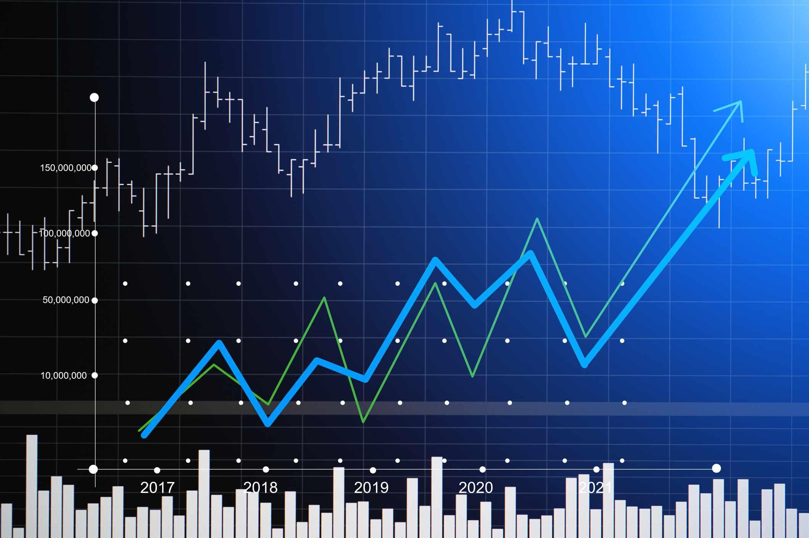

The growth stocks market in October 2024 is witnessing significant developments that shape investment strategies. Growth stocks, typically characterized by their potential for substantial revenue and earnings growth, attract investors seeking capital appreciation. As of October 2024, the market for these stocks is influenced by various macroeconomic factors, including technological advancements, changes in consumer behavior, and global economic conditions.

Algorithmic trading plays an increasingly pivotal role in shaping modern investment strategies. The use of algorithms enables investors to analyze vast amounts of data efficiently, make informed decisions, and execute trades at speeds unattainable by humans. This technological advancement transforms the investment landscape by providing nuanced insights into market trends and patterns, thus enabling more strategic involvement in growth stocks.



The primary purpose of this article is to explore the investment opportunities present in growth stocks through the lens of algorithmic trading. With the sheer volume of data available, algorithmic trading offers a method to dissect and harness this information, identifying patterns that signal the potential uptrend of growth stocks. This approach minimizes human error and biases, optimizing investment decisions and outcomes.

Continuous updates in market trends are crucial for investors, particularly in the dynamic environment of growth stocks. Fluctuations in these trends can be influenced by policy changes, technological innovations, and consumer sentiment shifts. Staying informed allows investors to capitalize on emerging opportunities and mitigate risks associated with growth stock investments.

In optimizing investment in growth stocks, algorithmic trading offers distinct advantages, including increased efficiency, reduced transaction costs, and enhanced risk management. Algorithms can be designed to identify growth opportunities automatically, making real-time adjustments to investment portfolios. By leveraging these technologies, investors are better equipped to navigate the complexities of the growth stock market, ensuring alignment with broader financial goals.

In conclusion, as we analyze the dynamics of the growth stocks market, understanding the utilization of algorithmic trading offers a significant edge in making informed investment choices. This technological integration marks a substantive shift towards more adaptive, data-driven techniques in growth stock investment strategies.

## Table of Contents

## Understanding Growth Stocks

Growth stocks are equities expected to grow at an above-average rate compared to other firms. These stocks are often characterized by high price-to-earnings (P/E) ratios and are commonly reinvested, yielding minimal immediate dividends to investors. Instead, the focus is on capital appreciation, assuming that the stock's price will increase significantly. Companies issuing [growth stocks](/wiki/growth-stocks) typically report substantial revenue growth, robust earnings [momentum](/wiki/momentum), and a strong competitive position within their industry.

### Key Sectors Driving Growth Stocks in 2024

As of 2024, the sectors most influential in driving growth stocks include technology, renewable energy, healthcare, and the fintech sector. The technology sector continues to evolve with advancements in [artificial intelligence](/wiki/ai-artificial-intelligence), cloud computing, and the Internet of Things (IoT). Renewable energy gains momentum as global initiatives focus on sustainability, creating opportunities for companies specializing in solar, wind, and other clean technologies. The healthcare sector is driven by innovative biotech firms and digital health solutions. Meanwhile, the fintech industry capitalizes on digital payments, blockchain, and other financial innovations.

### Historical Performance Trends of Growth Stocks

Historically, growth stocks have demonstrated periods of robust returns, particularly during economic expansions when investor confidence is high. For example, during the late 1990s dot-com bubble, technology-focused growth stocks soared. However, they may also face significant [volatility](/wiki/volatility-trading-strategies) and corrections during economic downturns or periods of market uncertainty, as seen during the 2008 financial crisis. Over the long term, growth stocks often outperform value stocks due to higher potential for appreciation, but they may also [carry](/wiki/carry-trading) higher risk.

### Risk Versus Reward Dynamics in Growth Stock Investment

Investing in growth stocks involves balancing significant risks with the potential for substantial rewards. The primary risk lies in the volatility associated with high growth potential, which can lead to sharp price fluctuations. This volatility can be mitigated by thorough research, diversification, and strategic entry and [exit](/wiki/exit-strategy) timings. However, the reward of investing in successful growth stocks is considerable, as these stocks can experience exponential growth over time, far outpacing inflation and providing substantial returns on investment.

### How Economic Indicators Influence Growth Stocks

Economic indicators such as interest rates, inflation rates, and GDP growth can profoundly impact growth stocks. Low-interest rates generally lead to favorable conditions for growth stocks, as borrowing costs are reduced and companies can invest more in expansion activities. Conversely, high inflation can erode purchasing power and affect consumer spending, influencing companies' growth prospects. GDP growth indicates economic health, with higher rates pointing to an expanding economy conducive to growth stock performance. Investors often analyze these indicators while formulating strategies to predict growth stock trends and make informed investment decisions.

## The Role of Algorithmic Trading in Investing

Algorithmic trading, often referred to as algo trading, involves the use of complex mathematical models and algorithms to execute trades at speeds and frequencies that are impossible for human traders. The rise of [machine learning](/wiki/machine-learning) and advanced computing power has made [algorithmic trading](/wiki/algorithmic-trading) a transformative force within the investment landscape.

### Algorithmic Trading's Impact on the Investment Landscape

Algorithmic trading has significantly altered how investments are managed by enhancing decision-making processes through sophisticated analytical tools and data-driven insights. This transformation allows for the automation of trading strategies, ensuring precise timing and execution. It minimizes human errors, optimizes transaction costs, and can execute multiple strategies simultaneously across various markets and instruments. As a result, investors can quickly adjust to market conditions, capitalize on brief opportunities, and mitigate risk more effectively.

### Advantages of Using Algorithms in Trading Growth Stocks

When it comes to growth stocks, algorithmic trading offers several advantages. These stocks, known for their potential for significant capital appreciation, can benefit from the speed and precision of algorithmic trading. Algorithms enable investors to react promptly to market signals and news, thus capturing favorable entry and exit points. They also facilitate back-testing strategies using historical data, offering insights that guide future trades. Moreover, algorithmic models can analyze vast data sets to identify trends and patterns that may not be immediately evident, helping investors make informed decisions.

### Types of Algorithms Used in Growth Stock Trading

Several types of algorithms are especially valuable in trading growth stocks, each serving different investment objectives:

1. **Statistical Arbitrage Algorithms**: These leverage statistical and econometric models to identify mispriced securities by transforming short-term deviations from historical averages into trading opportunities.

2. **Trend-Following Algorithms**: These algorithms analyze historical price patterns and signals to predict future movements, allowing investors to ride the momentum of growing stock prices.

3. **Mean Reversion Algorithms**: These strategies assume that prices will revert to their mean, predicting short-term reversals for stocks that have deviated from their historical price levels.

4. **Machine Learning Algorithms**: These use sophisticated models that incorporate artificial intelligence to learn from and adapt to new data. They can adaptively refine strategies based on evolving market conditions.

### Case Studies of Successful Algo Trading Strategies

Several notable case studies highlight the success of algorithmic trading strategies:

- **Example 1**: A hedge fund developed a machine learning algorithm that combined news sentiment analysis with quantitative data to trade tech stocks. This hybrid approach yielded a 20% return during a period when traditional indices showed moderate growth.

- **Example 2**: An investment firm utilized an arbitrage algorithm that exploited price discrepancies between American Depository Receipts (ADRs) and their underlying foreign securities. By automating trades across time zones, the firm capitalized on inefficiencies and gained substantial profit margins.

- **Example 3**: A quantitative trading team designed a trend-following algorithm for renewable energy stocks, successfully navigating the sector's volatility and generating consistent returns through dynamic market cycles.

In conclusion, the role of algorithmic trading in investing, particularly for growth stocks, is marked by enhanced efficiency, precision, and adaptability. By leveraging these technological tools, investors can gain a competitive edge in the complex and fast-paced financial markets of 2024.

## Identifying Potential Growth Stocks in October 2024

Current market conditions in October 2024 demonstrate a dynamic landscape for growth stocks, influenced by fluctuating economic indicators and sector-specific developments. The economic environment, marked by moderate GDP growth, low unemployment, and stable interest rates, has created favorable conditions for growth-focused investments. Global supply chain normalization and technological advancements have further contributed to this climate, fostering opportunities across various industries.

### Top Industries to Watch in October 2024

Several key industries are poised for significant growth in October 2024. The technology sector, driven by advancements in artificial intelligence and machine learning, continues to lead. Companies focusing on renewable energy and sustainability are also gaining momentum as regulatory pressures and consumer preferences shift towards greener solutions. Additionally, the healthcare and biotechnology sectors are witnessing robust expansion due to breakthroughs in personalized medicine and genetic research. The resurgence of consumer confidence is fueling the e-commerce and digital entertainment sectors, making them crucial areas for potential investment.

### Criteria for Selecting Promising Growth Stocks

Identifying promising growth stocks requires a systematic approach. Investors should assess the following criteria:

1. **Revenue Growth**: Consistent revenue increases indicate a company's expanding market presence and product demand.

2. **Earnings Potential**: Strong earnings growth potential reflects a company's operational efficiency and market competitiveness.

3. **Market Position**: Companies with a strong competitive edge or unique value propositions are more likely to sustain growth.

4. **Innovation**: A focus on innovation suggests a company's ability to adapt and thrive in evolving markets.

5. **Management Quality**: Experienced and dynamic management teams are crucial for executing growth strategies effectively.

### Tips for Evaluating the Potential of Growth Stocks

When evaluating growth stocks, investors should:

- Conduct a thorough analysis of financial statements, focusing on revenue trends, profitability margins, and cash flow stability.

- Assess industry trends and market dynamics to understand the external factors influencing stock performance.

- Utilize valuation metrics such as the Price to Earnings Growth (PEG) ratio, which considers the expected earnings growth, providing a more nuanced view of a stock's value compared to its current price.

- Monitor news and developments related to the company and its industry to stay informed about potential risks and opportunities.

### Expert Predictions for Growth Stock Performance

Financial analysts predict that growth stocks will continue to perform well, particularly those in sectors like technology and green energy, benefiting from sustained innovation and regulatory incentives. The healthcare sector is also expected to witness upward momentum, driven by an aging population and increased healthcare spending. However, experts caution that rising geopolitical tensions and potential regulatory changes could introduce volatility.

Overall, staying vigilant about market trends and maintaining a diversified investment approach are crucial for maximizing returns on growth stocks. By leveraging algorithmic trading strategies, investors can optimize their portfolio management, enhancing decision-making processes and capitalizing on market opportunities efficiently.

## Integrating Algo Trading in Growth Stock Investment

Integrating algorithmic trading into growth stock investment can significantly enhance decision-making processes, optimize execution speed, and minimize human biases. A structured approach to implementing algorithmic trading strategies involves multiple steps, starting from the design phase to continuous monitoring and adaptation.

### Step-by-Step Guide to Implementing Algo Trading Strategies

1. **Strategy Development**:
   - Identify specific investment goals and risk tolerance. These form the foundation of the algorithmic strategy.
   - Conduct a comprehensive market analysis to determine the criteria for selecting growth stocks. This involves examining historical data, economic indicators, and industry forecasts to identify potential opportunities.
   - Develop mathematical models to predict stock price movements. These models can range from simple moving averages to complex machine learning algorithms.

2. **Backtesting**:
   - Apply historical data to test the effectiveness of the developed strategies. This step is crucial for identifying potential flaws and optimizing strategy parameters.
   - Utilize programming languages like Python or R to simulate trading scenarios. Below is a basic example of backtesting using the Simple Moving Average (SMA) crossover strategy in Python:

   ```python
   import pandas as pd

   # Load historical data
   data = pd.read_csv('historical_stock_data.csv')
   data['SMA_20'] = data['Close'].rolling(window=20).mean()
   data['SMA_50'] = data['Close'].rolling(window=50).mean()

   # Signal generation
   data['Signal'] = 0
   data['Signal'][data['SMA_20'] > data['SMA_50']] = 1
   data['Position'] = data['Signal'].diff()

   # Evaluate strategy performance
   initial_capital = 10000
   data['Portfolio Value'] = initial_capital * (1 + data['Returns']).cumprod()
   print(data['Portfolio Value'].tail())
   ```

3. **Tools and Platforms for Algorithmic Trading**:
   - Choose trading platforms that offer robust API support and real-time data feeds. Popular platforms include MetaTrader 5, Interactive Brokers, and QuantConnect.
   - Leverage cloud computing services to manage computational loads and ensure rapid processing times.

4. **Balancing Human Oversight with Automated Trading**:
   - Implement control systems that allow for human intervention when necessary. This could involve setting predefined thresholds for review or alerts for unusual market conditions.
   - Regularly review algorithm performance and adjust for changing market dynamics or unforeseen macroeconomic events.

5. **Managing Risks Associated with Algorithmic Trading**:
   - Use risk management techniques such as stop-loss orders, position sizing, and diversification to limit potential losses.
   - Conduct scenario analysis to understand how strategies perform under different market conditions, ensuring algorithms are robust against volatility.

6. **Monitoring and Adjusting Algorithms**:
   - Establish mechanisms for real-time monitoring of algorithm performance. This involves using dashboards and real-time analytics tools to track key performance metrics.
   - Continuously update algorithms with new data and insights, making iterative improvements based on feedback and performance outcomes.

Algorithmic trading offers a systematic and efficient approach to investing in growth stocks. By carefully developing, testing, and monitoring strategies, investors can potentially enhance returns while managing associated risks. The integration of technological tools allows for precise execution and the ability to quickly adapt to market changes, ultimately optimizing growth stock investment strategies.

## Case Studies: Successful Investments Using Algo Trading

### Real-World Examples of Growth Stock Investments via Algo Trading

Algorithmic trading has become an essential component in the growth stock investment landscape, offering enhanced precision and rapid execution that human traders alone cannot achieve. Notable instances of successful growth stock investments using algorithmic trading provide valuable insights into evolving market strategies.

One prominent example is Renaissance Technologies, a pioneer in the application of quantitative analysis to stock trading. The firm's Medallion Fund, known for its algo-driven strategy, consistently achieved annual returns exceeding 35% over two decades. The fund's success is attributed to Renaissance Technologies' ability to employ highly sophisticated algorithms that analyze immense datasets, identifying patterns and executing high-frequency trades with exceptional accuracy.

Another example is the case of Two Sigma, an investment firm leveraging data science and technology to outperform traditional strategies. Two Sigma invests heavily in technology infrastructure to continuously enhance its algorithms. The firm uses machine learning algorithms to process vast amounts of data from diverse sources, enabling it to predict stock movements and uncover profitable opportunities in growth stocks.

### Lessons Learned and Best Practices

These examples underscore several key lessons for deploying successful algo trading strategies:

1. **Data Utilization**: Successful algo trading emphasizes the integration and analysis of large datasets. Firms like Renaissance Technologies and Two Sigma have shown the importance of exhaustive data collection, including traditional financial data, alternative datasets, and real-time market information.

2. **Technological Infrastructure**: Robust technological infrastructure is crucial. Investment firms must ensure high computational power and low latency to process data swiftly and execute trades efficiently.

3. **Continuous Improvement**: As seen with successful firms, continually refining and improving algorithms is vital. Incorporating feedback loops and adapting to new data trends are essential to maintaining a competitive edge.

4. **Risk Management**: Effective risk management strategies, such as stop-loss orders and portfolio diversification, are integral to safeguarding investments against market volatility.

### Impact of Technological Advancements on Trading Success

Technological advancements have drastically altered the dynamics of stock trading. The development of advanced machine learning models and enhancements in computational capabilities have facilitated more sophisticated algorithmic approaches. Quantum computing, although still in its infancy, promises to revolutionize data processing speeds, allowing for even more complex analyses and faster trade executions.

These innovations enhance the efficiency and efficacy of algo trading in identifying and capitalizing on opportunities in growth stocks. Moreover, the advent of artificial intelligence-driven predictive models improves the accuracy of market predictions, further optimizing growth stock investments.

### Future Outlook for Growth Stock Investments Using Algorithms

The future of growth stock investments using algorithmic trading is promising. As technological advancements continue, investment firms are likely to deploy more complex and nuanced algorithms that further enhance predictive capabilities. This progress will enable investors to increasingly rely on data-driven decisions, minimizing human biases and errors.

Additionally, the application of blockchain technology for increased transparency and security in trades could further solidify the reliability of algo trading systems. The ongoing development of decentralized autonomous organizations (DAOs) may also emerge as a new horizon for algorithmic trading, enabling more democratic and automated investment management.

### Guiding Future Investment Decisions

These case studies and insights guide future investment decisions by highlighting the indispensable role of technology and data analytics in contemporary trading. Investors should prioritize the integration of sophisticated algo trading systems and continuously evolve these systems to align with emerging technologies and market trends.

The success stories of firms like Renaissance Technologies and Two Sigma offer a blueprint for other investors aiming to harness algorithmic trading's potential in the growth stock market. Adopting a mindset of innovation, data-driven analysis, and continuous learning will be key to sustaining competitive advantage and achieving substantial returns in the years to come.

## Conclusion

Investing in growth stocks using algorithmic trading offers substantial benefits, capitalizing on advanced technological tools to enhance decision-making and optimize returns. Growth stocks, characterized by their potential for above-average expansion compared to market indices, often attract investors seeking high returns. Algorithmic trading enhances these opportunities by analyzing vast datasets in real-time, allowing for quick and informed decisions that capitalize on volatile market conditions.

The shift towards algorithm-based investment strategies signifies a major transformation in the investment landscape. This method's precision mitigates human error and emotional bias, factors that often lead to suboptimal decisions. The systematic nature of algorithms supports consistent performance, capturing market signals efficiently and making adjustments based on pre-defined criteria. Algorithms not only streamline the investment process but also facilitate the execution of complex strategies that may not be possible manually.

Investors are encouraged to embrace these technological advancements, as reliance on well-designed algorithms can improve accuracy and execution speed, two critical factors in high-frequency trading environments. The capability to back-test strategies with historical data further provides an avenue to refine approaches before committing capital, thereby reducing risk.

Furthermore, continuous learning and adaptation remain crucial. The dynamic nature of markets demands an understanding of emerging trends and the flexibility to incorporate new techniques into existing strategies. By utilizing machine learning and AI, investors can refine algorithms to adapt to changing market conditions and economic indicators, ensuring sustained effectiveness over time.

Finally, predicting and reacting to market trends in 2024 requires a blend of technology and insight. Algorithmic trading provides the means to anticipate shifts through data-driven predictions, while human oversight ensures strategic alignment with broader investment goals. By combining the analytical power of algorithms with the strategic acumen of seasoned investors, market participants can better navigate the complexities of growth stock investment, poised to maximize returns in an ever-evolving economic landscape.

## References & Further Reading

[1]: Bergstra, J., Bardenet, R., Bengio, Y., & Kégl, B. (2011). ["Algorithms for Hyper-Parameter Optimization."](https://dl.acm.org/doi/10.5555/2986459.2986743) Advances in Neural Information Processing Systems 24.

[2]: ["Advances in Financial Machine Learning"](https://www.amazon.com/Advances-Financial-Machine-Learning-Marcos/dp/1119482089) by Marcos Lopez de Prado

[3]: ["Evidence-Based Technical Analysis: Applying the Scientific Method and Statistical Inference to Trading Signals"](https://www.wiley.com/en-us/Evidence+Based+Technical+Analysis%3A+Applying+the+Scientific+Method+and+Statistical+Inference+to+Trading+Signals-p-9780470008744) by David Aronson

[4]: ["Machine Learning for Algorithmic Trading"](https://github.com/stefan-jansen/machine-learning-for-trading) by Stefan Jansen

[5]: ["Quantitative Trading: How to Build Your Own Algorithmic Trading Business"](https://books.google.com/books/about/Quantitative_Trading.html?id=j70yEAAAQBAJ) by Ernest P. Chan