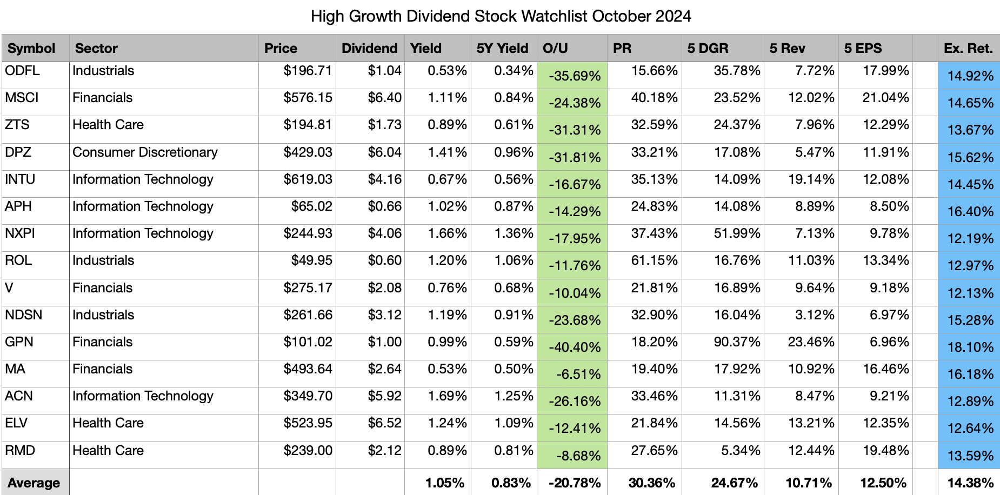

## Table of Contents

## What are growth stocks and why are they important for investors?

Growth stocks are shares in companies that are expected to grow faster than other companies in the market. These companies usually reinvest their earnings back into the business to expand and increase their profits, rather than paying out dividends to shareholders. Examples of growth stocks include technology companies like Apple or Amazon, which have seen their stock prices increase significantly over time due to their rapid growth.

Growth stocks are important for investors because they offer the potential for high returns. If an investor buys a growth stock early and the company continues to grow, the value of the stock can increase a lot, leading to big profits. However, growth stocks can also be risky because their prices can be volatile, meaning they can go up and down a lot. So, while they can be a great way to build wealth, investors need to be prepared for the ups and downs that come with them.

## How do you identify a growth stock?

To identify a growth stock, you need to look at a few key things. First, check the company's past earnings growth. Growth stocks usually have earnings that grow faster than average. You can find this information in the company's financial reports or on financial websites. Second, look at the company's future growth potential. This means thinking about things like new products, entering new markets, or expanding their business. Analysts' reports can help you understand what experts think about the company's future.

Another important thing to look at is the company's price-to-earnings (P/E) ratio. Growth stocks often have higher P/E ratios because investors are willing to pay more for the stock, expecting future growth. However, a very high P/E ratio can also mean the stock is overvalued, so you need to be careful. Lastly, pay attention to the company's industry. Growth stocks are often found in industries that are growing quickly, like technology or healthcare. By combining these factors, you can better identify stocks that have strong growth potential.

## What are the key financial metrics to look at when evaluating growth stocks?

When you want to evaluate [growth stocks](/wiki/growth-stocks), there are a few important financial metrics to look at. One key metric is the earnings growth rate. This tells you how fast the company's profits are growing. You can find this by looking at the company's past earnings and comparing them over time. A high earnings growth rate is a good sign that the company is doing well and has the potential to keep growing. Another important metric is the price-to-earnings (P/E) ratio. This shows how much investors are willing to pay for each dollar of the company's earnings. Growth stocks often have higher P/E ratios because people expect them to grow a lot in the future.

Another metric to consider is the revenue growth rate. This shows how fast the company's sales are increasing. Strong revenue growth can be a sign that the company is expanding and gaining more customers. You should also look at the return on equity (ROE), which measures how well the company is using its money to make profits. A high ROE can mean the company is good at turning its investments into earnings. By looking at these metrics, you can get a better idea of whether a stock has good growth potential and is worth investing in.

## What industries are expected to lead growth in October 2024?

In October 2024, the technology sector is expected to lead growth. This is because more and more people are using new technology like [artificial intelligence](/wiki/ai-artificial-intelligence) and cloud computing. Big tech companies are making a lot of money from these new technologies. They are also investing a lot to keep growing. Because of this, their stock prices are expected to go up.

Another industry that is expected to do well is healthcare. This is because people are always going to need healthcare, no matter what the economy is doing. New medicines and treatments are being developed all the time, and this is helping healthcare companies grow. Also, as the population gets older, more people will need healthcare services. This means that healthcare stocks could be a good investment in October 2024.

## Can you list the top growth stocks to watch in October 2024?

In October 2024, one of the top growth stocks to watch is Nvidia. Nvidia is a big company in the technology sector, especially known for making chips that help with artificial intelligence and gaming. They are making a lot of money because more and more businesses want to use AI. Another stock to keep an eye on is Eli Lilly. This is a healthcare company that is doing well because they are coming out with new medicines for diseases like diabetes and Alzheimer's. People need these medicines, so Eli Lilly's stock is expected to grow.

Another growth stock to consider is Tesla. Tesla is a car company that makes electric vehicles, and they are growing fast because more people want to buy electric cars. They are also working on other technologies like solar energy and batteries. Shopify is another good stock to watch. They help small businesses sell things online, and as more people shop online, Shopify is making more money. These stocks are good to watch because they are in industries that are expected to grow a lot in October 2024.

## What are the growth projections for these top stocks in the next quarter?

For Nvidia, the growth projections for the next quarter look very good. They are expected to keep making more money because a lot of companies want to use their chips for artificial intelligence. Their sales are expected to go up by around 20% in the next three months. This is because more businesses are using AI and need Nvidia's technology. Their stock price is also expected to go up because of this strong growth.

Eli Lilly is also expected to grow a lot in the next quarter. They are coming out with new medicines that a lot of people need, like treatments for diabetes and Alzheimer's. Their sales are expected to increase by about 15% in the next three months. This growth is because more people are using their medicines. Because of this, Eli Lilly's stock price is expected to go up as well.

Tesla and Shopify are also expected to do well in the next quarter. Tesla's sales are expected to grow by around 10% because more people want to buy electric cars. They are also working on other things like solar energy and batteries, which is helping them grow. Shopify's sales are expected to go up by about 12% because more small businesses are using their services to sell things online. Both of these companies are expected to see their stock prices increase because of their strong growth.

## How have these stocks performed historically, and what does this indicate for future growth?

Nvidia has done really well in the past few years. Their stock price has gone up a lot because more and more companies are using their chips for artificial intelligence and gaming. This good performance in the past shows that Nvidia is good at making money and growing. Because AI is becoming more important, Nvidia is expected to keep growing in the future. If they keep coming out with new technology and more businesses use their chips, their stock price should keep going up.

Eli Lilly's stock has also grown a lot over the years. They have made new medicines that a lot of people need, like treatments for diabetes and Alzheimer's. This has helped them make more money and grow their business. Because people will always need healthcare, Eli Lilly is expected to keep growing. If they keep making new medicines that work well, their stock price should keep going up too.

Tesla and Shopify have also done well in the past. Tesla's stock has gone up because more people want to buy electric cars. They are also working on other things like solar energy and batteries, which has helped them grow. Shopify's stock has grown because more small businesses are using their services to sell things online. Both companies are expected to keep growing in the future. If Tesla keeps making good electric cars and Shopify helps more businesses sell online, their stock prices should keep going up.

## What are the risks associated with investing in growth stocks in October 2024?

Investing in growth stocks in October 2024 can be risky because their prices can go up and down a lot. This is called [volatility](/wiki/volatility-trading-strategies). If the market gets scared or something bad happens to the company, the stock price can drop a lot very quickly. For example, if Nvidia has a problem with their new chips, their stock price could go down. Also, if people start thinking that a company like Eli Lilly won't be able to make new medicines, their stock price could fall too. This means you could lose money if you need to sell your stocks when the price is low.

Another risk is that growth stocks can be overvalued. This means that people might be paying too much for the stock because they expect it to grow a lot. If the company doesn't grow as fast as people thought, the stock price can drop. For example, if Tesla's electric cars don't sell as well as expected, their stock price could go down. Also, if the economy gets worse, people might stop buying things online, which could hurt Shopify's stock price. So, it's important to think about whether the price of a growth stock is too high before you buy it.

## How does the current economic climate affect growth stock performance?

The current economic climate can really change how growth stocks do. If the economy is doing well, people and businesses have more money to spend. This means companies like Nvidia, Eli Lilly, Tesla, and Shopify can grow more because people are buying their products and services. When the economy is good, people feel confident and are more likely to invest in growth stocks, which can make their prices go up. But if the economy is not doing well, like if there's a recession, people might not have as much money to spend. This can make it harder for these companies to grow, and their stock prices might go down.

Another thing to think about is interest rates. If interest rates are low, it's cheaper for companies to borrow money to grow their business. This can help growth stocks because companies can invest more in things like new technology or expanding into new markets. But if interest rates go up, borrowing money becomes more expensive, which can slow down growth. Also, when interest rates are high, people might move their money from stocks to savings accounts or bonds because they can get a better return. This can make growth stock prices go down. So, the economic climate, including how well the economy is doing and what interest rates are, can have a big effect on growth stock performance.

## What advanced valuation techniques should be used to assess the potential of these stocks?

To assess the potential of stocks like Nvidia, Eli Lilly, Tesla, and Shopify, one advanced valuation technique you can use is the Discounted Cash Flow (DCF) analysis. This method looks at how much money the company is expected to make in the future and then figures out what that money is worth today. You do this by guessing how fast the company will grow and then using a discount rate to bring those future earnings back to today's dollars. If the value you get from this method is higher than the current stock price, it might mean the stock is a good buy. But, this method depends a lot on your guesses about the future, so it can be tricky.

Another good technique is the Price/Earnings to Growth (PEG) ratio. This is a way to see if a stock's price is fair when you think about how fast the company is growing. You find the PEG ratio by dividing the Price/Earnings (P/E) ratio by the expected earnings growth rate. A PEG ratio less than 1 can mean the stock is undervalued for its growth, which could make it a good investment. This method is helpful because it gives you a quick way to see if a growth stock is priced right. But, like the DCF, it depends on guesses about the future, so you need to be careful with your numbers.

## How can investors use technical analysis to time their investments in these growth stocks?

Investors can use technical analysis to help them decide when to buy or sell growth stocks like Nvidia, Eli Lilly, Tesla, and Shopify by looking at charts and patterns. They can use tools like moving averages, which show the average stock price over a certain time. If the stock price goes above its moving average, it might be a good time to buy because it could mean the stock is starting to go up. On the other hand, if the stock price falls below its moving average, it might be a good time to sell because the stock could be going down. Another tool is the Relative Strength Index (RSI), which shows if a stock is overbought or oversold. If the RSI is over 70, the stock might be overbought and could go down soon, so it might be a good time to sell. If the RSI is under 30, the stock might be oversold and could go up soon, so it might be a good time to buy.

Another way to use technical analysis is by looking at chart patterns like support and resistance levels. Support is a price level where the stock often stops falling and starts going back up. Resistance is a price level where the stock often stops going up and starts falling again. If a stock breaks through its resistance level, it might keep going up, so it could be a good time to buy. If it breaks through its support level, it might keep going down, so it could be a good time to sell. By using these tools and patterns, investors can try to time their investments better and make more money from growth stocks.

## What are the expert opinions and market analyses predicting for these stocks in the long term?

Experts and market analyses are generally positive about Nvidia's long-term growth. They think that the demand for Nvidia's chips will keep growing because more and more businesses are using artificial intelligence. Nvidia is also working on new technology that could help them make even more money in the future. Because of this, many experts believe Nvidia's stock price will go up over the long term. But, some worry that Nvidia's stock might be too expensive right now, so they think investors should be careful and do their own research before buying.

For Eli Lilly, experts are also hopeful about their long-term growth. They think that Eli Lilly will keep coming out with new medicines that a lot of people need, like treatments for diabetes and Alzheimer's. This should help Eli Lilly make more money and grow their business. Many analysts believe that Eli Lilly's stock price will go up over time because of this. But, like with any stock, there are risks. Some experts worry that if Eli Lilly's new medicines don't work as well as expected, their stock price could go down.

Tesla and Shopify are also expected to do well in the long term, according to experts. Tesla is working on new electric cars and other technologies like solar energy and batteries, which should help them grow. Shopify is helping more and more small businesses sell things online, and as more people shop online, Shopify should make more money. Many analysts think that both Tesla and Shopify's stock prices will go up over the long term. But, they also warn that both companies face risks, like competition and changes in the economy, so investors should be careful and do their own research before buying these stocks.

## References & Further Reading

[1]: Bergstra, J., Bardenet, R., Bengio, Y., & Kégl, B. (2011). ["Algorithms for Hyper-Parameter Optimization."](https://dl.acm.org/doi/10.5555/2986459.2986743) Advances in Neural Information Processing Systems 24.

[2]: ["Advances in Financial Machine Learning"](https://www.amazon.com/Advances-Financial-Machine-Learning-Marcos/dp/1119482089) by Marcos Lopez de Prado

[3]: ["Evidence-Based Technical Analysis: Applying the Scientific Method and Statistical Inference to Trading Signals"](https://www.wiley.com/en-us/Evidence+Based+Technical+Analysis%3A+Applying+the+Scientific+Method+and+Statistical+Inference+to+Trading+Signals-p-9780470008744) by David Aronson

[4]: ["Machine Learning for Algorithmic Trading"](https://github.com/stefan-jansen/machine-learning-for-trading) by Stefan Jansen

[5]: ["Quantitative Trading: How to Build Your Own Algorithmic Trading Business"](https://books.google.com/books/about/Quantitative_Trading.html?id=j70yEAAAQBAJ) by Ernest P. Chan