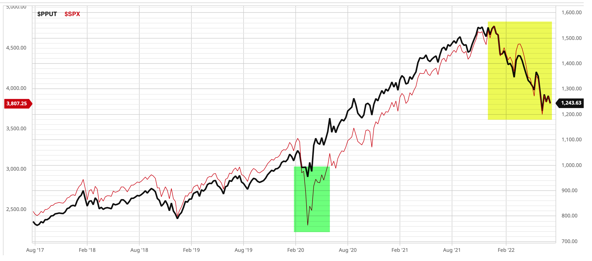

## Table of Contents

## What is the S&P 500 and why is it important?

The S&P 500 is a stock market index that measures the performance of 500 large companies listed on stock exchanges in the United States. It is maintained by S&P Global, a company that provides financial information and analytics. The index includes companies from various industries like technology, healthcare, and finance, which makes it a good representation of the overall U.S. economy.

The S&P 500 is important because it is widely used as a benchmark for the stock market and the economy. Investors and financial analysts often use it to gauge how well the market is doing. If the S&P 500 goes up, it usually means that the economy is doing well, and if it goes down, it might mean that the economy is struggling. Many people also invest in funds that track the S&P 500 because it's a simple way to invest in a broad range of companies and potentially see good returns over time.

## What does it mean when the S&P 500 declines?

When the S&P 500 declines, it means that the average stock price of the 500 big companies in the index is going down. This usually happens when many of these companies are not doing well, maybe because people are buying less of their products or because something big is happening in the world that makes everyone worried about the future.

A decline in the S&P 500 can make people feel less confident about the economy. When the index goes down, it might mean that people think the economy is going to get worse. This can lead to less spending and investing, which can make the economy slow down even more. But remember, the stock market can go up and down a lot, so a short-term decline doesn't always mean the economy is in big trouble.

## Why might someone want to hedge against an S&P 500 decline?

Someone might want to hedge against an S&P 500 decline because they want to protect their money. If someone has a lot of their money invested in the S&P 500, and it goes down, they could lose a lot. By hedging, they can use other investments to help make up for any losses if the S&P 500 goes down. This can give them peace of mind and help keep their money safer.

Hedging can also be important for people who need to plan for the future. If someone is saving for something big like buying a house or retiring, they don't want a big drop in the S&P 500 to mess up their plans. By hedging, they can make sure that their savings stay more stable, even if the stock market goes through rough times. This way, they can keep working towards their goals without worrying too much about market ups and downs.

## What are the basic types of financial instruments used for hedging?

One common type of financial instrument used for hedging is options. Options give someone the right, but not the obligation, to buy or sell an asset at a certain price before a certain date. If someone thinks the S&P 500 might go down, they can buy a "put option," which lets them sell the S&P 500 at a set price even if it drops lower. This can help limit their losses if the market goes down.

Another type of financial instrument for hedging is futures contracts. Futures are agreements to buy or sell an asset at a future date for a price set today. If someone wants to hedge against a decline in the S&P 500, they can sell a futures contract on the S&P 500. If the index goes down, the value of the futures contract they sold will go up, which can help offset the losses in their other investments.

A third type of financial instrument is inverse exchange-traded funds (ETFs). These are funds that move in the opposite direction of the market. If the S&P 500 goes down, an inverse [ETF](/wiki/etf-trading-strategies) that tracks the S&P 500 will go up. By investing in an inverse ETF, someone can make money when the market goes down, which can help balance out any losses they might have in their other investments.

## How can inverse ETFs be used to hedge against an S&P 500 decline?

Inverse ETFs can be a simple way to hedge against an S&P 500 decline. These ETFs are designed to move in the opposite direction of the market. So, if the S&P 500 goes down, an inverse ETF that tracks the S&P 500 will go up. By investing in an inverse ETF, someone can make money when the market goes down. This can help balance out any losses they might have in their other investments that are tied to the S&P 500.

For example, if someone has a lot of their money invested in the S&P 500 and they're worried it might go down, they can buy an inverse ETF. If the S&P 500 does drop, the inverse ETF will rise in value. The gains from the inverse ETF can help offset the losses from their S&P 500 investments. This way, they can protect their money and feel more secure, even if the market takes a downturn.

## What are put options and how can they be used to protect against a decline in the S&P 500?

Put options are a type of financial tool that gives someone the right, but not the obligation, to sell an asset at a set price before a certain date. If someone thinks the S&P 500 might go down, they can buy a put option on the S&P 500. This put option lets them sell the S&P 500 at the price they agreed on, even if the actual market price drops lower. This can help limit their losses if the market goes down.

For example, if someone owns stocks that follow the S&P 500 and they're worried the market might drop, they can buy a put option. If the S&P 500 does go down, they can use the put option to sell their stocks at the higher, agreed-upon price instead of the lower market price. This way, they can protect their money and feel more secure, even if the market takes a downturn.

## Can you explain the use of futures contracts in hedging an S&P 500 downturn?

Futures contracts are agreements to buy or sell an asset at a future date for a price set today. If someone wants to hedge against a downturn in the S&P 500, they can sell a futures contract on the S&P 500. This means they agree to sell the S&P 500 at a price set today, even if the actual market price goes down later. If the S&P 500 does drop, the value of the futures contract they sold will go up because they can buy it back at the lower market price and still sell it at the higher, agreed-upon price.

By using futures contracts this way, someone can make money from the futures contract if the market goes down. This money can help offset any losses they might have in their other investments that are tied to the S&P 500. It's like a safety net that can help protect their money and give them peace of mind, even if the market takes a downturn.

## What are some advanced hedging strategies involving options, such as collars and spreads?

A collar is a strategy that uses both put options and call options to protect against big losses while also limiting big gains. If someone owns stocks that follow the S&P 500 and they're worried about a downturn, they can buy a put option to set a floor on how much they can lose. At the same time, they sell a call option to help pay for the put option. The call option sets a ceiling on how much they can gain. This way, they can protect their money if the market goes down, but they also give up some potential profits if the market goes up a lot.

Spreads are another advanced hedging strategy that involves buying and selling multiple options at different prices. For example, someone might use a "bear put spread" to hedge against an S&P 500 decline. They would buy a put option at a higher strike price and sell another put option at a lower strike price. If the S&P 500 goes down, the value of the put option they bought goes up more than the value of the put option they sold, so they can make money. But their potential gains are limited because of the put option they sold. This strategy can help them protect against losses while also managing the cost of the hedge.

## How do market conditions affect the choice of hedging strategies for the S&P 500?

Market conditions play a big role in deciding which hedging strategy to use for the S&P 500. If the market is very volatile and people think it might go down a lot, someone might choose a strategy like buying put options or using inverse ETFs. These strategies can give them a lot of protection if the market drops suddenly. But they can also be more expensive because they need to pay for the options or the ETFs. So, if the market is only a little bit risky, they might not want to spend as much on hedging and might choose a cheaper strategy like a collar, which uses both put and call options to balance protection and cost.

Another thing to think about is how long someone wants to hedge for. If they think the market might go down for a short time, they might use futures contracts or options that expire soon. These can be good for quick protection. But if they're worried about the market for a longer time, they might choose strategies like spreads or collars that can last longer. These strategies can help them manage their risk over time without having to keep buying new options or futures. So, the choice of hedging strategy really depends on what's happening in the market and how long someone wants to protect their money.

## What are the tax implications of different hedging strategies?

Different hedging strategies can have different tax effects. When you use options like put options or call options, any money you make from them is usually taxed as capital gains. If you hold the options for less than a year before selling them, the gains are taxed at your regular income tax rate, which can be high. But if you hold them for more than a year, the gains are taxed at a lower long-term capital gains rate. Also, if you use a collar strategy, you need to be careful because selling a call option can create what's called a "constructive sale." This means you might have to pay taxes on the gains from your stocks even before you actually sell them.

Futures contracts and inverse ETFs also have their own tax rules. Gains from futures contracts are usually taxed at a special 60/40 rate, where 60% of the gains are taxed as long-term capital gains and 40% as short-term gains. This can be better than the regular tax rates for options. Inverse ETFs are taxed like regular stocks, so any money you make from them is taxed as capital gains. If you hold them for less than a year, the gains are taxed at your regular income tax rate, and if you hold them for more than a year, they're taxed at the lower long-term capital gains rate. So, when you're choosing a hedging strategy, you need to think about how it will affect your taxes too.

## How can one evaluate the effectiveness of a hedge against an S&P 500 decline?

To evaluate how well a hedge works against an S&P 500 decline, you need to look at how much it protects your money when the market goes down. A good hedge should help you lose less money when the S&P 500 drops. For example, if the S&P 500 goes down by 10%, and your hedge helps you only lose 2%, then the hedge was pretty effective. You can also look at the cost of the hedge. If the hedge costs a lot of money, it might not be worth it, even if it works well. So, you need to compare the cost of the hedge to how much it protects your money.

Another way to evaluate a hedge is by looking at how it affects your overall investment. A hedge might protect you from losses, but it can also limit your gains if the market goes up. For example, if you use a collar strategy, you might lose less money if the S&P 500 goes down, but you also won't make as much money if it goes up a lot. So, you need to think about what's more important to you: protecting against losses or having the chance to make big gains. By looking at these things, you can decide if a hedge is working well for you.

## What are the latest trends and innovations in hedging strategies for the S&P 500?

One of the latest trends in hedging strategies for the S&P 500 is the use of more sophisticated options strategies like iron condors and butterflies. These strategies involve buying and selling multiple options at different strike prices to create a range where the investor can make money. Iron condors, for example, let investors make money if the S&P 500 stays within a certain range, which can be good in a market that's not moving a lot. These strategies can be more complicated, but they give investors more ways to manage their risk and protect their money.

Another innovation is the use of technology and algorithms to help with hedging. Some investors now use computer programs to automatically buy and sell options or futures contracts based on market conditions. These programs can quickly adjust hedges to make sure they're always working well. This can help investors react faster to changes in the market and keep their money safer. It's like having a smart helper that's always watching the market and making sure the hedge is doing its job.

## References & Further Reading

[1]: Bergstra, J., Bardenet, R., Bengio, Y., & Kégl, B. (2011). ["Algorithms for Hyper-Parameter Optimization."](https://papers.nips.cc/paper/4443-algorithms-for-hyper-parameter-optimization) Advances in Neural Information Processing Systems 24.

[2]: ["Advances in Financial Machine Learning"](https://www.amazon.com/Advances-Financial-Machine-Learning-Marcos/dp/1119482089) by Marcos Lopez de Prado

[3]: ["Evidence-Based Technical Analysis: Applying the Scientific Method and Statistical Inference to Trading Signals"](https://www.amazon.com/Evidence-Based-Technical-Analysis-Scientific-Statistical/dp/0470008741) by David Aronson

[4]: ["Machine Learning for Algorithmic Trading"](https://github.com/stefan-jansen/machine-learning-for-trading) by Stefan Jansen

[5]: ["Quantitative Trading: How to Build Your Own Algorithmic Trading Business"](https://www.amazon.com/Quantitative-Trading-Build-Algorithmic-Business/dp/1119800064) by Ernest P. Chan