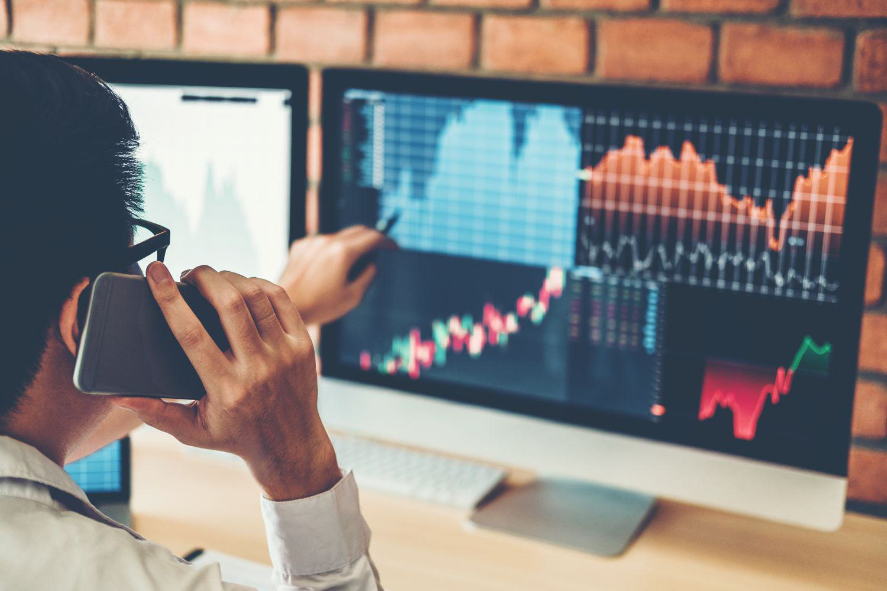

The S&P 500, a vital indicator of the American economy and international financial health, comprises 500 of the largest publicly traded companies in the United States. As a benchmark for U.S. equity performance, it influences investment decisions worldwide and serves as a barometer for economic conditions. In recent months, the S&P 500 has displayed a downward trend, with fluctuating global markets, geopolitical tensions, and economic uncertainties contributing to its volatility.

There are multiple factors that have played significant roles in these declines. Economic disruptions, such as interest rate adjustments by the Federal Reserve, have created ripples throughout the market. Additionally, geopolitical events, such as trade disputes and ongoing international conflicts, have exacerbated market instability. As the S&P 500 responds to these external pressures, investors face significant challenges in maintaining portfolio value.



Amidst this volatility, algorithmic trading has surged in popularity among investors seeking to optimize their strategies in fast-moving markets. Algorithmic trading employs complex computer programs to execute trades with precision and speed, capitalizing on minute market movements. Its advantages include increased efficiency, accuracy, and the ability to decipher intricate market patterns, leading to timely trading decisions. During periods of market disquietude, such as the current declines in the S&P 500, algorithmic trading can serve as a powerful tool.

The central purpose of this article is to explore how hedging can enhance algorithmic trading strategies, especially during times of decline in the S&P 500. Hedges involve financial instruments or strategies deployed to offset potential losses, thereby reducing the risk associated with securities. When integrated into algorithmic trading systems, hedges can provide a robust mechanism to maintain stability and protect investments in turbulent markets.

This article is structured to provide insights into these themes. It will begin by examining the recent declines in the S&P 500, considering contributing economic and geopolitical factors. Subsequently, the rise and advantages of algorithmic trading will be discussed, focusing on its application during volatile periods. Further sections will explore strategic hedging as a response to market declines, integrating these strategies within algorithmic systems, and considering the future outlook for both the S&P 500 and hedging technologies. Through this comprehensive analysis, investors can gain a deeper understanding of how to adapt to evolving market conditions with informed and strategic use of technology and financial instruments.

## Table of Contents

## Understanding Recent S&P 500 Declines

The recent declines in the S&P 500 have been driven by a confluence of economic and geopolitical factors. Understanding these elements is crucial for investors and analysts. Several key aspects have significantly impacted the index:

### Economic and Geopolitical Factors

1. **Inflation and Interest Rates**: Recent periods have seen heightened inflationary pressures, prompting central banks, including the Federal Reserve, to increase interest rates. Higher interest rates can dampen economic growth as borrowing costs rise, affecting corporate profits and consumer spending, thereby exerting downward pressure on stock prices.

2. **Supply Chain Disruptions**: The global supply chain, already under stress due to the COVID-19 pandemic, has faced persistent disruptions, leading to increased production costs and reduced corporate earnings forecasts, affecting investor sentiment negatively.

3. **Geopolitical Tensions**: Ongoing geopolitical tensions, such as the Russia-Ukraine war, have created market uncertainty. These events can lead to volatility in commodity prices, particularly oil and gas, influencing operational costs for companies and affecting overall market stability.

### Statistical Analysis of Market Performance

A statistical analysis of the S&P 500 over the past few months to years shows a marked deviation from previous growth trajectories. For instance, using a rolling average of historical performance data, we observe:

- **Volatility Measures**: Standard deviation and the VIX (Volatility Index) have remained elevated, indicating high market volatility. This unpredictability can inhibit market growth as investors become risk-averse.

- **Performance Comparison**: A comparative analysis via regression models shows that recent performances lag behind historical averages in periods of economic expansion.

```python
import numpy as np
import pandas as pd
from sklearn.linear_model import LinearRegression

# Sample code for regression analysis
# Assume df is a pre-loaded DataFrame with relevant S&P 500 performance data
df = pd.DataFrame({'Past_Performance': [3, 5, 2, 8, 7], 'Current_Performance': [1, 2, 1.5, 2.2, 2.1]})
X = df[['Past_Performance']]
y = df['Current_Performance']

model = LinearRegression()
model.fit(X, y)
predictions = model.predict(X)
```

### Historical Context

When compared to previous market downturns, such as the dot-com bubble burst in 2000 and the financial crisis of 2008, recent declines show both similarities and distinctions. Historically, the S&P 500 has demonstrated resilience, with recoveries often following systematic financial interventions. During these past events, macroeconomic policies played pivotal roles in aiding recovery:

- **2000s Technology Bubble**: Excessive stock valuations without corresponding earnings led to a corrective phase, similar to recent trends in overvalued tech stocks.

- **2008 Financial Crisis**: Unlike recent declines, the 2008 drop was primarily due to systemic failures in financial institutions, prompting massive fiscal stimuli to stabilize markets.

### Impact of Macroeconomic Policies and Global Events

Macroeconomic policies significantly affect the S&P 500. The fiscal policy measures, such as government spending programs, can stimulate economic activity, counteracting some downward pressures. Conversely, contractionary monetary policies tend to exert negative influences on the index by reducing [liquidity](/wiki/liquidity-risk-premium).

Global events like pandemics, wars, and trade disputes have uncertain implications, often resulting in cautious investor behavior. This uncertainty can translate into market declines or stagnations, particularly if those events impact fundamental economic metrics such as GDP growth rates and unemployment figures.

In summary, understanding the intricate web of influences on the S&P 500 requires evaluating both quantitative data and qualitative geopolitical shifts. This knowledge aids investors in formulating robust strategies to navigate and potentially capitalize on market turbulence.

## The Rise of Algorithmic Trading

Algorithmic trading is a method of executing trade orders using automated and pre-programmed trading instructions that account for variables such as time, price, and [volume](/wiki/volume-trading-strategy). This form of trading leverages the power of technology, using complex algorithms to make trading decisions at speeds and frequencies that are impossible for human traders. In modern financial markets, [algorithmic trading](/wiki/algorithmic-trading) is integral, providing numerous advantages and optimizing trading strategies for individual and institutional investors alike.

### Benefits of Algorithmic Trading
Algorithmic trading offers several key benefits that enhance the trading process. Firstly, speed is a significant advantage; algorithms can scan markets and execute trades within milliseconds, faster than any human trader. This is crucial in markets where prices can fluctuate in fractions of a second. Furthermore, the accuracy provided by algorithmic systems ensures trades are executed exactly as specified, reducing the likelihood of manual errors.

Efficiency is another critical benefit. Algorithms can process vast amounts of market data, identifying patterns and executing trades when specific market conditions are met. This efficiency streamlines the trading process, minimizing the time and effort required to execute substantial orders.

### Role in Market Volatility
Algorithms serve a crucial role in assessing market trends and executing trades, particularly during periods of high [volatility](/wiki/volatility-trading-strategies). By analyzing large datasets quickly, they can identify short-lived patterns and price discrepancies that may arise in volatile markets. Algorithmic systems often use statistical models and [machine learning](/wiki/machine-learning) techniques to predict future price movements, thus allowing traders to capitalize on market inefficiencies.

A popular strategy involves mean reversion, where algorithms identify stocks that have deviated from their historical average and predict that they will return to this mean. For example, an algorithm may place trades when a stock's price moves one standard deviation from the mean, relying on statistical analysis to determine entry and [exit](/wiki/exit-strategy) points.

### Successful Strategies in Volatile Markets
Numerous algorithmic trading strategies have proven successful in volatile market conditions. One such strategy is statistical [arbitrage](/wiki/arbitrage), which involves trading pairs of stocks that typically move in relation to each other. An algorithm would analyze the historical correlation between these stocks and execute trades when the correlation weakens, betting on a return to historical norms.

Another example is [momentum](/wiki/momentum) trading, where algorithms buy securities that have shown an upward price trend or sell those in a downward trend. This strategy banks on the continuation of existing trends in highly volatile markets, using advanced predictive models to anticipate their persistence.

Furthermore, high-frequency trading ([HFT](/wiki/high-frequency-trading-strategies)), a form of algorithmic trading characterized by a high turnover rate and extremely short holding periods, has made significant strides in exploiting tiny price discrepancies that exist only for a brief instant. HFT algorithms can execute thousands of trades per second, profiting from minute price movements during volatile periods.

Overall, algorithmic trading has revolutionized the landscape of modern financial markets. Its benefits of speed, accuracy, and efficiency, combined with its ability to exploit fleeting market opportunities, make it an indispensable tool for managing trades in both stable and volatile conditions. As financial technology continues to advance, the promise of algorithmic trading will likely expand further, offering new avenues for traders to optimize their trading strategies.

## Hedges as a Strategic Response

Hedging is a strategic approach employed by traders and investors to mitigate risk during periods of market volatility or declines. By taking offsetting positions in different securities, hedging aims to reduce the potential adverse impact on an investment portfolio. This strategy is crucial during downturns in major indices like the S&P 500, where systematic risk can significantly impact investment returns.

Various hedging instruments are available to investors, each with unique characteristics and uses. Common tools include options, futures contracts, and inverse exchange-traded funds (ETFs). Options, for instance, grant the holder the right to buy or sell an asset at a predetermined price before a specified date, allowing investors to hedge against price fluctuations. Futures contracts, binding agreements to buy or sell an asset at a future date and price, are another popular hedging vehicle for mitigating risk. Inverse ETFs, which aim to deliver the opposite performance of a particular index, offer an accessible way for investors to hedge against market declines without engaging in short selling.

Hedges can significantly complement algorithmic trading strategies, particularly during market downturns. Algorithmic trading leverages mathematical models and pre-set conditions to execute trades at optimal times. By integrating hedging strategies, algorithmic systems can adjust more dynamically to market changes, preserving capital and stabilizing returns. For example, algorithms can be programmed to trigger the purchase of put options when specific market thresholds are breached, thus providing protection against further losses. The merger of hedging strategies with algorithmic trading can enhance the resilience of a trading system, making it agile and robust in volatile market conditions.

Historically, hedging has proven effective in protecting investors from S&P 500 declines. During the market downturn in 2008, some investors employed put options and short selling to safeguard their portfolios. These hedging strategies enabled them to either profit from the downward movement or limit their losses, demonstrating the practical benefits of hedging in crisis scenarios. Another case study involves the use of volatility-based hedges during the 2020 COVID-19-induced market crash. Investors who utilized volatility indices, like the VIX, as hedging tools were able to mitigate risk and achieve more stable portfolio returns despite the market turbulence.

In summary, hedging plays a vital role in risk management, especially during periods of market declines. By employing a combination of hedging instruments, traders can complement their algorithmic trading strategies and safeguard their investments from adverse market movements. Historical evidence underscores the efficacy of hedging, highlighting its importance for modern investors in navigating the complexities of fluctuating markets.

## Integration of Hedges in Algorithmic Trading

Integrating hedging strategies into algorithmic trading systems involves a systematic approach that enhances risk management while maintaining the efficiency of trading operations. Here are the essential steps and considerations that traders and developers must account for during this process.

### Steps to Integrate Hedging Strategies

1. **Risk Assessment and Identification**: The initial step involves identifying potential risks in the trading strategy and determining the appropriate hedging instruments. This requires analyzing the volatility of the assets being traded, historical market data, and expected market movements.

2. **Selection of Hedging Instruments**: Choose suitable hedging instruments such as options, futures, or swaps based on the identified risks. For example, put options can provide downside protection in declining markets, while futures contracts can hedge against adverse price movements.

3. **Algorithm Design and Development**: Develop the algorithm by incorporating hedging logic into the existing trading system. This involves programming rules to execute hedging trades based on predefined conditions or market signals. The logic should allow for dynamic adjustment of hedge positions based on real-time data.

4. **Backtesting and Simulation**: Conduct rigorous backtesting to evaluate the performance of the integrated algorithm under various market conditions. Simulations can help in fine-tuning the hedging strategy by analyzing its impact on overall portfolio performance and risk metrics.

5. **Implementation and Monitoring**: Deploy the integrated hedging strategy in live trading. Constant monitoring is essential to ensure that the hedging mechanism functions effectively and adapts to changing market conditions.

### Technical Considerations and Challenges

Integrating hedging strategies requires careful consideration of technical complexities:

- **Data Management**: Efficient data handling is critical, as the system must process vast amounts of market data to make informed hedging decisions. Latency in data processing can lead to suboptimal hedging actions.

- **Algorithmic Complexity**: Adding hedging logic increases the complexity of the trading algorithm. The system must balance between executing primary trades and placing hedges without introducing significant delays.

- **Transaction Costs**: Hedging involves additional transactions, which can increase costs. The algorithm should optimize hedging activities to minimize transaction costs while maximizing risk coverage.

- **Regulatory Compliance**: Adhering to regulatory requirements is crucial, as hedging strategies may involve complex derivative instruments subject to specific regulations.

### Role of Artificial Intelligence and Machine Learning

Artificial intelligence (AI) and machine learning (ML) play a pivotal role in optimizing hedging strategies:

- **Predictive Analytics**: ML models can predict market trends and volatility, allowing for proactive hedging decisions. Techniques such as time series forecasting and reinforcement learning can enhance risk management.

- **Adaptive Algorithms**: AI-driven systems can continuously learn from market data and adjust hedging strategies in real time. This adaptability helps maintain optimal hedge ratios and positions.

- **Portfolio Optimization**: AI algorithms can optimize portfolio allocations by considering hedging costs and risk-adjusted returns, leading to superior performance compared to static strategies.

### Real-World Examples

Several financial institutions have successfully integrated hedging strategies with algorithmic trading. For instance:

- **Investment Banks**: Utilize proprietary trading algorithms combined with options and futures hedges to manage large portfolios' risk exposure.

- **Hedge Funds**: Employ machine learning models to dynamically adjust hedge positions in response to market volatility, optimizing both returns and risk management.

- **Automated Trading Platforms**: Offer clients algorithmic strategies with built-in hedging capabilities, allowing individual traders to manage risks effectively without manual intervention.

In summary, the integration of hedging strategies within algorithmic trading systems necessitates meticulous planning, comprehensive testing, and continuous optimization. By leveraging AI and ML, traders can create sophisticated systems that provide robust risk management and enhance trading performance.

## Future Outlook

The future of the S&P 500, amidst its historical volatility, carries significant implications for traders, particularly in the context of algorithmic trading and hedging strategies. As we look towards the near to mid-term horizon, several factors will likely shape the index's performance and the strategies employed by traders.

Recent market analyses suggest that while some level of volatility is expected to persist, primarily due to ongoing geopolitical tensions and shifting macroeconomic policies, there are also opportunities for recovery and growth. Traders should anticipate that the S&P 500 may remain sensitive to fluctuations in interest rates, changes in fiscal policy, and international trade dynamics. As a result, maintaining adaptable and robust trading strategies will be crucial for navigating this period effectively.

In the realm of algorithmic trading, several emerging trends are poised to influence its evolution. The increasing availability of big data and advancements in machine learning (ML) are enhancing the predictive capabilities of algorithms, allowing traders to better forecast market movements and optimize trading decisions in real-time. Additionally, the integration of natural language processing (NLP) techniques is enabling algorithms to analyze news and social media sentiment, providing previously untapped insights into market psychology.

Hedging strategies are also experiencing a transformative period, driven by technological advancements. The rise of blockchain technology and smart contracts is offering new ways to execute complex hedging transactions with greater transparency and reduced counterparty risk. Moreover, [artificial intelligence](/wiki/ai-artificial-intelligence) (AI) is playing an increasingly vital role in optimizing hedging strategies by analyzing vast datasets to identify correlations and hedge ratios more precisely.

The convergence of these technological advancements signifies a pivotal moment for traders and investors. The critical need for proactive hedging in algorithmic trading cannot be overstated, as it provides a safety net against potential downturns while allowing traders to capitalize on market upswings. Implementing dynamic hedging models that adjust to real-time data input, market sentiment, and geopolitical events will be crucial for maintaining a competitive edge.

In conclusion, traders and investors should remain vigilant, embracing technological innovations and refining their hedging strategies to better align with anticipated market trends. By combining data-driven insights with cutting-edge technology, they can enhance their strategic responses to both volatility and opportunity within the S&P 500 landscape.

## Conclusion

In conclusion, the recent declines in the S&P 500 highlight the necessity for investors to adapt their strategies in response to changing market conditions. The interplay between market volatility and algorithmic trading underscores the potential these sophisticated systems offer when coupled with hedging strategies. Algorithmic trading, with its speed, accuracy, and ability to analyze massive datasets, presents a formidable tool for navigating volatile markets. However, its effectiveness can be greatly enhanced by incorporating hedging techniques that mitigate risk and provide stability during market downturns.

The strategic use of technology and financial instruments, such as algorithmic trading and hedging, is crucial for investors seeking to maintain a competitive edge. These tools not only help in mitigating losses but also in capitalizing on market opportunities that may arise during periods of instability. The integration of artificial intelligence and machine learning in refining these strategies further emphasizes the transformative impact of technology on financial markets.

Furthermore, it is essential for traders and investors to remain committed to continuous learning and exploration of innovative trading strategies. The rapidly evolving financial landscape demands that market participants stay informed about emerging trends and technological advancements that could influence market dynamics. By consistently updating their knowledge and being open to adopting new strategies, traders can better prepare themselves to respond to market changes effectively.

Finally, investors are encouraged to critically evaluate their existing trading strategies and remain agile in their approach. By considering current trends and the insights provided by recent market developments, investors can make informed decisions that align with their financial goals. The proactive evaluation and adjustment of trading strategies in light of recent trends are vital for success in today's dynamic financial markets.

## References & Further Reading

[1]: Bergstra, J., Bardenet, R., Bengio, Y., & Kégl, B. (2011). ["Algorithms for Hyper-Parameter Optimization."](https://papers.nips.cc/paper/4443-algorithms-for-hyper-parameter-optimization) Advances in Neural Information Processing Systems 24.

[2]: ["Advances in Financial Machine Learning"](https://www.amazon.com/Advances-Financial-Machine-Learning-Marcos/dp/1119482089) by Marcos Lopez de Prado

[3]: ["Evidence-Based Technical Analysis: Applying the Scientific Method and Statistical Inference to Trading Signals"](https://www.amazon.com/Evidence-Based-Technical-Analysis-Scientific-Statistical/dp/0470008741) by David Aronson

[4]: ["Machine Learning for Algorithmic Trading"](https://github.com/stefan-jansen/machine-learning-for-trading) by Stefan Jansen

[5]: ["Quantitative Trading: How to Build Your Own Algorithmic Trading Business"](https://www.amazon.com/Quantitative-Trading-Build-Algorithmic-Business/dp/1119800064) by Ernest P. Chan