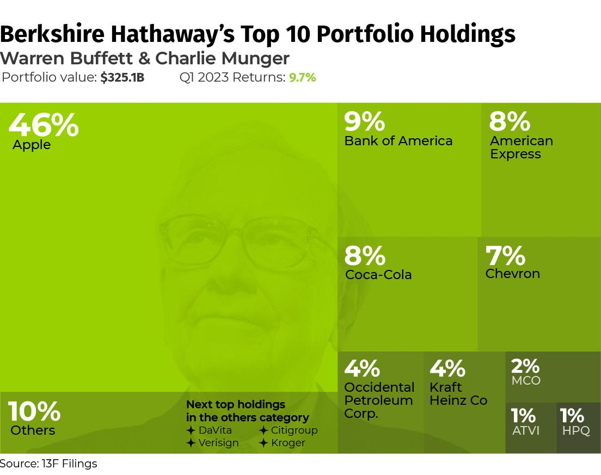

## Table of Contents

## What are investment portfolios and why are they important?

An investment portfolio is a collection of different investments like stocks, bonds, and other assets that someone owns. It's like a basket where you put all your investment eggs. People make portfolios to help them reach their financial goals, like saving for retirement or buying a house. By spreading money across different types of investments, people can lower the risk of losing money if one investment does badly.

Portfolios are important because they help manage risk and grow wealth over time. If you put all your money in one place, like one company's stock, you could lose a lot if that company does poorly. But if you spread your money around, some investments might go down, but others might go up, balancing things out. Also, portfolios can be adjusted to match someone's comfort with risk and their financial goals, making them a key tool for smart investing.

## What does 'top holdings' mean in the context of an investment portfolio?

In an investment portfolio, 'top holdings' refers to the biggest investments someone has. These are the stocks, bonds, or other assets that make up the largest part of the portfolio. Think of it like a pie chart where the biggest slices are the top holdings.

Top holdings are important because they show where most of the money is invested. If someone wants to understand the main risks and potential rewards of their portfolio, they should look at these top holdings first. They can tell you a lot about what the investor thinks will do well in the future.

## How can understanding top holdings benefit an investor?

Understanding top holdings can help an investor see where most of their money is going. If someone knows which stocks or assets are the biggest parts of their portfolio, they can figure out if they are too focused on one thing. This can help them decide if they need to spread their money around more to lower their risk. For example, if most of their money is in tech stocks, they might want to put some money into other areas like healthcare or real estate to balance things out.

Also, knowing the top holdings can show an investor what they think will do well in the future. If they see that their biggest investments are in companies they believe in, it can give them confidence in their choices. On the other hand, if they find out they have a lot of money in something they're not sure about, they might want to sell some of it and buy other things they feel better about. This way, they can make sure their portfolio matches their goals and how much risk they're okay with taking.

## What are some common types of assets found in top holdings?

In an investment portfolio, you often find stocks as one of the top holdings. Stocks are pieces of a company that people can buy. When a stock is in the top holdings, it means a big part of the portfolio's money is in that company. Stocks can be from big companies like Apple or smaller ones. People like stocks because they can go up in value and sometimes pay dividends, which is like getting a little extra money.

Another common type of asset in top holdings is bonds. Bonds are like loans that people give to governments or companies. They pay back the money with interest over time. Bonds are seen as safer than stocks because they usually give steady income, but they might not grow as much. If bonds are in the top holdings, it shows the investor wants some safety in their portfolio.

Sometimes, you'll also see mutual funds or exchange-traded funds (ETFs) in the top holdings. These are collections of different investments put together. Mutual funds and ETFs can have stocks, bonds, or other things inside them. They help people spread their money around without having to pick each investment themselves. If these are in the top holdings, it means the investor wants to diversify their portfolio easily.

## How do top holdings vary across different types of investment portfolios?

Top holdings can be very different depending on what kind of investment portfolio someone has. For example, in a growth-focused portfolio, the top holdings might be stocks from companies that are expected to grow a lot, like new tech companies. These portfolios aim for big gains, so they often have a lot of money in stocks that could go up a lot in value. On the other hand, in a conservative portfolio, the top holdings might be mostly bonds or stocks from big, stable companies. These portfolios are more about keeping money safe and getting steady income, so they have less risk.

In a diversified portfolio, the top holdings might be spread across different types of assets to balance risk and reward. For instance, you might see a mix of stocks, bonds, and maybe even real estate investment trusts (REITs) or commodities like gold. This way, if one type of investment goes down, the others might help keep the portfolio stable. In a sector-specific portfolio, like one focused on healthcare, the top holdings would be mostly stocks from healthcare companies. This kind of portfolio is more risky because it depends a lot on how one industry does, but it can also do really well if that industry grows.

## What factors should be considered when evaluating the top holdings in a portfolio?

When looking at the top holdings in a portfolio, it's important to think about how much risk you're okay with. If most of your money is in just a few stocks or one type of investment, your portfolio might be riskier than you want. You should check if the top holdings fit with how much risk you're comfortable taking. Also, think about how the top holdings might affect your whole portfolio. If they do well, great, but if they do badly, it could hurt a lot. So, it's good to see if the top holdings help balance out the risk in your portfolio.

Another thing to consider is if the top holdings match your financial goals. If you're saving for something far away, like retirement, you might want more stocks in your top holdings because they can grow a lot over time. But if you need the money soon, you might want more bonds or safer investments. It's also smart to look at how the companies or assets in your top holdings are doing. Are they making money? Are they growing? This can help you decide if you should keep them as top holdings or if you should change things up.

## How often should an investor review and adjust their top holdings?

An investor should look at their top holdings at least once a year. This helps them make sure their investments are still doing what they want them to do. But if something big happens, like a big change in the market or in their life, they might need to check their top holdings more often. For example, if they lose their job or if there's a big drop in the stock market, they might want to see if they need to change their investments to be safer.

It's also a good idea to check the top holdings when they reach certain goals or when they get close to needing the money. If they're saving for a house and they're almost there, they might want to move some money from risky stocks to safer bonds. By keeping an eye on their top holdings and making changes when needed, investors can keep their portfolio in line with their goals and how much risk they're okay with.

## Can you explain the impact of market trends on top holdings?

Market trends can really change what's in the top holdings of a portfolio. If a certain type of investment, like tech stocks, is doing really well, more people might want to buy them. This can make tech stocks go up in value and become a bigger part of the portfolio. On the other hand, if people start thinking that tech stocks are too risky or not doing well, they might sell them. This can make the value of tech stocks go down and they might not be in the top holdings anymore.

It's important for investors to keep an eye on market trends because they can affect how much risk they're taking. If a lot of the top holdings are in something that's popular right now, like green energy, the portfolio might grow a lot if that trend keeps going. But if the trend changes and people start liking something else, the value of those top holdings could drop. So, investors need to think about how market trends might change and adjust their top holdings to make sure they're still happy with the risk and their goals.

## What are the risks associated with having concentrated top holdings?

Having a lot of your money in just a few top holdings can be risky. If one of those top holdings does badly, it can hurt your whole portfolio a lot. For example, if most of your money is in one company's stock and that company has problems, the value of your portfolio can go down a lot. This is called concentration risk, and it can make your investments more likely to lose money.

It's also harder to balance out the risk when your money is in just a few things. If the market changes and people start liking different kinds of investments, your top holdings might not do well anymore. This can make your portfolio less stable and more likely to go up and down a lot. To lower this risk, it's a good idea to spread your money around more so that you're not too dependent on just a few top holdings.

## How do professional portfolio managers select and manage top holdings?

Professional portfolio managers pick and take care of top holdings by looking at a lot of things. They think about how well a company is doing, what's happening in the market, and what they think will happen in the future. They use special tools and research to find out which stocks or other investments might do well. They also think about how much risk they want to take and what their clients want to achieve with their money. If a company looks like it will grow and fits with their plan, they might decide to make it a top holding in the portfolio.

Once they pick the top holdings, portfolio managers keep watching them closely. They check how the companies are doing and if anything big changes in the market. If they see that a top holding isn't doing well or if a better opportunity comes up, they might decide to sell some of it and buy something else. This way, they try to keep the portfolio balanced and working towards the client's goals. They might change the top holdings if they need to take less risk or if they want to aim for more growth.

## What advanced strategies can be used to optimize the performance of top holdings?

One way to make top holdings work better is by using something called rebalancing. This means checking the portfolio from time to time and making sure the top holdings are still the right size. If one top holding has grown a lot and now it's too big, you might sell some of it and buy more of another investment to keep things balanced. This can help lower risk and keep the portfolio doing what you want it to do. Another strategy is called tax-loss harvesting. If one of your top holdings goes down in value, you can sell it and use that loss to lower the taxes you have to pay on your other gains. Then, you can buy a similar investment to keep your portfolio the same but save on taxes.

Another advanced strategy is using options. Options let you make deals that can protect your top holdings or help them grow more. For example, you can buy a put option to protect against a big drop in the value of a top holding. Or you can sell a call option to make some extra money if you think the stock won't go up much. These strategies need to be used carefully because they can be complicated and risky, but they can help make your top holdings perform better if you know what you're doing.

## How can investors use data analytics to predict changes in top holdings?

Investors can use data analytics to look at lots of information about the companies in their top holdings. They can see how the companies are doing, what people think about them, and what's happening in the market. By using special tools and computer programs, investors can find patterns and trends that might not be easy to see just by looking at the news or stock prices. For example, they might see that a company's sales are growing fast or that people are talking a lot about a new product. This can help them guess if the company will do well in the future and if they should keep it as a top holding or maybe sell some of it.

Another way data analytics can help is by looking at how different things in the economy are connected. For instance, if interest rates go up, it might affect the value of bonds in the top holdings. By using data to understand these connections, investors can see how changes in the economy might change their top holdings. They can use this information to make better choices about when to buy or sell, and how to adjust their portfolio to keep it working towards their goals. Data analytics can make it easier to predict what might happen next and help investors make smarter decisions about their top holdings.

## What is Understanding Investment Portfolios?

An investment portfolio is a collection of financial assets such as stocks, bonds, commodities, currencies, and cash equivalents, as well as their fund counterparts, including mutual funds, exchange-traded funds (ETFs), and closed funds. The primary purpose of an investment portfolio is to achieve an investor's financial objectives within a particular time frame while balancing risk and return. Each asset or fund within the portfolio has specific contributions towards the overall risk and return of the portfolio, presenting investors with a comprehensive tool to manage and grow their wealth.

Investment vehicles come in various forms, each carrying distinct characteristics, benefits, and risks:

- **Stocks**: Represent ownership shares in a company and provide potential for high returns, albeit with higher risk levels. They offer dividends and capital gains, making them popular for long-term growth.

- **Bonds**: Debt instruments that offer fixed returns in the form of interest payments. They are considered more stable than stocks and can provide regular income with lower risk, though the potential for returns is generally lower.

- **Exchange-Traded Funds (ETFs)**: Investment funds traded on stock exchanges, similar to stocks. ETFs offer diversification, professional management, and liquidity. They can track indices, sectors, commodities, or other assets.

- **Mutual Funds**: Pooled funds managed by professional managers with diversified holdings. They offer investors access to a wide range of assets and professional management but often come with management fees.

Portfolio management involves the strategic allocation of assets to optimize potential returns while managing risk. Three key metrics guide this process:

- **Risk**: Refers to the uncertainty of returns and the potential financial loss. It is a function of the portfolio's asset allocation. Diversification, or spreading investments across various asset classes, sectors, or geographies, is a common strategy to mitigate risk. Mathematical models such as the standard deviation and beta measure portfolio risk. For example, the standard deviation of returns $\sigma$ represents the volatility of the portfolio's returns:
$$
  \sigma = \sqrt{\frac{1}{N}\sum_{i=1}^{N}(R_i - \overline{R})^2}

$$

  where $N$ is the number of returns, $R_i$ is each periodic return, and $\overline{R}$ is the average return.

- **Return**: The financial gain or loss on an investment. Portfolio managers aim to maximize expected returns based on the investor’s risk tolerance and financial goals. The expected portfolio return can be calculated as a weighted sum of individual asset returns:
$$
  E(R_p) = \sum_{i=1}^{n} w_i \cdot E(R_i)

$$

  where $E(R_p)$ is the expected return of the portfolio, $w_i$ is the weight of each asset, and $E(R_i)$ is the expected return of each asset.

- **Diversification**: Aims to reduce unsystematic risk by including a variety of asset categories, which tend to perform differently under different market conditions. A well-diversified portfolio can lower overall risk without significantly compromising returns.

Investors must continuously monitor and re-evaluate their portfolios to ensure alignment with their evolving financial goals and market conditions, making adjustments as necessary to maintain the desired level of diversification and risk.

## What are Financial Examples of Top Holdings?

In financial portfolio management, top holdings refer to the securities that represent the largest asset allocations within a given investment portfolio. These holdings are significant because they can have a substantial impact on the overall performance of the portfolio. The strategic selection of top holdings involves considering factors such as the potential for capital appreciation, yield, risk, and the correlation of each security with others in the portfolio to ensure diversification.

**Case Study: High-Performing Stock Fund**

Examining a high-performing stock fund provides insight into effective portfolio management strategies. Such funds typically invest in large-cap stocks with strong growth prospects. For instance, consider a stock fund that has achieved consistent above-market returns. The top holdings in this portfolio might include shares of major technology companies like Apple Inc. (AAPL) and Microsoft Corp. (MSFT), which are known for steady growth and innovation. The performance metrics for such a fund can be appraised using:

1. **Return on Equity (ROE):**
$$
   \text{ROE} = \frac{\text{Net Income}}{\text{Shareholder's Equity}}

$$

2. **Price to Earnings (P/E) Ratio:**
$$
   \text{P/E Ratio} = \frac{\text{Market Value per Share}}{\text{Earnings per Share}}

$$

These metrics help in assessing the efficiency and valuation of the equities held. Moreover, such funds often exhibit a Sharpe ratio greater than 1, indicating favorable risk-adjusted returns, which signifies efficient portfolio management. The focus on blue-chip stocks with strong financials and robust growth pipelines usually contributes significantly to the fund’s returns.

**Case Study: Leading Bond Fund**

Analyzing a bond fund emphasizes the fund’s capacity to generate returns from income, primarily through interest. A leading bond fund might hold top positions in U.S. Treasury Bonds, municipal bonds, and high-grade corporate bonds. These securities are generally selected for their low-risk profiles and steady income streams. In evaluating their contributions to the fund, the following metrics are significant:

1. **Current Yield:**
$$
   \text{Current Yield} = \frac{\text{Annual Coupon Payment}}{\text{Current Bond Price}}

$$

2. **Yield to Maturity (YTM):**
$$
   \text{YTM} \approx \frac{\text{Interest Payments} + \frac{\text{Face Value} - \text{Price}}{\text{Years to Maturity}}}{\frac{\text{Face Value} + \text{Price}}{2}}

$$

These metrics provide investors with insights into the income generated from bond holdings and the expected total returns if the bonds are held to maturity. The bond fund may also utilize a diversified selection approach to include bonds with different maturities and credit qualities, mitigating specific risks and enhancing stability.

By systematically selecting and managing top holdings, investment managers can significantly impact the returns and risk profile of a portfolio. This strategic asset allocation aims to align with the fund’s investment objectives, whether they prioritize growth or income, ensuring that the portfolio can meet or exceed performance benchmarks over time.

## How can algorithmic trading be integrated with investment portfolios?

Algorithmic trading has become a significant force in the optimization of portfolio diversification by leveraging computational algorithms to make trading decisions at speeds and accuracy levels unattainable for human traders. This section explores how algorithmic trading can be integrated into investment portfolios to enhance diversification, provides insights on implementing algorithmic strategies in real-time portfolio management, and offers a comparison of various tools and platforms available for investors interested in algorithmic trading.

### Optimization of Portfolio Diversification through Algorithmic Trading

Algorithmic trading enables the efficient processing and analysis of large datasets, allowing for the identification of diversification opportunities that may not be immediately apparent through traditional analysis. Diversification, a fundamental principle of portfolio management, involves spreading investments across various asset classes and securities to mitigate risk. Algorithms can analyze market data to identify asset correlations, price movements, and [volatility](/wiki/volatility-trading-strategies) patterns, thereby offering a more robust diversification strategy.

By employing [machine learning](/wiki/machine-learning) and statistical models, algorithms can forecast market trends and adjust portfolio allocations dynamically to optimize the balance between risk and return. For example, simulations can be run to evaluate the effect of potential trades on portfolio variance, using formulas such as the variance of a portfolio: 

$$
\sigma_p^2 = \sum_{i=1}^n \sum_{j=1}^n w_i w_j \sigma_{ij}
$$

where $\sigma_p^2$ is the portfolio's variance, $w_i$ and $w_j$ are asset weights, and $\sigma_{ij}$ is the covariance between assets $i$ and $j$.

### Implementing Algorithmic Strategies in Real-time Portfolio Management

Incorporating algorithmic strategies into real-time portfolio management allows for the execution of trades based on predefined criteria without human intervention. This automation ensures that trades are executed at the most opportune moments, enhancing the timing and precision of buy and sell decisions. Commonly implemented strategies include:

1. **Mean Reversion**: This strategy assumes that asset prices will revert to their historical mean and uses algorithms to identify and capitalize on price deviations.

2. **Momentum Trading**: Algorithms detect and exploit trends by executing trades that follow the prevailing market momentum.

3. **Arbitrage Opportunities**: Algorithms can quickly identify and exploit price inefficiencies across different markets or asset classes.

Real-time data processing and high-frequency trading capabilities provided by algorithmic trading systems help investors react swiftly to market changes, maintaining the optimal asset mix in the portfolio.

### Tools and Platforms for Algorithmic Trading

Investors have access to a wide range of platforms and tools that facilitate algorithmic trading. Each platform offers varying degrees of customization, support for different programming languages, and access to different markets. Some of the leading options include:

- **MetaTrader**: Popular for its user-friendly interface and Expert Advisors feature, which allows users to implement custom trading algorithms.

- **QuantConnect**: Provides a cloud-based backtesting and live trading environment that supports multiple programming languages, including Python and C#.

- **Interactive Brokers Algo Trading**: Offers an advanced trading platform with access to various markets and a robust API that supports automated trading strategies.

- **Quantopian**: (although it was officially closed in 2020, it was highly regarded for providing institutional-level tools for backtesting and deploying algorithms).

Investors seeking to adopt algorithmic trading should consider factors such as fees, ease of use, access to quantitative data, and support for [backtesting](/wiki/backtesting) and live trading when choosing a platform. Moreover, familiarity with programming languages like Python can be beneficial, as it is widely used for developing and backtesting trading algorithms due to its extensive libraries and community support.

In conclusion, integrating algorithmic trading into investment portfolios can significantly enhance diversification and real-time management capabilities. By utilizing sophisticated algorithms and suitable trading platforms, investors can execute more informed and timely trades, ultimately optimizing their portfolio performance.

## References & Further Reading

[1]: Bergstra, J., Bardenet, R., Bengio, Y., & Kégl, B. (2011). ["Algorithms for Hyper-Parameter Optimization."](https://dl.acm.org/doi/10.5555/2986459.2986743) Advances in Neural Information Processing Systems 24.

[2]: ["Advances in Financial Machine Learning"](https://www.amazon.com/Advances-Financial-Machine-Learning-Marcos/dp/1119482089) by Marcos Lopez de Prado

[3]: ["Evidence-Based Technical Analysis: Applying the Scientific Method and Statistical Inference to Trading Signals"](https://www.amazon.com/Evidence-Based-Technical-Analysis-Scientific-Statistical/dp/0470008741) by David Aronson

[4]: ["Machine Learning for Algorithmic Trading"](https://github.com/stefan-jansen/machine-learning-for-trading) by Stefan Jansen

[5]: ["Quantitative Trading: How to Build Your Own Algorithmic Trading Business"](https://www.amazon.com/Quantitative-Trading-Build-Algorithmic-Business/dp/1119800064) by Ernest P. Chan