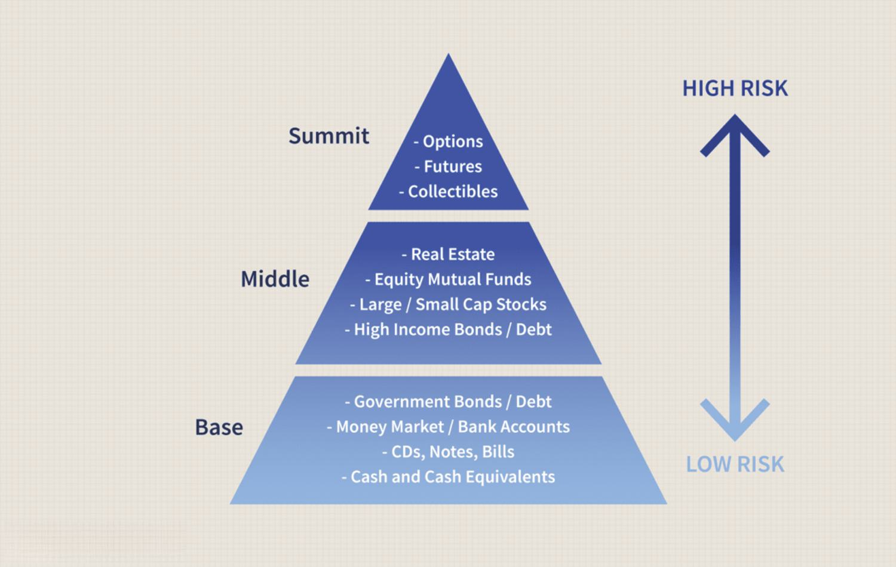

Investment portfolios are critical components of robust financial planning. They serve as collections of financial assets held by individuals, companies, or institutions to meet specific investment goals. The diversity in portfolio composition helps mitigate risks and enhance returns, contributing to the long-term financial stability and growth for investors. By balancing different asset classes, investors can manage volatility and achieve desirable levels of risk-adjusted returns.

Top holdings within investment portfolios refer to the largest individual investments, often representing a significant share of the total portfolio's value. These holdings are typically chosen based on their historical performance, growth potential, and the strategic objectives of the investor. Monitoring the performance of top holdings is vital, as these assets heavily influence the overall performance and returns of the portfolio. For example, a leading stock fund may have shares in major companies like Apple, Microsoft, or Amazon, which can consistently drive growth due to their market dominance and financial strength.



Algorithmic trading is increasingly becoming a cornerstone of portfolio management, utilizing sophisticated algorithms and computer systems to execute trades at optimal times and prices. This form of trading enhances speed and precision, elements crucial in the fast-paced financial markets. Algorithms are designed to follow pre-defined instructions, consisting of timing, price, and volume, or any mathematical model, to make decisions that humans, constrained by time and computation power, cannot achieve effectively. This approach allows for the efficient management of large volumes of trades, minimizing transaction costs, and maximizing liquidity.

The primary aim of this article is to explore financial examples of top holdings, demonstrating their significance in high-performing portfolios, and to examine the integration of algorithmic trading into investment strategies. By understanding the synergies between these two concepts, investors can optimize their portfolios for better risk management and superior returns, meeting their financial goals with greater efficiency.

## Table of Contents

## Understanding Investment Portfolios

An investment portfolio is a collection of financial assets such as stocks, bonds, commodities, currencies, and cash equivalents, as well as their fund counterparts, including mutual funds, exchange-traded funds (ETFs), and closed funds. The primary purpose of an investment portfolio is to achieve an investor's financial objectives within a particular time frame while balancing risk and return. Each asset or fund within the portfolio has specific contributions towards the overall risk and return of the portfolio, presenting investors with a comprehensive tool to manage and grow their wealth.

Investment vehicles come in various forms, each carrying distinct characteristics, benefits, and risks:

- **Stocks**: Represent ownership shares in a company and provide potential for high returns, albeit with higher risk levels. They offer dividends and capital gains, making them popular for long-term growth.

- **Bonds**: Debt instruments that offer fixed returns in the form of interest payments. They are considered more stable than stocks and can provide regular income with lower risk, though the potential for returns is generally lower.

- **Exchange-Traded Funds (ETFs)**: Investment funds traded on stock exchanges, similar to stocks. ETFs offer diversification, professional management, and liquidity. They can track indices, sectors, commodities, or other assets.

- **Mutual Funds**: Pooled funds managed by professional managers with diversified holdings. They offer investors access to a wide range of assets and professional management but often come with management fees.

Portfolio management involves the strategic allocation of assets to optimize potential returns while managing risk. Three key metrics guide this process:

- **Risk**: Refers to the uncertainty of returns and the potential financial loss. It is a function of the portfolio's asset allocation. Diversification, or spreading investments across various asset classes, sectors, or geographies, is a common strategy to mitigate risk. Mathematical models such as the standard deviation and beta measure portfolio risk. For example, the standard deviation of returns $\sigma$ represents the volatility of the portfolio's returns:
$$
  \sigma = \sqrt{\frac{1}{N}\sum_{i=1}^{N}(R_i - \overline{R})^2}

$$

  where $N$ is the number of returns, $R_i$ is each periodic return, and $\overline{R}$ is the average return.

- **Return**: The financial gain or loss on an investment. Portfolio managers aim to maximize expected returns based on the investor’s risk tolerance and financial goals. The expected portfolio return can be calculated as a weighted sum of individual asset returns:
$$
  E(R_p) = \sum_{i=1}^{n} w_i \cdot E(R_i)

$$

  where $E(R_p)$ is the expected return of the portfolio, $w_i$ is the weight of each asset, and $E(R_i)$ is the expected return of each asset.

- **Diversification**: Aims to reduce unsystematic risk by including a variety of asset categories, which tend to perform differently under different market conditions. A well-diversified portfolio can lower overall risk without significantly compromising returns.

Investors must continuously monitor and re-evaluate their portfolios to ensure alignment with their evolving financial goals and market conditions, making adjustments as necessary to maintain the desired level of diversification and risk.

## Financial Examples of Top Holdings

In financial portfolio management, top holdings refer to the securities that represent the largest asset allocations within a given investment portfolio. These holdings are significant because they can have a substantial impact on the overall performance of the portfolio. The strategic selection of top holdings involves considering factors such as the potential for capital appreciation, yield, risk, and the correlation of each security with others in the portfolio to ensure diversification.

**Case Study: High-Performing Stock Fund**

Examining a high-performing stock fund provides insight into effective portfolio management strategies. Such funds typically invest in large-cap stocks with strong growth prospects. For instance, consider a stock fund that has achieved consistent above-market returns. The top holdings in this portfolio might include shares of major technology companies like Apple Inc. (AAPL) and Microsoft Corp. (MSFT), which are known for steady growth and innovation. The performance metrics for such a fund can be appraised using:

1. **Return on Equity (ROE):**
$$
   \text{ROE} = \frac{\text{Net Income}}{\text{Shareholder's Equity}}

$$

2. **Price to Earnings (P/E) Ratio:**
$$
   \text{P/E Ratio} = \frac{\text{Market Value per Share}}{\text{Earnings per Share}}

$$

These metrics help in assessing the efficiency and valuation of the equities held. Moreover, such funds often exhibit a Sharpe ratio greater than 1, indicating favorable risk-adjusted returns, which signifies efficient portfolio management. The focus on blue-chip stocks with strong financials and robust growth pipelines usually contributes significantly to the fund’s returns.

**Case Study: Leading Bond Fund**

Analyzing a bond fund emphasizes the fund’s capacity to generate returns from income, primarily through interest. A leading bond fund might hold top positions in U.S. Treasury Bonds, municipal bonds, and high-grade corporate bonds. These securities are generally selected for their low-risk profiles and steady income streams. In evaluating their contributions to the fund, the following metrics are significant:

1. **Current Yield:**
$$
   \text{Current Yield} = \frac{\text{Annual Coupon Payment}}{\text{Current Bond Price}}

$$

2. **Yield to Maturity (YTM):**
$$
   \text{YTM} \approx \frac{\text{Interest Payments} + \frac{\text{Face Value} - \text{Price}}{\text{Years to Maturity}}}{\frac{\text{Face Value} + \text{Price}}{2}}

$$

These metrics provide investors with insights into the income generated from bond holdings and the expected total returns if the bonds are held to maturity. The bond fund may also utilize a diversified selection approach to include bonds with different maturities and credit qualities, mitigating specific risks and enhancing stability.

By systematically selecting and managing top holdings, investment managers can significantly impact the returns and risk profile of a portfolio. This strategic asset allocation aims to align with the fund’s investment objectives, whether they prioritize growth or income, ensuring that the portfolio can meet or exceed performance benchmarks over time.

## Algorithmic Trading: Revolutionizing Portfolio Management

Algorithmic trading, often referred to as algo trading, is a method of executing trades using pre-programmed instructions based on various factors such as timing, price, [volume](/wiki/volume-trading-strategy), etc. This automated approach is characterized by its utilization of mathematical models and high-speed computer systems to perform trades at speeds and frequencies that are impossible for human traders. Essentially, [algorithmic trading](/wiki/algorithmic-trading) enables traders to implement strategies that can be back-tested and refined before being deployed in live markets.

One of the primary benefits of algorithmic trading is its significant enhancement of speed and precision in executing large volume trades. By removing human emotions from trading decisions, algorithmic systems can consistently apply predefined strategies, ensuring transactions are completed at the best possible prices. Furthermore, algorithms can efficiently process and analyze vast amounts of market data from multiple exchanges simultaneously, identifying [arbitrage](/wiki/arbitrage) opportunities and responding in milliseconds.

Common algorithmic trading strategies include [momentum](/wiki/momentum), [trend following](/wiki/trend-following), and mean reversion. Momentum trading strategies operate under the premise that assets which are rising will continue to rise, and vice versa. By leveraging historical price patterns, momentum algorithms identify and capture trends early, allowing traders to ride the wave of a price movement. Conversely, trend following strategies focus on persistent market trends over various time frames, using technical indicators such as moving averages or channel breakouts to make trading decisions. 

Mean reversion strategies, on the other hand, are based on the hypothesis that asset prices tend to revert to their long-term mean or average level. In this approach, algorithms identify when prices deviate significantly from the norm, triggering trades that capitalize on the expected convergence back to the mean. This requires sophisticated statistical tools to determine what constitutes a significant deviation and when a reversion is likely to occur.

Algorithmic trading, with its capacity for rapid execution and strategy implementation, has indisputably revolutionized how modern portfolios are managed. As technology continues to evolve and data analytics capabilities expand, the role of algorithmic trading in portfolios will likely become even more prominent, optimizing execution and potentially enhancing returns for investors.

## Integrating Algorithmic Trading with Investment Portfolios

Algorithmic trading has become a significant force in the optimization of portfolio diversification by leveraging computational algorithms to make trading decisions at speeds and accuracy levels unattainable for human traders. This section explores how algorithmic trading can be integrated into investment portfolios to enhance diversification, provides insights on implementing algorithmic strategies in real-time portfolio management, and offers a comparison of various tools and platforms available for investors interested in algorithmic trading.

### Optimization of Portfolio Diversification through Algorithmic Trading

Algorithmic trading enables the efficient processing and analysis of large datasets, allowing for the identification of diversification opportunities that may not be immediately apparent through traditional analysis. Diversification, a fundamental principle of portfolio management, involves spreading investments across various asset classes and securities to mitigate risk. Algorithms can analyze market data to identify asset correlations, price movements, and [volatility](/wiki/volatility-trading-strategies) patterns, thereby offering a more robust diversification strategy.

By employing [machine learning](/wiki/machine-learning) and statistical models, algorithms can forecast market trends and adjust portfolio allocations dynamically to optimize the balance between risk and return. For example, simulations can be run to evaluate the effect of potential trades on portfolio variance, using formulas such as the variance of a portfolio: 

$$
\sigma_p^2 = \sum_{i=1}^n \sum_{j=1}^n w_i w_j \sigma_{ij}
$$

where $\sigma_p^2$ is the portfolio's variance, $w_i$ and $w_j$ are asset weights, and $\sigma_{ij}$ is the covariance between assets $i$ and $j$.

### Implementing Algorithmic Strategies in Real-time Portfolio Management

Incorporating algorithmic strategies into real-time portfolio management allows for the execution of trades based on predefined criteria without human intervention. This automation ensures that trades are executed at the most opportune moments, enhancing the timing and precision of buy and sell decisions. Commonly implemented strategies include:

1. **Mean Reversion**: This strategy assumes that asset prices will revert to their historical mean and uses algorithms to identify and capitalize on price deviations.

2. **Momentum Trading**: Algorithms detect and exploit trends by executing trades that follow the prevailing market momentum.

3. **Arbitrage Opportunities**: Algorithms can quickly identify and exploit price inefficiencies across different markets or asset classes.

Real-time data processing and high-frequency trading capabilities provided by algorithmic trading systems help investors react swiftly to market changes, maintaining the optimal asset mix in the portfolio.

### Tools and Platforms for Algorithmic Trading

Investors have access to a wide range of platforms and tools that facilitate algorithmic trading. Each platform offers varying degrees of customization, support for different programming languages, and access to different markets. Some of the leading options include:

- **MetaTrader**: Popular for its user-friendly interface and Expert Advisors feature, which allows users to implement custom trading algorithms.

- **QuantConnect**: Provides a cloud-based backtesting and live trading environment that supports multiple programming languages, including Python and C#.

- **Interactive Brokers Algo Trading**: Offers an advanced trading platform with access to various markets and a robust API that supports automated trading strategies.

- **Quantopian**: (although it was officially closed in 2020, it was highly regarded for providing institutional-level tools for backtesting and deploying algorithms).

Investors seeking to adopt algorithmic trading should consider factors such as fees, ease of use, access to quantitative data, and support for [backtesting](/wiki/backtesting) and live trading when choosing a platform. Moreover, familiarity with programming languages like Python can be beneficial, as it is widely used for developing and backtesting trading algorithms due to its extensive libraries and community support.

In conclusion, integrating algorithmic trading into investment portfolios can significantly enhance diversification and real-time management capabilities. By utilizing sophisticated algorithms and suitable trading platforms, investors can execute more informed and timely trades, ultimately optimizing their portfolio performance.

## Examples of Algorithmic Trading in Action

Algorithmic trading has transformed how investors manage portfolios by automating decision-making processes and executing trades with high precision and speed. This section examines practical examples of algorithmic trading, focusing on index fund rebalancing and momentum strategies, as well as the challenges associated with implementing these approaches.

### Case Study: Algorithmic Trading in Index Fund Rebalancing

Index funds are designed to replicate the performance of a financial market index, such as the S&P 500. Rebalancing these funds involves adjusting the asset allocation to mirror the changes in the composition of the underlying index. Traditionally, this process can be time-consuming and sensitive to human error. Algorithmic trading streamlines rebalance by using automated systems to quickly adjust positions as soon as changes are announced.

For instance, when a company is added or removed from an index, algorithms can immediately calculate the required buy or sell orders to align the fund's holdings with the new index weighting. This automation minimizes tracking error, which measures the deviation between the fund's performance and its index. Reduced tracking errors can lead to higher fidelity in index fund returns, ultimately benefiting investors.

### Momentum Algorithmic Strategy

A common algorithmic trading strategy is momentum trading, which exploits continuance in market trends. In this strategy, algorithms identify assets that have exhibited substantial returns over a recent timeframe and predict that these assets will continue to rise. Conversely, assets with poor returns indicate a downward trend that could persist.

Momentum strategies usually rely on technical indicators such as the Relative Strength Index (RSI) or moving averages. For example, an algorithm might be designed to enter a buy order when an asset's RSI exceeds a predefined threshold, indicating strong upward momentum, and initiate a sell order when the RSI falls below another threshold.

The impact of momentum strategies on portfolio returns can be significant. By systematically capturing trends, these algorithms aim to outperform the market, although they also come with risks, chiefly the potential for trend reversals that can lead to losses if not managed correctly.

### Challenges and Limitations of Implementing Algorithmic Trading

Despite their advantages, algorithmic trading systems present notable challenges. One primary concern is the reliance on historical data to model future trends, which may not accurately reflect market dynamics. Additionally, the fast-paced nature of algorithmic trading can amplify market volatility during periods of financial stress, as evidenced by incidents like the Flash Crash of 2010.

Developers of these systems must also consider technical limitations, such as latency, which refers to delays in executing trades. Minimizing latency is crucial for achieving strategic advantage, as even milliseconds can impact profits.

Moreover, algorithmic trading strategies require constant monitoring and adjustment to remain effective in changing market conditions. This necessitates advanced skills in quantitative analysis and programming, making algorithmic trading less accessible for individual investors without significant technical expertise.

In conclusion, algorithmic trading represents a powerful tool for implementing strategies like index fund rebalancing and momentum trading. However, its successful application demands careful consideration of the inherent challenges and limitations. By understanding and addressing these issues, investors can leverage algorithmic trading to enhance portfolio performance while managing associated risks.

## Risk Management in Algorithmic and Traditional Investing

Risk management is a crucial component of investing, whether through traditional methods or utilizing algorithmic trading. Both approaches aim to maximize returns while minimizing potential losses, but they do so through different strategies and techniques.

### Comparing Risk Management Strategies in Traditional vs. Algorithmic Trading

**Traditional Trading** primarily relies on human judgment and analysis. Fundamental analysis, technical analysis, and market sentiment are key tools used by traders and portfolio managers to assess and manage risk. Traditional risk management often involves setting stop-loss orders, using options to hedge positions, and periodically rebalancing portfolios based on predefined criteria.

Algorithmic Trading, on the other hand, leverages computer algorithms to manage risk. These algorithms can quickly analyze vast amounts of data to execute trades and manage portfolios with precision and speed that are beyond human capabilities. Algorithmic strategies can automatically adjust to changing market conditions and manage risk in real-time.

**Diversification and Hedging**

Diversification is a foundational principle in risk reduction for both traditional and algorithmic strategies. It involves spreading investments across various asset classes, industries, or geographic regions to minimize the impact of any single asset's poor performance on the overall portfolio. The mathematical underpinning of diversification is encapsulated in Modern Portfolio Theory, which seeks to optimize the trade-off between risk and return.

Hedging is another technique employed to manage risk. In traditional investing, hedging might involve using derivatives such as options or futures to protect against adverse price movements. Algorithmic strategies can implement hedging more dynamically, adjusting hedges in real-time based on market data and predictive analytics.

**Evaluating and Monitoring Risk-Adjusted Returns**

Risk-adjusted returns are a crucial metric for evaluating the performance of both traditional and algorithmically managed portfolios. These metrics help investors understand the return they receive relative to the risk taken. Common measures include the Sharpe Ratio and the Sortino Ratio, which adjust returns based on the standard deviation of returns and downside risk, respectively.

```python
def sharpe_ratio(returns, risk_free_rate):
    excess_returns = returns - risk_free_rate
    return excess_returns.mean() / excess_returns.std()

def sortino_ratio(returns, risk_free_rate, target_return=0):
    excess_returns = returns - risk_free_rate
    downside_deviation = excess_returns[excess_returns < target_return].std()
    return excess_returns.mean() / downside_deviation
```

Algorithmic trading systems can offer enhanced capabilities in evaluating and monitoring these metrics. By continuously analyzing data, algorithms can provide real-time assessments of a portfolio's risk-adjusted performance, enabling instant adjustments to maintain optimal risk levels.

In summary, while traditional and algorithmic trading have distinct approaches to risk management, both utilize key concepts such as diversification and hedging to mitigate risks. However, algorithmic trading provides the advantage of speed and precision in monitoring and adjusting portfolios to maintain favorable risk-adjusted returns.

## Conclusion

Investment portfolios serve as a cornerstone in personal and institutional financial planning, helping individuals and organizations achieve their financial goals through diverse asset allocation. Top holdings within these portfolios are significant because they often serve as the primary drivers of performance, embodying the fund manager's conviction in specific investments. Algorithmic trading is increasingly pivotal in managing these portfolios by providing enhanced speed, precision, and efficiency.

The benefits of having top holdings and algorithmic trading in portfolio management are profound. Top holdings, such as leading stocks in equity funds or blue-chip bonds in fixed-income funds, tend to shape the overall return profile. They offer concentrated exposure to high-potential assets, assisting in achieving targeted financial outcomes. Meanwhile, algorithmic trading brings a transformative edge by enabling rapid execution of trades and sophisticated strategies like momentum and mean reversion, adapting seamlessly to market changes. This combination leads to optimized portfolio performance, as algorithms can swiftly respond to market data, reduce transaction costs, and minimize human error.

Looking forward, the integration of technology in investment strategies signifies a paradigm shift towards more dynamic and data-driven decision-making processes. The continued advancement in [artificial intelligence](/wiki/ai-artificial-intelligence), machine learning, and data analytics predicts a future where investment management becomes increasingly automated and precise. This evolution will likely lead to more personalized investment strategies, harnessing vast datasets to tailor portfolios to individual risk tolerances and financial goals.

In making informed decisions to optimize financial portfolios, investors must balance the insights gained from traditional analysis of top holdings with the cutting-edge methodologies offered by algorithmic trading. By leveraging both approaches, investors can craft robust strategies capable of navigating the complexities of modern financial markets. The synergy between human expertise and algorithmic efficiency promises enhanced risk-adjusted returns, setting the stage for a more resilient and adaptable investment landscape.

## References & Further Reading

[1]: Bergstra, J., Bardenet, R., Bengio, Y., & Kégl, B. (2011). ["Algorithms for Hyper-Parameter Optimization."](https://dl.acm.org/doi/10.5555/2986459.2986743) Advances in Neural Information Processing Systems 24.

[2]: ["Advances in Financial Machine Learning"](https://www.amazon.com/Advances-Financial-Machine-Learning-Marcos/dp/1119482089) by Marcos Lopez de Prado

[3]: ["Evidence-Based Technical Analysis: Applying the Scientific Method and Statistical Inference to Trading Signals"](https://www.amazon.com/Evidence-Based-Technical-Analysis-Scientific-Statistical/dp/0470008741) by David Aronson

[4]: ["Machine Learning for Algorithmic Trading"](https://github.com/stefan-jansen/machine-learning-for-trading) by Stefan Jansen

[5]: ["Quantitative Trading: How to Build Your Own Algorithmic Trading Business"](https://www.amazon.com/Quantitative-Trading-Build-Algorithmic-Business/dp/1119800064) by Ernest P. Chan