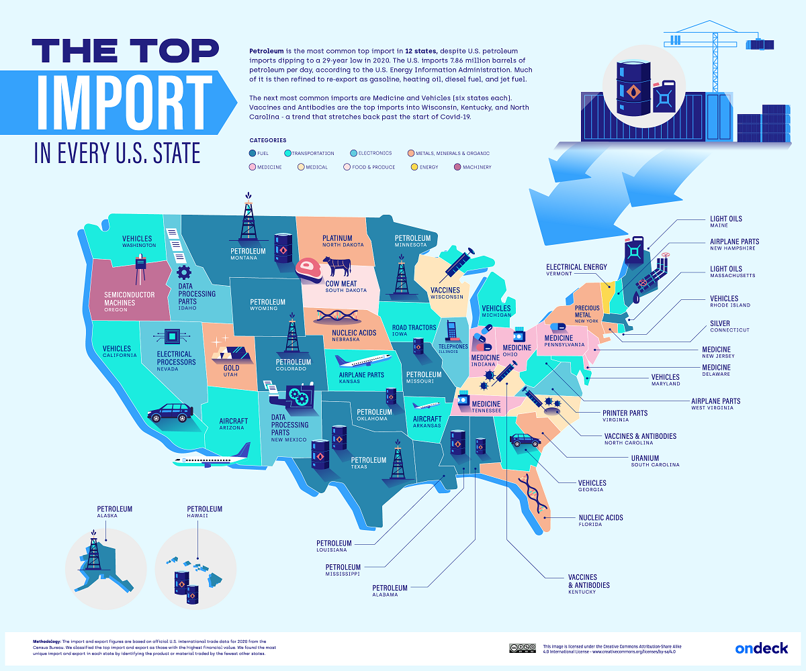

## Table of Contents

## What are imports and why are they important for the United States?

Imports are products or services that a country buys from other countries. For the United States, imports include things like cars, clothes, electronics, and food. These items come from places like China, Mexico, and Japan. Imports are important because they give people in the United States more choices. Instead of just buying what is made in the U.S., people can pick from things made all over the world. This can make products cheaper and better because companies have to compete with each other.

Imports also help the United States in other ways. They can bring in things that the country does not make enough of or cannot make at all. For example, the U.S. might import oil because it does not produce enough on its own. This helps keep the economy running smoothly. Also, importing goods can create jobs in the U.S. This happens when companies need people to handle, sell, or transport the imported goods. So, imports are not just about getting new products; they are also about keeping the economy strong and creating jobs.

## What are the top 5 imports of the United States by value?

The top five imports of the United States by value are important because they show what the country needs from other places. The number one import is cars and car parts. Many cars and parts come from countries like Japan, Germany, and Mexico. The second biggest import is petroleum, which is oil. The U.S. gets a lot of its oil from Canada and Saudi Arabia. The third most valuable import is pharmaceuticals, which are medicines. These come from places like Ireland, Switzerland, and Germany.

The fourth top import is machinery, like computers and other equipment. These often come from China, Mexico, and Germany. The fifth biggest import is electronics, which includes things like phones and TVs. These mostly come from China and other Asian countries. These top imports help the U.S. because they provide things that people need and want, and they keep the economy running smoothly.

## Which countries are the primary sources of these top imports?

The United States gets a lot of its top imports from different countries. For cars and car parts, the main countries are Japan, Germany, and Mexico. These countries send a lot of vehicles and parts to the U.S. because many people in the U.S. buy cars from these places. For petroleum, which is oil, the U.S. gets most of it from Canada and Saudi Arabia. These countries have a lot of oil, and the U.S. needs it to keep things running.

For pharmaceuticals, which are medicines, the U.S. imports a lot from Ireland, Switzerland, and Germany. These countries make a lot of medicines that people in the U.S. need. Machinery, like computers and other equipment, comes mostly from China, Mexico, and Germany. These countries are good at making these things, and the U.S. buys a lot from them. Lastly, for electronics like phones and TVs, China is the biggest source, along with other Asian countries. These countries make a lot of electronics that people in the U.S. want to buy.

## How has the trend of these top imports changed over the last decade?

Over the last decade, the trend of the top imports into the United States has shown some interesting changes. For cars and car parts, the U.S. has been importing more from Mexico, partly because of trade agreements like the USMCA. Japan and Germany are still big sources, but Mexico has become more important. The import of petroleum has gone up and down. The U.S. used to import a lot of oil, but it started producing more of its own. So, while Canada and Saudi Arabia are still big suppliers, the amount the U.S. imports has changed based on how much oil it can produce at home.

Pharmaceuticals have seen steady growth in imports, with Ireland, Switzerland, and Germany continuing to be major suppliers. The U.S. needs more medicines, and these countries have been able to meet that need. Machinery imports, especially from China, have increased a lot over the last decade. The U.S. buys more computers and equipment from China and Mexico, although there have been some changes because of trade tensions. Electronics from China have also grown a lot. More people in the U.S. want phones and TVs, and China makes a lot of these. Overall, the trend shows that the U.S. is still relying on these top imports, but where they come from and how much is imported can change over time.

## What specific products within these categories are most commonly imported?

Within the cars and car parts category, the U.S. imports a lot of passenger cars, trucks, and engines. Many of these cars come from Japan, like Toyota and Honda. Germany sends a lot of luxury cars, like BMW and Mercedes-Benz. Mexico also sends a lot of cars and parts because it's close to the U.S. and they have trade deals that make it easier to import.

For petroleum, the U.S. imports a lot of [crude oil](/wiki/crude-oil) and refined petroleum products like gasoline and diesel. Canada and Saudi Arabia are big suppliers of crude oil. The U.S. needs this oil to keep cars running and to make electricity. In the pharmaceuticals category, the U.S. imports a lot of prescription drugs and vaccines. These come from places like Ireland, Switzerland, and Germany. These countries make a lot of the medicines that people in the U.S. need to stay healthy.

In the machinery category, the U.S. imports a lot of computers, computer parts, and industrial machinery. China, Mexico, and Germany are big suppliers of these items. People in the U.S. use these computers at home and at work. For electronics, the U.S. imports a lot of smartphones, TVs, and other gadgets. Most of these come from China, where a lot of electronics are made. These products are very popular in the U.S. because people like having the latest technology.

## What economic factors influence the import levels of these goods in the U.S.?

Several economic factors affect how much the U.S. imports of cars, petroleum, pharmaceuticals, machinery, and electronics. One big [factor](/wiki/factor-investing) is the exchange rate. When the U.S. dollar is strong, it's cheaper for Americans to buy things from other countries. This can make imports go up. Another factor is trade policies. If the U.S. has good trade deals with other countries, it's easier and cheaper to import things. But if there are high tariffs or trade wars, it can make imports more expensive and cause them to go down.

Another important factor is the demand from people in the U.S. If more people want to buy cars or electronics, then imports of these things will go up. The price of goods in other countries also matters. If it's cheaper to make cars in Mexico than in the U.S., then the U.S. will import more cars from Mexico. Finally, the U.S. economy itself plays a role. If the economy is doing well, people have more money to spend on things like cars and electronics, which can increase imports. But if the economy is not doing well, people might not buy as much, and imports could go down.

## How do tariffs and trade agreements affect the importation of these top goods?

Tariffs and trade agreements have a big effect on how much the U.S. imports cars, petroleum, pharmaceuticals, machinery, and electronics. Tariffs are like taxes that the U.S. puts on things coming into the country. If the U.S. puts high tariffs on cars from Japan, it makes those cars more expensive for people in the U.S. to buy. This can make people buy fewer Japanese cars, so fewer cars get imported. On the other hand, if the U.S. has a trade agreement with Mexico, it might mean lower tariffs on cars from Mexico. This makes Mexican cars cheaper, so more people might buy them, and imports from Mexico could go up.

Trade agreements also make it easier for the U.S. to import things. For example, the USMCA (United States-Mexico-Canada Agreement) helps the U.S. import more cars and car parts from Mexico because it sets rules that make trade easier. If the U.S. has a good trade deal with Saudi Arabia, it can import more oil at a lower cost. But if there are no good trade agreements, or if there are trade wars, it can make importing things harder and more expensive. This can lead to fewer imports of things like electronics from China if there are high tariffs or trade disputes.

## What are the impacts of these imports on the U.S. economy and job market?

Imports of cars, petroleum, pharmaceuticals, machinery, and electronics have a big effect on the U.S. economy. When the U.S. imports these things, it can help keep prices low for people because they have more choices. This is good because it means people can buy what they need without spending too much money. But, it can also make it harder for companies in the U.S. that make the same things. If people buy more cars from Japan or Mexico, then U.S. car companies might sell fewer cars and make less money. This can slow down the economy if a lot of businesses struggle.

Imports also affect jobs in the U.S. On one hand, importing things can create jobs. For example, people are needed to handle, sell, and transport imported goods. This means more jobs in places like ports and stores. On the other hand, if the U.S. imports a lot of something that used to be made in the U.S., like cars or electronics, it can mean fewer jobs for people who used to work in those factories. So, imports can both create and take away jobs, depending on what is being imported and how much. Overall, imports are important for the U.S. economy, but they can have both good and bad effects on jobs and businesses.

## How do the top imports of the U.S. compare with those of other major economies like China and the EU?

The United States imports a lot of cars, oil, medicines, machinery, and electronics. These things come from places like Japan, Mexico, and China. Other big economies like China and the European Union (EU) also import a lot, but what they import can be different. China imports a lot of oil, just like the U.S., but it also imports a lot of food because it needs to feed so many people. The EU imports a lot of energy, like oil and gas, because it does not have enough of its own. The EU also imports machinery and vehicles, but it imports less electronics than the U.S. because it makes a lot of them itself.

The U.S. and these other big economies rely on imports to keep their economies running well. For the U.S., importing things helps keep prices low and gives people more choices. China and the EU also benefit from imports, but they have different needs. China needs to import a lot of food to feed its large population, while the EU needs more energy to keep its industries going. Even though they import different things, all these big economies depend on imports to help their people and businesses.

## What are the environmental impacts associated with the production and transportation of these top imports?

The production and transportation of top U.S. imports like cars, oil, medicines, machinery, and electronics can have big effects on the environment. Making cars and machinery uses a lot of energy and creates pollution. For example, factories that make car parts might burn a lot of coal or gas, which puts out carbon dioxide and other harmful gases. These gases can make the air dirty and contribute to climate change. Also, mining for the materials needed to make these things, like metals and plastics, can harm the land and water. Oil production is especially bad for the environment because it can cause oil spills, which hurt wildlife and damage the ocean.

Transportation of these imports also has environmental impacts. Ships, trucks, and planes that bring goods to the U.S. use a lot of fuel, which creates more pollution. For example, a big ship carrying cars from Japan to the U.S. burns a lot of oil, and this adds to the carbon dioxide in the air. Moving oil around can be risky too, because there's always a chance of spills during transport. Even though importing these things helps the U.S. economy, it's important to think about how it affects the environment and try to find ways to make it less harmful.

## How do fluctuations in currency exchange rates affect the cost and volume of these imports?

When the value of the U.S. dollar goes up or down compared to other countries' money, it can change how much it costs to import things like cars, oil, medicines, machinery, and electronics. If the U.S. dollar gets stronger, it means Americans can buy more things from other countries for the same amount of money. So, importing cars from Japan or oil from Saudi Arabia might become cheaper. This can make people in the U.S. buy more of these things, so the [volume](/wiki/volume-trading-strategy) of imports might go up. But if the U.S. dollar gets weaker, it costs more to buy things from other countries. This can make imports more expensive, and people might not buy as much, so the volume of imports could go down.

Exchange rates can also affect how much other countries want to sell to the U.S. If the U.S. dollar is strong, other countries might want to sell more to the U.S. because they get more of their own money for each dollar they earn. This can lead to more imports coming into the U.S. But if the U.S. dollar is weak, other countries might not want to sell as much to the U.S. because they get less of their own money for each dollar. This can make the volume of imports go down. So, changes in the value of the U.S. dollar can have a big impact on both the cost and the amount of imports the U.S. brings in.

## What future trends are predicted for these top imports based on current global economic forecasts?

Looking ahead, experts think that the U.S. will keep importing a lot of cars, oil, medicines, machinery, and electronics. But there might be some changes. For cars, the U.S. might import more electric vehicles from places like China and Europe because people are starting to care more about the environment. Also, trade deals like the USMCA might keep helping the U.S. import more cars from Mexico. Oil imports could go down a bit because the U.S. is making more of its own oil. But the U.S. will still need to import some oil from Canada and Saudi Arabia. Medicines will probably keep being imported a lot, especially from Ireland, Switzerland, and Germany, because the U.S. needs them to keep people healthy.

For machinery and electronics, things might change too. The U.S. might import more high-tech machinery from countries like Germany and Japan because businesses need them to stay competitive. But trade tensions with China could affect how much electronics the U.S. imports from there. If the U.S. and China can work out their differences, imports of electronics might stay high. If not, the U.S. might start looking for other places to get electronics. Overall, the U.S. will still rely on these top imports, but the amounts and where they come from might shift based on new technology, trade deals, and how the global economy is doing.

## References & Further Reading

[1]: Office of the United States Trade Representative. ["U.S.-Mexico-Canada Trade Agreement (USMCA)"](https://ustr.gov/trade-agreements/free-trade-agreements/united-states-mexico-canada-agreement)

[2]: United States Census Bureau. ["Foreign Trade Statistics"](https://www.census.gov/foreign-trade/data/index.html)

[3]: Lopresti, S. M. (2023). ["Algorithmic Trading: A Practical Guide"](https://www.researchgate.net/publication/378548435_Algorithmic_Trading_and_AI_A_Review_of_Strategies_and_Market_Impact) Wiley Finance Series.

[4]: Freund, C., & McDaniel, C. (2016). ["How US Trade Policy Affects Imports and Exports"](https://documents.worldbank.org/curated/en/761201468175464382/pdf/wps3909.pdf) VoxEU.org.

[5]: International Trade Administration. ["U.S. Import Overview"](https://www.trade.gov/)

[6]: Powell, L. (2020). ["The Impact of Trade Agreements on U.S. Imports"](https://www.csis.org/) Journal of International Commerce and Economics.