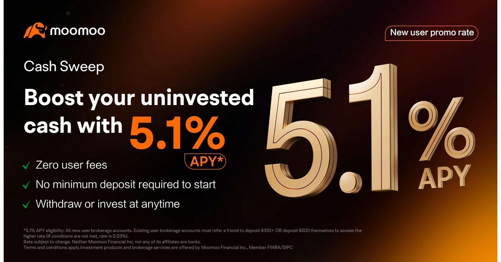

## Table of Contents

## What is uninvested cash and why is it important to manage it?

Uninvested cash is money that you have but are not using to buy things or invest in something. It's like having money sitting in your pocket or in a regular bank account without earning any interest or making more money. This can happen when you are waiting to find a good investment or when you are not sure what to do with your money yet.

It's important to manage uninvested cash because if you leave it sitting around, it might lose value over time because of inflation. Inflation means that the price of things goes up, so the same amount of money can buy less in the future. By managing your uninvested cash wisely, you can put it into investments that might grow over time, helping you to keep up with or even beat inflation. This way, your money can work for you and help you reach your financial goals.

## What are the basic types of investment accounts suitable for uninvested cash?

One basic type of investment account for uninvested cash is a savings account. This is a safe place to keep your money at a bank or credit union. Savings accounts usually give you a small amount of interest, which means your money can grow a little bit over time. They are good for money you might need soon because you can take it out easily.

Another type is a certificate of deposit, or CD. With a CD, you put your money in for a certain time, like six months or a year. CDs often give you a higher [interest rate](/wiki/interest-rate-trading-strategies) than a regular savings account, but you can't take your money out until the time is up without paying a fee. This is good if you know you won't need the money for a while.

A third option is a money market account. This is like a mix between a savings account and a checking account. Money market accounts usually offer higher interest rates than regular savings accounts and let you write checks or use a debit card. They are good for money you might need soon but still want to earn a bit more interest on.

## How do savings accounts work for managing uninvested cash?

A savings account is a simple and safe way to manage uninvested cash. You can open a savings account at a bank or a credit union. When you put your money into a savings account, the bank pays you a small amount of interest over time. This means your money can grow a little bit, even if you're not using it for anything else. Savings accounts are great because they are very safe; your money is protected and you can take it out whenever you need it.

Savings accounts are perfect for money that you might need soon but don't want to spend right away. For example, if you're saving up for a new bike or a vacation, you can keep that money in a savings account until you're ready to use it. The interest you earn is like a small bonus for keeping your money in the bank. It's a good first step for managing uninvested cash because it's easy to start and you don't have to worry about losing your money.

## What are the benefits of using money market accounts for uninvested cash?

Money market accounts are a good choice for managing uninvested cash because they usually offer higher interest rates than regular savings accounts. This means your money can grow a bit faster. They are still very safe, just like savings accounts, so you don't have to worry about losing your money. This makes them a good place to keep money that you might need soon but want to earn a bit more interest on.

Another benefit of money market accounts is that they are more flexible than some other types of accounts. You can often write checks or use a debit card to take money out when you need it. This makes it easy to use your money when you want to, without having to wait or pay fees. So, if you have uninvested cash that you might need to spend in the near future, a money market account can be a smart choice.

## How can certificates of deposit (CDs) be used to manage uninvested cash?

Certificates of deposit, or CDs, are a good way to manage uninvested cash if you know you won't need the money for a while. When you put your money into a CD, you agree to leave it there for a set time, like six months or a year. In return, the bank gives you a higher interest rate than you would get with a regular savings account. This means your money can grow more than it would in a savings account, making CDs a smart choice for uninvested cash that you can afford to set aside for a bit.

CDs are safe and reliable, just like savings accounts. Your money is protected, and you know exactly how much interest you will earn by the end of the term. The only thing to remember is that you can't take your money out early without paying a fee. So, CDs are perfect for managing uninvested cash that you won't need to touch until the CD matures. If you can plan ahead and leave your money in a CD, it's a great way to make your uninvested cash work harder for you.

## What are the risks and rewards of investing uninvested cash in stocks?

Investing uninvested cash in stocks can be a way to make your money grow a lot more than it would in a savings account or a CD. Stocks are pieces of a company that you can buy. If the company does well, the value of the stock can go up, and you can make money. Sometimes, companies also pay dividends, which are like little bonuses for owning the stock. This means that over time, if you pick good stocks, your uninvested cash can turn into a lot more money.

But, there are risks too. The value of stocks can go down as well as up. If the company you invest in does not do well, the price of the stock can drop, and you could lose money. This can happen quickly, and it can be hard to predict. Because of this, investing in stocks is riskier than keeping your money in a savings account or a CD. It's important to think about how much risk you are okay with before you decide to invest your uninvested cash in stocks.

## How do bond investments help in managing uninvested cash?

Bond investments are another way to manage uninvested cash. When you buy a bond, you are lending money to a company or the government. They promise to pay you back the money you lent them, plus some extra money called interest, over a certain time. This makes bonds a safer way to invest your money compared to stocks. The interest you earn can help your uninvested cash grow a little bit, and because bonds are generally safer, you don't have to worry as much about losing your money.

Bonds can be a good choice if you want to keep your money safe but still earn more than you would in a savings account. They are especially useful if you know you won't need the money for a while because bonds usually have a set time before you get your money back. By investing your uninvested cash in bonds, you can make it work for you and earn some interest without taking on too much risk.

## What role do mutual funds play in managing uninvested cash?

Mutual funds can be a good way to manage uninvested cash if you want to spread your money out and not put it all in one place. A mutual fund is like a big basket where lots of people put their money together. Then, the people who run the mutual fund use that money to buy different things like stocks, bonds, or other investments. This means your uninvested cash can be part of a lot of different investments, which can help it grow. It's like having a little bit of many different things instead of all your money in just one thing.

The good thing about mutual funds is that they can help you make your money grow without you having to pick each investment yourself. The people who run the mutual fund do that for you. But, just like with stocks, there is some risk. The value of the mutual fund can go up or down depending on how well the things they invest in are doing. So, while mutual funds can be a smart way to manage your uninvested cash, it's important to think about how much risk you are okay with before you decide to put your money in them.

## How can exchange-traded funds (ETFs) be utilized for uninvested cash management?

Exchange-traded funds, or ETFs, are another way to manage your uninvested cash. ETFs are like mutual funds because they hold a bunch of different investments, like stocks or bonds, all in one place. But, ETFs are different because you can buy and sell them on the stock market, just like you would with a single stock. This makes them easy to get into and out of, which can be good if you want to be able to use your money quickly. By putting your uninvested cash into an [ETF](/wiki/etf-trading-strategies), you can spread it out over many different investments, which can help it grow without you having to pick each one yourself.

ETFs can be a smart choice because they often have lower fees than mutual funds. This means more of your money can stay in your pocket instead of going to pay for running the fund. But, just like with stocks and mutual funds, there is some risk. The value of an ETF can go up or down depending on how well the things it holds are doing. So, while ETFs can be a good way to manage your uninvested cash, it's important to think about how much risk you are okay with before you decide to invest in them.

## What advanced strategies can be used for managing uninvested cash in retirement accounts?

When you have uninvested cash in your retirement accounts, one advanced strategy you can use is called dollar-cost averaging. This means you take your uninvested cash and put it into your retirement account a little bit at a time, instead of all at once. For example, if you have $12,000 in uninvested cash, you might decide to put $1,000 into your account each month for a year. This can help you buy investments at different prices over time, which might lower your risk because you're not putting all your money in when prices might be high. It's a good way to slowly grow your retirement savings without taking big risks.

Another strategy is to use a target-date fund. These funds are set up to change how they invest your money as you get closer to retiring. When you're young, the fund might put more of your uninvested cash into stocks, which can grow a lot but are riskier. As you get closer to retirement, the fund will slowly move your money into safer investments like bonds. This way, your uninvested cash can be managed to grow over time but also become safer as you need it for retirement. It's like having someone adjust your investments for you as you get older, making it easier to manage your retirement money.

## How do robo-advisors manage uninvested cash and what are their advantages?

Robo-advisors are a modern way to manage your uninvested cash. They use computer programs to make decisions about where to put your money. When you give your uninvested cash to a robo-advisor, it will look at things like how much risk you want to take and when you need the money. Then, it will put your money into different investments like stocks, bonds, or ETFs. The robo-advisor will keep an eye on your investments and make changes if it thinks it can do better. This means you don't have to worry about [picking](/wiki/asset-class-picking) each investment yourself, which can be a big help if you're not sure where to start.

One big advantage of using a robo-advisor is that it's usually cheaper than hiring a person to manage your money. Robo-advisors often charge lower fees because they use computers instead of people to do the work. Another advantage is that they make investing easy. You just answer a few questions about your goals and how much risk you're okay with, and the robo-advisor does the rest. This can be a good way to manage your uninvested cash if you want to grow your money but don't want to spend a lot of time or money on it.

## What are the tax implications of different investment accounts for managing uninvested cash?

When you put your uninvested cash into different types of investment accounts, you need to think about taxes. Some accounts, like regular savings accounts and CDs, don't have special tax rules. The interest you earn from these accounts is added to your income, and you pay taxes on it at the end of the year. This means the more interest you earn, the more taxes you might have to pay. If you put your money into a money market account, the same rules usually apply. The interest you get is taxed as regular income.

But, there are other types of accounts that can help you save on taxes. For example, if you put your uninvested cash into a retirement account like an IRA or a 401(k), you might get some tax benefits. With a traditional IRA or 401(k), you can put money in before you pay taxes on it, which can lower your taxes for that year. The money grows without being taxed until you take it out when you retire. On the other hand, with a Roth IRA or Roth 401(k), you pay taxes on the money before you put it in, but then it grows and you can take it out tax-free when you retire. So, choosing the right type of account can help you manage your uninvested cash in a way that saves you money on taxes.

## References & Further Reading

[1]: Bergstra, J., Bardenet, R., Bengio, Y., & Kégl, B. (2011). ["Algorithms for Hyper-Parameter Optimization."](https://papers.nips.cc/paper/4443-algorithms-for-hyper-parameter-optimization) Advances in Neural Information Processing Systems 24.

[2]: ["Advances in Financial Machine Learning"](https://www.amazon.com/Advances-Financial-Machine-Learning-Marcos/dp/1119482089) by Marcos Lopez de Prado

[3]: ["Evidence-Based Technical Analysis: Applying the Scientific Method and Statistical Inference to Trading Signals"](https://www.amazon.com/Evidence-Based-Technical-Analysis-Scientific-Statistical/dp/0470008741) by David Aronson

[4]: ["Machine Learning for Algorithmic Trading"](https://github.com/PacktPublishing/Machine-Learning-for-Algorithmic-Trading-Second-Edition) by Stefan Jansen

[5]: ["Quantitative Trading: How to Build Your Own Algorithmic Trading Business"](https://books.google.com/books/about/Quantitative_Trading.html?id=j70yEAAAQBAJ) by Ernest P. Chan