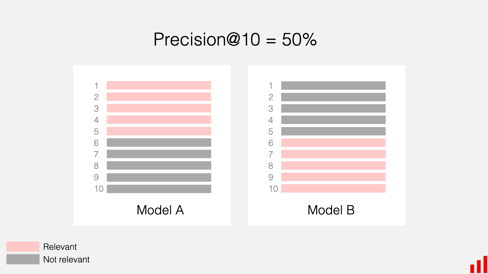

## Table of Contents

## What is Top-K Accuracy in machine learning?

Top-K Accuracy is a way to measure how well a machine learning model can predict the right answer. Instead of just looking at the very top prediction, Top-K Accuracy checks if the correct answer is among the top K predictions. For example, if K is 5, the model is considered correct if the right answer is in its top 5 guesses. This is useful because sometimes the exact top prediction might be wrong, but the correct answer might still be close to the top.

In practice, Top-K Accuracy can be calculated by going through all the predictions made by the model and checking how often the correct answer appears in the top K predictions. If a model has a high Top-K Accuracy, it means it's good at narrowing down the possibilities to a small set that includes the right answer. This measure is especially helpful in tasks where getting the exact top prediction isn't as important as getting it into a small group of likely options.

## How is Top-K Accuracy different from Top-1 Accuracy?

Top-K Accuracy and Top-1 Accuracy are both ways to see how good a machine learning model is at making predictions, but they look at different things. Top-1 Accuracy is simple: it checks if the model's very top guess is the right answer. If the model picks the correct answer as its number one choice, it gets a point. So, Top-1 Accuracy is all about the model getting it exactly right on the first try.

On the other hand, Top-K Accuracy is a bit more forgiving. Instead of just looking at the top guess, it checks if the right answer is among the top K guesses. For example, if K is 3, the model gets a point if the correct answer is in its top 3 choices. This means that even if the model doesn't get the exact top prediction right, it can still be considered accurate if the right answer is close to the top. Top-K Accuracy is useful when it's okay for the model to give a few good options instead of just one perfect answer.

## Why is Top-K Accuracy important in classification tasks?

Top-K Accuracy is important in classification tasks because it gives a more relaxed way to check how well a model is doing. In many real-life situations, it's okay if the model doesn't get the exact top answer right, as long as the right answer is among the top few guesses. For example, if you're using a model to suggest movies, it's fine if the model's top choice isn't the one you want, as long as the movie you like is in the top 5 suggestions. This makes Top-K Accuracy a useful measure because it shows how good the model is at narrowing down the possibilities to a small set that includes the right answer.

Another reason Top-K Accuracy is important is that it can help in understanding the model's performance in a more detailed way. If a model has a high Top-1 Accuracy, that's great, but knowing its Top-K Accuracy can tell you how often the model is close to being right even when it doesn't get the top spot. This can be really helpful for improving the model because it shows where the model is making mistakes and how it can be tweaked to do better. For example, if a model has a low Top-1 Accuracy but a high Top-5 Accuracy, it might mean the model needs a bit more fine-tuning to push the right answer to the very top.

## How do you calculate Top-K Accuracy?

To calculate Top-K Accuracy, you go through all the predictions your model made and check if the correct answer is in the top K guesses for each prediction. For example, if K is 3, you see if the right answer is in the top 3 choices the model gave. You count how many times this happens and then divide that number by the total number of predictions. This gives you the Top-K Accuracy as a percentage or a number between 0 and 1.

Here's a simple way to think about it: Imagine you have 100 predictions, and for 75 of them, the correct answer is in the top 3 guesses. Your Top-3 Accuracy would be 75 out of 100, or 75%. If you want to use a formula, it looks like this: $$ \text{Top-K Accuracy} = \frac{\text{Number of correct predictions in top K}}{\text{Total number of predictions}} $$. This way, you can see how often your model is close to being right, even if it doesn't always get the top spot.

## What are the common values of K used in Top-K Accuracy?

In [machine learning](/wiki/machine-learning), the most common values of K used in Top-K Accuracy are 1, 3, and 5. Top-1 Accuracy is the strictest measure because it only counts a prediction as correct if the model's top guess is right. Top-3 and Top-5 Accuracy are more relaxed, allowing the correct answer to be in the top 3 or top 5 guesses, respectively. These values are popular because they balance between being strict enough to be meaningful and lenient enough to show how well the model is doing overall.

Choosing the right K depends on what you're trying to do with your model. For tasks where getting the exact top answer is important, like medical diagnosis, you might stick with Top-1 Accuracy. But for things like recommending products or movies, where it's okay to give a few good options, Top-3 or Top-5 Accuracy might be more useful. The formula to calculate Top-K Accuracy is simple: $$ \text{Top-K Accuracy} = \frac{\text{Number of correct predictions in top K}}{\text{Total number of predictions}} $$. This helps you see how often your model is close to being right, even if it doesn't always get the top spot.

## Can you explain the impact of choosing different K values on model evaluation?

Choosing different K values for Top-K Accuracy can change how you see your model's performance. If you use a small K, like 1, you're being very strict. The model has to get the top guess right to be considered accurate. This is good for tasks where getting the exact answer is super important, like in medical diagnoses. But if your model is good at narrowing down choices but not always perfect, a small K might make it look worse than it really is. The formula for Top-K Accuracy is $$ \text{Top-K Accuracy} = \frac{\text{Number of correct predictions in top K}}{\text{Total number of predictions}} $$. So, with a small K, the numerator might be smaller, leading to a lower accuracy score.

On the other hand, using a larger K, like 3 or 5, is more forgiving. It counts the model as accurate if the right answer is in the top few guesses. This is useful for things like recommending movies or products, where giving a few good options is okay. A larger K can show that your model is doing well even if it doesn't always get the top spot right. But be careful: if K is too big, almost every prediction might be counted as correct, and that can make your model look better than it really is. So, choosing the right K depends on what you're trying to do with your model and how strict you need to be about getting the exact answer right.

## How does Top-K Accuracy help in understanding model performance in multi-class classification?

In multi-class classification, where a model has to pick from many different options, Top-K Accuracy helps you see how well the model is doing at finding the right answer. Instead of just looking at the very top guess like with Top-1 Accuracy, Top-K Accuracy checks if the right answer is in the top K guesses. For example, if K is 3, the model gets a point if the correct answer is in its top 3 choices. This is useful because it shows how often the model is close to being right, even if it doesn't always get the top spot. The formula for Top-K Accuracy is simple: $$ \text{Top-K Accuracy} = \frac{\text{Number of correct predictions in top K}}{\text{Total number of predictions}} $$. This way, you can see how good the model is at narrowing down the possibilities to a small set that includes the right answer.

Choosing the right K value is important because it changes how you see the model's performance. If you use a small K, like 1, you're being very strict. The model has to get the top guess right to be considered accurate. This is good for tasks where getting the exact answer is super important. But if your model is good at narrowing down choices but not always perfect, a small K might make it look worse than it really is. On the other hand, using a larger K, like 3 or 5, is more forgiving. It counts the model as accurate if the right answer is in the top few guesses. This is useful for things like recommending movies or products, where giving a few good options is okay. A larger K can show that your model is doing well even if it doesn't always get the top spot right.

## What are the limitations of using Top-K Accuracy as a performance metric?

Top-K Accuracy is a good way to see how well a model is doing, but it has some problems. One big problem is that it can make a model look better than it really is if you use a big K. For example, if you use Top-10 Accuracy, almost every guess might be counted as right, even if the model isn't very good. This can hide how the model is really doing. Also, Top-K Accuracy doesn't tell you how sure the model is about its guesses. If the model is just guessing randomly but the right answer is in the top K by chance, it still counts as correct.

Another limitation is that Top-K Accuracy doesn't help you see how the model is doing for different groups of data. For example, if the model is good at guessing for one type of data but bad for another, Top-K Accuracy won't show that. It just gives you one number for all the data. This can make it hard to know where the model needs to get better. So, while Top-K Accuracy is useful, it's important to use other ways to check the model's performance too.

## How can Top-K Accuracy be used alongside other metrics like precision and recall?

Top-K Accuracy is a good way to see how well a model is doing, but it's even better when you use it with other metrics like precision and recall. Precision tells you how many of the model's positive guesses were right. Recall tells you how many of the actual positive cases the model found. If you use Top-K Accuracy with precision and recall, you get a fuller picture of how the model is doing. For example, if a model has high Top-K Accuracy but low precision, it might be good at guessing a few right answers but also guessing a lot of wrong ones. The formula for Top-K Accuracy is $$ \text{Top-K Accuracy} = \frac{\text{Number of correct predictions in top K}}{\text{Total number of predictions}} $$. This helps you see how often the model is close to being right, even if it doesn't always get the top spot.

Using these metrics together can help you understand where the model needs to get better. If the model has high Top-K Accuracy but low recall, it might be missing a lot of the right answers even if it's good at guessing a few. By looking at all these metrics, you can see if the model is good at finding the right answer, how sure it is about its guesses, and if it's missing any important cases. This way, you can make the model better by focusing on the areas where it's not doing well.

## In what scenarios might Top-K Accuracy be more appropriate than other accuracy metrics?

Top-K Accuracy is really helpful when you're okay with the model giving you a few good options instead of just one perfect answer. For example, if you're using a model to suggest movies or products, it's fine if the model's top choice isn't the one you want, as long as the movie or product you like is in the top 5 suggestions. This makes Top-K Accuracy a good measure because it shows how good the model is at narrowing down the possibilities to a small set that includes the right answer. The formula for Top-K Accuracy is $$ \text{Top-K Accuracy} = \frac{\text{Number of correct predictions in top K}}{\text{Total number of predictions}} $$. This way, you can see how often your model is close to being right, even if it doesn't always get the top spot.

In some cases, like recommending things or searching for information, getting the exact top answer isn't as important as getting it into a small group of likely options. Top-K Accuracy is more appropriate here because it's more forgiving than Top-1 Accuracy, which only counts the model as correct if it gets the very top guess right. If you're working on a project where you want to see how well the model is doing at finding the right answer among the top few guesses, Top-K Accuracy can give you a better idea of the model's performance than other accuracy metrics.

## How do you implement Top-K Accuracy in popular machine learning frameworks like TensorFlow or PyTorch?

In TensorFlow, you can calculate Top-K Accuracy using the `tf.keras.metrics.TopKCategoricalAccuracy` function. This metric is designed to check if the correct label is in the top K predictions. First, you define the metric with the K value you want, like `top_k_accuracy = tf.keras.metrics.TopKCategoricalAccuracy(k=3)`. Then, you update the metric in your training loop with `top_k_accuracy.update_state(y_true, y_pred)`. Finally, you can get the Top-K Accuracy value with `top_k_accuracy.result().numpy()`. This way, you can see how often your model's top K guesses include the right answer. The formula for Top-K Accuracy is $$ \text{Top-K Accuracy} = \frac{\text{Number of correct predictions in top K}}{\text{Total number of predictions}} $$.

In PyTorch, you can calculate Top-K Accuracy using the `torch.topk` function to get the top K values and their indices from your model's predictions. Then, you compare these indices with the true labels to see if the correct label is in the top K predictions. You can do this in a loop over your dataset. For example, you might write a function like this:

```python
def top_k_accuracy(output, target, k=3):
    with torch.no_grad():
        _, pred = output.topk(k, 1, True, True)
        pred = pred.t()
        correct = pred.eq(target.view(1, -1).expand_as(pred))
        correct_k = correct[:k].reshape(-1).float().sum(0, keepdim=True)
        return correct_k.mul_(100.0 / output.size(0))
```

This function calculates the Top-K Accuracy by checking how many times the correct label is in the top K predictions and then dividing by the total number of predictions. This way, you can see how well your model is doing at finding the right answer among its top guesses.

## What advanced techniques can be used to optimize models based on Top-K Accuracy?

To optimize models based on Top-K Accuracy, one advanced technique is to use a loss function that focuses on improving the model's ability to rank the correct answer higher among its top predictions. For example, you can use a loss function like the "ListMLE" (Listwise Maximum Likelihood Estimation) loss, which tries to make the model's top K predictions as close to the correct order as possible. This can help the model push the right answer closer to the top of its guesses, which is what Top-K Accuracy measures. The formula for Top-K Accuracy is $$ \text{Top-K Accuracy} = \frac{\text{Number of correct predictions in top K}}{\text{Total number of predictions}} $$. By using a loss function that focuses on ranking, you can make the model better at getting the right answer into its top K guesses.

Another technique is to use techniques like "knowledge distillation," where a smaller, simpler model learns from a bigger, more complex model. The smaller model can be trained to mimic the bigger model's top K predictions, which can help improve its Top-K Accuracy. You can do this by training the smaller model to match the bigger model's output probabilities for the top K guesses. This way, the smaller model can learn to be good at finding the right answer among its top guesses, even if it's not as good at getting the exact top prediction right. By using these advanced techniques, you can make your model better at what Top-K Accuracy measures, which is getting the right answer into a small set of top guesses.

## References & Further Reading

[1]: Russakovsky, O., Deng, J., Su, H., Krause, J., Satheesh, S., Ma, S., ... & Fei-Fei, L. (2015). ["ImageNet Large Scale Visual Recognition Challenge."](https://arxiv.org/abs/1409.0575) International Journal of Computer Vision, 115(3), 211-252.

[2]: Bishop, C. M. (2006). ["Pattern Recognition and Machine Learning."](https://www.cs.uoi.gr/~arly/courses/ml/tmp/Bishop_book.pdf) Springer.

[3]: Chollet, F. (2018). ["Deep Learning with Python."](https://www.amazon.com/Deep-Learning-Python-Francois-Chollet/dp/1617294438) Manning Publications.

[4]: He, K., Zhang, X., Ren, S., & Sun, J. (2016). ["Deep Residual Learning for Image Recognition."](https://arxiv.org/abs/1512.03385) Proceedings of the IEEE Conference on Computer Vision and Pattern Recognition (CVPR), 770-778.

[5]: Goodfellow, I., Bengio, Y., & Courville, A. (2016). ["Deep Learning."](https://link.springer.com/article/10.1007/s10710-017-9314-z) MIT Press.

[6]: Simonyan, K., & Zisserman, A. (2015). ["Very Deep Convolutional Networks for Large-Scale Image Recognition."](https://arxiv.org/abs/1409.1556) arXiv preprint arXiv:1409.1556.

[7]: Deng, J., Dong, W., Socher, R., Li, L. J., Li, K., & Fei-Fei, L. (2009). ["ImageNet: A Large-Scale Hierarchical Image Database."](https://ieeexplore.ieee.org/document/5206848) 2009 IEEE Conference on Computer Vision and Pattern Recognition, 248-255.