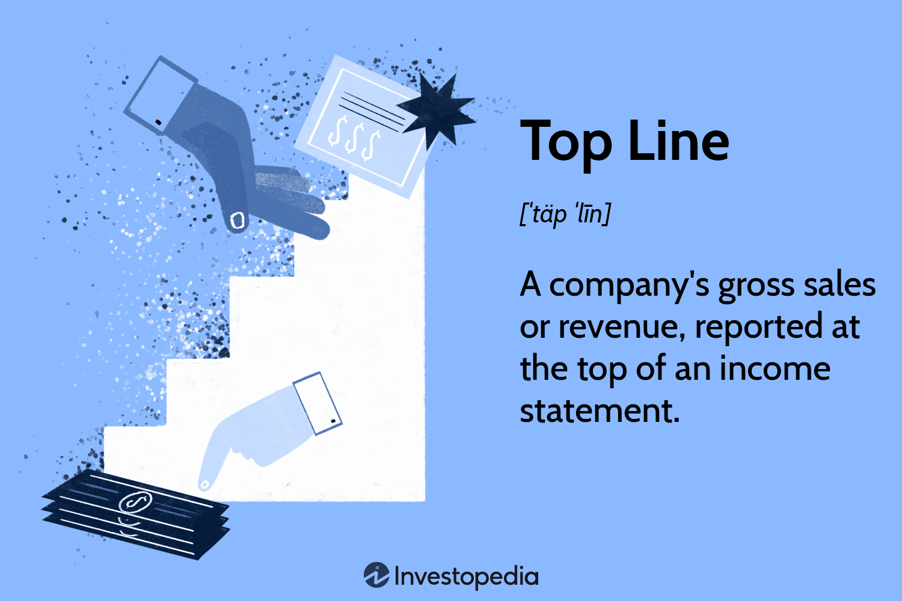

The financial world is intricate, and understanding its core components such as financial statements, financial metrics, the top line, and algorithmic trading is crucial for making informed decisions. These elements form the backbone of strategic financial analysis and trading, enabling investors and traders to decode the complexities of market dynamics.

This article aims to provide a comprehensive exploration of these elements, elucidating their significance in today's trading environments. By dissecting financial statements, investors can gauge a company's fiscal strength and operational efficiency. Key financial metrics offer quantitative insights that extend beyond numerical profits, revealing a company's real performance. The top line, or total revenue, serves as a critical barometer for market demand and business growth potential. Algorithmic trading, meanwhile, leverages these financial insights to execute precise and timely trading decisions through automated processes.



Assessing the strength of businesses through financial statements and utilizing algorithmic trading for optimized investment strategies are essential. Understanding the interplay between these components not only enhances decision-making processes but also strengthens predictive capabilities in trading operations. This integration allows market participants to refine their strategies based on robust financial data and market trends.

Join us as we explore a detailed guide tailored for investors, analysts, and traders eager to leverage financial data for more robust trading strategies. The content is structured to benefit both seasoned investors and novices. Seasoned investors will find advanced strategies and insights into refining their trading methodologies, while newcomers will acquire foundational knowledge to build their financial acumen.

Whether you're a seasoned investor or a novice keen on learning, this article will furnish you with insights into key financial concepts and their practical applications. This comprehensive understanding empowers market participants to make data-driven choices, optimizing investment and trading outcomes in today's fast-paced financial landscape.

## Table of Contents

## Understanding Financial Statements

Financial statements are integral to comprehending a company's financial performance and position, serving as a foundational tool for investors, analysts, and other stakeholders. These formal records encapsulate critical information through key types such as balance sheets, income statements, cash flow statements, and statements of shareholders' equity. Each type plays a distinct role, providing insights into various facets of a company's operations and financial condition.

**Balance Sheets**  
A balance sheet offers a snapshot of a company's financial position at a specific point in time by detailing its assets, liabilities, and shareholders' equity. Assets are resources owned by the company expected to generate future economic benefits and can be categorized as current (e.g., cash, inventory) or non-current (e.g., property, equipment). Liabilities represent obligations the company must settle, encompassing current liabilities like accounts payable and long-term obligations such as bonds payable. Shareholders' equity, the residual interest in the company's assets after deducting liabilities, reflects owners' claims, capturing retained earnings and additional paid-in capital. The fundamental accounting equation, **Assets = Liabilities + Shareholders' Equity**, forms the basis of the balance sheet. It assures that all capital coming into the company, whether from borrowing or investment, is accounted for.

**Income Statements**  
An income statement details a company’s financial performance over a specific period, highlighting its ability to generate profit through operations. It starts with the top line or revenue, derived from sales of goods or services. From this, costs and expenses like cost of goods sold (COGS), operating expenses, interest, and taxes are subtracted to ascertain the net income. Net income, often referred to as the bottom line, indicates the company's profitability. This statement is crucial for investors assessing the company's revenue-generating capability and operational efficiency.

**Cash Flow Statements**  
The cash flow statement tracks the inflows and outflows of cash within a business over a period, highlighting [liquidity](/wiki/liquidity-risk-premium) and solvency. It is divided into three sections: operating activities, which adjust net income for non-cash items and changes in working capital; investing activities, reporting cash used for investments in assets; and financing activities, showing cash flows from transactions with shareholders and creditors. Understanding this statement helps stakeholders evaluate how well a company generates cash to meet its debt obligations and fund its operating expenses.

**Statements of Shareholders' Equity**  
This statement provides details on changes in the value of shareholders' equity over an accounting period. Key elements recorded include net income, dividends paid, issuance or repurchase of stocks, and changes in retained earnings and reserves. It offers insights into how the company's management uses profits, whether retained for growth or paid out as dividends.

Collectively, these financial statements offer a comprehensive picture of a company's financial health, informing investment decisions and risk assessments. They are also pivotal in creating [algorithmic trading](/wiki/algorithmic-trading) strategies, as algorithms leverage the data within these statements to predict market trends and inform real-time trading decisions. Understanding these documents not only enhances investment evaluations but also supports the development of data-driven trading strategies, fostering more informed and effective financial decision-making.

## Exploring Financial Metrics

Financial metrics are fundamental tools for investors and analysts seeking to gauge a company’s performance, efficiency, and financial health beyond the basic figures found in its financial statements. These metrics offer valuable insights that direct financial figures might not immediately reveal, assisting in making informed investment and trading decisions. Key metrics include revenue, net income, and financial ratios such as the debt-to-equity ratio, among others.

**Revenues and Net Income:**

- **Revenue (Top Line):** This is the total amount of money generated by the sale of goods or services related to the company's primary operations. It serves as a measure of a company’s scale of operations, reflecting sales growth and market demand.

- **Net Income:** Also known as the bottom line, this represents the profit a company makes after deducting all expenses, including taxes and interest. It's a crucial indicator of a company’s profitability.

**Financial Ratios:**

Financial ratios simplify the complexity of financial data into accessible figures for easier analysis and comparison. Some critical ratios include:

- **Debt-to-Equity Ratio:** This measures a company’s financial leverage by comparing its total liabilities to its shareholder equity. It’s indicative of how much debt the company is using to finance its assets relative to the value represented in shareholders’ equity. A high debt-to-equity ratio can indicate higher risk, especially in volatile markets. The formula is:
$$
  \text{Debt-to-Equity Ratio} = \frac{\text{Total Liabilities}}{\text{Shareholders' Equity}}

$$

- **Current Ratio:** This liquidity ratio assesses a company's ability to pay short-term obligations with its current assets. A higher current ratio suggests that the company is well-positioned to cover its short-term liabilities. It is calculated as:
$$
  \text{Current Ratio} = \frac{\text{Current Assets}}{\text{Current Liabilities}}

$$

- **Profit Margins (Gross, Operating, and Net):** These ratios reflect a company's ability to convert sales into profits at various stages of its income statement:

  - **Gross Profit Margin:** Measures the relationship between revenue and cost of goods sold (COGS):
$$
    \text{Gross Profit Margin} = \frac{\text{Revenue - COGS}}{\text{Revenue}}

$$

  - **Operating Margin:** Indicates the proportion of revenue left after paying for variable costs of production like wages and raw materials:
$$
    \text{Operating Margin} = \frac{\text{Operating Income}}{\text{Revenue}}

$$

  - **Net Profit Margin:** Calculates how much of each dollar earned by the company translates to profit:
$$
    \text{Net Profit Margin} = \frac{\text{Net Income}}{\text{Revenue}}

$$

**Application in Trading and Investment:**

Financial metrics are not only about historical assessment but also play a pivotal role in algorithmic trading and strategy formulation. By analyzing these metrics, traders can develop algorithms that identify market patterns, optimize portfolio combinations, and execute trades based on precise financial insights. Tools like Python can automate data retrieval and analysis, streamlining the process for more informed, responsive trading decisions. 

For example, a Python script might pull real-time financial data and compute financial ratios to trigger buy/sell indicators based on pre-set thresholds:

```python
import yfinance as yf  # For more datasets, visit: https://paperswithbacktest.com/datasets

# Get data on a stock
data = yf.download('AAPL', start='2022-01-01', end='2023-01-01')

# Calculate financial metrics
net_income = ... # Placeholder for net income calculation
revenue = ... # Placeholder for revenue calculation

# Calculate net profit margin
net_profit_margin = net_income / revenue

# Decision logic
if net_profit_margin > 0.1:
    print("Positive signal for AAPL")
else:
    print("Caution: AAPL underperforming")
```

The deep understanding and application of these metrics enhance trading algorithms, allowing traders to leverage data effectively to manage risks while maximizing returns.

## The Top Line: Significance and Analysis

The top line, also known as total revenue, is a fundamental indicator of a company's financial health and potential for growth. As the initial figure on an income statement, it represents the gross income generated by the company before any expenses are deducted. This metric is crucial for determining the company's ability to generate sales and sustain revenue growth over time, reflecting its market demand and competitive position.

A company's top line is intimately connected to its operational and strategic prowess. For instance, an increasing top line suggests effective marketing strategies, successful product launches, or an expanding customer base, whereas a stagnating or declining top line may indicate market saturation or competitive challenges. Analysts and investors pay close attention to this figure as it provides insights into whether a company's products or services are gaining or losing traction in the market.

The significance of the top line extends beyond merely gauging current performance. It serves as a predictor of future growth opportunities and areas needing improvement. Consistent growth in the top line can suggest that a company has a sustainable business model, while fluctuations might indicate the need for strategic shifts or deeper market analysis.

From a practical standpoint, changes in the top line are instrumental in informing traders' decisions. For example, traders might evaluate trends in revenue growth to forecast stock performance. This is particularly relevant in algorithmic trading, where quantitative analysis drives decision-making. Algorithms can be programmed to detect changes in revenue growth and adjust strategies accordingly. Here’s a simple Python example of how such an approach might look:

```python
# Sample Python code to calculate percentage change in top line revenue
def calculate_revenue_growth(current_revenue, previous_revenue):
    growth = ((current_revenue - previous_revenue) / previous_revenue) * 100
    return growth

# Example usage
previous_revenue = 500000  # previous year's revenue
current_revenue = 550000   # current year's revenue
growth_percentage = calculate_revenue_growth(current_revenue, previous_revenue)
print(f"Revenue Growth: {growth_percentage}%")
```

In summary, the top line serves as a crucial metric for assessing a company's revenue-generating abilities, informing both financial health assessments and strategic investment decisions. Its analysis provides a gateway to understanding long-term growth trends, enhancing the development of data-driven trading strategies, and ultimately predicting stock performance in financial markets.

## Algorithmic Trading and Financial Statements

Algorithmic trading, often referred to as algo trading, automates trading activities through pre-programmed instructions. These algorithms utilize data sourced from financial statements to predict market movements and make trading decisions autonomously. Financial statements such as income statements, balance sheets, and cash flow statements provide crucial data points essential for formulating these algorithms.

To build efficient trading strategies, algo trading harnesses financial metrics like the Price-to-Earnings (P/E) ratio, Return on Equity (ROE), and more. These metrics deliver insights into a company’s valuation and profitability. For instance, the P/E ratio, calculated as the market price per share divided by the earnings per share, is a critical indicator of how the market values a company:

$$
\text{P/E Ratio} = \frac{\text{Market Price per Share}}{\text{Earnings per Share (EPS)}}
$$

ROE, which measures how effectively management is using a company’s assets to create profits, is another vital metric:

$$
\text{ROE} = \frac{\text{Net Income}}{\text{Shareholder's Equity}}
$$

By integrating these metrics, algo trading algorithms can screen for investment opportunities, identifying undervalued stocks with growth potential or overvalued stocks that may be poised for a decline.

Notably, the inclusion of financial statement analysis into algo trading algorithms enhances accuracy. By allowing for nuanced screening and real-time trading decisions, these algorithms can respond to market conditions adaptively. For example, a trading algorithm might monitor a company’s revenue trajectory from its income statement over multiple quarters. Should the revenue consistently exceed forecasts, the algorithm may flag this as a potential buy signal, factoring in other metrics such as improving profit margins.

Advanced algorithms also leverage insights from financial statements to optimize trading portfolios. Through [machine learning](/wiki/machine-learning) techniques, algorithms can detect patterns and predict financial risks, adjusting their strategies to market fluctuations effectively. This adaptive capability is critical in fast-moving markets, where timely decision-making can significantly impact profitability.

In practice, coding such an algorithm may look like this simple Python snippet, focusing on ROE:

```python
def calculate_roe(net_income, shareholder_equity):
    if shareholder_equity == 0:
        return float('inf')  # to handle division by zero
    return net_income / shareholder_equity

# Example usage
companies = [
    {'net_income': 500000, 'shareholder_equity': 2000000},
    {'net_income': 300000, 'shareholder_equity': 1000000}
]

for company in companies:
    roe = calculate_roe(company['net_income'], company['shareholder_equity'])
    print(f"ROE: {roe:.2f}")
```

In summary, algorithmic trading harnesses the depth of financial statement analysis to refine trading strategies, manage risks, and capitalize on market opportunities efficiently. By interpreting key financial metrics and adjusting to real-time data, algorithm-driven trading optimizes investment outcomes in dynamic financial environments.

## Key Financial Ratios for Algo Trading

Financial ratios play a pivotal role in distilling the wealth of information contained in financial statements into digestible metrics that can effectively guide algorithmic trading strategies. By transforming financial data into quantifiable indicators, these ratios provide deeper insight into a company's financial health and operational efficiency, contributing to more precise trading decisions. Here, we analyze three critical financial ratios: the debt-to-equity ratio, net profit margin, and current ratio.

The **debt-to-equity ratio** is a measure of a company's financial leverage, calculated by dividing its total liabilities by its shareholder equity. It is given by:

$$
\text{Debt-to-Equity Ratio} = \frac{\text{Total Liabilities}}{\text{Shareholder Equity}}
$$

This ratio indicates the proportion of equity and debt being used to finance a company's assets. A higher ratio suggests greater leverage and financial risk, as the company is heavily financed by debt. In algorithmic trading, a predefined threshold on this ratio can automatically trigger an evaluation for potential investment, signaling risk levels that exceed tolerable limits.

The **net profit margin** reflects the percentage of revenue that turns into profit after all expenses are deducted and is determined by:

$$
\text{Net Profit Margin} = \left( \frac{\text{Net Income}}{\text{Total Revenue}} \right) \times 100
$$

This metric provides insight into a company's profitability by indicating how much profit is generated from sales. By integrating net profit margins into trading algorithms, traders can set benchmarks for profitability that must be met before a buy signal is generated. This ensures that algorithmic trades are geared towards companies demonstrating strong profitability metrics.

The **current ratio** evaluates a company's liquidity by measuring its ability to cover short-term obligations with short-term assets:

$$
\text{Current Ratio} = \frac{\text{Current Assets}}{\text{Current Liabilities}}
$$

A current ratio above 1 implies that the company has more current assets than liabilities, indicating a good liquidity position. Traders often embed this ratio into algorithms to identify companies with solid short-term financial health, flagging those meeting specific liquidity criteria for potential investment. 

By systematically embedding these financial ratios into trading strategies, algorithms can efficiently screen stocks, providing clear signals for executing buy or sell decisions based on predefined criteria. This use of precise financial data empowers traders to enhance trading efficiency and optimize outcomes, achieving improved investment performance through informed decision-making.

## Practical Considerations and Limitations

Financial statements and metrics are fundamental tools for analyzing a company's performance, but they have inherent limitations that can impact their reliability and effectiveness. One notable concern is the dependence on historical data, which may not account for current or future market dynamics. This reliance can result in incomplete evaluations, as past performance is not always indicative of future outcomes. To mitigate this limitation, incorporating forward-looking indicators, such as economic forecasts and market sentiment, can provide a more comprehensive view.

Another limitation is the potential for financial statement manipulation. Through practices like earnings management, companies might present a more favorable financial outlook, thereby skewing the analysis. Investors and analysts need to be cautious of such practices and should look beyond the numbers by evaluating the quality of earnings. For example, detailed scrutiny of footnotes and auditor comments within financial reports can reveal insights into the accounting methods used.

Additionally, financial statements often fail to capture non-financial factors that can significantly influence a company's prospects, such as technological advancements, changes in consumer behavior, or regulatory shifts. These qualitative elements are crucial for a holistic analysis. Integrating market intelligence, such as industry reports and expert opinions, alongside financial analysis can provide a nuanced perspective of a company's position.

To complement traditional financial analyses, investors can adopt a "mosaic theory" approach, combining various data sources and insights to form a clearer picture of the firm's actual performance and potential. By synthesizing quantitative financial data with qualitative assessments, traders and investors can develop balanced and informed investment strategies.

In practice, crafting a robust analytical framework requires acknowledging these limitations and employing diverse analytical tools and techniques. This considered approach ensures that decisions are based on a thorough understanding of both financial metrics and broader market conditions, enhancing the capability to make well-informed investment choices.

## Conclusion

Mastering financial statements and metrics is essential for traders and investors seeking to excel in financial markets. These analytical tools provide a foundation for evaluating a company's financial health, thereby guiding informed investment decisions. By scrutinizing balance sheets, income statements, and cash flow statements, traders can assess a company's economic stability and operational efficiency.

Moreover, the integration of financial statement analysis with algorithmic trading strategies offers significant advantages. Algorithmic trading, which relies on computer programs to execute trades at high speed and frequency, benefits immensely from the precise insights garnered from financial metrics. For instance, understanding key financial ratios, such as the debt-to-equity ratio and net profit margin, can help develop algorithms that predict market movements and optimize trading outcomes. This synergy between financial analysis and technology allows traders to automate decision-making processes, increasing response speed to market changes and minimizing emotional bias.

Leveraging expertise in financial statements and metrics not only enhances trading performance but also ensures continued competitiveness in a dynamic market landscape. By systematically analyzing financial data, traders can identify trends and anomalies that might otherwise be overlooked, thereby optimizing returns. Financial metrics provide a quantitative basis for appraising investment opportunities, reducing risk, and maximizing profitability.

The effective combination of financial analysis and algorithmic trading techniques can significantly improve market results and sustain long-term investment success. This balanced approach equips traders with robust tools to generate superior returns while adapting to evolving market conditions. As the financial market continues to grow in complexity, maintaining proficiency in these areas remains crucial for traders and investors dedicated to achieving strategic financial goals.

## References & Further Reading

Further reading materials include articles and [books](/wiki/algo-trading-books) on financial statement analysis, algorithmic trading, and advanced financial metrics. Comprehensive resources provide foundational and advanced knowledge for those keen on analyzing and optimizing trading strategies using financial data. Notable platforms such as Investopedia offer detailed articles and tutorials that cover a wide range of financial topics, from basic concepts to intricate trading strategies. Financial textbooks, such as "Financial Statement Analysis and Security Valuation" by Stephen Penman or “Options, Futures, and Other Derivatives” by John C. Hull, provide in-depth insights into financial analysis and derivatives markets.

Online courses from platforms like Coursera, edX, and Khan Academy offer structured learning paths on algorithmic trading and financial metrics. These courses often include coding exercises in Python, enabling learners to apply theoretical knowledge practically. For example, a Python script implementing a simple moving average crossover strategy might look like this:

```python
import pandas as pd

# Load historical stock data
data = pd.read_csv('stock_data.csv')

# Calculate moving averages
data['SMA_50'] = data['Close'].rolling(window=50).mean()
data['SMA_200'] = data['Close'].rolling(window=200).mean()

# Generate buy/sell signals
data['Signal'] = 0
data['Signal'][50:] = np.where(data['SMA_50'][50:] > data['SMA_200'][50:], 1, 0)
data['Position'] = data['Signal'].diff()

# Display the signals
print(data[['Date', 'Close', 'SMA_50', 'SMA_200', 'Signal', 'Position']])
```

Stay informed with financial news and market analyses provided by established outlets like Bloomberg, Reuters, or The Wall Street Journal. These sources deliver timely updates on market trends, economic policies, and other factors affecting financial markets.

Finally, cultivating an inquisitive approach towards learning is crucial for thriving in fast-paced markets. Engaging actively with forums such as Stack Exchange or Reddit’s trading communities can offer anecdotal insights and practical tips from seasoned traders, enhancing one's ability to respond to evolving market conditions effectively.