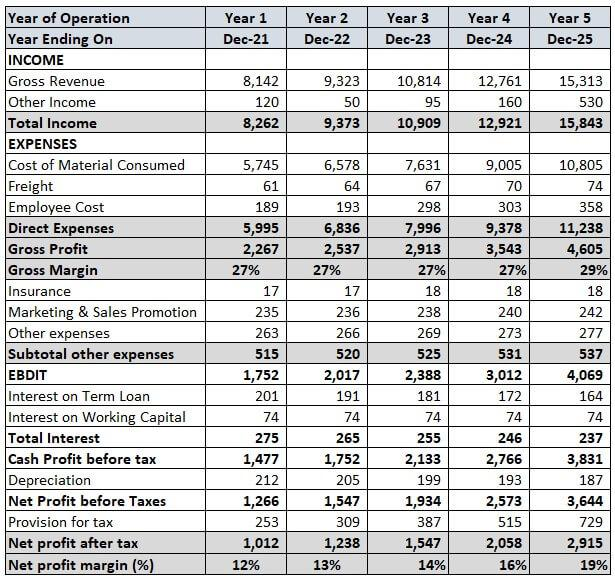

## Table of Contents

## What is the top line in financial statements?

The top line in financial statements refers to the first line of the income statement, which shows a company's total revenue or sales for a specific period. It is called the top line because it is literally at the top of the income statement and represents the starting point for calculating a company's financial performance.

The top line is important because it indicates how much money a company is bringing in from its core business activities before any expenses are deducted. Investors and analysts often look at the top line to gauge a company's growth and market demand for its products or services. A growing top line suggests that a company is successfully increasing its sales, which is a positive sign for future profitability.

## How is the top line different from the bottom line?

The top line and the bottom line are two important numbers on a company's income statement. The top line is the total amount of money a company makes from selling its products or services. It's called the top line because it's at the very top of the income statement. This number shows how well a company is doing at selling things before any costs are taken away.

The bottom line, on the other hand, is what's left after all the costs and expenses are subtracted from the top line. It's called the bottom line because it's at the very bottom of the income statement. This number tells you if the company made a profit or a loss. While the top line shows how much money came in, the bottom line shows how much money the company actually kept.

Both the top line and the bottom line are important for understanding a company's financial health. The top line gives you an idea of the company's sales growth, while the bottom line tells you if the company is making money overall. Investors look at both numbers to decide if a company is doing well.

## Why is the top line important for businesses?

The top line is important for businesses because it shows how much money they are making from selling their products or services. It's like the starting point of their financial story. When a business sees its top line growing, it means more people are buying what they're selling. This is a good sign because it shows that the business is doing well at attracting customers and making sales.

Knowing the top line helps businesses plan for the future. If they see that their top line is going up, they might decide to invest more money in making their products or services even better. On the other hand, if the top line is not growing, the business might need to think about new ways to attract customers or change what they're selling. So, the top line is a key number that helps businesses understand how they're doing and what they should do next.

## What are some common examples of top line items in financial statements?

The top line of a financial statement is usually called "Revenue" or "Sales." This is the total amount of money a company gets from selling its products or services. For example, if a company sells shoes, the top line would show how much money they made from selling all those shoes before they take away any costs like making the shoes or paying the workers.

Sometimes, the top line can be broken down into different parts. For example, a company might show "Product Revenue" and "Service Revenue" separately. This helps them see which part of their business is doing better. If a company sells both computers and repair services, they might have one top line item for the money made from selling computers and another for the money made from repair services. This way, they can see if people are buying more computers or using more repair services.

## How can a company increase its top line?

A company can increase its top line by finding more customers to buy what they're selling. This can be done by making their products or services better, so people want to buy them more. They can also try selling to new people by going into new places or using the internet to reach people far away. Another way is to tell more people about what they're selling through ads on TV, on the internet, or even on billboards. If more people know about the company's products or services, more people might buy them, which will make the top line go up.

Another way to increase the top line is by making customers buy more often or spend more money each time they buy. For example, a company could offer special deals or discounts to make people want to buy more. They could also add new things to what they sell, so customers have more choices and might spend more money. If a company can get its customers to buy more often or spend more each time, the top line will grow because more money is coming in from sales.

## What are the potential challenges in growing the top line?

Growing the top line can be tough because it means finding more people to buy what the company is selling. One big challenge is that there might not be enough new customers out there. If the market is already full of similar products or services, it can be hard to get people to switch to what the company is offering. Another problem is that competitors might be doing a better job at selling their stuff, so they take away customers that the company could have had. It's like trying to get a bigger slice of a pie that's not growing, and everyone else wants a bigger slice too.

Another challenge is that it can cost a lot of money to try to grow the top line. For example, spending more on ads to tell more people about the product or service can be expensive. If the company spends too much on these ads and doesn't get enough new customers, it might not be worth it. Also, if the company tries to sell in new places or to new kinds of customers, it might need to change its products or services, which can be tricky and costly. So, growing the top line is not just about selling more, but also about spending money wisely to make those sales happen.

## How does the top line affect a company's valuation?

The top line, which is the total money a company makes from selling its stuff, is really important when people are trying to figure out how much the company is worth. If the top line is growing, it means more people are buying the company's products or services. This is a good sign because it shows that the company is doing well at making sales. Investors like to see a growing top line because it suggests that the company might make more money in the future, which can make the company's value go up.

But the top line is just one part of the story. While it's great to see the top line going up, people also look at other things like how much it costs the company to make those sales. If the costs are too high, the company might not be making much profit even if the top line is growing. So, when figuring out a company's value, people look at the top line along with other numbers to get a full picture of how the company is doing.

## Can the top line be manipulated, and if so, how?

Yes, the top line can be manipulated, and companies might do this to make it look like they are doing better than they really are. One way to manipulate the top line is by recognizing revenue too early. For example, a company might count money from a sale before they actually deliver the product or service. This makes the top line look bigger for that period, even though the company hasn't really earned that money yet.

Another way to manipulate the top line is by using something called "channel stuffing." This is when a company sends a lot of products to stores or distributors at the end of a period, making it look like they sold more than they did. The stores might not actually sell all those products to customers right away, but the company can still count it as revenue. This can make the top line look good for a short time, but it's not a real increase in sales.

## How do analysts use the top line to assess a company's performance?

Analysts look at the top line to see how well a company is doing at selling its stuff. The top line is the total money a company makes from sales before any costs are taken away. When analysts see the top line growing, it tells them that more people are buying the company's products or services. This is a good sign because it shows that the company is getting better at making sales. If the top line stays the same or goes down, it might mean that the company is having trouble getting people to buy what they're selling.

But the top line is just one part of the puzzle. Analysts also look at other numbers to get a full picture of how the company is doing. They want to know if the company is making a profit, so they look at the bottom line too. The bottom line is what's left after all the costs are taken away from the top line. By comparing the top line and the bottom line, analysts can see if the company is growing its sales in a way that makes more money overall. This helps them decide if the company is a good investment.

## What role does the top line play in forecasting future financial health?

The top line, which is the total money a company makes from selling its products or services, helps people guess how the company will do in the future. When the top line keeps growing, it shows that more people are buying what the company is selling. This is a good sign because it means the company might keep making more sales in the future. If the top line stays the same or goes down, it might mean that fewer people want to buy what the company is selling, which could be a problem for the company's future.

But the top line is not the only thing people look at when trying to guess a company's future financial health. They also look at how much it costs the company to make those sales. If the costs are too high, the company might not make much profit even if the top line is growing. So, by looking at the top line along with other numbers like the bottom line, which is the money left after costs, people can get a better idea of whether the company will do well in the future.

## How does the top line relate to other key financial metrics like gross profit and EBITDA?

The top line, which is the total money a company makes from selling its stuff, is really important because it helps figure out other key financial numbers like gross profit and EBITDA. Gross profit is what's left after the company takes away the cost of making the products or services from the top line. So, if the top line is big but the costs to make the stuff are also big, the gross profit might not be that great. On the other hand, if the top line is growing and the costs to make the stuff are not growing as fast, the gross profit can go up, which is good for the company.

EBITDA stands for Earnings Before Interest, Taxes, Depreciation, and Amortization. It's another way to see how much money a company is making, but it starts with the top line too. After you take away the costs of making the stuff (which gives you the gross profit), you also take away other costs like running the business, but you don't take away interest, taxes, or the costs of things getting old (depreciation and amortization). So, a growing top line can help make EBITDA bigger if the other costs don't grow as fast. Both gross profit and EBITDA help people see how well a company is doing, and they both start with the top line.

## What are advanced strategies for optimizing the top line in various industries?

In different industries, companies can use advanced strategies to make their top line, or total sales, grow. One way is by using data to understand what customers want and then changing products or services to fit those needs better. For example, a tech company might use data from its apps to see what features people use the most and then focus on making those features even better. In retail, companies might use data to see what products are selling well and then put more of those products in stores or online. Another strategy is to use technology like artificial intelligence to predict what customers will want next, so the company can be ready with new products or services before anyone else.

Another advanced strategy is to create new ways to make money from existing customers. This could mean adding new services that go along with the main product, like how car companies might offer subscriptions for maintenance or software updates. In the entertainment industry, companies might offer different levels of service, like basic and premium, to get more money from people who want extra features. Companies can also partner with other businesses to offer combined products or services, which can attract more customers and increase sales. For example, a food delivery service might partner with a popular restaurant to offer special deals, making both companies more money.

In some industries, like healthcare or finance, companies can optimize the top line by making their services easier to use and more personal. For instance, a healthcare company might use apps or online tools to let people book appointments or get advice from doctors more easily, which can bring in more customers. In finance, companies might offer personalized investment advice or banking services through apps, making it easier for people to use their services and spend more money. By focusing on making things easier and more personal, companies in these industries can grow their top line and stay ahead of competitors.

## What are we exploring about financial metrics?

Financial metrics are fundamental tools for investors and analysts seeking to gauge a company’s performance, efficiency, and financial health beyond the basic figures found in its financial statements. These metrics offer valuable insights that direct financial figures might not immediately reveal, assisting in making informed investment and trading decisions. Key metrics include revenue, net income, and financial ratios such as the debt-to-equity ratio, among others.

**Revenues and Net Income:**

- **Revenue (Top Line):** This is the total amount of money generated by the sale of goods or services related to the company's primary operations. It serves as a measure of a company’s scale of operations, reflecting sales growth and market demand.

- **Net Income:** Also known as the bottom line, this represents the profit a company makes after deducting all expenses, including taxes and interest. It's a crucial indicator of a company’s profitability.

**Financial Ratios:**

Financial ratios simplify the complexity of financial data into accessible figures for easier analysis and comparison. Some critical ratios include:

- **Debt-to-Equity Ratio:** This measures a company’s financial leverage by comparing its total liabilities to its shareholder equity. It’s indicative of how much debt the company is using to finance its assets relative to the value represented in shareholders’ equity. A high debt-to-equity ratio can indicate higher risk, especially in volatile markets. The formula is:
$$
  \text{Debt-to-Equity Ratio} = \frac{\text{Total Liabilities}}{\text{Shareholders' Equity}}

$$

- **Current Ratio:** This liquidity ratio assesses a company's ability to pay short-term obligations with its current assets. A higher current ratio suggests that the company is well-positioned to cover its short-term liabilities. It is calculated as:
$$
  \text{Current Ratio} = \frac{\text{Current Assets}}{\text{Current Liabilities}}

$$

- **Profit Margins (Gross, Operating, and Net):** These ratios reflect a company's ability to convert sales into profits at various stages of its income statement:

  - **Gross Profit Margin:** Measures the relationship between revenue and cost of goods sold (COGS):
$$
    \text{Gross Profit Margin} = \frac{\text{Revenue - COGS}}{\text{Revenue}}

$$

  - **Operating Margin:** Indicates the proportion of revenue left after paying for variable costs of production like wages and raw materials:
$$
    \text{Operating Margin} = \frac{\text{Operating Income}}{\text{Revenue}}

$$

  - **Net Profit Margin:** Calculates how much of each dollar earned by the company translates to profit:
$$
    \text{Net Profit Margin} = \frac{\text{Net Income}}{\text{Revenue}}

$$

**Application in Trading and Investment:**

Financial metrics are not only about historical assessment but also play a pivotal role in algorithmic trading and strategy formulation. By analyzing these metrics, traders can develop algorithms that identify market patterns, optimize portfolio combinations, and execute trades based on precise financial insights. Tools like Python can automate data retrieval and analysis, streamlining the process for more informed, responsive trading decisions. 

For example, a Python script might pull real-time financial data and compute financial ratios to trigger buy/sell indicators based on pre-set thresholds:

```python
import yfinance as yf  # For more datasets, visit: https://paperswithbacktest.com/datasets

# Get data on a stock
data = yf.download('AAPL', start='2022-01-01', end='2023-01-01')

# Calculate financial metrics
net_income = ... # Placeholder for net income calculation
revenue = ... # Placeholder for revenue calculation

# Calculate net profit margin
net_profit_margin = net_income / revenue

# Decision logic
if net_profit_margin > 0.1:
    print("Positive signal for AAPL")
else:
    print("Caution: AAPL underperforming")
```

The deep understanding and application of these metrics enhance trading algorithms, allowing traders to leverage data effectively to manage risks while maximizing returns.

## What is the relationship between Algorithmic Trading and Financial Statements?

Algorithmic trading, often referred to as algo trading, automates trading activities through pre-programmed instructions. These algorithms utilize data sourced from financial statements to predict market movements and make trading decisions autonomously. Financial statements such as income statements, balance sheets, and cash flow statements provide crucial data points essential for formulating these algorithms.

To build efficient trading strategies, algo trading harnesses financial metrics like the Price-to-Earnings (P/E) ratio, Return on Equity (ROE), and more. These metrics deliver insights into a company’s valuation and profitability. For instance, the P/E ratio, calculated as the market price per share divided by the earnings per share, is a critical indicator of how the market values a company:

$$
\text{P/E Ratio} = \frac{\text{Market Price per Share}}{\text{Earnings per Share (EPS)}}
$$

ROE, which measures how effectively management is using a company’s assets to create profits, is another vital metric:

$$
\text{ROE} = \frac{\text{Net Income}}{\text{Shareholder's Equity}}
$$

By integrating these metrics, algo trading algorithms can screen for investment opportunities, identifying undervalued stocks with growth potential or overvalued stocks that may be poised for a decline.

Notably, the inclusion of financial statement analysis into algo trading algorithms enhances accuracy. By allowing for nuanced screening and real-time trading decisions, these algorithms can respond to market conditions adaptively. For example, a trading algorithm might monitor a company’s revenue trajectory from its income statement over multiple quarters. Should the revenue consistently exceed forecasts, the algorithm may flag this as a potential buy signal, factoring in other metrics such as improving profit margins.

Advanced algorithms also leverage insights from financial statements to optimize trading portfolios. Through [machine learning](/wiki/machine-learning) techniques, algorithms can detect patterns and predict financial risks, adjusting their strategies to market fluctuations effectively. This adaptive capability is critical in fast-moving markets, where timely decision-making can significantly impact profitability.

In practice, coding such an algorithm may look like this simple Python snippet, focusing on ROE:

```python
def calculate_roe(net_income, shareholder_equity):
    if shareholder_equity == 0:
        return float('inf')  # to handle division by zero
    return net_income / shareholder_equity

# Example usage
companies = [
    {'net_income': 500000, 'shareholder_equity': 2000000},
    {'net_income': 300000, 'shareholder_equity': 1000000}
]

for company in companies:
    roe = calculate_roe(company['net_income'], company['shareholder_equity'])
    print(f"ROE: {roe:.2f}")
```

In summary, algorithmic trading harnesses the depth of financial statement analysis to refine trading strategies, manage risks, and capitalize on market opportunities efficiently. By interpreting key financial metrics and adjusting to real-time data, algorithm-driven trading optimizes investment outcomes in dynamic financial environments.

## What are the key financial ratios for algo trading?

Financial ratios play a pivotal role in distilling the wealth of information contained in financial statements into digestible metrics that can effectively guide algorithmic trading strategies. By transforming financial data into quantifiable indicators, these ratios provide deeper insight into a company's financial health and operational efficiency, contributing to more precise trading decisions. Here, we analyze three critical financial ratios: the debt-to-equity ratio, net profit margin, and current ratio.

The **debt-to-equity ratio** is a measure of a company's financial leverage, calculated by dividing its total liabilities by its shareholder equity. It is given by:

$$
\text{Debt-to-Equity Ratio} = \frac{\text{Total Liabilities}}{\text{Shareholder Equity}}
$$

This ratio indicates the proportion of equity and debt being used to finance a company's assets. A higher ratio suggests greater leverage and financial risk, as the company is heavily financed by debt. In algorithmic trading, a predefined threshold on this ratio can automatically trigger an evaluation for potential investment, signaling risk levels that exceed tolerable limits.

The **net profit margin** reflects the percentage of revenue that turns into profit after all expenses are deducted and is determined by:

$$
\text{Net Profit Margin} = \left( \frac{\text{Net Income}}{\text{Total Revenue}} \right) \times 100
$$

This metric provides insight into a company's profitability by indicating how much profit is generated from sales. By integrating net profit margins into trading algorithms, traders can set benchmarks for profitability that must be met before a buy signal is generated. This ensures that algorithmic trades are geared towards companies demonstrating strong profitability metrics.

The **current ratio** evaluates a company's liquidity by measuring its ability to cover short-term obligations with short-term assets:

$$
\text{Current Ratio} = \frac{\text{Current Assets}}{\text{Current Liabilities}}
$$

A current ratio above 1 implies that the company has more current assets than liabilities, indicating a good liquidity position. Traders often embed this ratio into algorithms to identify companies with solid short-term financial health, flagging those meeting specific liquidity criteria for potential investment. 

By systematically embedding these financial ratios into trading strategies, algorithms can efficiently screen stocks, providing clear signals for executing buy or sell decisions based on predefined criteria. This use of precise financial data empowers traders to enhance trading efficiency and optimize outcomes, achieving improved investment performance through informed decision-making.

## References & Further Reading

Further reading materials include articles and [books](/wiki/algo-trading-books) on financial statement analysis, algorithmic trading, and advanced financial metrics. Comprehensive resources provide foundational and advanced knowledge for those keen on analyzing and optimizing trading strategies using financial data. Notable platforms such as Investopedia offer detailed articles and tutorials that cover a wide range of financial topics, from basic concepts to intricate trading strategies. Financial textbooks, such as "Financial Statement Analysis and Security Valuation" by Stephen Penman or “Options, Futures, and Other Derivatives” by John C. Hull, provide in-depth insights into financial analysis and derivatives markets.

Online courses from platforms like Coursera, edX, and Khan Academy offer structured learning paths on algorithmic trading and financial metrics. These courses often include coding exercises in Python, enabling learners to apply theoretical knowledge practically. For example, a Python script implementing a simple moving average crossover strategy might look like this:

```python
import pandas as pd

# Load historical stock data
data = pd.read_csv('stock_data.csv')

# Calculate moving averages
data['SMA_50'] = data['Close'].rolling(window=50).mean()
data['SMA_200'] = data['Close'].rolling(window=200).mean()

# Generate buy/sell signals
data['Signal'] = 0
data['Signal'][50:] = np.where(data['SMA_50'][50:] > data['SMA_200'][50:], 1, 0)
data['Position'] = data['Signal'].diff()

# Display the signals
print(data[['Date', 'Close', 'SMA_50', 'SMA_200', 'Signal', 'Position']])
```

Stay informed with financial news and market analyses provided by established outlets like Bloomberg, Reuters, or The Wall Street Journal. These sources deliver timely updates on market trends, economic policies, and other factors affecting financial markets.

Finally, cultivating an inquisitive approach towards learning is crucial for thriving in fast-paced markets. Engaging actively with forums such as Stack Exchange or Reddit’s trading communities can offer anecdotal insights and practical tips from seasoned traders, enhancing one's ability to respond to evolving market conditions effectively.

