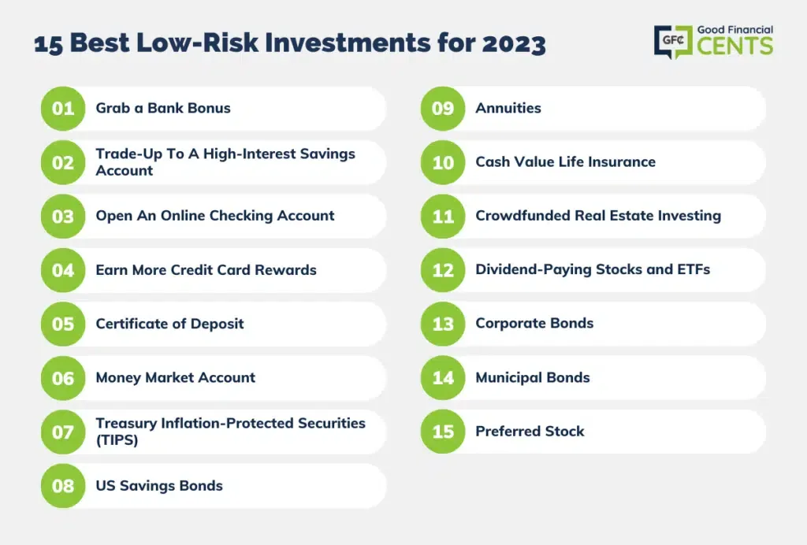

## Table of Contents

## What are low-risk investments?

Low-risk investments are types of investments that have a lower chance of losing money. They are good for people who don't want to take big risks with their money. Some common low-risk investments include savings accounts, certificates of deposit (CDs), and government bonds. These investments usually give you a small but steady return on your money over time.

Even though low-risk investments are safer, they usually don't grow your money as fast as riskier investments like stocks. This means that if you want your money to grow a lot, you might need to wait longer or invest more money. But, low-risk investments are a good choice if you want to keep your money safe and still earn a little bit more than if you just kept it at home.

## Why should someone consider low-risk investments in 2024?

In 2024, someone should consider low-risk investments if they want to keep their money safe and still earn a little bit more. The world can be unpredictable, with things like economic changes or unexpected events happening. Low-risk investments like savings accounts, CDs, and government bonds can help protect your money from these ups and downs. They might not make your money grow a lot, but they are less likely to lose value, which can give you peace of mind.

Another reason to think about low-risk investments in 2024 is if you are saving for something important in the near future, like buying a house or paying for school. You don't want to risk losing the money you need for these big goals. Low-risk investments can help you save steadily and know that your money will be there when you need it. Even though the returns might be small, they are more predictable and reliable, which is good when you have specific plans for your money.

## What are the differences between low-risk and high-risk investments?

Low-risk investments are like safe choices for your money. They don't usually make you a lot of money fast, but they are less likely to lose value. Things like savings accounts, certificates of deposit (CDs), and government bonds are low-risk. They give you a small but steady return over time. This makes them good if you want to keep your money safe and don't mind waiting longer to see it grow a little.

High-risk investments are like taking a bigger chance with your money. They can make you a lot of money quickly, but they can also lose a lot of value. Stocks, cryptocurrencies, and some types of mutual funds are high-risk. They can go up and down a lot, so you might make big profits or big losses. High-risk investments are good if you're okay with the ups and downs and want the chance to grow your money faster.

Choosing between low-risk and high-risk investments depends on what you want and how much risk you can handle. If you want to keep your money safe and are saving for something important soon, low-risk might be better. If you're okay with big ups and downs and want to grow your money fast, high-risk could be the way to go. It's all about finding the right balance for your goals and comfort level.

## Can you list some examples of low-risk investments suitable for beginners?

For beginners, one good low-risk investment is a savings account. You can open one at a bank or a credit union. It's very safe because your money is protected by the government up to a certain amount. You can put money in and take it out whenever you want. Savings accounts usually don't give you a lot of money back, but they are easy to use and a good place to start saving.

Another low-risk investment for beginners is a certificate of deposit, or CD. With a CD, you put your money in a bank for a certain time, like six months or a year. In return, the bank gives you a little more money when the time is up. CDs are safe because your money is also protected by the government. The only thing is, you can't take your money out early without paying a fee, so you need to be sure you won't need it until the time is up.

Government bonds are also a good choice for beginners. When you buy a government bond, you're lending money to the government. They promise to pay you back with a little extra after a certain time. Government bonds are very safe because the government is less likely to not pay you back. They are a good way to keep your money safe while still earning a little bit more over time.

## How do savings accounts and certificates of deposit (CDs) work as low-risk investments?

Savings accounts are a simple and safe way to save money. When you put your money into a savings account at a bank or credit union, you earn a little bit of interest over time. This means the bank pays you a small amount for keeping your money with them. You can take your money out whenever you need it, which makes savings accounts very flexible. The government also protects your money up to a certain amount, so it's very safe. Savings accounts are great for beginners because they are easy to use and help you save money without taking big risks.

Certificates of deposit, or CDs, are another safe way to invest your money. When you buy a CD, you agree to leave your money in the bank for a set time, like six months or a year. In return, the bank gives you a bit more money when the time is up. The longer you leave your money in, the more you usually get back. CDs are safe because your money is also protected by the government. The only thing to remember is that if you take your money out early, you might have to pay a fee. CDs are good for beginners who want to save money and are okay with not touching it for a while.

## What role do government bonds play in a low-risk investment portfolio?

Government bonds are a safe choice for a low-risk investment portfolio. When you buy a government bond, you are lending money to the government. They promise to pay you back with a little extra interest after a certain time. Because it's the government, it's very unlikely they won't pay you back, which makes government bonds very safe. They are a good way to keep your money safe while still earning a bit more over time.

Including government bonds in your portfolio can help balance out riskier investments. If you have some money in stocks or other high-risk investments, government bonds can protect your money if those other investments go down. They give you steady, predictable returns, which can help you feel more secure about your overall savings. Government bonds are especially useful if you are saving for something important in the future and want to make sure your money will be there when you need it.

## How can Treasury Inflation-Protected Securities (TIPS) be beneficial in 2024?

Treasury Inflation-Protected Securities, or TIPS, can be a smart choice for 2024 if you're worried about inflation. Inflation means prices go up, and your money might not buy as much. TIPS help protect your money from this. They work by adjusting the value of the bond based on inflation rates. So, if prices go up, the value of your TIPS goes up too. This means you won't lose buying power even if things get more expensive.

In 2024, having TIPS in your investment mix can give you peace of mind. They are backed by the U.S. government, which makes them very safe. While they might not make you rich quickly, they help keep your money's value steady over time. If you're saving for the future and want to make sure inflation doesn't eat away at your savings, TIPS can be a good part of your low-risk investment strategy.

## What are money market funds and how safe are they for investment?

Money market funds are a type of investment where you put your money into a fund that invests in very safe, short-term things like government securities and high-quality commercial paper. These funds aim to keep your money safe and give you a little bit of interest. They are easy to get into and out of, so you can take your money out whenever you need it. Money market funds are often used by people who want to keep their money safe but still earn a little more than they would in a regular savings account.

Money market funds are considered pretty safe because they invest in things that are less likely to lose value. They are not as safe as government-backed options like savings accounts or CDs, but they are still a low-risk choice. The risk is small, but there's a tiny chance the value could go down if the things the fund invests in don't do well. Overall, money market funds are a good option if you want to keep your money safe while earning a bit more, but they are not completely risk-free.

## How do municipal bonds offer tax advantages and safety for investors?

Municipal bonds are loans that you give to local governments, like cities or states. They use this money to build things like schools, roads, or hospitals. When you buy a municipal bond, the government promises to pay you back with a little extra interest. One big advantage of municipal bonds is that the interest you earn is often free from federal taxes, and sometimes from state and local taxes too. This means you get to keep more of the money you earn, which can be a big help.

Municipal bonds are also considered safe investments. They are less risky than stocks because the chance of a local government not paying you back is small. While there is a tiny risk if the government runs into money problems, most municipal bonds are very reliable. This makes them a good choice for people who want to keep their money safe and still earn some interest without worrying about taxes taking a big chunk of it.

## What strategies should be used to diversify a low-risk investment portfolio?

To diversify a low-risk investment portfolio, you should spread your money across different types of safe investments. This can help protect your money if one type of investment doesn't do well. For example, you could put some money in a savings account, some in certificates of deposit (CDs), and some in government bonds. Each of these investments works a little differently and has its own level of safety and return. By spreading your money out, you lower the risk that all your money could be affected by problems in just one type of investment.

Another strategy is to include different kinds of bonds in your portfolio. You could invest in Treasury Inflation-Protected Securities (TIPS) to protect against inflation, municipal bonds for tax advantages, and regular government bonds for steady returns. Mixing these different bonds can help you balance safety with a bit of growth. It's also smart to think about how long you want to keep your money in each investment. Short-term CDs and money market funds can be good for money you might need soon, while longer-term bonds can help you save for the future.

## How can an investor assess the risk and return of low-risk investment options?

To assess the risk and return of low-risk investment options, an investor should first look at the type of investment. For example, savings accounts and CDs are very safe because they are protected by the government. Government bonds are also safe, but they can change a bit with interest rates. Money market funds are a bit riskier than these, but still pretty safe. By understanding what each investment is, you can get a sense of how safe your money will be.

Next, look at the return or interest you can earn. Savings accounts and CDs usually give you a small, steady return. Government bonds might give you a bit more, but it depends on the interest rate at the time. TIPS can help protect against inflation, so their return might go up if prices go up. Municipal bonds can be good because the interest is often tax-free, which means you keep more of what you earn. By comparing the returns, you can see which low-risk investment might help your money grow a little more, even if it's not a lot.

## What advanced techniques can experts use to optimize returns while maintaining low risk in 2024?

In 2024, experts can use a technique called laddering to optimize returns while keeping risk low. Laddering means spreading out your investments over different times. For example, you could buy CDs that mature at different times, like one in six months, another in a year, and another in two years. This way, you can take advantage of different interest rates and have money coming back to you at different times. It helps you keep your money safe and still earn a bit more because you can reinvest at new rates when each CD matures.

Another technique is to use a mix of different low-risk investments to balance safety and returns. Experts might put some money in TIPS to protect against inflation, some in municipal bonds for tax advantages, and some in regular government bonds for steady returns. By carefully choosing how much to put in each type of investment, they can make sure their money is safe but still growing a little. This mix can help them get the best possible return without taking on too much risk.

## What is the Importance of Low-Risk Investments in 2024?

In 2024, economic uncertainties and global financial fluctuations necessitate a focus on low-risk investments to maintain financial stability. Such investments act as a buffer against the volatility often present in more aggressive investment strategies. Low-risk options are crucial as they help investors secure a predictable return, which can be particularly beneficial during turbulent economic periods.

Treasury securities, certificates of deposit (CDs), and high-yield savings accounts are traditionally regarded as some of the most reliable low-risk investments. U.S. Treasurys, particularly, are backed by the full faith and credit of the U.S. government, making them a cornerstone of safety in any conservative portfolio. These government-issued securities include bills, notes, and bonds that can cater to different investment horizons and financial goals. For example, Treasury bills are short-term investments that mature in one year or less, offering lower yields but enhanced liquidity and minimal risk.

Certificates of deposit offer a higher [interest rate](/wiki/interest-rate-trading-strategies) compared to regular savings accounts, in return for the account holder agreeing to leave a lump sum deposit untouched for a fixed term ranging from several months to several years. This commitment ensures better returns than a typical savings account, while still maintaining Federal Deposit Insurance Corporation (FDIC) insurance protection up to $250,000, thus safeguarding the principal investment.

High-yield savings accounts provide the advantage of [liquidity](/wiki/liquidity-risk-premium) paired with reasonable rates of return, especially as digital banks compete to offer the most attractive interest rates. The convenience of accessing funds while [earning](/wiki/earning-announcement) interest higher than traditional savings accounts makes these platforms an attractive option.

Understanding the risk-reward trade-off is paramount to intelligent financial planning. This concept illustrates the balance between the desire for the lowest possible risk and the highest potential return. Mathematically, the expected return of an investment can be represented by the formula:

$$
\text{Expected Return} = \sum (P_i \times R_i)
$$

where $P_i$ is the probability of return $R_i$. In low-risk investments, the variance (a measure of risk) is expected to be low, reflecting a more predictable and stable expected outcome.

Strategic allocation towards low-risk investments in a broader portfolio reduces the overall portfolio [volatility](/wiki/volatility-trading-strategies), acting as a shield against economic downturns and unexpected market behaviors. This forms the bedrock of a prudent investor’s strategy, highlighting the importance of low-risk investments in 2024.

## How can one build a diversified portfolio using low-risk assets and algo trading?

Creating a diversified portfolio that effectively balances low-risk assets with [algorithmic trading](/wiki/algorithmic-trading) strategies is an essential approach to building resilience and achieving sustainable financial growth. In this context, diversification involves organizing assets in a manner that not only minimizes risks but also has the potential to enhance returns. A prudent diversification strategy encompasses asset allocation and robust risk management frameworks.

### Asset Allocation

Asset allocation is the process of distributing investments across various asset categories, such as stocks, bonds, and cash equivalents, with the aim of optimizing the risk-reward balance. For a low-risk portfolio, a significant proportion might be invested in stable assets like high-yield savings accounts, Treasury securities, or AAA bonds. 

One method to determine an optimal allocation is the mean-variance optimization, an approach that evaluates potential portfolio compositions to maximize return for a given risk level. Mathematically, this is expressed as:

$$
\min_{\omega} \frac{1}{2} \omega^T \Sigma \omega - \lambda \mu^T \omega
$$

Here, $\omega$ represents the vector of weights for different assets, $\Sigma$ is the covariance matrix of asset returns, $\mu$ is the expected return vector, and $\lambda$ is a scalar that represents the investor's risk aversion.

### Risk Management

Risk management is crucial in maintaining a portfolio's health and ensuring long-term stability. This includes regular portfolio rebalancing, setting appropriate stop-loss limits, and maintaining sufficient liquidity to meet potential obligations. The goal is to mitigate uncontrollable risks and align the portfolio with the investor's risk tolerance and financial goals.

### Combining Traditional and Technological Solutions

Combining traditional investment vehicles with technological solutions like algorithmic trading can provide significant advantages. Algorithmic trading utilizes computer programs to execute trades based on predetermined criteria, offering precision and speed. This can be particularly beneficial in reducing transaction costs and exploiting market inefficiencies.

For instance, an algorithm might capture [arbitrage](/wiki/arbitrage) opportunities between low-risk assets such as municipal bonds versus AAA corporate bonds, adjusting for yield and risk differentials. A simple Python implementation might look like:

```python
def arbitrage_opportunity(bond1_yield, bond2_yield, risk1, risk2):
    if bond1_yield - risk1 > bond2_yield - risk2:
        return "Long bond1, Short bond2"
    elif bond2_yield - risk2 > bond1_yield - risk1:
        return "Long bond2, Short bond1"
    else:
        return "No arbitrage opportunity"
```

The fusion of traditional assets with algorithmic mechanisms can thus result in a portfolio that is both enduring and adaptive. Importantly, this approach requires continuous monitoring and fine-tuning of algorithms to adapt to evolving market conditions and ensure that the portfolio remains aligned with the initial investment strategy.

## References & Further Reading

[1]: ["Advances in Financial Machine Learning"](https://www.amazon.com/Advances-Financial-Machine-Learning-Marcos/dp/1119482089) by Marcos Lopez de Prado

[2]: ["Machine Learning for Algorithmic Trading"](https://github.com/PacktPublishing/Machine-Learning-for-Algorithmic-Trading-Second-Edition) by Stefan Jansen

[3]: ["Quantitative Trading: How to Build Your Own Algorithmic Trading Business"](https://www.amazon.com/Quantitative-Trading-Build-Algorithmic-Business/dp/1119800064) by Ernest P. Chan

[4]: ["Evidence-Based Technical Analysis: Applying the Scientific Method and Statistical Inference to Trading Signals"](https://www.amazon.com/Evidence-Based-Technical-Analysis-Scientific-Statistical/dp/0470008741) by David Aronson

[5]: Treasury Securities and the U.S. Government's Role in Safe Investments, [U.S. Department of the Treasury](https://knowledge.wharton.upenn.edu/article/the-specter-of-default-how-safe-are-u-s-treasuries/)

[6]: ["The Intelligent Investor: The Definitive Book on Value Investing"](https://www.amazon.com/Intelligent-Investor-Definitive-Investing-Essentials/dp/0060555661) by Benjamin Graham

[7]: Bergstra, J., Bardenet, R., Bengio, Y., & Kégl, B. (2011). ["Algorithms for Hyper-Parameter Optimization."](https://dl.acm.org/doi/10.5555/2986459.2986743) Advances in Neural Information Processing Systems 24.