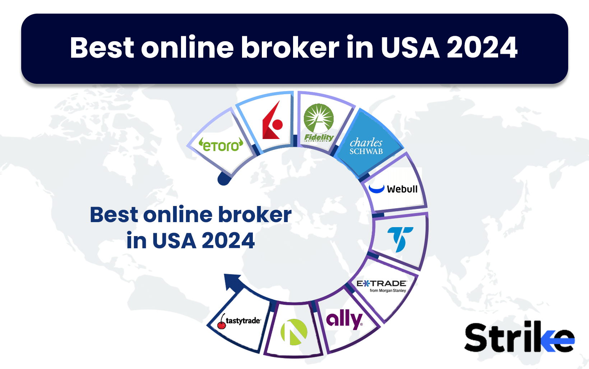

In recent years, online trading has witnessed a significant surge in popularity, becoming increasingly accessible to individuals with varying degrees of investment experience. The proliferation of digital platforms has democratized trading, allowing beginners to participate in financial markets with relative ease. These platforms equip new traders with tools, resources, and information that were once reserved for professional investors, thus lowering entry barriers and fostering an environment conducive to learning and growth.

Understanding brokerage platforms is crucial for beginners, as selecting the right online broker can greatly influence trading success. These platforms act as intermediaries, facilitating the buying and selling of financial securities. They offer various features, including market analysis tools, real-time data, and educational content, making them essential for informed decision-making. Beginners are advised to evaluate factors such as fees, ease of use, customer support, and security measures when choosing a brokerage service.



Algorithmic trading is revolutionizing traditional investment strategies by utilizing computer algorithms to execute trades based on predetermined criteria. This form of trading offers several advantages, including speed, precision, and the ability to process vast amounts of data, which can lead to more informed trading decisions. By reducing the emotional component of trading, algorithmic strategies can enhance efficiency and improve outcomes for investors, including those at the novice level.

The purpose of this article is to provide beginners with a comprehensive guide to selecting online brokers and explore the opportunities algorithmic trading presents for 2024. This introduction establishes the foundation for a nuanced understanding of how newcomers can effectively navigate online brokerage platforms and leverage algorithmic trading to their advantage. Key topics covered in subsequent sections include an overview of online brokers, a review of top brokers for beginners, an introduction to algorithmic trading, and best practices for integrating these strategies into investment approaches. Through this exploration, beginners will be equipped with the knowledge and tools necessary to embark on their trading journey with confidence and strategic foresight.

## Table of Contents

## Understanding Online Brokers: A Beginner's Guide

An online broker is a digital platform that facilitates the buying and selling of financial securities, such as stocks, bonds, and mutual funds, on behalf of investors. By operating online, these brokers eliminate the need for a physical presence, making investing accessible to a wider audience. They offer a range of tools and resources to help individuals make informed investment decisions.

Key features to look for in an online trading platform include:

1. **User Interface and Functionality**: A user-friendly interface is crucial, particularly for beginners. Platforms should have intuitive designs that allow users to navigate with ease. Functionality such as real-time data analytics, performance tracking, and research tools enhances the investment experience.

2. **Commission Structures and Fees**: Understanding a broker’s fee structure is vital for efficient investment as these fees can impact overall profitability. Online brokers typically charge commissions per trade, management fees, or may operate on a zero-commission model. Additionally, investors should be aware of potential hidden costs, such as inactivity fees, withdrawal charges, and subscription fees for premium services.

3. **Customer Support**: Quality customer support is essential, providing assistance with technical issues or account inquiries. Effective brokers offer multiple support channels, such as chat, email, and phone, with availability aligning with global market hours to accommodate all traders' needs.

4. **Security Measures and Regulations**: Ensuring the security of personal and financial information is paramount when selecting a broker. Platforms should be compliant with reputable regulatory bodies, such as the U.S. Securities and Exchange Commission (SEC) or the Financial Conduct Authority (FCA) in the UK. Brokers should implement robust security measures, including two-factor authentication, encryption, and regular audits to safeguard clients' data and funds.

Regulatory considerations also play a critical role in defining an online broker's credibility. In addition to adhering to regulations, brokers must also be transparent in their operations, providing clear information regarding their license status and legal compliance.

By evaluating these aspects, beginners can choose an online broker that not only meets their financial needs but also provides a secure and supportive environment for their investment journey.

## Top Online Brokers for Beginners in 2024

When selecting an online broker, beginners must consider several critical factors to ensure a successful trading experience. These criteria include the platform's usability, fee structure, customer support, educational resources, and the availability of tools for novice traders. Such considerations help in identifying brokers that cater specifically to those new to trading and investing.

### Criteria for Selecting the Best Brokers for Beginners

#### 1. Usability and Interface
A user-friendly interface is essential for beginners. A well-designed platform simplifies the learning curve by allowing easy navigation and accessibility to various tools and features.

#### 2. Fee Structure
Understanding the commission structure and any associated fees is crucial. Some brokers offer commission-free trades or low fees, which are advantageous for beginners with limited capital. Hidden costs should also be scrutinized to avoid unexpected expenses.

#### 3. Customer Support
Reliable and responsive customer support is invaluable for novice traders. Look for platforms that offer 24/7 assistance and multiple channels of communication, such as live chat, phone support, and email.

#### 4. Educational Resources
Quality educational resources, including tutorials, webinars, and articles, are important for beginners to build their knowledge and confidence in trading.

#### 5. Security Measures
Robust security protocols and regulatory compliance are vital to protect traders' personal information and investments. Ensure the broker is registered with relevant financial authorities.

### Review of Popular Online Brokers for Novice Traders

Several brokers stand out in 2024 due to their beginner-friendly approach and cutting-edge features. Here are some highly recommended options:

#### 1. **TD Ameritrade**
- **Pros**: Offers an extensive range of educational materials, a user-friendly platform (thinkorswim), and excellent customer service.
- **Cons**: Higher than average fees for certain products, such as mutual funds.
- **Testimonials**: Many beginners appreciate TD Ameritrade for its comprehensive learning resources that aid in developing trading skills.

#### 2. **E*TRADE**
- **Pros**: Well-structured platform with a rich selection of tools and educational content. Known for low fees on its commission-free options.
- **Cons**: Advanced features may be overwhelming for absolute beginners initially.
- **Testimonials**: Users commend E*TRADE for the intuitive design and supportive community forums that help new traders overcome initial challenges.

#### 3. **Robinhood**
- **Pros**: Offers commission-free trades on stocks, options, and cryptocurrencies, appealing to beginners with limited budgets.
- **Cons**: Lacks advanced financial tools and research capabilities found on other platforms.
- **Testimonials**: New traders appreciate the simplicity and modern interface, though some express the need for more advanced resources as they gain experience.

### Updates and Trends in Online Brokerage Services for 2024

In 2024, online brokers are increasingly focusing on integrating advanced technologies such as [artificial intelligence](/wiki/ai-artificial-intelligence) and [machine learning](/wiki/machine-learning) to personalize the trading experience. Sustainable investing options and enhanced mobile trading capabilities are also trending. Brokers are further lowering fees and expanding their educational content to attract and retain new traders. Another notable trend is the inclusion of social trading features, enabling beginners to follow and learn from experienced traders within the platform.

In conclusion, selecting the right online broker involves a careful evaluation of usability, cost, support, and educational offerings. Brokers such as TD Ameritrade, E*TRADE, and Robinhood continue to offer valuable services for beginners, each with unique advantages and potential drawbacks. By staying informed about the latest trends and updates, novice traders can make informed decisions and set a strong foundation for their trading journey.

 to Algo Trading for Beginners

Algorithmic trading, often referred to as algo trading, utilizes computer algorithms to execute trades at speeds and frequencies that are impossible for human traders. This approach leverages mathematical models and automated systems to make trading decisions, contrasting with traditional trading where decisions are typically based on [fundamental analysis](/wiki/fundamental-analysis) and human intuition. Algorithmic trading allows for the processing of large volumes of data at high speed, which can contribute to more precise and efficient trading activities.

The key advantage of this method lies in its ability to evaluate multiple markets simultaneously and execute trades at optimal conditions. However, [algorithmic trading](/wiki/algorithmic-trading) is not without its risks. The primary dangers include technical failures, such as bugs in the algorithms, and the potential for unintended market impacts due to erroneous trades. Additionally, as many market participants use similar strategies, there's an increased risk of crowded trades leading to reduced profitability.

For beginners, starting with simple algorithmic trading strategies can be a practical approach. One such strategy is the "Moving Average Crossover". In essence, this strategy involves the use of two moving averages—a short-term and a long-term. When the short-term moving average crosses above the long-term moving average, a buy signal is generated. Conversely, when the short-term moving average crosses below the long-term moving average, a sell signal is triggered. This simple approach helps beginners apply algorithmic concepts without needing complex computational models. 

Here’s a basic Python example of implementing a Moving Average Crossover strategy:

```python
import numpy as np
import pandas as pd

def moving_average_crossover(data, short_window, long_window):
    signals = pd.DataFrame(index=data.index)
    signals['signal'] = 0.0

    # Create short simple moving average column
    signals['short_mavg'] = data.rolling(window=short_window, min_periods=1, center=False).mean()

    # Create long simple moving average column
    signals['long_mavg'] = data.rolling(window=long_window, min_periods=1, center=False).mean()

    # Create signals
    signals['signal'][short_window:] = np.where(signals['short_mavg'][short_window:] 
                                                 > signals['long_mavg'][short_window:], 1.0, 0.0)   

    # Generate trading orders
    signals['positions'] = signals['signal'].diff()

    return signals

# Example usage
# Assuming `prices` is a DataFrame with your stock data
signals = moving_average_crossover(prices['Close'], short_window=40, long_window=100)
```

To begin algorithmic trading, beginners should first select an online broker that supports such functionality. Many leading brokerage platforms offer APIs and integrated tools that allow users to implement and test trading algorithms. [Interactive Brokers](/wiki/interactive-brokers-api) and TD Ameritrade are examples of brokers with robust API support that permit algorithmic trading, though suitability should be evaluated by each trader based on their specific needs and geographical availability.

Resources and educational tools are vital for those looking to delve deeper into algorithmic trading. Websites, online courses, and forums provide a wealth of information. Platforms such as Coursera, Khan Academy, and QuantInsti offer courses specifically focused on algorithmic and [quantitative trading](/wiki/quantitative-trading), and online forums like those found on Reddit or Stack Exchange can provide community support and troubleshooting help.

In conclusion, while algorithmic trading holds significant promise for enhancing trading strategies, it requires diligence, continual learning, and the climbing of a steep but manageable learning curve, particularly for beginners.

## Integrating Algo Trading with Online Brokerage Platforms

Integrating algorithmic trading with online brokerage platforms is increasingly accessible due to advancements in technology and the proliferation of platforms that support such capabilities. For beginners eager to explore this facet of trading, several brokerages offer comprehensive features tailored for algorithmic trading.

### Which Online Brokerage Platforms Support Algorithmic Trading?

Several brokerage platforms support algorithmic trading, known for their user-friendly interfaces and robust API support. Notable examples include:

1. **Interactive Brokers**: Known for its advanced trading tools and API support, it offers a flexible interface for algorithmic trading.

2. **TD Ameritrade**: This platform features the thinkorswim trading suite, supporting custom script and strategy development.

3. **E*TRADE**: Provides API support suitable for beginners entering the algorithmic trading space.

4. **Robinhood**: While traditionally not for advanced traders, its API allows for basic algorithmic execution strategies.

### Step-by-step Guide on Setting Up Algorithmic Trading with Your Broker

1. **Open an Account**: Choose a broker that supports algorithmic trading and open an account. Ensure the broker provides API access.

2. **API Documentation**: Familiarize yourself with the broker's API documentation. This is critical, as it guides how to interact with the market programmatically.

3. **Development Environment**: Set up a development environment. Python is recommended due to its extensive libraries (such as `pandas`, `NumPy`, and `TA-Lib`) that aid in data analysis and strategy development.

4. **Strategy Implementation**: Write your algorithm. For instance, a simple moving average crossover strategy might look like this in Python:

   ```python
   import pandas as pd

   # Fetch historical data - typically obtained through your broker's API
   data = pd.DataFrame()

   # Calculate moving averages
   data['SMA_50'] = data['Close'].rolling(window=50).mean()
   data['SMA_200'] = data['Close'].rolling(window=200).mean()

   # Trading signals
   data['Signal'] = 0
   data['Signal'][50:] = np.where(data['SMA_50'][50:] > data['SMA_200'][50:], 1, 0)
   ```

5. **Backtesting**: Use historical data to test your strategy. Adjust parameters as necessary to optimize performance.

6. **Execution**: With the strategy and risk parameters set, execute your strategy in a live environment.

### Recommended Automated Trading Software and APIs

- **QuantConnect**: Provides a cloud-based algorithmic trading platform with a strong community and extensive backtesting capabilities.

- **MetaTrader 5**: Offers advanced charting and trading options for algorithmic strategies. 

- **Alpaca**: Offers commission-free trading with robust API support, suitable for beginners.

### Case Studies of Successful Algo Trading by Beginners

Many beginners have successfully transitioned to algorithmic trading. One notable instance is a beginner who developed a simple [momentum](/wiki/momentum)-based strategy on QuantConnect, yielding a consistent 2% monthly return on a simulated account. The key to their success was thorough [backtesting](/wiki/backtesting) and adapting strategies based on market behaviors.

### Tips for Troubleshooting Common Issues in Algorithmic Trading

1. **Data Integrity**: Ensure data is clean and correctly formatted. Inconsistencies can lead to erroneous trading signals.

2. **Latency and Speed**: Recognize the importance of latency. Faster execution can make the difference between profit and loss.

3. **Risk Management**: Implement stop-loss orders and other risk management techniques to mitigate potential losses.

4. **Continuous Monitoring**: Algorithms should be monitored regularly to ensure they operate as expected and adapt to changing market conditions.

5. **Logging and Diagnostics**: Maintain detailed logs of trades and system performance to facilitate troubleshooting and refinement of strategies.

By leveraging these strategies and tools, beginners can effectively merge algorithmic strategies with their chosen online brokerage platforms, enhancing their trading efficiency and potential profitability in the evolving trading landscape of 2024.

## Best Practices for Beginners in Online and Algo Trading

When embarking on the journey of online and algorithmic trading, beginners should be aware of certain best practices that can help navigate the complexities of the trading landscape.

### Common Pitfalls to Avoid When Starting Online Trading

New traders often encounter challenges due to a lack of experience and understanding of market dynamics. One major pitfall is the tendency to chase losses, often referred to as "revenge trading." This is when traders, attempting to quickly recover losses, engage in impulsive trading that can lead to further financial setbacks. Over-leveraging trades is another common mistake. Leverage can amplify gains, but it can also magnify losses, potentially wiping out one's trading account. Beginners should also avoid overtrading, which is frequent buying and selling that can result in high transaction costs and reduced overall profitability.

### Risk Management Strategies for Novice Traders

Effective risk management is crucial in trading. One fundamental strategy is setting stop-loss orders, which automatically sell an asset when it reaches a certain price level, limiting potential losses. Beginners should also practice proper position sizing to ensure that no single trade has an outsized impact on their portfolio. A common rule is to limit risk on any single trade to 1-2% of the total trading capital. Diversification across different asset classes and markets can also mitigate risks, as it reduces dependency on the performance of any single investment.

### The Importance of Setting Realistic Goals and Expectations

Setting achievable goals and maintaining realistic expectations are key components of a successful trading journey. Beginners should focus on learning and improving their trading skills rather than expecting immediate profits. It's important to understand that achieving consistent profitability often takes time and experience. Keeping a trading journal to document trading decisions, outcomes, and emotional responses can aid in personal evaluation and goal setting.

### Continuing Education: Courses, Webinars, and Resources for Beginner Traders

Continuous learning is essential for navigating the ever-evolving markets. Beginners can benefit from a variety of educational resources, such as online courses, webinars, and [books](/wiki/algo-trading-books) on trading strategies and market analysis. Platforms like Coursera, Udemy, and Investopedia offer courses tailored to different levels of trading expertise. Additionally, staying updated with the latest market news and trends through financial news websites and publications like Bloomberg and The Financial Times is advisable.

### Building a Community: Finding Support and Networking Within Online Trading Groups

Engaging with a community of traders can provide valuable insights and support. Online forums, social media groups, and local trading meetups offer opportunities for networking, sharing experiences, and learning from more experienced traders. Platforms such as Reddit's r/stocks and Discord trading servers can connect beginners with mentors and peer traders, fostering a collaborative learning environment. Building a network can also enhance trading discipline and motivation.

By adhering to these best practices, beginners can improve their chances of success in online and algorithmic trading. Patience, discipline, and a commitment to continuous learning are essential traits for any aspiring trader.

## Conclusion

Selecting the right online broker is paramount for beginners embarking on their trading journey. An informed choice can significantly influence your trading experience and outcomes. It ensures access to essential tools, minimizes costs, and enhances security. A suitable broker will provide user-friendly platforms and reliable customer support, essential for navigating early challenges. Additionally, understanding algorithms' role in modern trading opens new avenues for beginners, facilitating a broader exploration of market strategies. Algorithmic trading offers potential for systematic, unemotional trading, but it's vital to recognize the associated risks and acquire proper knowledge before diving in.

Looking towards 2024, the online trading industry is anticipated to embrace more technological advancements, particularly in artificial intelligence and machine learning. These technologies aim to refine algorithmic strategies, improve data analysis, and offer personalized trading experiences. Furthermore, we expect enhanced regulations focusing on security and transparency to protect investors, promoting a safer trading environment.

Now is an opportune time to start trading. Beginners should employ the strategies outlined, progressively incorporating algorithmic components as they gain confidence. By educating themselves continuously, they can adapt to industry changes and shift their trading paradigms.

For further enrichment, numerous resources are available. Books such as "Algorithmic Trading" by Ernie Chan and online courses like those available on Coursera and edX can provide deep insights into both online and algo trading. Engaging in webinars and joining forums or communities like those on Reddit or LinkedIn can offer practical advice and support from seasoned traders. As the trading landscape evolves, staying informed and connected will be integral to success.

## References & Further Reading

[1]: Chan, E. P. (2009). ["Quantitative Trading: How to Build Your Own Algorithmic Trading Business."](https://github.com/ftvision/quant_trading_echan_book) John Wiley & Sons.

[2]: Jansen, S. (2020). ["Machine Learning for Algorithmic Trading."](https://github.com/stefan-jansen/machine-learning-for-trading) Packt Publishing.

[3]: Aronson, D. R. (2006). ["Evidence-Based Technical Analysis: Applying the Scientific Method and Statistical Inference to Trading Signals."](https://www.amazon.com/Evidence-Based-Technical-Analysis-Scientific-Statistical/dp/0470008741) John Wiley & Sons.

[4]: Lopez de Prado, M. (2018). ["Advances in Financial Machine Learning."](https://www.amazon.com/Advances-Financial-Machine-Learning-Marcos/dp/1119482089) John Wiley & Sons.

[5]: Bergstra, J., Bardenet, R., Bengio, Y., & Kégl, B. (2011). ["Algorithms for Hyper-Parameter Optimization."](https://proceedings.neurips.cc/paper/2011/file/86e8f7ab32cfd12577bc2619bc635690-Paper.pdf) Advances in Neural Information Processing Systems, 24.