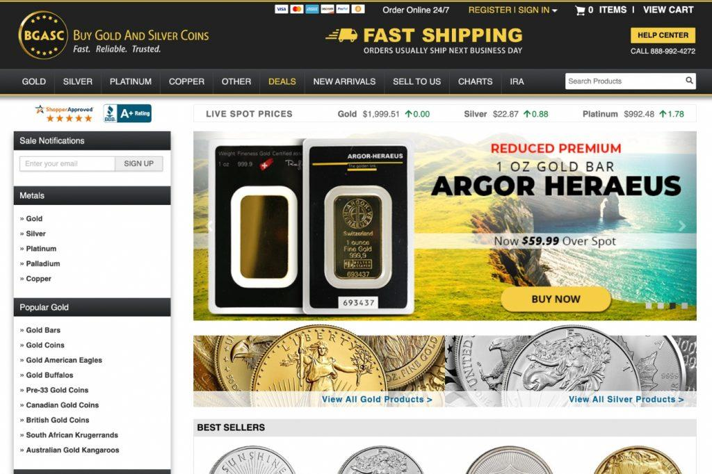

## Table of Contents

## What are the criteria for selecting the top online gold dealers in October 2024?

When choosing the top online gold dealers in October 2024, it's important to look at several key factors. First, consider the reputation of the dealer. This can be checked by reading customer reviews and ratings on trusted websites. A good dealer will have positive feedback and a history of satisfied customers. Also, make sure the dealer is accredited by organizations like the Better Business Bureau or the Professional Numismatists Guild. This shows they follow high standards in their business practices.

Another important factor is the pricing and fees. The best dealers will offer competitive prices for gold and have clear, low fees for transactions. It's a good idea to compare prices from different dealers to make sure you're getting a fair deal. Additionally, look at the variety of products they offer. Top dealers will have a wide range of gold products, like coins, bars, and rounds, so you can choose what fits your needs best.

Lastly, consider the customer service and security measures of the dealer. Good customer service means they are easy to reach and helpful with any questions or issues. Security is also crucial, especially for online transactions. The dealer should use secure payment methods and have strong measures to protect your personal and financial information. By looking at these factors, you can find the best online gold dealers in October 2024.

## How do beginners start investing in gold online?

Starting to invest in gold online is easy if you follow a few simple steps. First, you need to do some research to find a good online gold dealer. Look for dealers with good reviews and a solid reputation. Make sure they are accredited by trusted organizations. Once you've chosen a dealer, take a look at the different gold products they offer, like coins, bars, or rounds. Decide which type of gold fits your investment goals and budget.

After you've picked your gold product, it's time to buy it. Most online dealers let you pay with a credit card, bank transfer, or other secure methods. Make sure you understand any fees or costs involved in the purchase. Once you've paid, the dealer will ship your gold to you or store it in a secure facility if you choose. It's a good idea to keep track of your investment and check on the gold market from time to time. This way, you can learn more about investing in gold and make smart decisions in the future.

## What are the most reputable online gold dealers for October 2024?

In October 2024, some of the most reputable online gold dealers are JM Bullion, APMEX, and SD Bullion. JM Bullion is known for its wide selection of gold products and competitive pricing. They have a strong reputation for customer service and secure transactions. APMEX is another top choice, offering a variety of gold coins and bars with clear pricing and low fees. They are trusted by many investors for their reliability and excellent customer support. SD Bullion rounds out the list with its focus on low prices and a user-friendly website. They are praised for their fast shipping and secure storage options.

These dealers stand out because they are accredited by organizations like the Better Business Bureau and the Professional Numismatists Guild. This means they follow high standards in their business practices. They also offer a range of payment options and have strong security measures to protect your information. By choosing one of these reputable dealers, beginners and experienced investors alike can feel confident in their gold investments.

## What types of gold products can be purchased from online dealers?

Online gold dealers offer many types of gold products that you can buy. You can find gold coins, which are popular because they come in different sizes and designs. Some common gold coins are the American Eagle, Canadian Maple Leaf, and South African Krugerrand. Gold bars are another option. They come in different weights, from small 1-gram bars to large 1-kilogram bars. Gold bars are often chosen by investors who want to buy gold in larger amounts. You can also buy gold rounds, which are similar to coins but are not legal tender. They often have unique designs and can be a good choice if you want something different.

In addition to these, some online dealers sell gold jewelry and gold-backed exchange-traded funds (ETFs). Gold jewelry can be a way to own gold and wear it too, but keep in mind that the price includes the cost of the craftsmanship. Gold-backed ETFs are a way to invest in gold without physically owning it. They track the price of gold and can be bought and sold like stocks. Each type of gold product has its own benefits, so it's good to think about what fits your investment goals and budget.

## How do online gold dealers ensure the authenticity and quality of their products?

Online gold dealers make sure their products are real and good quality by working with trusted sources. They buy gold from well-known mints and refineries that have a good reputation for making high-quality gold. These dealers also check each piece of gold carefully before they sell it. They use special tools and tests to make sure the gold is pure and matches what they say it is. This way, customers can trust that they are getting real gold.

To keep their customers happy, online gold dealers often give certificates of authenticity with their products. These certificates show that the gold has been checked and is real. Some dealers also let customers return their gold if they are not happy with it. This shows that the dealers are confident in the quality of their gold and want to make sure their customers feel safe when they buy from them.

## What are the fees and costs associated with buying gold online?

When you buy gold online, you need to know about the different fees and costs that come with it. The main cost is the price of the gold itself, which can change based on the market. But there are other fees too. Most dealers charge a premium over the spot price of gold. This premium covers the cost of making the gold product and the dealer's profit. The premium can be different depending on the type of gold you buy, like coins or bars, and how much you buy.

There are also other costs to think about. Some dealers charge a fee for shipping the gold to you. This fee can change based on how fast you want the gold and how much you are buying. If you choose to store your gold with the dealer instead of having it shipped to you, there might be a storage fee. And don't forget about payment fees. If you pay with a credit card, there might be a fee for that too. It's a good idea to look at all these costs before you buy gold online so you know what to expect.

## How can one compare the prices of gold from different online dealers?

To compare the prices of gold from different online dealers, start by visiting the websites of the dealers you are interested in. Look at the price per ounce or gram of the gold products you want to buy. Make sure to note the spot price of gold, which is the current market price, and then see how much the dealer is charging over that. This extra amount is called the premium. Write down the total price, including any premiums, for each dealer so you can compare them easily.

Also, remember to check for any extra fees that might affect the total cost. Some dealers might charge for shipping, storage, or using a credit card to pay. These fees can add up and make a big difference in the final price. By looking at all these costs together, you can see which dealer offers the best deal for the gold you want to buy.

## What are the security measures in place for transactions with online gold dealers?

Online gold dealers use strong security measures to keep your transactions safe. They use secure websites with encryption to protect your personal and payment information. This means that when you enter your details, they are turned into a code that is hard for hackers to read. Many dealers also use two-factor authentication, which adds an extra step to make sure it's really you making the purchase. This could be a code sent to your phone or an email you need to confirm.

In addition to these digital protections, online gold dealers often use secure payment methods like bank transfers or credit cards that have their own security features. They might also offer insurance for your gold while it's being shipped to you. This way, if something goes wrong, you can get your money back. By using these security measures, online gold dealers help make sure your investment is safe and secure.

## How do expert investors analyze the performance of online gold dealers?

Expert investors analyze the performance of online gold dealers by looking at several key factors. They start by checking the dealer's reputation, which includes reading customer reviews and ratings on trusted websites. They also see if the dealer is accredited by organizations like the Better Business Bureau or the Professional Numismatists Guild. This helps them know if the dealer follows high standards in their business practices. Another important thing they look at is the pricing and fees. Expert investors compare the prices from different dealers to see which one offers the best deal. They also pay attention to any extra costs like shipping or storage fees, because these can affect the total cost of the investment.

In addition to these factors, expert investors consider the variety of gold products offered by the dealer. They want to see a wide range of options, like coins, bars, and rounds, so they can choose what fits their investment goals best. They also look at the dealer's customer service and security measures. Good customer service means the dealer is easy to reach and helpful with any questions or issues. Strong security measures, like encryption and two-factor authentication, are important to protect personal and financial information during online transactions. By looking at all these things, expert investors can make smart choices about which online gold dealers to use.

## What are the trends in the online gold market for October 2024?

In October 2024, the online gold market is seeing a big increase in people buying gold. More and more people are choosing to invest in gold online because it's easy and quick. They like that they can compare prices from different dealers and buy gold without leaving their homes. Another trend is that dealers are offering more types of gold products, like special edition coins and smaller gold bars. This gives buyers more choices and lets them find gold that fits their needs and budgets.

Also, online gold dealers are focusing more on making their websites safe and easy to use. They are using better security measures to protect customers' information and make sure their transactions are safe. Many dealers are also making their websites easier to navigate so customers can find what they want quickly. These trends show that the online gold market is growing and changing to meet the needs of more people who want to invest in gold.

## How do online gold dealers handle shipping and insurance?

Online gold dealers take care of shipping and insurance to make sure your gold gets to you safely. When you buy gold, the dealer will package it securely and send it to you using a trusted shipping company. They often use services like FedEx or UPS that have good tracking systems. This way, you can see where your gold is and when it will arrive. Some dealers even let you choose how fast you want your gold shipped, so you can decide if you want it to come quickly or if you're okay waiting a bit longer to save on shipping costs.

For insurance, online gold dealers usually include it in the shipping cost to protect your investment. This means if something happens to your gold while it's being shipped, like if it gets lost or damaged, you can get your money back. The insurance covers the full value of the gold, so you don't have to worry about losing your investment. Some dealers might also offer extra insurance options if you want even more protection. By handling shipping and insurance carefully, online gold dealers help make sure your gold arrives safely and securely.

## What are the best practices for storing gold purchased online?

When you buy gold online, it's important to store it safely. You can keep your gold at home if you have a good safe. Make sure the safe is strong and hard to break into. It's also a good idea to keep your gold hidden and not tell many people about it. If you don't want to keep it at home, you can use a safe deposit box at a bank. This is a secure place where you can store your gold, and only you can get to it.

Another option is to use a storage service offered by some online gold dealers. They have secure facilities where they can keep your gold for you. This can be a good choice if you don't want to worry about storing it yourself. These services usually charge a fee, but they offer peace of mind because they have strong security measures in place. No matter where you choose to store your gold, make sure it's protected and that you know where it is at all times.

## References & Further Reading

[1]: Goodman, J. (2014). ["The Gold Market: Theory, Practice, and Analysis."](https://link.springer.com/book/10.1057/9781137306715) Palgrave Macmillan.

[2]: Katz, J. O., & McCormick, D. L. (2000). ["The Encyclopedia of Trading Strategies."](https://archive.org/details/encyclopediaoftr0000katz) McGraw-Hill Education.

[3]: Rooney, B. (2022). ["The Digital Transformation of Gold Investment: Opportunities and Challenges."](https://journals.sagepub.com/doi/full/10.1177/21582440211047576) World Gold Council.

[4]: Taylor, M. P. (2020). ["Gold: A Commodity, Currency, and Capital Market Asset."](https://www.gold.org/goldhub/research/relevance-of-gold-as-a-strategic-asset) Oxford University Press.

[5]: Wildau, R. T. (2015). ["Online Platforms for Investing in Gold: A Comparative Analysis."](https://www.semanticscholar.org/paper/The-Project-TEDS%40wildau%3A-TEDS-Framework-Integration-Scholl-Ehrlich/703d2818b1b39291523183b4cda86f5e79b5d27f) Journal of Financial Planning and Analysis, 45(2), 114-132.