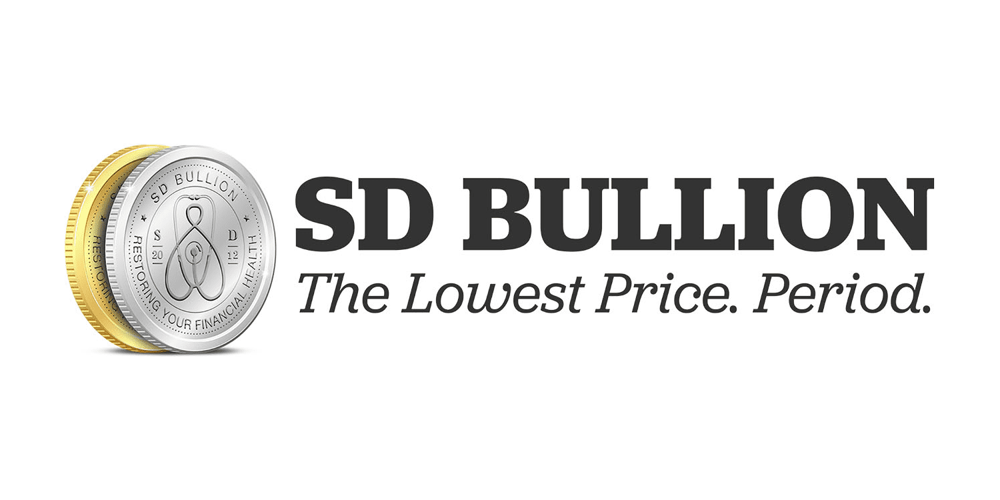

In recent years, the digital transformation has revolutionized the way we invest in precious metals like gold. The advancement of technology has significantly lowered barriers to entry, enabling investors to access and transact in gold markets with unprecedented ease and convenience. Historically, investing in gold involved complex processes and was largely limited to wealthy individuals or institutions. Today, however, the proliferation of online gold dealers has democratized gold investing, making it accessible to a broader audience.

With the rise of online platforms, purchasing gold has never been easier or more accessible. These platforms provide a wide range of products, from physical gold bars and coins to digital gold options, catering to diverse investment preferences and strategies. As we head into 2024, this trend is expected to continue, further empowering individual investors. Increased competition among dealers has led to more competitive pricing, while technological innovations have enhanced security and transparency in transactions.

This article aims to guide you through the process of buying gold online, highlight some of the best gold dealers, and touch upon algo trading in this market. By leveraging technology, algorithmic trading (or algo trading) has emerged as a significant force in financial markets, including the gold market. This technology utilizes computer algorithms to execute trades automatically, optimizing investment strategies by analyzing market conditions in real time. Understanding how to integrate algo trading into your investment strategy can be valuable, whether you're a seasoned investor or a beginner learning the ropes.

As we explore the evolving landscape of online gold purchasing, you'll be equipped with insights that can enhance your investment strategy. Leveraging the opportunities presented by digital transformation, you can make informed decisions and potentially gain a competitive edge. Let's explore the online gold purchasing landscape together, uncovering strategies that align with the modern investment climate.

## Table of Contents

## The Rise of Online Gold Dealers

The expansion of the internet has transformed the gold investment landscape, leading to the proliferation of online gold dealers as a favored option among investors. These digital platforms have redefined the investment process by providing unprecedented convenience: investors can now tap into the gold market without the geographic and logistical constraints that typically accompany traditional purchasing methods. 

Online gold dealers offer competitive pricing, allowing investors to effortlessly compare costs from multiple sources to ensure optimal value. This competitive environment benefits the consumer by promoting transparency and preventing overpricing. Additionally, the assortment of products available online is extensive, ranging from gold bars and coins to numismatic collectibles, accommodating diverse investor preferences and objectives.

As we approach 2024, the online gold market is on the brink of further diversification and innovation. Technological advancements are expected to introduce improved transactional security and more personalized customer experiences. The evolution of user interfaces and the integration of emerging technologies, such as [artificial intelligence](/wiki/ai-artificial-intelligence), could enhance user engagement and streamline purchasing processes, making the experience more intuitive and less time-consuming.

While the advantages of online gold investment are evident, awareness of potential challenges is essential for informed decision-making. Risks include cybersecurity threats, such as data breaches and fraud, which can compromise personal and financial information. Therefore, choosing reputable online dealers who employ robust security protocols and provide comprehensive insurance options is crucial in mitigating these risks.

In summary, online gold dealers represent a growing segment of the investment market, reshaping how gold investments are conducted. Their continued evolution promises to bring both opportunities and challenges, underscoring the importance of vigilance and critical evaluation in optimizing investment outcomes.

## Benefits of Purchasing Gold Online

Purchasing gold online presents several advantages over traditional methods, providing a convenient and efficient way for investors to acquire this precious metal. A significant benefit is the ease with which investors can compare prices across various dealers. The digital platform eliminates the need to physically visit different outlets, thereby saving time and ensuring the best possible deal. This transparency empowers buyers, fostering a competitive market environment that often benefits consumers.

Online platforms are designed to deliver comprehensive information about gold products, which aids investors in making informed decisions. Detailed descriptions about the gold's purity, weight, and origin are typically available at a click, along with market trends and historical data. This wealth of information, readily accessible, supports investors in understanding the product they are purchasing. Moreover, reviews and ratings from other buyers can offer insights into the quality and authenticity of the gold.

Security remains a paramount concern for investors, and many reputable online gold dealers address this by offering secure shipping and insurance options. Once a purchase is made, the gold is often shipped directly to the buyer with tracking facilities, ensuring its safe arrival. Insurance options mitigate the risk of loss or theft during transit, providing an additional layer of security to the investment.

The convenience of purchasing gold online extends to the payment process, which accommodates various methods, including bank transfers, credit cards, and even cryptocurrencies. This flexibility caters to diverse preferences and enhances the overall buying experience.

In essence, purchasing gold online combines convenience with comprehensive information and robust security measures, facilitating a smooth and reliable purchasing process for modern investors.

## Evaluating the Best Gold Dealers in 2024

With numerous options available, selecting the right gold dealer in 2024 involves careful evaluation of multiple factors. Reputation stands as a fundamental consideration, as a well-regarded dealer often indicates reliability and trust. When assessing reputation, platforms such as the Better Business Bureau (BBB) and Trustpilot provide valuable insights into a dealer’s standing, offering ratings derived from comprehensive customer feedback and complaint resolution records. Moreover, online reviews, testimonials, and industry awards can also serve as indicators of a dealer's credibility.

Customer reviews provide firsthand accounts of others' experiences, highlighting not only the positives but also any concerns or potential red flags. Reading a mix of both positive and negative reviews ensures a balanced perspective. Additionally, transparency is essential; trustworthy dealers typically disclose their pricing structures, fees, and any relevant terms associated with the purchase of gold. Clear information regarding buyback options and storage solutions further enhances a dealer’s transparency.

Service offerings are another critical [factor](/wiki/factor-investing). This encompasses the range of products available, including bullion bars, coins, and numismatic collectibles. A diverse product range allows investors to tailor their portfolios according to their investment strategies and goals. Furthermore, exceptional customer service, easy navigation of online platforms, and accessible educational resources signify a dealer committed to customer satisfaction and informed decision-making.

In 2024, several online gold dealers are anticipated to excel in these criteria. Companies such as APMEX, JM Bullion, and Kitco have consistently received industry accolades and positive customer feedback for their integrity, transparency, and comprehensive service offerings. APMEX, for instance, is celebrated for its vast inventory and user-friendly platform, which facilitates easy comparison and purchase of gold products. JM Bullion is noted for its competitive pricing and robust customer service, while Kitco is regarded for its market insights and extensive educational resources.

By assessing these dealers based on reputation, customer reviews, transparency, and service offerings, investors can make well-informed decisions about where to buy gold online. Engaging with these leading dealers not only ensures a secure purchasing experience but also enhances one's ability to strategically navigate the growing online gold market.

 to Algo Trading in Gold Market

Algorithmic trading, often referred to as algo trading, has significantly influenced the financial markets by leveraging technology to automate trading processes. This innovation is becoming increasingly relevant in the gold market, where it offers a multitude of opportunities for enhancing investment strategies. Algo trading employs computer algorithms to execute trades automatically, often at speeds and frequencies that are impossible for human traders. These algorithms are designed to make decisions based on pre-set criteria, which can include price variations, market trends, and even historical data analysis.

One of the key benefits of [algorithmic trading](/wiki/algorithmic-trading) is its ability to optimize trading efficiency. By automating the trading process, investors can minimize the impact of emotional biases, improve order execution, and take advantage of market conditions in real-time. For the gold market, this means that traders can respond rapidly to price changes, capitalize on market inefficiencies, and ultimately achieve better pricing and timing for their trades.

As technology continues to integrate with financial markets, understanding the mechanics of algo trading is becoming increasingly important for investors. Algorithms can be programmed to [carry](/wiki/carry-trading) out a variety of trading strategies, from market-making and [arbitrage](/wiki/arbitrage) to [trend following](/wiki/trend-following) and mean reversion. For instance, an arbitrage algorithm might simultaneously buy and sell gold on different exchanges to exploit price differences, while a trend-following algorithm could buy gold when a predefined upward trend is detected and sell when the trend reverses.

The potential impact of algo trading on the gold market is multifaceted. By increasing market [liquidity](/wiki/liquidity-risk-premium) and reducing transaction costs, it can lead to more efficient price discovery. Furthermore, algo trading can help stabilize markets by smoothing out price fluctuations through the constant presence of automated buying and selling activities.

For investors looking to incorporate algo trading into their gold investment portfolios, several practical steps can be taken. Firstly, it is essential to develop or acquire a robust algorithmic trading system that aligns with their specific investment goals. Additionally, continuous monitoring and tuning of the algorithms are required to adapt to changing market conditions. Investors should also be aware of the risks associated with algo trading, such as the potential for technical glitches or unexpected market events that could trigger automatic trades in an undesirable manner.

In conclusion, algorithmic trading presents innovative possibilities for the gold market, offering enhanced efficiency, precision, and strategic potential. As investors seek new avenues to optimize their portfolios, understanding and utilizing algo trading may become a crucial component of successful gold investment strategies.

## Future Trends in Online Gold Trading

As we approach 2024, several transformative trends are anticipated to reshape the online gold trading landscape. These trends include significant advancements in blockchain technology, a surge in demand for digital gold, and the proliferation of mobile trading applications.

**Advancements in Blockchain Technology**

Blockchain technology is revolutionizing the way gold is traded online by enhancing transparency, efficiency, and security. The decentralized nature of blockchain ensures that every transaction is recorded in a public ledger, minimizing the risk of fraud and providing a higher level of trust. This technology allows for the tokenization of physical gold, enabling investors to trade digital representations of gold. For example, gold-backed cryptocurrencies have become increasingly popular, allowing investors to easily buy, sell, or trade gold on digital platforms.

**Increased Demand for Digital Gold**

Digital gold offers several advantages over physical gold, including ease of access, lower transaction costs, and increased liquidity. As more investors seek convenient and flexible investment options, the demand for digital gold is expected to rise. Unlike physical gold, digital gold can be purchased in small fractions, making it accessible to a broader range of investors. Additionally, platforms offering digital gold often provide storage solutions, eliminating the need for investors to store and insure physical gold themselves.

**Rise of Mobile Trading Applications**

The proliferation of mobile technology has significantly impacted the way investors trade gold online. Mobile trading applications offer the convenience of real-time market access and trading capabilities from anywhere, at any time. These apps often come with user-friendly interfaces and various functionalities such as price alerts, portfolio tracking, and educational resources, enhancing the trading experience for users. The increased reliance on smartphones for financial transactions is expected to drive the development of more sophisticated mobile trading applications in the gold market.

**Implications for Online Gold Traders**

For investors, staying informed about these emerging trends is crucial to capitalize on new opportunities in the gold market. The integration of blockchain technology and the rise of digital gold provide more diversified and flexible investment options. Meanwhile, mobile trading applications offer greater accessibility, allowing investors to react swiftly to market changes. By understanding these trends, investors can better strategize their gold investments, ensuring they remain competitive and well-positioned to make informed decisions.

As these trends continue to evolve, they are expected to drive significant changes in the online gold trading environment, presenting both challenges and opportunities for investors seeking to optimize their investment strategies.

## Conclusion

The online gold market presents a diverse range of opportunities for investors aiming to diversify their portfolios. By comprehensively understanding the rise of online dealers, investors can appreciate how digital platforms have revolutionized the purchasing process. The convenience and flexibility offered by purchasing gold online are complemented by the strategic advantages of algorithmic trading, enhancing opportunities for informed decision-making in 2024.

Evaluating the best gold dealers is crucial for ensuring quality and reliability in transactions. When selecting a dealer, factors such as reputation, customer feedback, and transparency become essential considerations. This critical evaluation supports the investor's journey and helps mitigate risks often associated with online transactions.

As the digital landscape continues to evolve, adaptability and consistent information acquisition remain pivotal to achieving successful gold investing. Investors should keep pace with technological advancements and market trends, which are essential for staying competitive and exploiting emerging opportunities. Future trends such as blockchain integration and mobile trading technologies require proactive observation and adaptation.

In planning investment strategies for the future, seizing the opportunities presented by the online gold market becomes a strategic imperative. By remaining informed and flexible, investors can navigate this dynamic market effectively, ensuring robust portfolio diversification and long-term value creation.

## References & Further Reading

[1]: Goodman, J. (2014). ["The Gold Market: Theory, Practice, and Analysis."](https://link.springer.com/book/10.1057/9781137306715) Palgrave Macmillan.

[2]: Katz, J. O., & McCormick, D. L. (2000). ["The Encyclopedia of Trading Strategies."](https://archive.org/details/encyclopediaoftr0000katz) McGraw-Hill Education.

[3]: Rooney, B. (2022). ["The Digital Transformation of Gold Investment: Opportunities and Challenges."](https://journals.sagepub.com/doi/full/10.1177/21582440211047576) World Gold Council.

[4]: Taylor, M. P. (2020). ["Gold: A Commodity, Currency, and Capital Market Asset."](https://www.gold.org/goldhub/research/relevance-of-gold-as-a-strategic-asset) Oxford University Press.

[5]: Wildau, R. T. (2015). ["Online Platforms for Investing in Gold: A Comparative Analysis."](https://www.semanticscholar.org/paper/The-Project-TEDS%40wildau%3A-TEDS-Framework-Integration-Scholl-Ehrlich/703d2818b1b39291523183b4cda86f5e79b5d27f) Journal of Financial Planning and Analysis, 45(2), 114-132.