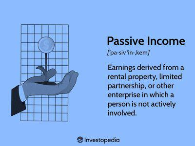

Passive income has emerged as an increasingly attractive financial strategy for individuals seeking to diversify and stabilize their income streams. This approach allows for the generation of earnings with minimal active involvement, a quality that many find appealing in a world that increasingly values time freedom and financial independence.

The concept of passive income encompasses various investment vehicles and asset classes that are designed to yield returns without the need for constant oversight or intervention. Among the myriad of options available, algorithmic trading stands out as a powerful tool in the passive income arsenal. Algorithmic trading involves using pre-set programming scripts to execute trades in financial markets based on predetermined conditions, thereby offering the potential for consistent, automated returns.



Understanding the mechanics of passive income is essential for making well-informed investment decisions. It involves not only identifying what passive income is but also recognizing the risks and benefits associated with different investment strategies. For instance, while dividend stocks, real estate, and interest-bearing accounts are common passive income streams, they each come with distinct levels of risk and reward.

This article will explore a range of investment options suited for passive income generation, with a specific focus on how algorithmic trading can be integrated into these strategies. By examining various asset classes, including bonds, dividend stocks, and real estate, we will provide insights into how these investments can be optimized for steady income with minimal effort. Moreover, we will discuss how algorithmic trading can enhance these methods by automating the trading process, thereby potentially increasing efficiency and profitability.

As we navigate through the possibilities of passive income, it is crucial to understand both the potential and the limitations of algorithmic trading within this context. Embracing such innovative strategies requires an appreciation of the technological advancements at play as well as a keen awareness of market dynamics.

By the end of this exploration, readers should be equipped with the knowledge to incorporate algorithmic trading into their passive income strategy effectively, assessing its role alongside more traditional investment methods. This is a journey into the evolving landscape of passive income, where understanding and adaptation are key to achieving financial success.

## Table of Contents

## Understanding Passive Income: An Overview

Passive income refers to earnings derived from sources that do not require active, daily involvement in their maintenance or generation. This concept plays a significant role in financial planning as it provides a means for individuals to earn money while minimizing the effort required over time. Passive income streams offer an opportunity for financial diversity, essential in mitigating risks associated with relying solely on active income, such as a salary, which can be subject to loss or reduction during economic downturns.

There are several types of passive income streams, each offering unique benefits and considerations. Dividend income is one popular form, where investors earn a share of a company's profits in proportion to the number of shares they own. Real estate earnings, such as rental income from property investments, is another significant source. This income stems from tenants' payments and can be augmented by property appreciation over time. Another common form of passive income is interest earned from investments such as savings accounts, certificates of deposit (CDs), or bonds. These instruments offer periodic interest payments with minimal management.

Incorporating passive income into one's financial strategy also involves understanding tax implications, which differ from those of active income. Passive income is usually taxed differently, sometimes at a lower rate, as it is often classified as investment income. For instance, qualified dividends may benefit from preferential tax rates compared to ordinary income. However, certain passive income sources, such as rental income, may be subject to specific expenses and deductions that can affect taxable income levels.

There are several key advantages to generating passive income. Primarily, it creates a sustainable revenue stream without the necessity of constant active work, which provides financial security and flexibility. This can enable individuals to pursue other interests or career paths without the pressure of an immediate income requirement. Additionally, passive income can facilitate long-term wealth creation through compounding, particularly when investment returns are reinvested to generate more income over time.

In summary, passive income plays a crucial role in financial planning by providing stability and diversification. Understanding and leveraging different passive income streams can significantly enhance financial resilience and growth potential.

## Top Investment Options for Passive Income

Passive income offers an attractive financial strategy for individuals seeking to diversify their income streams with minimal active involvement. Here, we examine popular investment options that provide passive income, namely real estate, bonds, dividend stocks, index funds, exchange-traded funds (ETFs), and peer-to-peer lending.

### Real Estate and Real Estate Investment Trusts (REITs)

Real estate has long been a favored option for generating passive income through rental earnings. Investors can purchase properties and earn income-by leasing them to tenants. However, this often requires significant upfront capital and ongoing management efforts. Alternatively, Real Estate Investment Trusts (REITs) provide an accessible avenue for [earning](/wiki/earning-announcement) from real estate without direct property management. REITs are companies that own, operate, or finance income-generating real estate across various sectors such as commercial, residential, and industrial properties.

Investing in REITs allows individuals to receive dividends derived from the income generated by these properties. Many REITs are publicly traded on major stock exchanges, offering [liquidity](/wiki/liquidity-risk-premium) and diversification across different real estate markets. These characteristics make REITs a preferred choice for passive income seekers who want real estate exposure without the demand of property management.

### Bonds and Dividend Stocks

Bonds are debt securities issued by governments or corporations to raise capital. They promise to pay back the principal along with periodic interest payments, known as coupons, over a fixed term. Bonds are generally considered a lower-risk investment compared to stocks and can provide a steady stream of income, particularly valuable in a diversified portfolio.

Dividend stocks represent shares in companies that pay out a portion of their profits to shareholders in the form of dividends. These companies are often well-established with stable earnings, providing a reliable income to investors. Dividend-paying stocks can be an attractive option for passive income due to potential capital appreciation alongside regular income. Notable examples include utilities and consumer goods companies, which often offer relatively higher dividends.

### Index Funds and ETFs

Index funds and ETFs (exchange-traded funds) are popular investment vehicles allowing individuals to invest in a diversified portfolio of stocks or bonds with relatively low costs. Index funds aim to replicate the performance of a particular market index, such as the S&P 500, by holding a similar portfolio of securities. ETFs function similarly but trade on stock exchanges, providing the flexibility to buy and sell throughout the trading day.

Investing in index funds and ETFs can provide steady returns over the long term, primarily through capital gains and dividends. Their diversification helps mitigate the risk associated with individual securities, making them suitable for passive income strategies. Additionally, these funds typically have lower expense ratios compared to actively managed funds, enhancing overall investment efficiency.

### Peer-to-Peer Lending

Peer-to-peer (P2P) lending platforms connect individual lenders with borrowers, offering an alternative to traditional banking systems. Investors can lend money directly to borrowers and earn interest on the loans, creating a potential passive income stream. P2P lending platforms often provide various loan options, including personal loans, business loans, and real estate loans, with different risk and return profiles.

While P2P lending can offer higher returns compared to traditional fixed-income investments, it also carries higher risks, such as borrower default. Investors should carefully assess these risks and consider spreading investments across multiple loans to diversify their portfolio and mitigate potential losses.

In summary, real estate, bonds, dividend stocks, index funds, ETFs, and peer-to-peer lending offer diverse means for generating passive income. Careful consideration of each option's risk, return, and management requirements is essential for developing a balanced and effective income-generating strategy.

## Algorithmic Trading: An Innovative Strategy for Passive Income

Algorithmic trading, often referred to as algo trading, is the use of computer algorithms to execute trades in financial markets at speeds and frequencies that are beyond human capabilities. These algorithms are designed to make trading decisions by monitoring market data and executing orders based on pre-defined strategies. Automated trading eliminates the emotional component of trading decisions, offering precision and the ability to backtest strategies with historical data.

Algorithmic trading generates passive income by utilizing automated systems to conduct trades. These systems are capable of executing orders for a wide range of assets, including stocks, commodities, foreign exchange, and cryptocurrencies. The trading strategies are based on various inputs such as price, timing, and [volume](/wiki/volume-trading-strategy). Once these parameters are set, the algorithm automatically places orders without human intervention, thereby allowing for consistent participation in the market while the trader focuses on strategy refinement.

The advantages of [algorithmic trading](/wiki/algorithmic-trading) over traditional methods are manifold. Firstly, speed is enhanced; algorithms can analyze multiple market conditions simultaneously and place orders within milliseconds. Secondly, it increases accuracy by minimizing the risk of human error. Thirdly, it facilitates high-frequency trading where large volumes of trade are executed in short time spans, potentially increasing the profitability of small price fluctuations.

Moreover, algorithmic trading can operate 24/7, particularly in markets like foreign exchange or crypto, where trading happens round the clock. This continuous operation maximizes the profit-making opportunities. Importantly, the scalability feature allows traders to manage complex strategies involving multiple markets and instruments.

However, there are risks and considerations inherent in deploying trading algorithms. Market impact remains a concern: while high-frequency trading promises quick profit from small price movements, these trades can have a significant impact on market dynamics due to their volume and speed. External factors such as technical malfunctions, connectivity issues, or incorrect algorithmic parameters can lead to financial losses. Furthermore, the dependence on historical data for strategy development introduces a risk; past performance is not always indicative of future results.

Regulatory risks also demand attention, as varying jurisdictions have specific rules governing automated trading activities. Ensuring compliance is vital to avoid legal issues and penalties. Additionally, algorithmic trading demands a strong understanding of both financial markets and programming, potentially posing a barrier to entry for some traders.

In conclusion, algorithmic trading offers a compelling option for generating passive income through the automated execution of trades in financial markets. The ability to operate at [high frequency](/wiki/high-frequency-trading) with precision and scalability presents significant advantages over traditional trading. However, the associated risks, including technical, compliance, and market impacts, must be carefully managed to secure favorable outcomes.

## Integrating Algorithmic Trading with Other Income Strategies

Combining algorithmic trading strategies with other passive income investments offers investors a comprehensive approach to income generation. Algorithmic trading, by automating financial transactions, allows for continuous market interaction without the need for constant manual oversight. When integrated with varied passive income streams, it can significantly enhance and stabilize overall returns.

Diversification through multiple income streams is a fundamental principle in risk management. By not relying solely on one source of income, investors can mitigate potential losses that might arise from market [volatility](/wiki/volatility-trading-strategies) or specific sector downturns. In practice, this might involve blending algorithmic trading with investments in real estate, dividend-paying stocks, and bonds. Algorithmic trading can complement these by offering liquidity and the potential for daily returns, whereas other investments might provide periodic returns and long-term growth potential.

Balancing traditional and modern investment strategies entails maintaining a harmonious mix of time-tested approaches with innovative methods like algorithmic trading. Traditional investments, such as real estate and bonds, often offer stability and lower risk, albeit with potentially lower returns. Conversely, algorithmic trading can offer higher potential returns, albeit with increased complexity and risk. For example, an investor might allocate a portion of their portfolio to algorithmic trading in the [forex](/wiki/forex-system) market, while another portion might be dedicated to REITs (Real Estate Investment Trusts) for consistent rental income. 

In practical terms, an investor might implement a simple moving average crossover strategy in Python to automate trades in the stock market:

```python
import pandas as pd

def moving_average(data, window_size):
    return data.rolling(window=window_size).mean()

def calculate_signals(data, short_window, long_window):
    signals = pd.DataFrame(index=data.index)
    signals['price'] = data['price']
    signals['short_mavg'] = moving_average(data['price'], short_window)
    signals['long_mavg'] = moving_average(data['price'], long_window)
    signals['signal'] = 0.0
    signals['signal'][short_window:] = np.where(signals['short_mavg'][short_window:] 
                                                > signals['long_mavg'][short_window:], 1.0, 0.0)
    signals['positions'] = signals['signal'].diff()
    return signals

# Assuming 'data' is a DataFrame containing stock price data
signals = calculate_signals(data, short_window=50, long_window=200)
```

While this automated strategy searches for trading opportunities, other parts of the portfolio generate passive income through dividends or interest payments.

The key to optimizing income through this blend of strategies lies in carefully assessing the correlation between chosen income streams. By ensuring a low correlation, an investor can better protect against market fluctuations affecting all investments simultaneously. Regular portfolio review and adjustments based on market conditions and personal financial goals are essential to maintain a balanced approach. 

In summary, the integration of algorithmic trading with other passive income strategies offers a dynamic approach to modern investing, enabling a balance between risk and reward and catering to diverse financial objectives.

## Getting Started: Choosing the Right Strategy

When embarking on the journey of generating passive income through algorithmic trading, carefully choosing the appropriate strategy is essential. This process involves assessing risk tolerance, establishing clear investment goals, setting up trading systems, and selecting suitable financial instruments.

### Assessing Risk Tolerance and Investment Goals

The first step involves understanding your risk tolerance, which is essentially how much risk you are willing to bear while investing. This can be determined by considering factors such as your financial situation, investment horizon, and personal comfort with market fluctuations. Higher risk tolerance may allow for investing in more volatile assets with the potential for higher returns, while a lower risk tolerance might favor safer, but potentially lower-yield investments.

Investment goals are typically divided into short-term and long-term objectives. Short-term goals might include generating supplementary income to cover immediate expenses, while long-term goals could involve accumulating wealth for retirement. Defining these goals clearly can help in choosing suitable trading strategies and instruments.

### Setting Up Algorithmic Trading Systems: A Step-by-Step Guide

1. **Define Strategy and Parameters:** Begin by outlining the trading strategy you wish to automate. This involves deciding the asset class, trading frequency, and specific entry and exit signals. Parameters such as stop-loss levels or maximum allowable drawdown should be clearly defined.

2. **Select a Reliable Trading Platform:** Choose a trading platform that supports algorithmic trading. Popular platforms include MetaTrader, Interactive Brokers, and QuantConnect, each offering various programming languages and tools for strategy development.

3. **Develop and Test the Algorithm:** Write the code for your trading strategy using a programming language such as Python. Here’s a simple example of a moving average crossover strategy in Python:

    ```python
    import pandas as pd

    def moving_average_strategy(prices, short_window, long_window):
        signals = pd.DataFrame(index=prices.index)
        signals['price'] = prices
        signals['short_mavg'] = prices.rolling(window=short_window, min_periods=1, center=False).mean()
        signals['long_mavg'] = prices.rolling(window=long_window, min_periods=1, center=False).mean()
        signals['signal'] = 0.0
        signals['signal'][short_window:] = np.where(signals['short_mavg'][short_window:] 
                                                    > signals['long_mavg'][short_window:], 1.0, 0.0)   
        signals['positions'] = signals['signal'].diff()
        return signals

    # Assume 'prices' is a DataFrame containing historical price data
    signals = moving_average_strategy(prices, short_window=40, long_window=100)
    ```

4. **Backtest the Algorithm:** Test the algorithm using historical data to evaluate its performance. Look for metrics like Sharpe ratio, win/loss ratio, and maximum drawdown to assess risk and return.

5. **Optimize and Refine:** Based on the backtesting results, refine and adjust parameters to enhance performance. Avoid overfitting by ensuring that the strategy is robust across different market conditions.

6. **Deploy the Strategy:** Once satisfied with the algorithm’s performance, deploy it live through your chosen platform. Begin with a demo account to ensure it functions correctly before committing real capital.

### Selecting the Right Financial Instruments for Passive Income

Selecting the appropriate financial instruments is a crucial component of establishing an algorithmic trading system for passive income. Consider the following options:

- **Stocks and ETFs:** These are ideal for many traders due to their liquidity and availability of data. Dividend-paying stocks and sector-specific ETFs can offer regular income.

- **Forex and Commodities:** These markets are highly liquid and allow trading around the clock, which can be advantageous for algorithms that require frequent trades.

- **Cryptocurrencies:** With high volatility and potential for significant returns, cryptocurrencies are suitable for high-risk-tolerant investors using algorithms.

- **Bonds:** Generally less volatile, bonds can be effective for algorithms focused on stable, lower-risk returns.

In summary, establishing an effective passive income strategy through algorithmic trading requires a clear understanding of personal risk tolerance, investment goals, suitable trading systems, and optimal financial instruments. With careful planning and implementation, algorithmic trading can be a potent method for generating passive income.

## Conclusion: Future of Passive Income and Algorithmic Trading

The integration of algorithmic trading within passive income strategies presents a promising frontier for investors seeking to enhance their portfolios with minimal active involvement. By automating investment decisions and exploiting market inefficiencies, algorithmic trading can potentially generate consistent returns without the need for day-to-day management. This is especially relevant as financial markets continue to evolve, offering new opportunities and technological advancements that can be harnessed by algorithmic systems to optimize returns.

Current market trends indicate a growing acceptance of technology-driven solutions in investing. With the rise of [artificial intelligence](/wiki/ai-artificial-intelligence) and [machine learning](/wiki/machine-learning), algorithmic trading systems can process vast amounts of data with speed and accuracy, identifying patterns and executing trades much faster than human capability. As these technologies become more sophisticated, investors can leverage them to further enhance the efficiency and profitability of passive income strategies.

However, successful integration of algorithmic trading requires a thorough understanding of the tools and strategies involved. Investors must be equipped with the knowledge to assess the complexities and risks associated with automated trading systems. Continued education in both the technical and strategic elements of investing is critical. This involves keeping abreast of market developments, understanding the historical performance of algorithms in varying market conditions, and being aware of regulatory changes impacting trading practices.

Furthermore, algorithmic trading should not be viewed as a standalone solution but rather as a component of a diversified investment approach. Diversifying across different asset classes and income-generating strategies can mitigate risks and provide a more stable financial future. As the landscape of passive investing continues to evolve, maintaining a flexible strategy that combines traditional methods with innovative technologies will be crucial for achieving long-term financial goals.

In conclusion, the future of passive income strategies enriched by algorithmic trading is bright, offering enhanced potential for investors willing to embrace new technologies and methodologies. To capitalize on these opportunities, investors should be proactive in education and regularly reassess their financial objectives to adapt to the dynamic nature of financial markets.

## References & Further Reading

[1]: Bergstra, J., Bardenet, R., Bengio, Y., & Kégl, B. (2011). ["Algorithms for Hyper-Parameter Optimization."](https://papers.nips.cc/paper/4443-algorithms-for-hyper-parameter-optimization) Advances in Neural Information Processing Systems 24.

[2]: ["Advances in Financial Machine Learning"](https://www.amazon.com/Advances-Financial-Machine-Learning-Marcos/dp/1119482089) by Marcos Lopez de Prado

[3]: ["Evidence-Based Technical Analysis: Applying the Scientific Method and Statistical Inference to Trading Signals"](https://www.amazon.com/Evidence-Based-Technical-Analysis-Scientific-Statistical/dp/0470008741) by David Aronson

[4]: ["Machine Learning for Algorithmic Trading"](https://github.com/stefan-jansen/machine-learning-for-trading) by Stefan Jansen

[5]: ["Quantitative Trading: How to Build Your Own Algorithmic Trading Business"](https://www.amazon.com/Quantitative-Trading-Build-Algorithmic-Business-ebook/dp/B097QGPVND) by Ernest P. Chan