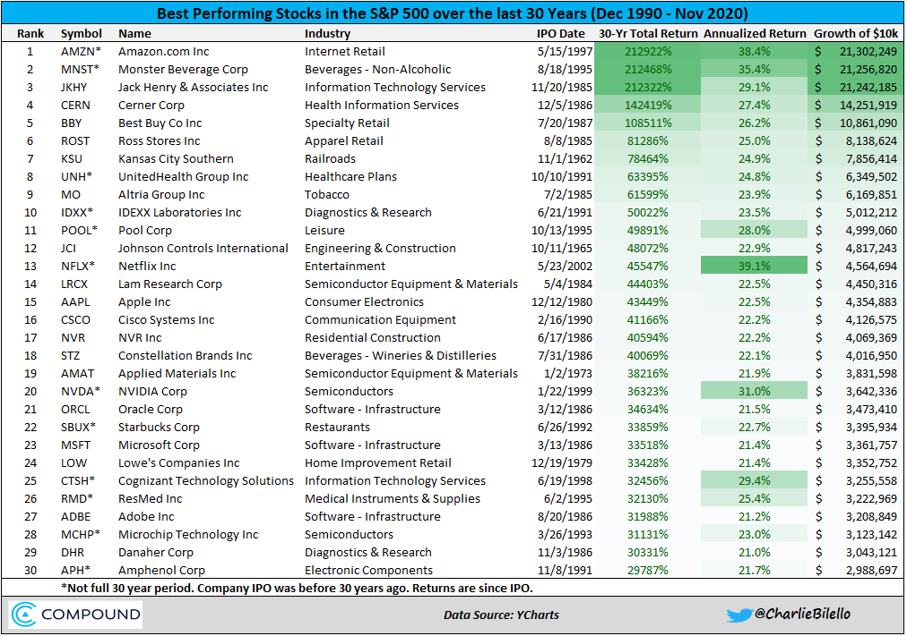

The stock market serves as a fundamental component of global economics, acting as a dynamic platform where securities trading facilitates the allocation of capital. It plays a critical role in economic health by providing companies with access to capital and allowing investors to participate in corporate profits. This interaction not only supports corporate growth but also influences job creation and economic expansion. Among the various indices that track stock market performance, the S&P 500 stands out as a pivotal benchmark. Comprising 500 of the largest publicly traded companies in the United States, the S&P 500 offers a comprehensive snapshot of market trends and serves as a gauge for the performance of the broader U.S. economy. It is widely recognized for its diverse representation across multiple industry sectors, which provides a balanced reflection of the market.

Identifying the best-performing stocks within the S&P 500 is of significant interest to investors. Performance evaluation helps investors maximize returns and mitigate risks. Key metrics such as total return, growth rate, and volatility are essential for assessing stock performance and guiding investment decisions. Consequently, understanding these metrics enables investors to tailor strategies in line with market conditions and individual risk tolerance.

Algorithmic trading, or algo trading, has revolutionized stock trading and performance analysis by leveraging computer algorithms to execute trades based on pre-defined criteria. This method enhances efficiency by processing vast data sets to identify potential investment opportunities, optimize stock selection, and execute strategies with minimal human intervention. Algo trading contributes to increased market liquidity and has transformed how investors and institutions comprehend stock performance and market dynamics.

This article will explore the intersection of these key topics: the fundamental aspects of the S&P 500, the evaluation of top-performing stocks, and the impact of algorithmic trading. Together, these factors illustrate how modern technology intertwines with traditional finance to shape the contemporary landscape of stock market performance.

## Table of Contents

## Understanding the S&P 500

The S&P 500, or Standard & Poor's 500, is a stock market index tracking the performance of 500 of the largest publicly traded companies in the United States. It is widely regarded as one of the best gauges of the U.S. stock market and is often used as a benchmark for the broader economy. The index represents approximately 80% of the total market capitalization of the U.S. stock market. This makes it a critical tool for investors seeking to assess market trends and evaluate the health of the American economy.

### Criteria for Inclusion

To be eligible for inclusion in the S&P 500, a company must meet several specific criteria. These include:

1. **Market Capitalization**: A company must have a minimum market capitalization, which is periodically adjusted. As of recent guidelines, this figure typically exceeds $13 billion.

2. **Liquidity**: The company's stock must exhibit sufficient trading volume to ensure liquidity.

3. **Domicile**: The company must be based in the United States.

4. **Float-Adjusted Market Cap**: At least 50% of the company’s stock must be available to the public for trading.

5. **Financial Viability**: At least four consecutive quarters of positive earnings are generally required.

6. **Sector Representation**: The company should contribute to the diversification of sectors within the index.

### Diversity of Industries

The S&P 500 encompasses a wide array of industries, providing broad exposure to different sectors of the U.S. economy. This diversity allows the index to mitigate sector-specific risks, offering a more stable investment vehicle. Key sectors represented include Information Technology, Health Care, Financials, Consumer Discretionary, and Industrials. Such diversity ensures that no single industry dominates the index, promoting balanced growth reflective of the entire economic landscape.

### Historical Performance

Historically, the S&P 500 has demonstrated robust long-term performance, characterized by average annualized returns of approximately 10% since its inception. This return rate underscores the index’s appeal to both individual and institutional investors alike. While the index experiences fluctuations due to economic cycles, geopolitical events, and other factors, its diversified nature typically cushions against severe downturns, thus maintaining investor confidence.

The index is favored for its reliability and the relatively lower risk associated with investing in a broad swath of the economy. This makes it particularly attractive for passive investment strategies, including index funds and exchange-traded funds (ETFs), which seek to replicate its performance.

In summary, the S&P 500 serves as an essential tool for investors looking to measure the performance of the U.S. stock market. Its rigorous inclusion criteria and sector diversity make it a robust indicator of economic health. Furthermore, its historical performance establishes it as a trusted benchmark for assessing market trends and developments.

## Identifying Best Performing Stocks in the S&P 500

Evaluating the performance of stocks within the S&P 500 can be achieved through several key metrics, each providing unique insights into the financial health and growth prospects of a company. Among the most significant of these metrics are total return and [volatility](/wiki/volatility-trading-strategies).

Total return is a comprehensive measure of a stock's performance, incorporating both capital appreciation and dividends. It is often expressed as a percentage, using the formula:

$$
\text{Total Return} = \frac{\text{(Ending Price - Starting Price) + Dividends}}{\text{Starting Price}} \times 100
$$

This metric offers investors a holistic view of the gains from holding a particular stock over a desired period.

Volatility, on the other hand, quantifies the degree of variation in a stock's price over time. It is typically calculated as the standard deviation of returns and serves as an indicator of risk. A stock with high volatility is generally considered riskier, offering the potential for higher gains or losses.

### Examples of Top-Performing Stocks

Recent years have seen several stocks within the S&P 500 achieving exceptional performance. For instance, companies such as Apple Inc., Amazon.com Inc., and Tesla Inc. have consistently demonstrated significant growth. Apple's innovative product line, robust ecosystem, and consistent revenue growth have contributed to its strong performance. Amazon's dominance in e-commerce and cloud computing, along with its continuous expansion into new markets, has solidified its position as a top performer. Similarly, Tesla's leadership in electric vehicle technology and its aggressive scaling have driven its stock price upward.

### Factors Contributing to Success

Several factors underpin the success of these top-performing stocks. Innovation and the ability to adapt to changing market conditions are crucial. Companies that continuously innovate tend to capture greater market share and enjoy sustained customer loyalty. For example, Tesla's advancements in battery technology and autonomous driving have positioned it as a leader in the automotive industry.

Market trends also play a pivotal role. The growing demand for sustainable energy solutions has propelled stocks involved in clean technology, underscoring how alignment with macroeconomic trends can enhance performance. Additionally, effective leadership and strategic acquisitions have enabled companies like Apple and Amazon to leverage synergies and expand their competitive advantages.

### Patterns and Common Traits

Several patterns can be observed among high-performing stocks within the S&P 500. Many of these companies are characterized by strong brand recognition, which facilitates customer retention and reduces marketing costs. They often have a diversified revenue base, reducing reliance on a single income stream and enhancing financial stability.

Furthermore, these companies exhibit robust financial metrics, including high margins and strong cash flow, allowing them to reinvest in growth and weather economic downturns. A common trait among these top performers is their ability to harness technological advancements, thereby enhancing operational efficiencies and opening new avenues for revenue generation.

In conclusion, the identification of best-performing stocks within the S&P 500 hinges on a detailed understanding of key performance metrics, the strategic execution of innovative practices, and the alignment with prevailing market dynamics. These factors together not only contribute to immediate success but also ensure sustained growth and resilience.

## The Role of Algorithmic Trading

Algorithmic trading, often referred to as algo trading, employs computer algorithms to execute trading orders, replacing manual processes and introducing automation in the trading landscape. Algo trading is prevalent due to its ability to enhance trade execution speed and efficiency, minimize human errors, and leverage the computational power to manage complex market situations.

Algorithmic trading optimizes stock selection and trading strategies through precise calculations and data analysis. It identifies patterns, trends, and trading signals derived from large data sets, enabling traders to make informed decisions rapidly. Algorithms can analyze historical data and real-time market prices to identify optimal entry and [exit](/wiki/exit-strategy) points for trades, which leads to optimized trade profitability and risk management.

Algorithms analyze vast datasets by employing complex statistical models and computational techniques. This capability allows for the identification of promising investment opportunities that might be overlooked by human traders due to the sheer [volume](/wiki/volume-trading-strategy) and complexity of data. For instance, [machine learning](/wiki/machine-learning) algorithms can detect intricate patterns within historical price data and news sentiment, enhancing the predictive accuracy of price movements.

Several well-known [algorithmic trading](/wiki/algorithmic-trading) strategies have significantly impacted market performance. These include:

1. **Momentum Trading**: This strategy involves taking advantage of market trends by buying stocks that are rising and selling them when momentum weakens. Algorithms are adept at calculating moving averages and other momentum indicators to automate these trades.

2. **Statistical Arbitrage**: This involves the identification of pricing inefficiencies between securities that algorithms can exploit. Statistical models are used to calculate expected values and detect arbitrage opportunities between asset pairs or baskets.

3. **High-Frequency Trading (HFT)**: A well-known form of algo trading, HFT utilizes high-speed data feeds and advanced algorithms to execute thousands of trades in fractions of a second, capitalizing on small price discrepancies.

4. **Market Making**: Algorithms place simultaneous buy and sell orders for a stock, capturing the bid-ask spread. They adjust rapidly to market conditions, providing liquidity and tightening spreads.

The impact of these strategies on market performance is profound, contributing to improved [liquidity](/wiki/liquidity-risk-premium), tighter spreads, and more efficient price discovery. However, these effects also introduce concerns regarding market volatility and systemic risk. As algorithmic trading becomes increasingly sophisticated, its role in shaping contemporary market dynamics continues to grow, challenging traditional trading paradigms and influencing regulatory frameworks.

## Impact of Algo Trading on S&P 500 Performance

Algorithmic trading, or algo trading, is a method of executing orders in the financial markets using automated and pre-programmed trading instructions. In the context of the S&P 500, one of the most prominent stock indices representing 500 of the largest publicly traded companies in the United States, algorithmic trading has profound effects on liquidity and volatility.

### Liquidity and Volatility

Algo trading increases market liquidity by enabling rapid execution of trades. Liquidity, which refers to the ease with which assets can be bought or sold without affecting their price, is crucial for reducing transaction costs and stabilizing prices. With algorithms capable of processing vast amounts of data and executing trades at high speeds, they contribute to a more liquid and efficient market environment. However, this same speed can introduce significant volatility. When algorithms encounter market anomalies or incorrect data, they may execute large volumes of trades in short periods, leading to rapid price fluctuations known as "flash crashes."

### Correlation with Stock Performance

The volume of algorithmic trading correlates with stock performance in several ways. Algorithms optimize execution strategies by analyzing historical data and current market conditions to predict future price movements. This capability allows for the identification of profitable trades that may be missed by human traders. Thus, an increased volume of algo trading can lead to more competitive pricing and spread reductions. However, excessive reliance on algorithms may amplify trends, potentially leading to inflated valuations or unwarranted sell-offs in the S&P 500.

### Regulatory Considerations

Regulatory bodies have recognized the complexities introduced by high-frequency and algorithmic trading. The Securities and Exchange Commission (SEC) and other regulatory agencies have introduced measures to increase transparency and reduce systemic risks associated with high-frequency trading ([HFT](/wiki/high-frequency-trading-strategies)). These measures include monitoring trading algorithms for compliance, instituting circuit breakers to curb excessive volatility, and enhancing order types to protect investors. Regulation aims to balance the innovative benefits of algo trading with overarching market integrity and stability.

### Market Risks Mitigation

While algorithmic trading can escalate certain market risks, it also offers mechanisms for risk mitigation. Algorithms can be programmed to implement stop-loss orders and hedge positions, thereby managing risk exposure dynamically. Additionally, they can analyze market sentiment through vast datasets, identifying potential risks before they manifest fully. By enhancing predictive analytics, algo trading contributes to a more resilient market structure. Nevertheless, there is an ongoing discussion about whether these benefits outweigh the potential for systemic risks that arise when a large number of market participants rely on similar algorithmic strategies.

Overall, algorithmic trading plays a complex role in the S&P 500, heavily influencing its liquidity, volatility, and risk management dynamics. As this technology evolves, so too will the strategies deployed by traders and the regulations governing their use, underscoring the need for ongoing scrutiny and adaptation.

## Future Trends in Stock Market Performance and Algorithmic Trading

Algorithmic trading, a cornerstone in modern financial markets, continues to shape the dynamics of the S&P 500 with its increasing sophistication. Predicting future trends suggests a profound impact on the index, driven by technological advancements, evolving metrics, and shifts in investor behavior.

### Technological Advancements

The future of algorithmic trading is intimately tied to technological progress. Quantum computing represents a promising development, offering unprecedented computational power that can exponentially enhance the speed and efficiency of algorithmic trading processes. By solving complex problems immeasurably faster than classical computers, quantum algorithms have the potential to analyze vast datasets instantaneously, enabling more informed trading decisions and potentially increasing the efficiency of markets like the S&P 500.

Artificial intelligence (AI) and machine learning (ML) will only deepen their integration into algorithmic trading systems. These technologies can continuously learn from new data, adapting trading strategies in real-time to changing market conditions. The development of [reinforcement learning](/wiki/reinforcement-learning) models, for instance, allows algorithms to optimize trading strategies without direct human input by interacting with the market environment.

Another significant advancement is the rise of 5G technology. The ultra-low latency and high-speed connectivity offered by 5G can facilitate faster data transmission and processing in trading systems, potentially reducing slippage—the difference between the expected price of a trade and the actual price. This enhancement can allow traders to execute transactions nearly instantaneously, thus diminishing the effects of short-term volatility within the S&P 500.

### Emerging Trends in Stock Performance Metrics

As algorithmic trading becomes more prevalent, traditional stock performance metrics may evolve to accommodate its nuances. Metrics like Sharpe Ratio, which evaluates risk-adjusted return, and Alpha, measuring an investment's performance against a market index, could be complemented by new metrics designed specifically for high-frequency trading contexts.

Moreover, the integration of [alternative data](/wiki/best-alternative-data) sets—such as social media sentiment, geospatial data, and even satellite imagery—into performance evaluation is expected to grow. These unconventional data sources can provide additional context and predictive power, enhancing the ability of algorithms to forecast stock movements and identify nascent market trends. For instance, natural language processing (NLP) can be harnessed to gauge the sentiment of news articles and social media posts, potentially providing insights into public perception and its potential market impact.

### Changes in Investor Behavior

The evolution of algorithmic trading also promises to influence investor behavior. As algorithms handle more trading activity, retail and institutional investors may increasingly rely on automated strategies for a competitive edge. This shift could democratize access to sophisticated trading strategies that were previously exclusive to large institutional players, potentially leveling the playing field.

Behavioral shifts may also occur as investors become more data-driven, relying less on intuition and more on algorithmic insights to guide investment decisions. This could lead to a more analytical approach to stock selection and portfolio management, emphasizing the role of quantitative analysis in evaluating investment opportunities.

Additionally, ethical considerations surrounding algorithmic trading may become more pronounced, affecting investor preferences. Concerns about market fairness, accessibility, and the potential for unintended consequences in algorithmic-driven markets could lead to increased demand for transparency and regulatory oversight. This scrutiny could, in turn, influence the development and deployment of algorithmic trading systems.

In conclusion, the future of the S&P 500 in the context of algorithmic trading encompasses a range of possibilities driven by technological innovation and changing investor landscapes. As algorithms continue to evolve, they will undoubtedly influence market dynamics, liquidity, and the overall structure of stock markets, making it essential for investors to stay informed and adaptable to these ongoing changes.

## Conclusion

The exploration of stock market performance and algorithmic trading reveals several critical insights essential for investors and analysts. Identifying the best-performing stocks within indices such as the S&P 500 is crucial for optimizing investment portfolios. These stocks not only drive individual wealth creation but also signal broader economic trends and sectors that are likely to experience growth. As investors focus on these high performers, they enhance their potential for returns while mitigating risk.

The rise of algorithmic trading has significantly reshaped market dynamics. Algorithms, capable of crunching vast datasets with speed and precision, enable investors to execute trades with higher efficiency and lower transaction costs. This approach enhances liquidity and reduces the time required for making informed investment decisions, thus continually transforming the landscape of stock trading.

Staying informed about technological advancements in trading and market analysis is now more important than ever. Innovations in [artificial intelligence](/wiki/ai-artificial-intelligence) and machine learning are continually advancing algorithmic trading capabilities, thereby broadening the scope for data-driven investment strategies. This evolution suggests a future where algorithms will not only identify promising opportunities but also anticipate market shifts with greater accuracy.

Looking ahead, the intersection between stock market performance and algorithmic trading points towards a more integrated and adaptive financial market. Algorithms will likely play an even more substantial role in shaping market behaviors, offering sophisticated tools that can analyze complex patterns and predict outcomes. This emerging synergy hints at a future where informed investors leverage technology not merely as a tool but as a partner in navigating the ever-evolving financial markets landscape.

## References & Further Reading

[1]: Bergstra, J., Bardenet, R., Bengio, Y., & Kégl, B. (2011). ["Algorithms for Hyper-Parameter Optimization."](https://dl.acm.org/doi/10.5555/2986459.2986743) Advances in Neural Information Processing Systems 24.

[2]: ["Advances in Financial Machine Learning"](https://www.amazon.com/Advances-Financial-Machine-Learning-Marcos/dp/1119482089) by Marcos Lopez de Prado

[3]: ["Evidence-Based Technical Analysis: Applying the Scientific Method and Statistical Inference to Trading Signals"](https://www.amazon.com/Evidence-Based-Technical-Analysis-Scientific-Statistical/dp/0470008741) by David Aronson

[4]: ["Machine Learning for Algorithmic Trading"](https://github.com/PacktPublishing/Machine-Learning-for-Algorithmic-Trading-Second-Edition) by Stefan Jansen

[5]: ["Quantitative Trading: How to Build Your Own Algorithmic Trading Business"](https://books.google.com/books/about/Quantitative_Trading.html?id=j70yEAAAQBAJ) by Ernest P. Chan