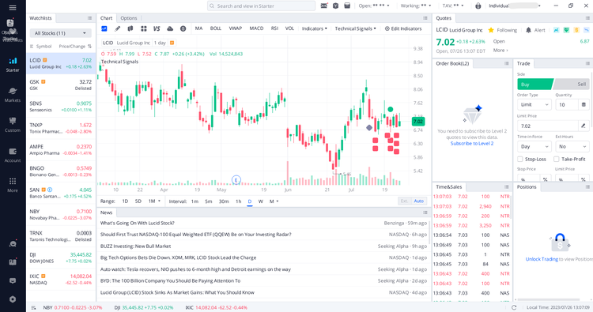

## Table of Contents

## What are platform feeds and why are they important for investors?

Platform feeds are streams of data and information that come from different financial platforms. These feeds can include things like stock prices, news about companies, and reports from financial experts. For investors, platform feeds are like a constant flow of updates that help them keep track of what's happening in the markets. They can see changes in stock prices in real time, read the latest news that might affect their investments, and get insights from analysts that could help them make better decisions.

Having access to platform feeds is important for investors because it helps them stay informed and make smart choices. If an investor knows about a big news event right away, they can decide whether to buy or sell a stock before the price changes too much. This real-time information can give investors an edge over others who might not be as up-to-date. Overall, platform feeds make it easier for investors to react quickly to market changes and manage their investments more effectively.

## How can beginners start using platform feeds to improve their investment decisions?

Beginners can start using platform feeds by first choosing a reliable financial platform that offers these feeds. Many popular platforms like Bloomberg, Yahoo Finance, or even apps like Robinhood provide real-time data and news. Once you have picked a platform, spend some time getting to know how to use it. Look for sections that show stock prices, news updates, and analyst reports. It's a good idea to start with a few stocks or sectors you are interested in and follow their feeds closely.

As you get more comfortable, use the feeds to keep an eye on the stocks you are thinking about investing in. For example, if you see a news article about a company you're interested in, read it to understand if it's good or bad news for the company. This can help you decide if you should buy or sell the stock. Also, pay attention to how stock prices move after news comes out. Over time, you'll start to see patterns and learn how to use this information to make better investment choices. Remember, the key is to stay curious and keep learning from the feeds.

## What are some of the most popular platform feeds for investors?

Some of the most popular platform feeds for investors come from big names like Bloomberg Terminal, Yahoo Finance, and Google Finance. Bloomberg Terminal is a favorite among professional investors because it gives a lot of detailed data and news. It's like a super tool for people who trade a lot. Yahoo Finance is great for everyone, not just pros. It's easy to use and shows stock prices, news, and even lets you make your own watchlists. Google Finance is also simple and good for beginners. It shows stock prices and news, and you can set up alerts to know when something important happens.

Another popular choice is the feeds from trading apps like Robinhood and E*TRADE. Robinhood is known for being easy to use and it's free, which is why a lot of new investors like it. It shows stock prices and news, and you can even trade right from the app. E*TRADE is a bit more advanced but still easy enough for beginners. It gives you stock prices, news, and research reports that can help you make better choices. Both of these apps are good because they let you see what's happening in the market and make quick decisions.

## How do platform feeds differ from traditional financial news sources?

Platform feeds and traditional financial news sources both give you information about the stock market, but they do it in different ways. Platform feeds are like a live stream of data. They show you stock prices as they change, news as it happens, and even let you set up alerts for things you care about. This means you can see what's going on in the market right away and make quick decisions. Traditional financial news sources, like newspapers or TV shows, usually come out at set times. They might give you a big picture of what's happening, but you won't see the latest changes in stock prices until the next update.

Another big difference is how you can use the information. With platform feeds, you can often customize what you see. You can pick certain stocks or news topics to follow, and the feed will show you only what you want. This makes it easier to focus on what matters to you. Traditional news sources don't let you do this as much. They cover a lot of different things, and you have to look through everything to find what you need. So, platform feeds are more about giving you exactly what you want, when you want it, while traditional news sources give you a broader view but less control over what you see.

## What features should investors look for in a platform feed?

When choosing a platform feed, investors should look for features that help them stay updated and make smart choices. One important feature is real-time data. This means the feed shows stock prices and news as they happen, so you can react quickly. Another good feature is customization. You should be able to pick which stocks or news topics you want to see, so the feed shows you only what you care about. Alerts are also useful. They can notify you when something important happens, like a big price change or a new news article about a company you're watching.

Another feature to consider is the quality of the news and analysis. Good platform feeds will have news from trusted sources and reports from experts that can help you understand what's going on in the market. It's also helpful if the platform has tools like charts and graphs that make it easier to see trends and patterns. Finally, ease of use is important. The feed should be simple to navigate, so you can find the information you need without getting confused. By looking for these features, investors can find a platform feed that helps them make better investment decisions.

## How can platform feeds help in identifying market trends?

Platform feeds can help investors spot market trends by giving them a constant flow of information. When you watch the feeds, you can see how stock prices move over time. If you notice that a lot of stocks in a certain industry are going up, it might mean that industry is getting popular. Also, the news and reports in the feeds can tell you why these changes are happening. For example, if there's a lot of good news about tech companies, you might see tech stocks going up, which could be the start of a trend.

By using the tools in platform feeds, like charts and graphs, investors can see these trends more clearly. These tools can show you patterns over days, weeks, or even months. If you see a pattern where stocks keep going up or down in a certain way, that's a trend. Alerts from the feeds can also help. They can tell you when something big happens, like a sudden drop or rise in stock prices, which might be the beginning of a new trend. By keeping an eye on these things, investors can use platform feeds to understand and follow market trends better.

## What are the best practices for filtering and managing information from platform feeds?

To make the most of platform feeds, it's important to filter and manage the information you get. Start by choosing what you want to see. Most platforms let you pick certain stocks or topics to follow. This way, you don't get overwhelmed by too much information. You can focus on what matters to you, like stocks you own or industries you're interested in. It's also a good idea to set up alerts for big news or price changes. This helps you know when something important happens without having to watch the feed all the time.

Another good practice is to use the tools the platform gives you, like charts and graphs. These can help you see trends and patterns more easily. Don't forget to check the sources of the news and reports. Good platform feeds will have information from trusted places, which helps you make better decisions. Lastly, take breaks from looking at the feeds. It's easy to get too caught up in all the data, so step away sometimes to think about what you've learned and plan your next moves.

## How can advanced investors use platform feeds for algorithmic trading?

Advanced investors can use platform feeds for algorithmic trading by setting up systems that automatically buy or sell stocks based on the information coming in. These feeds give real-time data on stock prices, news, and other important information. By using this data, investors can create algorithms that look for certain patterns or events. For example, if the feed shows a stock's price going up quickly, the algorithm might be set to buy that stock. Or if there's bad news about a company, the algorithm could sell the stock before the price drops too much.

To make this work well, advanced investors need to know how to code and understand the market. They use the platform feeds to feed data into their algorithms, which then make trading decisions without the investor having to do it manually. This can be faster and more efficient than trading by hand. But it's important to keep an eye on the algorithms and make sure they're working right. Sometimes, the market can change in ways the algorithm didn't expect, so it's good to check and adjust the system now and then.

## What are the potential risks associated with relying on platform feeds for investment decisions?

Relying too much on platform feeds for investment decisions can be risky. One big risk is getting too much information. Platform feeds give you a lot of data and news all the time, and it can be hard to know what's important. If you don't filter the information well, you might get confused or make choices based on the wrong things. Another risk is that the news and data might not always be right. Sometimes, the information on platform feeds can be wrong or out of date, and if you make decisions based on that, you could lose money.

Another problem is that platform feeds can make you act too quickly. Because you see changes in stock prices and news right away, you might feel like you need to buy or sell stocks fast. But acting too fast without thinking things through can lead to bad decisions. Also, if everyone is using the same platform feeds and making the same choices, it can cause a lot of people to buy or sell at the same time, which can make the market move in ways that are hard to predict. So, while platform feeds are helpful, it's important to use them carefully and not depend on them too much.

## How can investors verify the accuracy of information provided by platform feeds?

Investors can check if the information from platform feeds is right by looking at more than one source. If the same news or data shows up on different platforms like Bloomberg, Yahoo Finance, and Google Finance, it's more likely to be true. Also, it's a good idea to go to the company's official website or read reports from trusted places like the SEC to see if the news matches up. If something seems off or too good to be true, it's smart to do a bit more digging before making any big decisions.

Another way to make sure the information is correct is to keep an eye on how the stock market reacts to the news. If a big news story comes out and the stock prices move in a way that makes sense with the news, it's probably true. But if the prices don't change much or move in a strange way, the news might not be right. It's also helpful to talk to other investors or join online groups where people share what they know. This can give you different views and help you figure out if the information from the platform feeds is something you can trust.

## What role do platform feeds play in real-time market analysis?

Platform feeds are really important for understanding what's happening in the stock market right now. They show you stock prices, news, and other information as it happens. This means you can see how the market is changing and make decisions based on the newest information. For example, if you see a stock's price going up quickly because of good news, you can decide to buy it right away. This real-time information helps investors stay on top of things and react fast to what's going on.

Using platform feeds for real-time market analysis also means you can spot trends as they start. If you see a lot of stocks in one industry going up or down, you can figure out that something big is happening in that industry. The feeds give you charts and graphs that make it easier to see these patterns. By watching the feeds closely, investors can understand the market better and make smarter choices about when to buy or sell stocks.

## How can expert investors leverage multiple platform feeds to gain a competitive edge?

Expert investors can gain a competitive edge by using information from different platform feeds. By looking at feeds from places like Bloomberg, Yahoo Finance, and Google Finance, they can see the same news or data from different angles. This helps them check if the information is true and understand it better. If something important happens, like a big news story or a change in stock prices, they can see how it's reported across different platforms. This can give them a fuller picture of what's going on in the market and help them make smarter choices.

Also, expert investors can use special tools and algorithms to look at data from multiple platform feeds at the same time. They can set up systems that watch for certain patterns or events across all the feeds. This lets them spot trends or opportunities faster than others who only use one feed. By combining information from different sources, they can make more informed decisions and react quicker to changes in the market. This can give them an advantage over other investors who don't use as many feeds.

## References & Further Reading

[1]: ["Advances in Financial Machine Learning"](https://www.amazon.com/Advances-Financial-Machine-Learning-Marcos/dp/1119482089) by Marcos Lopez de Prado

[2]: ["Machine Learning for Algorithmic Trading"](https://github.com/stefan-jansen/machine-learning-for-trading) by Stefan Jansen

[3]: ["Quantitative Trading: How to Build Your Own Algorithmic Trading Business"](https://www.amazon.com/Quantitative-Trading-Build-Algorithmic-Business/dp/1119800064) by Ernest P. Chan

[4]: Bergstra, J., Bardenet, R., Bengio, Y., & Kégl, B. (2011). ["Algorithms for Hyper-Parameter Optimization."](https://dl.acm.org/doi/10.5555/2986459.2986743) Advances in Neural Information Processing Systems 24.

[5]: ["Evidence-Based Technical Analysis: Applying the Scientific Method and Statistical Inference to Trading Signals"](https://www.amazon.com/Evidence-Based-Technical-Analysis-Scientific-Statistical/dp/0470008741) by David Aronson