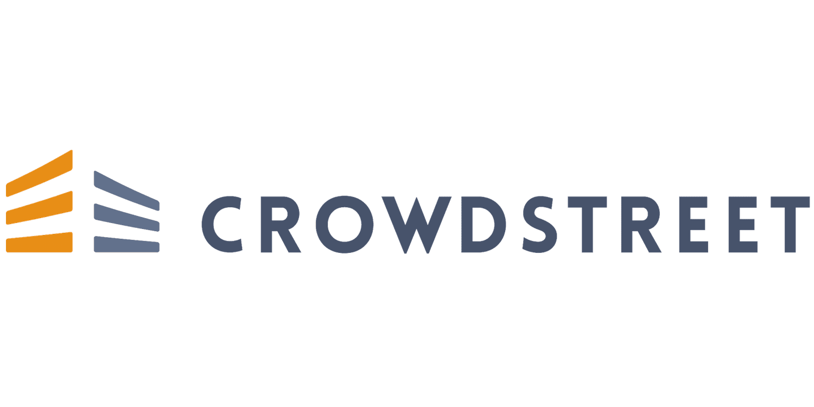

## Table of Contents

## What is real estate crowdfunding?

Real estate crowdfunding is a way for many people to invest in property together. Instead of one person buying a whole building, lots of people can chip in smaller amounts of money. This makes it easier for regular folks to invest in real estate without needing a lot of money upfront.

There are special websites where you can join these investments. These platforms manage everything, from finding the properties to collecting rent and handling any problems that come up. It's a good way to spread out your money across different properties and possibly earn some extra income or see your investment grow over time.

## How does real estate crowdfunding work?

Real estate crowdfunding works by letting a lot of people pool their money to buy property together. Instead of one person needing a big sum to buy a house or building, many people can each give a smaller amount. This is done through special websites called crowdfunding platforms. These platforms find the properties, check them out, and then offer them to investors. If you like a property, you can invest in it by giving money to the platform, which then uses all the money collected to buy the property.

Once the property is bought, the platform takes care of everything. This includes managing the property, finding tenants, collecting rent, and dealing with any repairs or issues. As an investor, you get a share of the rental income based on how much money you put in. If the property goes up in value and is sold later, you also get a part of the profit. This way, you can earn money from real estate without having to do all the work yourself.

Real estate crowdfunding is great because it lets you spread your money across different properties. This can lower your risk because if one property doesn't do well, you still have others that might do better. Plus, you can start investing with less money than you'd need to buy a whole property on your own. It's a way to get into real estate investing without a huge upfront cost and without having to manage properties yourself.

## What are the benefits of investing in real estate crowdfunding?

Investing in real estate crowdfunding has some great benefits. One big advantage is that it lets you start investing with less money. Instead of needing a lot of cash to buy a whole property, you can invest smaller amounts in different properties. This makes it easier for more people to get into real estate investing. Also, by investing in multiple properties, you can spread out your risk. If one property doesn't do well, you still have others that might do better. This can make your overall investment safer.

Another benefit is that you don't have to do the hard work of managing properties. The crowdfunding platform takes care of everything, from finding the right properties to dealing with tenants and repairs. This means you can enjoy the benefits of real estate investing without the stress and time it takes to manage properties yourself. Plus, you can earn money from rental income and possibly make a profit if the property's value goes up and it's sold later. It's a good way to grow your money over time without a lot of effort on your part.

## What are the risks associated with real estate crowdfunding?

Real estate crowdfunding can be a good way to invest, but it also comes with some risks. One big risk is that you might lose money. If the property doesn't do well or if the real estate market goes down, the value of your investment could drop. Also, if the property can't find tenants or if tenants don't pay rent, the income you expected might not come in. This means you could lose some or all of the money you put in.

Another risk is that real estate crowdfunding is less regulated than other types of investments. This means there's a chance the platform you're using might not be as trustworthy as you think. If the platform goes out of business or if they don't manage the properties well, your investment could be in trouble. It's important to do your homework and make sure the platform you choose is reputable and has a good track record.

Lastly, real estate crowdfunding can be less liquid than other investments. This means it can be harder to get your money back quickly if you need it. Unlike stocks or bonds, which you can sell pretty easily, real estate investments can take a long time to sell. If you need your money back fast, this could be a problem. So, it's good to think about how long you can keep your money tied up in these investments before you jump in.

## How do I get started with real estate crowdfunding?

To get started with real estate crowdfunding, first, you need to find a good platform. There are many websites that offer real estate crowdfunding, so do some research to find one that's trustworthy and has a good track record. Look at reviews and see what other investors say about their experiences. Once you choose a platform, you'll need to sign up and create an account. This usually involves giving some personal information and agreeing to the platform's terms.

After you're signed up, you can start looking at the properties available for investment. Each property will have details like its location, expected returns, and how much money you need to invest. Choose a property that fits your budget and investment goals. When you find one you like, you can invest by transferring money to the platform. The platform will then use everyone's money to buy the property. From there, they'll manage everything, and you'll get a share of the rental income and any profits if the property is sold later.

## What are the top real estate crowdfunding platforms for October 2024?

In October 2024, some of the top real estate crowdfunding platforms are Fundrise, RealtyMogul, and Yieldstreet. Fundrise is popular because it's easy to use and lets you start investing with just a little money. They have different investment plans that fit different goals, like growing your money over time or getting regular income. RealtyMogul is another good choice, especially if you want to invest in bigger, commercial properties. They have a lot of experience and offer detailed information about each property, so you know what you're getting into. Yieldstreet is known for offering a mix of real estate and other types of investments, which can help spread out your risk.

These platforms are all trustworthy and have good track records. Fundrise is great for beginners because it's simple and doesn't need a lot of money to start. RealtyMogul might be better if you're okay with investing more money and want to focus on bigger properties. Yieldstreet is a good option if you want to mix real estate with other investments like art or legal claims. No matter which platform you choose, make sure to read up on each one and see which fits your investment goals the best.

## What criteria should I use to evaluate real estate crowdfunding platforms?

When you're looking at real estate crowdfunding platforms, you should think about how easy they are to use. A good platform should have a website that's simple to navigate, with clear information about each property and how to invest. It's also important to check if the platform lets you start investing with a small amount of money. Some platforms need you to invest a lot, while others let you start with less. Another thing to look at is what kinds of properties they offer. Some platforms focus on houses, while others might offer big buildings or even land. Make sure the platform has the types of investments you're interested in.

You should also look at the fees the platform charges. Some platforms take a cut of the money you invest or the income you earn, so it's good to know what you'll be paying. Another big thing is the platform's track record. Check how long they've been around and what other investors say about them. Reading reviews and seeing how well their past investments have done can give you an idea of how trustworthy they are. Finally, think about how easy it is to get your money out if you need it. Some platforms let you sell your investment quickly, while others might make you wait. Choose a platform that fits your needs and goals.

## How do the fees and investment minimums compare across top platforms?

Fundrise, RealtyMogul, and Yieldstreet all have different fees and minimums for investing. Fundrise is good for beginners because you can start with as little as $10. They charge a yearly fee of about 1% of your investment, which helps them manage the properties. RealtyMogul needs more money to start - you might need at least $5,000 to invest. Their fees can be a bit higher, sometimes around 1-2% of your investment, but they focus on bigger, commercial properties. Yieldstreet is somewhere in between. You might need around $500 to start, and their fees are about 1-2% of your investment, but they offer a mix of real estate and other types of investments.

Choosing the right platform depends on how much money you have to invest and what you want to invest in. If you're just starting out and don't have a lot of money, Fundrise might be the best choice because of its low minimum and easy-to-understand fees. If you have more money to invest and want to focus on bigger properties, RealtyMogul could be a better fit, even though the fees are a bit higher. Yieldstreet is good if you want to spread your money across different types of investments, and their fees and minimums are in the middle of the other two platforms.

## What types of real estate projects are typically available on these platforms?

Real estate crowdfunding platforms like Fundrise, RealtyMogul, and Yieldstreet usually offer different kinds of properties for you to invest in. Fundrise often has residential properties, like apartments and houses, which are good for people who want to start with smaller investments. They also sometimes offer commercial properties, but these are usually part of bigger investment plans. RealtyMogul focuses more on commercial real estate, like office buildings, shopping centers, and big apartment complexes. They might need you to invest more money, but you can get into bigger projects that might have higher returns.

Yieldstreet is a bit different because they mix real estate with other types of investments. You can find residential and commercial properties on their platform, but they also offer investments in things like art or legal claims. This can help you spread out your risk if you want to invest in more than just real estate. No matter which platform you choose, you'll see a variety of projects, from single-family homes to big commercial buildings, so you can pick the ones that fit your investment goals and how much money you want to spend.

## How has the performance of real estate crowdfunding investments been in recent years?

In recent years, real estate crowdfunding investments have had a mixed performance. Some projects have done really well, giving investors good returns from rental income and when the properties were sold for a profit. For example, properties in growing areas or popular cities have often seen their values go up, which is good for investors. But not all projects have done well. Some properties have struggled to find tenants, or the real estate market has gone down in certain areas, which can lead to lower returns or even losses for investors.

Overall, the performance of real estate crowdfunding depends a lot on the specific properties and the platforms managing them. Platforms like Fundrise and RealtyMogul have had some success stories, but they've also had projects that didn't meet expectations. It's important for investors to look at the track record of the platform and the details of each project before investing. Real estate crowdfunding can be a good way to invest in real estate, but like any investment, it comes with risks, and past performance doesn't guarantee future results.

## What regulatory considerations should I be aware of when investing in real estate crowdfunding?

When you invest in real estate crowdfunding, it's important to know about the rules that govern these investments. In the United States, the Securities and Exchange Commission (SEC) has rules that platforms must follow. These rules are meant to protect investors by making sure platforms are honest and clear about what they're offering. For example, there are limits on how much you can invest based on your income and net worth. Also, platforms have to give you a lot of information about each property so you can make a smart choice.

Another thing to think about is that real estate crowdfunding can be less regulated than other investments like stocks or bonds. This means you need to be extra careful and do your homework. Make sure the platform you're using is registered with the SEC and follows all the rules. Also, some states have their own rules about real estate crowdfunding, so it's good to check those too. Knowing these rules can help you avoid problems and make better investment choices.

## How can I diversify my portfolio using real estate crowdfunding platforms?

Diversifying your portfolio with real estate crowdfunding means spreading your money across different types of properties and platforms. Instead of putting all your money into one property, you can invest smaller amounts in many different ones. This way, if one property doesn't do well, you still have others that might do better. For example, you could invest in apartments in one city, a shopping center in another, and even some land in a third place. By choosing different types of real estate, like residential, commercial, and industrial, you can reduce the risk that comes with investing in just one kind of property.

Using different platforms can also help you diversify. Each platform might focus on different kinds of properties or have different ways of managing them. For instance, you might use Fundrise for smaller residential investments, RealtyMogul for bigger commercial projects, and Yieldstreet for a mix of real estate and other investments. This way, you're not relying on just one platform to manage your investments. By spreading your money across different properties and platforms, you can create a more balanced and less risky investment portfolio.

## What is the Role of Accreditation in Real Estate Crowdfunding?

Accreditation status plays a critical role in determining the types of real estate crowdfunding investments accessible to individual investors. Accreditation is largely defined by financial criteria that aim to assess the investor's financial sophistication and ability to bear potential investment risks. According to the U.S. Securities and Exchange Commission (SEC), an accredited investor typically must meet one of the following conditions:

1. **Income Threshold**: The individual must have an annual income exceeding $200,000, or $300,000 for joint income, in each of the two most recent years with the expectation of earning the same or higher levels in the current year.
$$
   \text{Single Income} \geq \$200,000 \quad \text{or} \quad \text{Joint Income} \geq \$300,000

$$

2. **Net Worth Criterion**: The individual's net worth, or joint net worth with a spouse, must exceed $1 million excluding the value of their primary residence.
$$
   \text{Net Worth} = \text{Total Assets} - \text{Total Liabilities} > \$1,000,000 

$$

These criteria are designed to ensure that accredited investors possess the financial sophistication necessary to manage the risks associated with unregistered securities, commonly offered through crowdfunding platforms.

While accreditation opens doors to a wider array of investment opportunities, including potentially higher-risk and higher-reward projects, not all platforms restrict participation to accredited investors. For instance, Fundrise democratizes access to real estate investments by allowing participation from non-accredited investors, often requiring low initial investments, sometimes as low as $10. This inclusivity permits a broader audience to engage in real estate crowdfunding, mitigating risks through diversification and professional management without requiring accreditation status.

Overall, accreditation significantly affects the scope of investment options available to individuals on real estate crowdfunding platforms, aiming to match investors with opportunities that align with their financial capabilities and risk tolerance.

## References & Further Reading

[1]: Bergstra, J., Bardenet, R., Bengio, Y., & Kégl, B. (2011). ["Algorithms for Hyper-Parameter Optimization."](https://proceedings.neurips.cc/paper/2011/file/86e8f7ab32cfd12577bc2619bc635690-Paper.pdf) Advances in Neural Information Processing Systems 24.

[2]: ["Advances in Financial Machine Learning"](https://www.amazon.com/Advances-Financial-Machine-Learning-Marcos/dp/1119482089) by Marcos Lopez de Prado

[3]: ["Evidence-Based Technical Analysis: Applying the Scientific Method and Statistical Inference to Trading Signals"](https://www.amazon.com/Evidence-Based-Technical-Analysis-Scientific-Statistical/dp/0470008741) by David Aronson

[4]: ["Machine Learning for Algorithmic Trading"](https://github.com/stefan-jansen/machine-learning-for-trading) by Stefan Jansen

[5]: ["Quantitative Trading: How to Build Your Own Algorithmic Trading Business"](https://books.google.com/books/about/Quantitative_Trading.html?id=j70yEAAAQBAJ) by Ernest P. Chan