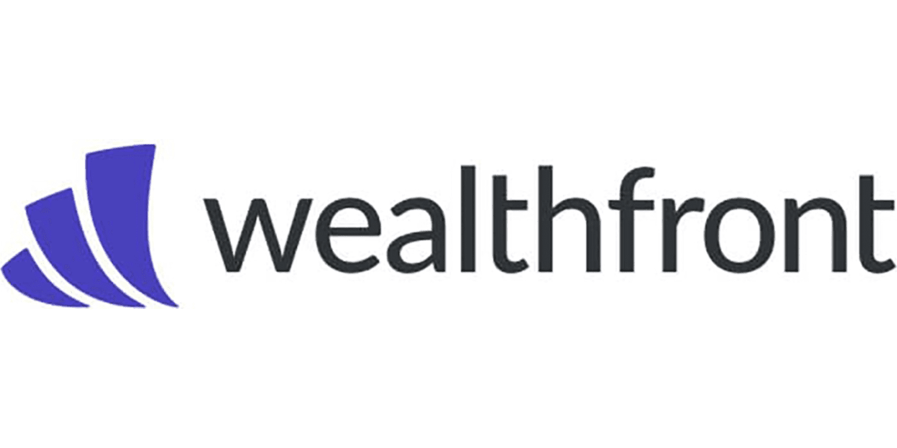

## Table of Contents

## What is a robo-advisor cash management account?

A robo-advisor cash management account is a type of account offered by automated investment services, known as robo-advisors. These accounts are designed to help you manage your cash more effectively. They often come with features like high-yield savings, easy access to your money, and sometimes even debit cards or checks. The main goal is to keep your money safe while earning a bit more interest than a regular savings account.

These accounts are popular because they are easy to use and usually have low or no fees. You can link them to your other bank accounts to move money around easily. Robo-advisors use technology to manage your cash, which means you don't need to do much work. This can be a good option if you want to keep your money in a safe place but also want it to grow a little bit without much effort on your part.

## Why should someone consider using a robo-advisor for cash management?

Someone should consider using a robo-advisor for cash management because it's easy and convenient. Robo-advisors use technology to handle your money, so you don't have to spend a lot of time managing it yourself. They often have low fees or no fees at all, which means you can keep more of your money. Plus, they usually offer higher interest rates than regular savings accounts, so your money can grow a bit more without you doing much work.

Another reason to use a robo-advisor for cash management is that it's safe and secure. These accounts are typically insured by the FDIC, which means your money is protected up to a certain amount. You can also link your robo-advisor account to your other bank accounts, making it easy to move money around when you need to. This can be really helpful if you want to keep your money in one place but still have easy access to it whenever you need it.

## What are the key features to look for in a robo-advisor cash management account?

When looking for a robo-advisor cash management account, it's important to consider a few key features. First, check the [interest rate](/wiki/interest-rate-trading-strategies). A good robo-advisor account should offer a higher interest rate than a regular savings account. This means your money can grow more over time. Also, look at the fees. Many robo-advisors don't charge fees for their cash management accounts, but it's good to make sure. Low or no fees help you keep more of your money.

Another important feature is ease of access. A good robo-advisor account should let you easily move money in and out. This can be through linking to other bank accounts, using a debit card, or even writing checks. Security is also key. Make sure the account is FDIC insured, which protects your money up to a certain amount. Lastly, consider the user experience. The best robo-advisors have easy-to-use apps or websites, so managing your money is simple and quick.

## How do robo-advisor cash management accounts compare to traditional bank accounts?

Robo-advisor cash management accounts and traditional bank accounts both help you keep your money safe, but they work a bit differently. A robo-advisor account often gives you a higher interest rate than a regular bank account. This means your money can grow a little more over time. Robo-advisors also usually have low or no fees, which helps you keep more of your money. On the other hand, traditional bank accounts might have more fees, like monthly maintenance fees or ATM fees.

Another big difference is how easy it is to use them. Robo-advisor accounts are designed to be simple and quick to manage. You can often link them to other bank accounts, use a debit card, or even write checks. They use technology to make everything easy for you. Traditional bank accounts can be more complicated. You might need to go to a bank branch or use their app, which can sometimes be harder to navigate. But, traditional banks might offer more services, like loans or credit cards, which robo-advisors might not have.

## What are the fees associated with robo-advisor cash management accounts?

Robo-advisor cash management accounts often have lower fees than traditional bank accounts. Many robo-advisors don't charge any fees at all for their cash management accounts. This means you can keep more of your money because you're not losing any to fees. If there are fees, they are usually very small, like a tiny percentage of the money you have in the account.

Even though some robo-advisors might charge fees, they are usually much less than what you'd pay for a regular bank account. Traditional banks might charge monthly maintenance fees, ATM fees, or fees for certain services. With a robo-advisor, you might not have to worry about these extra costs. This can make a big difference, especially if you're trying to save money and make your cash grow.

## Which robo-advisors offer the best cash management accounts in 2024?

In 2024, some of the best robo-advisors for cash management accounts are Wealthfront and Betterment. Wealthfront offers a high-yield cash account with no fees and an interest rate that's much better than most regular savings accounts. They also give you a debit card and let you write checks, so it's easy to use your money when you need it. Betterment's cash management account is also great because it has no fees and a good interest rate. They make it simple to move money in and out, and you can use their app to manage everything easily.

Another top choice is SoFi. SoFi's cash management account has no fees and offers a competitive interest rate. They also give you a debit card and let you access ATMs for free, which can save you money. All these robo-advisors use technology to make managing your cash easy and safe, and they are all FDIC insured, so your money is protected.

## What are the interest rates offered by top robo-advisor cash management accounts in 2024?

In 2024, Wealthfront offers one of the best interest rates for their cash management account. They give you around 5% annual interest, which is much higher than what you'd get from a regular savings account. This means your money can grow more over time without you doing much work. Wealthfront doesn't charge any fees for this account, so you keep all the interest you earn.

Betterment also offers a competitive interest rate for their cash management account, around 4.75% annually. Like Wealthfront, Betterment doesn't charge any fees, so you can enjoy the full benefit of the interest. Their account is easy to use, and you can manage everything through their app. SoFi is another good choice, with an interest rate of about 4.5%. They also have no fees and give you a debit card for easy access to your money.

## How do the security and insurance features of robo-advisor cash management accounts work?

Robo-advisor cash management accounts are safe and secure. They use strong technology to keep your money protected from hackers and other bad guys. You can feel safe knowing that your personal information and money are in good hands. Robo-advisors also have ways to make sure only you can access your account, like using special codes or passwords that only you know.

Another important part of security is insurance. Most robo-advisor cash management accounts are insured by the FDIC, which stands for Federal Deposit Insurance Corporation. This means if something really bad happens to the robo-advisor, your money is protected up to $250,000. So, even if the robo-advisor has problems, your money is still safe. This insurance gives you peace of mind knowing your money is secure no matter what happens.

## What are the minimum balance requirements for the top robo-advisor cash management accounts?

In 2024, the top robo-advisor cash management accounts usually don't have a minimum balance requirement. This means you can start using them even if you only have a little bit of money. Wealthfront, Betterment, and SoFi all let you open an account without needing to put in a certain amount of money first. This makes it easy for anyone to start saving and [earning](/wiki/earning-announcement) interest right away.

These robo-advisors want to make it simple for people to manage their cash. By not having a minimum balance, they help more people use their services. Whether you have a lot of money or just a little, you can still benefit from the high interest rates and no fees that these accounts offer. It's a great way to grow your savings without worrying about meeting a specific balance requirement.

## How can one integrate a robo-advisor cash management account with other financial tools?

Integrating a robo-advisor cash management account with other financial tools is easy and can help you manage your money better. You can link your robo-advisor account to your regular bank account. This lets you move money back and forth whenever you need to. For example, if you need to pay a bill, you can quickly transfer money from your robo-advisor account to your checking account. Some robo-advisors also let you use their app to see all your accounts in one place. This makes it simple to keep track of your money and make sure you're saving and spending wisely.

Another way to integrate your robo-advisor account is by using their debit card or checks. This means you can use your robo-advisor money to buy things or pay bills directly. It's like having a regular bank account, but with better interest rates and no fees. You can also connect your robo-advisor account to budgeting apps or financial planning tools. These tools can help you set goals, track your spending, and plan for the future. By linking everything together, you can make the most of your money and keep everything organized.

## What advanced features do the top robo-advisor cash management accounts offer for expert investors?

The top robo-advisor cash management accounts offer some cool features for expert investors. One of these is the ability to set up automatic investments. This means you can tell the robo-advisor to move money from your cash account into other investments like stocks or bonds without you having to do anything. This can help you grow your money over time without having to keep an eye on it every day. Another feature is tax-loss harvesting, which is a way to save money on taxes by selling investments that have gone down in value and buying similar ones. This can be really helpful for expert investors who want to keep more of their money.

Some robo-advisors also let you customize your investment strategy. This means you can choose how much risk you want to take and what kinds of investments you want to focus on. For example, you might want to invest more in technology companies or in green energy. This level of control can be great for expert investors who know what they're doing and want to make their own choices. Plus, many robo-advisors offer detailed reports and analytics, so you can see how your investments are doing and make smart decisions based on that information.

## How have the regulations and trends in robo-advisor cash management evolved by 2024?

By 2024, regulations for robo-advisor cash management accounts have become stricter to make sure they are safe and fair for everyone. The government wants to make sure that robo-advisors are doing a good job of keeping your money safe and giving you the right information. They have rules about how robo-advisors can use your money and what they need to tell you about fees and risks. This helps protect you and makes sure that robo-advisors are being honest and clear about what they're doing with your money.

Trends in robo-advisor cash management have also changed a lot by 2024. More people are using robo-advisors because they are easy to use and often have better interest rates than regular bank accounts. Robo-advisors are also adding more features, like letting you invest in different things and giving you tools to help you plan your money better. They are trying to make their services even better so that more people will want to use them. This means you can do more with your money and still keep it simple and safe.

## References & Further Reading

[1]: Bergstra, J., Bardenet, R., Bengio, Y., & Kégl, B. (2011). ["Algorithms for Hyper-Parameter Optimization."](https://dl.acm.org/doi/10.5555/2986459.2986743) Advances in Neural Information Processing Systems 24.

[2]: ["Advances in Financial Machine Learning"](https://www.amazon.com/Advances-Financial-Machine-Learning-Marcos/dp/1119482089) by Marcos Lopez de Prado

[3]: ["Evidence-Based Technical Analysis: Applying the Scientific Method and Statistical Inference to Trading Signals"](https://www.amazon.com/Evidence-Based-Technical-Analysis-Scientific-Statistical/dp/0470008741) by David Aronson

[4]: ["Machine Learning for Algorithmic Trading"](https://github.com/stefan-jansen/machine-learning-for-trading) by Stefan Jansen

[5]: ["Quantitative Trading: How to Build Your Own Algorithmic Trading Business"](https://books.google.com/books/about/Quantitative_Trading.html?id=j70yEAAAQBAJ) by Ernest P. Chan