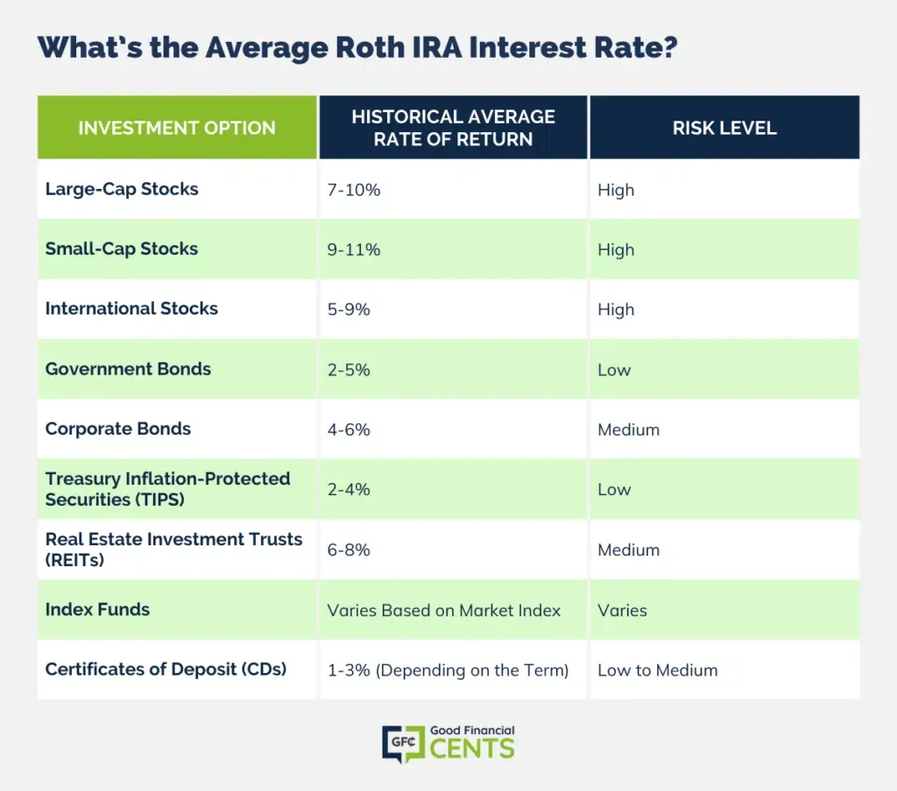

## Table of Contents

## What is a Roth IRA and how does it work?

A Roth IRA is a type of retirement account where you can save money for the future. The special thing about a Roth IRA is that you pay taxes on the money you put in now, but when you take the money out later, you don't have to pay any more taxes. This can be really helpful if you think taxes might be higher in the future or if you want tax-free income when you retire.

You can put money into a Roth IRA every year, but there's a limit to how much you can add. For example, in 2023, you can add up to $6,500 if you're under 50, or $7,500 if you're 50 or older. You can invest the money in things like stocks, bonds, or mutual funds. When you're ready to use the money, usually after you turn 59½ and have had the account for at least five years, you can take it out without owing any taxes on the earnings. This makes a Roth IRA a great way to save for retirement.

## What are the eligibility requirements for opening a Roth IRA?

To open a Roth IRA, you need to have earned income. This means money you get from a job, like wages, salaries, tips, or even freelance work. If you're married and your spouse has earned income, you might be able to contribute to a Roth IRA even if you don't have earned income yourself, but there are some rules about that.

There are also income limits that affect how much you can contribute or if you can contribute at all. For example, in 2023, if you're single and your income is less than $138,000, you can contribute the full amount. If your income is between $138,000 and $153,000, you can contribute a reduced amount. If your income is over $153,000, you can't contribute at all. For married couples filing jointly, the full contribution is allowed if their income is less than $218,000, a reduced amount between $218,000 and $228,000, and no contribution if their income is over $228,000. These limits can change each year, so it's good to check the current rules.

## What are the contribution limits for a Roth IRA in 2024?

In 2024, the contribution limit for a Roth IRA is $7,000 if you're under 50 years old. If you're 50 or older, you can contribute an extra $1,000, making your total limit $8,000. This extra amount is called a catch-up contribution, and it's meant to help people who are closer to retirement save more money.

You can only contribute to a Roth IRA if you have earned income. The amount you can contribute also depends on your income. If you're single and your income is less than $146,000, you can contribute the full amount. If your income is between $146,000 and $161,000, you can contribute a reduced amount. If your income is over $161,000, you can't contribute at all. For married couples filing jointly, the full contribution is allowed if their income is less than $230,000, a reduced amount between $230,000 and $240,000, and no contribution if their income is over $240,000.

## What are the tax benefits of a Roth IRA?

The main tax benefit of a Roth IRA is that the money you take out in retirement is tax-free. This means you don't have to pay any taxes on the money you earn from your investments when you withdraw it, as long as you follow the rules. You can put in money you've already paid taxes on, and then when you're older and ready to use it, all the growth and earnings are yours to keep without owing any more taxes.

Another benefit is that Roth IRAs don't have required minimum distributions (RMDs). This means you don't have to start taking money out of your account when you reach a certain age, like you do with traditional IRAs and 401(k)s. You can leave the money in your Roth IRA as long as you want, letting it grow tax-free. This can be really helpful if you don't need the money right away or if you want to pass it on to your heirs.

## How do I choose the best Roth IRA account for my needs?

Choosing the best Roth IRA account depends on what you need and want. First, think about fees. Some companies charge fees for managing your account or for the investments you choose. Look for a Roth IRA with low fees because over time, even small fees can add up and take away from your savings. Also, consider the types of investments the account offers. If you like picking your own stocks or funds, you'll want a Roth IRA that gives you lots of choices. If you prefer someone else to manage your investments, look for a company that offers good target-date funds or robo-advisors.

Another thing to think about is the company's reputation and customer service. You want a company that is trustworthy and easy to work with. Check reviews and ratings to see what other people say about their experiences. It's also important to know if the company has good tools and resources to help you manage your account. Some companies offer educational materials, planning tools, and even mobile apps that make it easy to keep track of your investments. By considering all these factors, you can find the best Roth IRA account that fits your needs and helps you save for retirement.

## What are the fees associated with different Roth IRA accounts?

Different Roth IRA accounts can have different fees. Some accounts charge a fee just for having the account, which is called a maintenance fee. This fee can be a flat amount, like $20 a year, or a percentage of the money you have in the account. Other fees can come from the investments you choose, like mutual funds or ETFs. These are called expense ratios, and they are a percentage of your investment that you pay each year. For example, if you invest $1,000 in a fund with a 0.5% expense ratio, you'll pay $5 that year.

Some Roth IRA providers also charge fees for trading or making transactions. If you buy or sell investments often, these fees can add up. It's important to look at all these fees because they can affect how much money you keep in your account over time. Lower fees mean more money stays in your account to grow. So, when you're choosing a Roth IRA, it's a good idea to compare the fees from different companies to find the one that will cost you the least.

## What investment options are available within Roth IRAs?

Roth IRAs offer a variety of investment options that you can choose from based on what you like and how much risk you're willing to take. You can invest in individual stocks, which are shares of a single company. If you want to spread out your risk, you might choose mutual funds or exchange-traded funds (ETFs). These funds hold a mix of different investments, like stocks or bonds, and can help you diversify your portfolio without having to pick each investment yourself.

Another option is to invest in bonds, which are loans you make to a company or government that pay you back with interest over time. Some people like to invest in real estate investment trusts (REITs), which let you invest in real estate without buying property directly. If you don't want to pick your own investments, you can choose target-date funds, which automatically adjust your investments as you get closer to retirement. Or, you might use a robo-advisor, which is a computer program that picks and manages your investments for you based on your goals and risk tolerance.

## How do the top Roth IRA accounts compare in terms of performance?

When looking at the top Roth IRA accounts, it's hard to say which one performs the best because performance depends a lot on the investments you choose. For example, if you pick stocks that do well, your account will grow more than if you pick stocks that don't do well. Companies like Vanguard, Fidelity, and Charles Schwab are known for having good Roth IRA accounts because they offer a lot of investment choices and have low fees. Lower fees mean more of your money stays in your account to grow, which can help your account perform better over time.

Another thing to consider is how easy it is to use the account. Vanguard, Fidelity, and Schwab all have user-friendly websites and apps that make it easy to manage your investments. They also offer tools and resources to help you make smart investment choices. While past performance can give you an idea of how well an account has done, it's not a guarantee of future results. So, it's important to look at the whole picture, including fees, investment options, and ease of use, when deciding which Roth IRA account is best for you.

## What are the withdrawal rules and penalties for Roth IRAs?

With a Roth IRA, you can take out the money you put in at any time without paying taxes or penalties. This is called your contributions. But if you want to take out the money your investments have earned, called earnings, you have to follow some rules. To avoid taxes and penalties on your earnings, you need to be at least 59½ years old and have had the Roth IRA for at least five years. This is called the five-year rule.

If you take out your earnings before you're 59½ or before the five-year rule is met, you might have to pay taxes on the earnings and a 10% penalty. There are some exceptions to the penalty, though. For example, you can take out earnings without a penalty if you're using the money to buy your first home, pay for college, or if you become disabled. It's important to know these rules so you can plan when and how to use your Roth IRA money.

## How can I convert a traditional IRA to a Roth IRA?

Converting a traditional IRA to a Roth IRA is called a Roth conversion. To do this, you need to move money from your traditional IRA to a Roth IRA. You'll have to pay taxes on the money you move because you didn't pay taxes on it when you put it into the traditional IRA. The amount of taxes you'll owe depends on how much money you're converting and your tax rate. It's a good idea to talk to a tax advisor to understand how much you'll have to pay and if it makes sense for you to do a conversion.

Once you've paid the taxes, the money in your Roth IRA can grow without owing any more taxes. This means when you take the money out in retirement, you won't have to pay taxes on it, as long as you follow the rules. To avoid penalties, you need to be at least 59½ years old and have had the Roth IRA for at least five years. A Roth conversion can be a smart move if you think taxes will be higher in the future or if you want tax-free income when you retire.

## What advanced strategies can I use to maximize my Roth IRA's potential?

One advanced strategy to maximize your Roth IRA's potential is to do a backdoor Roth IRA conversion. If your income is too high to contribute directly to a Roth IRA, you can put money into a traditional IRA and then convert it to a Roth IRA. This way, you can still enjoy the tax-free growth and withdrawals of a Roth IRA. Just remember, you'll have to pay taxes on the money you convert, so it's important to think about how this will affect your taxes. Talking to a tax advisor can help you figure out if this strategy makes sense for you.

Another strategy is to use tax-loss harvesting within your Roth IRA. This means selling investments that have lost value to offset gains from other investments. While you can't use these losses to reduce your taxable income like you can in a regular investment account, you can use them to rebalance your portfolio without owing taxes on the gains. This can help you keep your investments in line with your goals and risk tolerance, and it can also help your money grow more over time. By using these advanced strategies, you can make the most of your Roth IRA and build a stronger retirement nest egg.

## How do Roth IRAs fit into a comprehensive retirement plan?

Roth IRAs are a great part of a comprehensive retirement plan because they offer tax-free growth and withdrawals. When you put money into a Roth IRA, you pay taxes on it now, but you don't have to pay any more taxes when you take the money out in retirement. This can be really helpful if you think taxes might be higher in the future or if you want tax-free income when you're older. Also, Roth IRAs don't have required minimum distributions, so you can leave the money in the account as long as you want, letting it grow even more without owing any taxes.

In a comprehensive retirement plan, Roth IRAs can work well with other types of retirement accounts, like traditional IRAs and 401(k)s. For example, you might use a traditional IRA or 401(k) to save money and get a tax break now, and then use a Roth IRA to save money that you can take out tax-free later. This mix can help you manage your taxes better in retirement. By having both types of accounts, you can have more flexibility and control over your retirement income, making sure you have enough money to live comfortably when you stop working.

## References & Further Reading

[1]: ["Roth IRAs: Retirement Savings and Tax Advantages"](https://www.forbes.com/advisor/retirement/roth-ira/) - Internal Revenue Service (IRS)

[2]: Anderson, J. (2010). ["The Benefits of Roth IRAs: Maximizing Your Retirement Savings"](https://michaelryanmoney.com/roth-contributory-ira/) - Financial Planning Magazine

[3]: Kissell, R. (2013). ["The Science of Algorithmic Trading and Portfolio Management"](https://www.sciencedirect.com/book/9780124016897/the-science-of-algorithmic-trading-and-portfolio-management) - Elsevier

[4]: Duran, P. (2019). ["Introduction to Algorithmic Trading"](https://onlinelibrary.wiley.com/doi/book/10.1002/9781119206033) - Cambridge Centre for Alternative Finance

[5]: Narang, P. (2013). ["Inside the Black Box: A Simple Guide to Quantitative and High-Frequency Trading"](https://www.wiley.com/en-us/Inside+the+Black+Box%3A+A+Simple+Guide+to%26nbsp%3BQuantitative+and+High+Frequency+Trading%2C+2nd+Edition-p-9781118416990) - Wiley Finance

[6]: ["Tax-Free Roth IRA Withdrawals: Rules and Benefits"](https://www.irs.gov/retirement-plans/roth-iras) - Investopedia

[7]: Aldridge, I. (2013). ["High-Frequency Trading: A Practical Guide to Algorithmic Strategies and Trading Systems"](https://books.google.com/books/about/High_Frequency_Trading.html?id=8QpIsVUMhmEC) - Wiley Trading

[8]: Bodie, Z., Kane, A., & Marcus, A. (2021). ["Investments"](https://www.mheducation.com/highered/product/investments-bodie-kane/M9781264412662.html) - McGraw-Hill Education